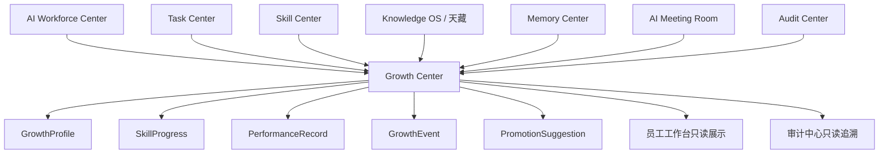

# Sprint62.10-A Growth 成长中心 V1 产品架构设计

## 1. 阶段边界

本阶段只做产品架构设计。

禁止：

- 不写代码
- 不修改前端
- 不修改后端
- 不创建数据库
- 不创建 migration
- 不接 OpenClaw
- 不接 n8n
- 不接 Execution Engine

目标：

设计天统AI Growth 成长中心，作为 AI员工成长与能力进化管理系统。

## 2. 产品定位

产品名称：

```text
Growth 成长中心 V1 / AI Employee Growth Center
```

建议页面：

```text
frontend/growth-center.html
```

定位：

- Growth 是 AI员工长期能力变化、工作表现、技能熟练度和成长轨迹的统一展示中心。
- V1 只分析、只展示，不自动升级员工、不自动修改技能、不自动调整权限、不自动执行任务。
- Growth 读取 Task Center、Skill Center、Knowledge OS、Memory、Audit Center、AI Meeting Room 的只读结果，形成员工成长视图和晋升建议。

负责：

- AI员工能力变化
- 技能熟练度
- 工作表现分析
- 成长轨迹
- 晋升建议
- 能力缺口分析
- 风险成长观察

不负责：

- 自动升级员工
- 自动修改技能
- 自动安装技能
- 自动调整权限
- 自动分配任务
- 自动执行任务
- 自动进入 Execution Engine

## 3. 现有基础分析

当前项目已有 Growth / Evolution 雏形：

| 模块 | 当前能力 | 与 Growth V1 的关系 |
| --- | --- | --- |
| `backend/evolution_models.py` | `EmployeeGrowth`、`ReviewAnalysis`、`SkillSuggestion`、`RiskEvent` | 已有成长评分、复盘分析、技能建议和风险事件模型 |
| `backend/routers/employee_evolution.py` | `/profile/{code}`、`/growth`、`/risk-events`、`/analyze` | V1 页面应优先使用 GET 只读接口，避免触发 POST 分析 |
| `backend/employee_growth/growth_profile.py` | 基于任务、能力、风险生成成长画像 | 可作为未来 Growth Center 画像来源 |
| `backend/employee_growth/growth_center.py` | 输出 AI Employee Growth Center 报告 | 可作为成长报告模型参考 |
| `backend/employee_growth/knowledge_distillation.py` | 生成 SOP 建议、最佳实践、经验规则 | 只能作为建议，不自动写入核心知识 |
| `frontend/employee-evolution-center.html` | 已有员工自学习进化中心页面 | Growth Center V1 可复用页面经验，但定位更偏只读管理视图 |
| `frontend/review-learning-center.html` | 复盘学习中心，展示评分趋势和成长值 | 可作为成长指标展示参考 |

V1 设计原则：

- 复用现有 Growth / Evolution 数据和页面经验。
- V1 首期只使用只读数据，不触发 `/api/employee-evolution/analyze`。
- 晋升建议、技能建议、能力缺口只作为待人工审核信息。
- 成长评分不等于权限，技能成长不等于技能授权。

## 4. 页面设计

页面：

```text
frontend/growth-center.html
```

页面结构：

```text
Growth 成长中心 V1
├── 顶部状态栏
│   ├── Growth Center
│   ├── 当前组织
│   ├── 员工数量
│   ├── 成长记录数量
│   └── readonly / analysis_only 安全模式
├── 成长总览
│   ├── 平均成长评分
│   ├── 高成长员工数量
│   ├── 待提升员工数量
│   ├── 高风险成长事件
│   ├── 技能建议数量
│   └── 待人工复审事项
├── AI员工成长排名
│   ├── 员工名称
│   ├── 部门
│   ├── 成长评分
│   ├── 成功率
│   ├── 风险事件
│   └── 查看详情
├── 能力变化
│   ├── 当前能力
│   ├── 新增能力建议
│   ├── 能力下降信号
│   ├── 复盘质量
│   └── 审核状态
├── 技能成长曲线
│   ├── 技能名称
│   ├── 当前熟练度
│   ├── 使用次数
│   ├── 成功率
│   └── 风险趋势
├── 成功率变化
│   ├── 任务总数
│   ├── 完成任务
│   ├── 失败任务
│   ├── 阻塞任务
│   └── 趋势说明
└── 能力缺口
    ├── 缺口类型
    ├── 缺口说明
    ├── 推荐学习方向
    ├── 关联技能
    └── 人工审核状态
```

### 4.1 成长总览

字段：

| 字段 | 说明 | V1 来源建议 |
| --- | --- | --- |
| `employee_count` | AI员工数量 | AI员工中心 |
| `growth_record_count` | 成长记录数量 | `EmployeeGrowth` |
| `average_growth_score` | 平均成长评分 | `EmployeeGrowth.score` |
| `high_growth_count` | 高成长员工数量 | 评分阈值统计 |
| `needs_improvement_count` | 待提升员工数量 | 低评分或失败任务统计 |
| `risk_event_count` | 风险成长事件数量 | `RiskEvent` |
| `skill_suggestion_count` | 技能建议数量 | `SkillSuggestion` |
| `review_required_count` | 待人工复审事项 | 高风险建议 / 晋升建议 |

空数据状态：

```text
暂无成长数据
```

异常状态：

```text
当前成长数据暂不可用
```

### 4.2 AI员工成长排名

展示字段：

| 字段 | 说明 |
| --- | --- |
| `rank` | 排名 |
| `employee_code` | 员工编号 |
| `employee_name` | 员工名称 |
| `department` | 部门 |
| `growth_score` | 成长评分 |
| `growth_level` | 成长等级 |
| `success_rate` | 成功率 |
| `failure_count` | 失败次数 |
| `risk_count` | 风险事件数量 |
| `last_updated` | 最近更新时间 |

排名原则：

- 排名只用于观察，不触发奖惩。
- 成长评分高不等于权限高。
- 风险事件必须与评分一起展示，避免只看分数。

### 4.3 能力变化

能力变化展示 AI员工能力状态的变化趋势。

字段：

| 字段 | 说明 |
| --- | --- |
| `current_capabilities` | 当前能力标签 |
| `new_capability_suggestions` | 新能力建议 |
| `decline_signals` | 能力下降信号 |
| `review_quality` | 复盘质量 |
| `evidence` | 证据来源 |
| `review_status` | 审核状态 |

判断来源：

- 任务完成质量
- 任务失败原因
- 技能使用记录
- 会议贡献质量
- 复盘学习记录
- 审计风险记录

### 4.4 技能成长曲线

技能成长曲线用于展示某员工在单个技能上的变化。

字段：

| 字段 | 说明 |
| --- | --- |
| `skill_id` | 技能编号 |
| `skill_name` | 技能名称 |
| `skill_version` | 技能版本 |
| `proficiency_level` | 熟练度 |
| `usage_count` | 使用次数 |
| `success_rate` | 成功率 |
| `manual_score` | 人工评价 |
| `risk_level` | 技能风险 |
| `trend` | up / stable / down |

技能熟练度建议状态：

```text
unknown -> learning -> basic -> skilled -> expert_candidate
```

注意：

- `expert_candidate` 只是候选，不等于专家任命。
- 技能成长不等于技能授权。
- 技能建议不自动安装。

### 4.5 成功率变化

成功率变化用于描述 AI员工任务表现趋势。

计算草案：

```text
success_rate = completed_task_count / (completed_task_count + failed_task_count)
```

展示维度：

| 维度 | 说明 |
| --- | --- |
| 近7天 | 短期趋势 |
| 近30天 | 阶段表现 |
| 近90天 | 稳定性 |
| 全部历史 | 总体表现 |

限制：

- 成功率只作为参考。
- 任务难度、风险等级、人工评价必须一起看。
- 不能因为成功率自动晋升或降级。

### 4.6 能力缺口

能力缺口用于发现员工需要补齐的能力。

字段：

| 字段 | 说明 |
| --- | --- |
| `gap_id` | 缺口编号 |
| `employee_code` | 员工编号 |
| `gap_type` | skill / knowledge / process / safety / collaboration |
| `gap_description` | 缺口说明 |
| `evidence` | 证据 |
| `recommended_learning` | 推荐学习方向 |
| `related_skill` | 关联技能 |
| `risk_level` | 风险等级 |
| `review_status` | 审核状态 |

缺口类型：

- 技能缺口
- 知识缺口
- 流程缺口
- 安全缺口
- 协作缺口
- 复盘缺口

## 5. 数据模型设计草案

本节只做设计，不创建数据库。

### 5.1 GrowthProfile

```text
GrowthProfile
├── profile_id
├── employee_code
├── employee_name
├── department
├── role
├── growth_score
├── growth_level
├── success_rate
├── stability_score
├── safety_score
├── collaboration_score
├── capability_summary
├── risk_summary
├── review_status
├── created_at
└── updated_at
```

字段说明：

| 字段 | 说明 |
| --- | --- |
| `growth_score` | 综合成长评分 |
| `growth_level` | starter / growing / skilled / expert_candidate |
| `stability_score` | 稳定性评分 |
| `safety_score` | 安全合规评分 |
| `collaboration_score` | 协作评分 |
| `review_status` | draft / reviewed / approved |

评分草案：

```text
growth_score =
  task_quality_score * 0.25
+ success_rate_score * 0.20
+ skill_progress_score * 0.20
+ safety_score * 0.20
+ collaboration_score * 0.10
+ review_quality_score * 0.05
```

安全约束：

- `growth_score` 只用于展示和建议。
- `growth_level` 不自动改变岗位或权限。

### 5.2 SkillProgress

```text
SkillProgress
├── progress_id
├── employee_code
├── skill_id
├── skill_name
├── skill_version
├── proficiency_level
├── usage_count
├── success_count
├── failure_count
├── success_rate
├── manual_score
├── risk_level
├── trend
├── evidence
└── updated_at
```

用途：

- 记录员工在某个技能上的成长变化。
- 支持技能成长曲线展示。
- 为能力缺口和专家候选提供只读证据。

### 5.3 PerformanceRecord

```text
PerformanceRecord
├── record_id
├── employee_code
├── task_id
├── meeting_id
├── performance_type
├── quality_score
├── business_value_score
├── safety_score
├── collaboration_score
├── user_satisfaction_score
├── summary
├── evidence
└── created_at
```

用途：

- 汇总任务表现、会议表现、复盘表现。
- 记录评分来源和证据。
- 支撑 GrowthProfile 的综合评分。

### 5.4 GrowthEvent

```text
GrowthEvent
├── event_id
├── employee_code
├── event_type
├── event_title
├── event_summary
├── source_system
├── source_id
├── impact_score
├── risk_level
├── review_status
└── created_at
```

事件类型：

| 类型 | 说明 |
| --- | --- |
| `task_completed` | 完成任务 |
| `task_failed` | 任务失败 |
| `risk_recorded` | 风险记录 |
| `skill_improved` | 技能提升 |
| `knowledge_used` | 使用知识 |
| `meeting_contribution` | 会议贡献 |
| `review_completed` | 复盘完成 |

### 5.5 PromotionSuggestion

```text
PromotionSuggestion
├── suggestion_id
├── employee_code
├── current_level
├── suggested_level
├── reason
├── evidence
├── risk_review
├── security_audited
├── boss_confirm
├── status
└── created_at
```

用途：

- 仅生成晋升/降级/复审建议。
- 必须人工审核。
- 不自动改变员工等级、岗位、权限。

状态：

```text
draft -> review_required -> approved_by_boss -> rejected -> archived
```

## 6. 数据关系图



关系说明：

| 来源/目标 | 关系 | 边界 |
| --- | --- | --- |
| AI Workforce Center -> Growth | 查看员工成长摘要 | 不改变员工状态 |
| Skill Center -> Growth | 提供技能资产和版本参考 | 不自动安装或升级技能 |
| Knowledge OS -> Growth | 提供知识使用和 SOP 参考 | 不自动发布知识 |
| Memory -> Growth | 提供成功/失败经验和历史上下文 | 不自动应用学习 |
| Audit Center -> Growth | 提供风险和安全记录 | 不自动封禁或改权 |
| AI Meeting Room -> Growth | 提供会议贡献和方案采纳线索 | 不自动创建任务 |
| Task Center -> Growth | 提供任务完成、失败、验收和复盘数据 | 不修改任务状态 |

## 7. 与现有系统关系

### 7.1 AI Workforce Center

AI Workforce Center 读取 Growth 摘要：

- 成长评分
- 成功率
- 技能成长
- 风险事件
- 晋升建议状态
- 能力缺口

边界：

- 工作台只展示成长结果。
- 工作台不能通过 Growth 启动员工、升级员工或修改权限。

### 7.2 Skill Center

Skill Center 管理技能资产：

- 技能名称
- 技能版本
- 技能状态
- 风险等级
- 审核状态

Growth 记录员工技能熟练度：

- 使用次数
- 成功率
- 人工评价
- 风险记录
- 成长趋势

边界：

- 技能熟练度不等于技能权限。
- 技能成长不自动安装新技能。
- 专家候选不等于自动授权。

### 7.3 Knowledge OS

Knowledge OS 管理正式知识：

- SOP
- Prompt
- 案例
- 课程
- 产品方案

Growth 使用知识结果：

- 员工是否正确调用知识
- 知识是否提升任务质量
- 哪些 SOP 对员工有效
- 哪些 Prompt 需要优化建议

边界：

- Growth 不自动修改 SOP。
- Growth 不自动发布 Prompt。
- Knowledge OS 的正式变更必须人工审核。

### 7.4 Memory

Memory 提供：

- 历史经验
- 成功案例
- 失败案例
- 决策记录
- 用户偏好

Growth 负责：

- 评分
- 成长轨迹
- 能力缺口
- 晋升建议

边界：

- Memory 不能直接修改 Growth 评分。
- Growth 不能自动把 Memory 经验应用到员工权限或技能。

### 7.5 Audit Center

Audit Center 提供：

- 风险事件
- 审批记录
- 权限访问记录
- 安全检查结果

Growth 使用：

- 安全评分
- 风险趋势
- 晋升风险复审

边界：

- 高风险成长建议必须进入 Audit Center。
- Growth 不自动修复风险。
- Growth 不自动封禁员工。

### 7.6 AI Meeting Room

AI Meeting Room 提供：

- 会议参与记录
- 观点贡献
- 方案采纳情况
- 风险发现能力

Growth 使用：

- 协作能力评分
- 贡献质量评分
- 方案采纳率参考

边界：

- 会议表现不自动转为晋升。
- 会议方案不自动创建任务。

### 7.7 Task Center

Task Center 提供：

- 任务记录
- 当前状态
- 完成结果
- 失败原因
- 验收记录
- 审计日志

Growth 使用：

- 成功率
- 任务质量
- 稳定性
- 失败复盘
- 风险事件

边界：

- Growth 只读取 Task Center。
- Growth 不创建任务、不分配任务、不修改任务状态。

## 8. 安全边界

V1 允许：

- 查看成长总览
- 查看员工成长排名
- 查看能力变化
- 查看技能成长曲线
- 查看成功率变化
- 查看能力缺口
- 查看晋升建议草稿
- 查看风险成长事件

V1 禁止：

- 自动升级员工
- 自动降级员工
- 自动修改技能
- 自动安装技能
- 自动调整权限
- 自动执行任务
- 自动创建任务
- 自动修改 Task Center 状态
- 自动发布知识
- 自动进入 Execution Engine
- 自动连接 OpenClaw
- 自动连接 n8n

高风险成长变化必须满足：

```json
{
  "security_audited": true,
  "boss_confirm": true,
  "readonly": true,
  "analysis_only": true,
  "auto_promote_employee": false,
  "auto_downgrade_employee": false,
  "employee_permission_modified": false,
  "employee_skill_modified": false,
  "task_created": false,
  "task_executed": false,
  "execution_engine_called": false,
  "openclaw_connected": false,
  "n8n_connected": false
}
```

权限原则：

- 成长评分 ≠ 权限。
- 成长等级 ≠ 岗位。
- 技能熟练度 ≠ 技能授权。
- 晋升建议 ≠ 自动晋升。
- 任何员工等级、权限、岗位变化都必须人工审核。

## 9. V1 / V2 / V3 路线规划

### V1：只读成长中心

目标：

- 建立 Growth Center 产品入口设计。
- 展示成长总览、员工成长排名、能力变化、技能成长曲线、成功率变化和能力缺口。
- 优先复用 `EmployeeGrowth`、`ReviewAnalysis`、`SkillSuggestion`、`RiskEvent` 和 Task Center 只读数据。

限制：

- 不触发自动分析。
- 不改变员工等级。
- 不改变技能和权限。
- 不执行任务。

### V2：人工审核成长建议

目标：

- 支持晋升建议、技能建议、能力缺口的人工审核流程。
- 支持成长证据链展示。
- 支持成长报告版本管理。

仍然禁止：

- 自动晋升。
- 自动授权。
- 自动安装技能。
- 自动执行任务。

### V3：企业级人才智能规划

目标：

- 支持跨部门 AI员工成长对比。
- 支持专家候选池。
- 支持根据企业目标生成员工培养建议。
- 支持为 Orchestrator 提供只读员工表现参考。

安全要求：

- Orchestrator 只能读取 Growth。
- Growth 不能直接调度员工。
- 高风险变化必须 `security_audited=true` 与 `boss_confirm=true`。

## 10. 验收结论

Sprint62.10-A 只完成 Growth 成长中心 V1 产品架构设计。

验收项：

- 已定义产品定位。
- 已设计 `frontend/growth-center.html` 页面结构。
- 已设计 GrowthProfile、SkillProgress、PerformanceRecord、GrowthEvent、PromotionSuggestion 数据模型草案。
- 已说明与 AI Workforce Center、Skill Center、Knowledge OS、Memory、Audit Center、AI Meeting Room、Task Center 的关系。
- 已明确 V1 只分析、只展示，不自动升级、不自动改技能、不自动改权限、不自动执行任务。
- 已规划 V1/V2/V3 演进路线。

未执行事项：

- 未写代码。
- 未修改前端。
- 未修改后端。
- 未创建数据库。
- 未创建 migration。
- 未接 OpenClaw。
- 未接 n8n。
- 未接 Execution Engine。
