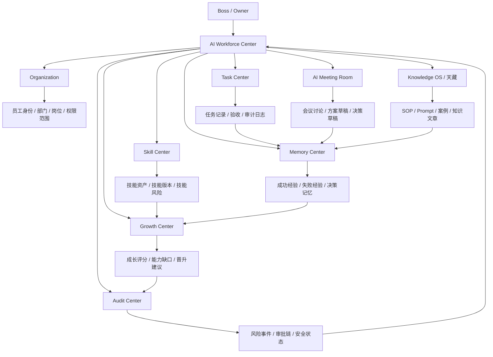
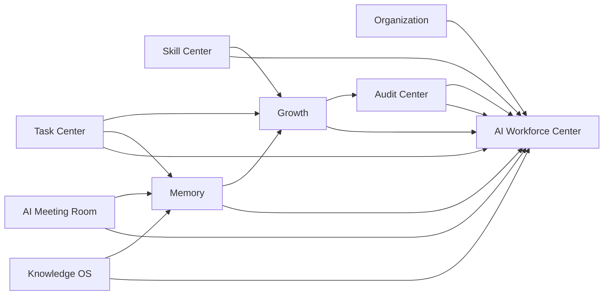
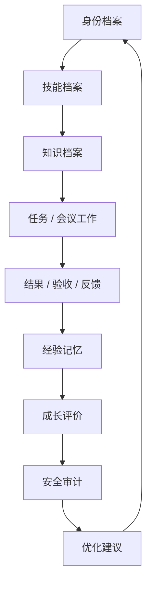

# Sprint62.11-A AI员工生态闭环 V1 总架构设计

## 1. 阶段边界

本阶段只做产品架构设计。

禁止：

- 不写代码
- 不修改前端
- 不修改后端
- 不创建数据库
- 不创建 migration
- 不接 OpenClaw
- 不接 n8n
- 不接 Execution Engine

目标：

设计 Tiantong AI AI员工生态闭环架构，整合 AI Workforce Center、Skill Center、Knowledge OS、Memory、Growth、Audit Center、AI Meeting Room、Organization、Task Center。

## 2. 产品定位

产品名称：

```text
AI员工生态闭环 V1 / AI Employee Ecosystem Loop
```

定位：

- AI员工生态闭环是天统AI企业大脑中“员工、组织、技能、知识、记忆、成长、审计、协作、任务”的总架构。
- V1 只读分析，统一展示 AI员工从身份建立到能力成长的完整链路。
- V1 不新增自动执行能力，不改变现有 Task Center、权限系统、员工系统和执行系统。

核心目标：

- 让老板看清每个 AI员工从哪里来、会什么、做过什么、沉淀了什么、成长了什么、有哪些风险。
- 让 AI员工系统从单点页面升级为长期生态闭环。
- 为 Sprint62.12 以后实现阶段提供拆分依据。

不负责：

- 自动创建员工
- 自动培训员工
- 自动安装技能
- 自动学习修改自身
- 自动晋升员工
- 自动改变权限
- 自动创建任务
- 自动执行任务
- 自动接入 Execution Engine

## 3. 总体架构图



层级说明：

| 层级 | 核心模块 | 职责 |
| --- | --- | --- |
| 入口层 | AI Workforce Center | 老板查看 AI员工生态的统一入口 |
| 组织层 | Organization | 员工身份、部门、岗位、权限范围 |
| 能力层 | Skill Center | 技能资产、技能版本、技能风险 |
| 知识层 | Knowledge OS | SOP、Prompt、知识文章、案例 |
| 协作层 | AI Meeting Room | 多 AI员工讨论、方案草稿、决策草稿 |
| 任务层 | Task Center | 任务记录、状态、验收、审计日志 |
| 记忆层 | Memory | 成功经验、失败经验、决策记忆、上下文 |
| 成长层 | Growth | 成长评分、技能熟练度、能力缺口、晋升建议 |
| 安全层 | Audit Center | 审计、风险、审批、安全状态 |

## 4. AI员工生命周期模型

AI员工生命周期：

```text
创建
↓
培训
↓
工作
↓
经验积累
↓
能力成长
↓
评价
↓
优化
```

### 4.1 创建

目标：

- 建立 AI员工身份档案。
- 明确部门、岗位、职责、状态、负责人和权限范围。

主管模块：

- Organization
- AI Workforce Center

数据对象：

- 员工编号
- 员工名称
- 部门
- 岗位
- 职责
- 状态
- 权限范围

边界：

- V1 不自动创建员工。
- V1 不自动绑定权限。
- V1 不自动任命负责人。

### 4.2 培训

目标：

- 为 AI员工建立技能和知识能力边界。
- 明确可用技能、知识范围、SOP、Prompt 和案例。

主管模块：

- Skill Center
- Knowledge OS
- Organization

数据对象：

- 技能列表
- 技能版本
- 技能状态
- 技能风险
- 知识权限
- SOP / Prompt / 案例引用

边界：

- 技能不等于权限。
- 知识可见不等于可执行。
- V1 不自动安装技能，不自动升级技能。

### 4.3 工作

目标：

- 记录 AI员工参与任务、会议和分析工作的过程。
- 将当前任务、历史任务、会议贡献和协作记录统一展示。

主管模块：

- Task Center
- AI Meeting Room
- AI Workforce Center

数据对象：

- 当前任务
- 历史任务
- 任务状态
- 验收结果
- 会议发言
- 方案草稿

边界：

- V1 不自动创建任务。
- V1 不自动改变任务状态。
- AI Meeting Room 只生成草稿，不执行方案。

### 4.4 经验积累

目标：

- 将任务结果、会议讨论、成功/失败案例沉淀为长期经验。

主管模块：

- Memory
- Knowledge OS
- Task Center
- AI Meeting Room

数据对象：

- 成功案例
- 失败案例
- 决策记忆
- 项目记忆
- 用户偏好
- 复盘记录

边界：

- Memory 不自动学习修改自身。
- Memory 不自动发布正式知识。
- 经验进入 Knowledge OS 必须人工审核。

### 4.5 能力成长

目标：

- 基于任务表现、技能使用、知识调用、会议贡献和风险记录形成成长画像。

主管模块：

- Growth
- Skill Center
- Memory
- Audit Center

数据对象：

- 成长评分
- 技能熟练度
- 能力变化
- 能力缺口
- 成功率变化
- 晋升建议

边界：

- Growth 不自动晋升员工。
- Growth 不自动调整技能。
- Growth 不自动改变权限。

### 4.6 评价

目标：

- 对 AI员工的工作质量、业务价值、安全合规、协作能力和用户满意度进行评价。

主管模块：

- Growth
- Audit Center
- Task Center

评价维度：

- 任务完成质量
- 业务价值
- 成功率
- 稳定性
- 安全合规
- 协作能力
- 用户满意度
- 风险记录

边界：

- 评价结果只作为参考。
- 评分不等于权限。
- 晋升建议必须人工审核。

### 4.7 优化

目标：

- 基于成长评价和经验记忆提出优化方向。

主管模块：

- Growth
- Memory
- Skill Center
- Knowledge OS
- Audit Center

优化类型：

- 技能学习建议
- SOP 补充建议
- Prompt 优化建议
- 任务流程优化建议
- 风险控制建议
- 组织协作建议

边界：

- V1 只展示优化建议。
- 不自动应用优化。
- 高风险优化必须 `boss_confirm=true` 与 `security_audited=true`。

## 5. 模块关系设计

| 模块 | 生态角色 | 读取内容 | 输出内容 | V1 边界 |
| --- | --- | --- | --- | --- |
| AI Workforce Center | 统一入口 | 所有中心摘要 | 员工生态视图 | 只读展示 |
| Organization | 身份与权限边界 | 员工、部门、岗位、角色 | 组织归属、权限范围 | 不自动授权 |
| Skill Center | 技能资产层 | 技能定义、版本、风险 | 技能能力画像 | 不自动安装技能 |
| Knowledge OS | 正式知识层 | SOP、Prompt、案例、文章 | 知识引用与知识状态 | 不自动发布知识 |
| Memory | 经验记忆层 | 任务结果、会议草稿、案例 | 成功经验、失败经验、决策记忆 | 不自动学习执行 |
| Growth | 成长评价层 | 任务表现、技能使用、记忆、审计 | 评分、缺口、晋升建议 | 不自动晋升 |
| Audit Center | 安全监督层 | 操作日志、风险事件、审批状态 | 安全报告、风险边界 | 不自动处置 |
| AI Meeting Room | 协作讨论层 | 员工、技能、知识、记忆 | 讨论记录、方案草稿 | 不自动创建任务 |
| Task Center | 工作记录层 | 人工创建或既有任务 | 任务状态、结果、验收 | 不被生态层修改 |

## 6. 数据流设计

### 6.1 总数据流



数据流原则：

- V1 所有数据流都是只读聚合或设计级引用。
- 生态层不反向修改核心系统。
- 任何写入、审批、发布、执行都不属于 V1。

### 6.2 员工视角数据流

```text
Organization
↓
员工身份 / 部门 / 岗位 / 权限范围
↓
Skill Center
↓
技能 / 版本 / 风险 / 审核状态
↓
Knowledge OS
↓
SOP / Prompt / 案例 / 知识资产
↓
Task Center + AI Meeting Room
↓
任务记录 / 会议讨论 / 方案草稿
↓
Memory
↓
成功经验 / 失败经验 / 决策记忆
↓
Growth
↓
成长评分 / 能力缺口 / 晋升建议
↓
Audit Center
↓
风险事件 / 审批链 / 安全边界
↓
AI Workforce Center
↓
老板统一查看
```

### 6.3 风险数据流

```text
风险来源
↓
Task Center / Skill Center / Knowledge OS / Meeting / Organization
↓
Audit Center
↓
风险分级
↓
Memory 风险经验沉淀
↓
Growth 安全评分参考
↓
AI Workforce Center 展示
```

风险数据流边界：

- Audit Center 记录风险，不自动处置。
- Memory 记录风险经验，不自动修复。
- Growth 引用风险，不自动降级。
- Workforce 展示风险，不自动执行。

## 7. AI员工能力成长闭环

能力成长闭环：



闭环说明：

1. Organization 定义员工身份、岗位和权限范围。
2. Skill Center 定义员工可展示的技能能力。
3. Knowledge OS 定义员工可查看和引用的知识资产。
4. Task Center 与 AI Meeting Room 记录员工参与工作。
5. Memory 沉淀成功经验、失败经验和决策背景。
6. Growth 形成成长评分、能力缺口和晋升建议。
7. Audit Center 对高风险能力变化进行审计。
8. AI Workforce Center 汇总给 Boss 查看。

关键限制：

- 闭环是“认知闭环”和“管理闭环”，不是自动执行闭环。
- 优化建议必须人工确认后才能进入后续开发或业务流程。
- V1 不进入 Execution Engine。

## 8. V1 安全边界

V1 允许：

- 只读查看员工生态视图。
- 只读查看组织、技能、知识、记忆、成长、审计、会议、任务摘要。
- 只读分析 AI员工生命周期。
- 展示风险、缺口、建议、草稿和待确认事项。

V1 禁止：

- 自动升级员工
- 自动降级员工
- 自动学习修改自身
- 自动改变权限
- 自动安装技能
- 自动升级技能
- 自动创建任务
- 自动修改任务状态
- 自动执行任务
- 自动发布知识
- 自动修改 SOP
- 自动修改 Prompt
- 自动进入 Execution Engine
- 自动连接 OpenClaw
- 自动连接 n8n

安全状态必须保持：

```json
{
  "readonly": true,
  "analysis_only": true,
  "auto_promote_employee": false,
  "auto_learning_applied": false,
  "employee_permission_modified": false,
  "employee_skill_modified": false,
  "task_created": false,
  "task_status_modified": false,
  "task_executed": false,
  "execution_engine_called": false,
  "openclaw_connected": false,
  "n8n_connected": false
}
```

高风险事项必须：

```json
{
  "security_audited": true,
  "boss_confirm": true
}
```

## 9. V1 / V2 / V3 路线规划

### V1：只读生态总览

目标：

- 建立 AI员工生态闭环总架构。
- 统一 AI Workforce、Organization、Skill、Knowledge、Memory、Growth、Audit、Meeting、Task 的关系。
- 为后续实现拆分提供产品边界。

限制：

- 不新增执行能力。
- 不写入核心系统。
- 不改变权限、技能、员工状态和任务状态。

### V2：中心级只读联动

目标：

- 按中心逐步实现只读页面和只读 API。
- 让 AI Workforce Center 能下钻到各中心。
- 打通员工详情、能力中心、Skill Center、Memory、Growth、Audit、Meeting 的只读展示。

实施原则：

- 每个中心独立开发。
- 每个中心必须有安全测试。
- 不接 Execution Engine。

### V3：人工审核驱动的管理闭环

目标：

- 支持人工审核后的建议归档。
- 支持会议草稿进入 Task Center 草稿区。
- 支持成长建议、技能建议、知识沉淀进入审核流程。

限制：

- 仍不自动执行。
- 仍不自动授权。
- 仍不自动学习修改自身。

### V4：审批网关后的安全执行准备

目标：

- 在未来独立 Sprint 中设计审批网关到 Execution Engine 的安全准备层。
- 只有通过权限、审计、Boss确认后，才允许进入执行准备。

前置条件：

- `security_audited=true`
- `boss_confirm=true`
- 操作日志完整
- 权限范围明确
- 回滚方案明确

## 10. Sprint62.12 以后开发拆分建议

Sprint62.12 以后进入实现阶段时，建议按以下顺序拆分：

| Sprint | 建议任务 | 范围 | 风险 |
| --- | --- | --- | --- |
| Sprint62.12 | Memory Center 只读页面 | `frontend/memory-center.html` + 页面测试 | 低 |
| Sprint62.13 | Growth Center 只读页面 | `frontend/growth-center.html` + 页面测试 | 低 |
| Sprint62.14 | Audit Center 只读页面 | `frontend/audit-center.html` + 页面测试 | 中 |
| Sprint62.15 | Organization 只读页面 | `frontend/organization.html` + 页面测试 | 中 |
| Sprint62.16 | AI Meeting Room 只读页面 | `frontend/ai-meeting-room.html` + 页面测试 | 中 |
| Sprint62.17 | AI员工生态总览只读 API 设计 | 只设计统一聚合 API | 中 |
| Sprint62.18 | AI员工生态总览只读 API 实现 | 只读聚合，不写入 | 中 |

开发约束：

- 每个 Sprint 先设计，再开发。
- 每次开发只做一个中心。
- 页面先空状态，再接只读数据。
- 不跨越到自动执行。

## 11. 验收结论

Sprint62.11-A 只完成 AI员工生态闭环 V1 总架构设计。

验收项：

- 已定义 AI员工生命周期模型：创建、培训、工作、经验积累、能力成长、评价、优化。
- 已设计模块关系图。
- 已设计数据流。
- 已设计 AI员工能力成长闭环。
- 已规划 V1/V2/V3/V4 路线。
- 已明确 Sprint62.12 以后开发拆分建议。
- 已明确 V1 只读分析，禁止自动升级、自动学习修改、自动改变权限、自动执行。

未执行事项：

- 未写代码。
- 未修改前端。
- 未修改后端。
- 未创建数据库。
- 未创建 migration。
- 未接 OpenClaw。
- 未接 n8n。
- 未接 Execution Engine。
