# Sprint62.12-A AI员工生态数据模型总设计 V1

## 1. 阶段边界

本阶段只做数据库与数据模型架构设计。

禁止：

- 不写代码
- 不创建数据库
- 不创建 migration
- 不修改已有 `models.py`
- 不接真实数据
- 不接 OpenClaw
- 不接 n8n
- 不接 Execution Engine

目标：

为 Tiantong AI AI员工生态设计未来数据模型蓝图，覆盖 AI Workforce、Organization、Skill Center、Knowledge OS、Memory、Growth、Audit、AI Meeting Room、Task Center。

## 2. 现有 PostgreSQL 表基础

当前项目已存在的相关表：

| 模块 | 已有表 | 现状 |
| --- | --- | --- |
| AI员工 | `ai_employees`、`ai_tasks` | 已有员工名册和旧任务状态 |
| Task Center | `task_center_tasks`、`task_center_results`、`task_center_reviews`、`task_center_audit_logs` | 已有任务、结果、验收、审计日志 |
| Knowledge OS | `knowledge_files`、`knowledge_articles`、`sop_library`、`prompt_library`、`bug_cases`、`course_lessons` | 已有天藏知识资产基础 |
| Growth / Review | `employee_growth`、`review_analysis`、`skill_suggestions`、`risk_events`、`task_reviews`、`employee_scores`、`knowledge_feedback` | 已有成长、复盘、评分、风险雏形 |
| Capability / Dispatch | `employee_capabilities`、`task_routing_rules`、`dispatch_records`、`employee_execution_logs` | 已有能力和调度记录雏形 |
| Auth / Permission | `users`、`roles`、`permissions`、`role_permissions` | 已有用户权限基础 |
| Brain / Orchestrator | `brain_task_graphs`、`brain_task_nodes`、`brain_task_edges`、`orchestrator_analysis_records` 等 | 已有编排和分析记录 |
| Execution | `employee_execution_contracts`、`brain_execution_runs` 等 | 已存在执行相关表，但本设计不接入 |

现有缺口：

- Organization 还没有正式企业组织、部门、岗位、员工归属表。
- Skill Center 还没有正式技能资产、技能版本、员工技能绑定表。
- Memory 还没有正式长期记忆表。
- AI Meeting Room 还没有正式会议、参与人、消息、方案草稿表。
- Audit Center 还没有跨模块统一审计事件表。
- 现有 Growth 表可用，但未来需要更完整的成长档案、技能进度、晋升建议模型。

设计原则：

- 未来模型优先引用现有表，不破坏现有表。
- 新表使用 `ai_employee_*` 前缀形成生态命名空间。
- `employee_code` 保留为跨系统兼容键，未来新增 `employee_id` 作为正式 FK。
- JSON 内容建议先用 `Text` 存储 JSON 字符串，待稳定后再评估 JSONB。
- 所有高风险变更必须保留 `security_audited`、`boss_confirm`、`review_status`。

## 3. AI员工核心实体

### 3.1 Employee

未来表名建议：

```text
ai_employee_core
```

定位：

- AI员工生态的核心身份表。
- 与现有 `ai_employees` 建立兼容关系。

字段草案：

| 字段 | 类型建议 | 说明 |
| --- | --- | --- |
| `id` | integer pk | 主键 |
| `employee_code` | varchar unique index | 员工编号，兼容 `ai_employees.employee_code` |
| `employee_name` | varchar | 员工名称 |
| `display_name` | varchar nullable | 展示名称 |
| `employee_type` | varchar | ai / human_assisted / system |
| `status` | varchar index | candidate / trial / active / frozen / disabled |
| `department_id` | fk nullable | 未来 Organization 部门 |
| `role_id` | fk nullable | 未来岗位角色 |
| `manager_employee_id` | fk nullable | 负责人 |
| `owner_user_id` | fk nullable | Boss或管理员 |
| `source_ai_employee_id` | fk nullable | 兼容现有 `ai_employees.id` |
| `created_at` | datetime | 创建时间 |
| `updated_at` | datetime | 更新时间 |

关系：

- `ai_employee_core.source_ai_employee_id` -> `ai_employees.id`
- `ai_employee_core.owner_user_id` -> `users.id`
- `ai_employee_core.department_id` -> `ai_employee_departments.id`
- `ai_employee_core.role_id` -> `ai_employee_roles.id`

边界：

- 不自动创建员工。
- 不自动启停员工。
- 不自动改变员工状态。

### 3.2 EmployeeProfile

未来表名建议：

```text
ai_employee_profiles
```

定位：

- 员工数字档案扩展表。

字段草案：

| 字段 | 类型建议 | 说明 |
| --- | --- | --- |
| `id` | integer pk | 主键 |
| `employee_id` | fk index | 关联 `ai_employee_core.id` |
| `department_name` | varchar nullable | 冗余展示部门 |
| `position_title` | varchar nullable | 岗位名称 |
| `responsibility` | text nullable | 职责 |
| `avatar_url` | text nullable | 头像 |
| `work_scope` | text nullable | 工作范围 JSON |
| `knowledge_scope` | text nullable | 知识范围 JSON |
| `permission_scope` | text nullable | 权限范围 JSON |
| `risk_level` | varchar index | low / medium / high |
| `profile_status` | varchar index | draft / reviewed / active |
| `created_at` | datetime | 创建时间 |
| `updated_at` | datetime | 更新时间 |

边界：

- `permission_scope` 只展示权限范围，不授予权限。
- 员工档案变化必须可审计。

### 3.3 EmployeeCapability

未来表名建议：

```text
ai_employee_capability_profiles
```

定位：

- 员工能力总览表，聚合技能、知识、任务、成长、风险。

字段草案：

| 字段 | 类型建议 | 说明 |
| --- | --- | --- |
| `id` | integer pk | 主键 |
| `employee_id` | fk index | 员工 |
| `capability_summary` | text | 能力摘要 |
| `capability_tags` | text | 能力标签 JSON |
| `current_skill_count` | integer | 当前技能数 |
| `knowledge_asset_count` | integer | 可用知识资产数 |
| `task_experience_count` | integer | 任务经验数 |
| `growth_score` | float | 成长评分冗余 |
| `risk_level` | varchar index | 风险等级 |
| `review_status` | varchar index | 审核状态 |
| `updated_at` | datetime | 更新时间 |

关系：

- 读取 `EmployeeSkill`、`EmployeeKnowledge`、`EmployeeGrowth`、`EmployeeAudit` 汇总。

边界：

- 能力不等于权限。
- 能力评分不触发自动授权。

### 3.4 EmployeeSkill

未来表名建议：

```text
ai_employee_skills
```

定位：

- 员工与技能资产的绑定和熟练度记录。

字段草案：

| 字段 | 类型建议 | 说明 |
| --- | --- | --- |
| `id` | integer pk | 主键 |
| `employee_id` | fk index | 员工 |
| `skill_id` | fk index | 技能资产 |
| `skill_version_id` | fk nullable | 技能版本 |
| `proficiency_level` | varchar | unknown / learning / basic / skilled / expert_candidate |
| `usage_count` | integer | 使用次数 |
| `success_rate` | float | 成功率 |
| `risk_level` | varchar index | 技能风险 |
| `approval_status` | varchar index | draft / review / approved / deprecated |
| `security_audited` | boolean | 是否安全审核 |
| `boss_confirm` | boolean | 是否 Boss确认 |
| `created_at` | datetime | 创建时间 |
| `updated_at` | datetime | 更新时间 |

边界：

- 技能绑定不等于权限授权。
- `expert_candidate` 不等于自动专家任命。
- 技能升级必须人工审核。

### 3.5 EmployeeKnowledge

未来表名建议：

```text
ai_employee_knowledge_links
```

定位：

- 员工与知识资产的可见、引用和学习关系。

字段草案：

| 字段 | 类型建议 | 说明 |
| --- | --- | --- |
| `id` | integer pk | 主键 |
| `employee_id` | fk index | 员工 |
| `knowledge_type` | varchar index | file / article / sop / prompt / bug_case / course |
| `knowledge_id` | integer index | 关联具体知识表 ID |
| `knowledge_title` | varchar | 冗余标题 |
| `access_scope` | varchar | view / reference / training_candidate |
| `usage_count` | integer | 使用次数 |
| `last_used_at` | datetime nullable | 最近使用 |
| `review_status` | varchar index | 审核状态 |
| `created_at` | datetime | 创建时间 |

关系：

- 可引用 `knowledge_files`、`knowledge_articles`、`sop_library`、`prompt_library`、`bug_cases`、`course_lessons`。

边界：

- 知识可见不等于可执行。
- Prompt 使用必须遵守权限和审计。
- 不自动发布知识。

### 3.6 EmployeeMemory

未来表名建议：

```text
ai_employee_memories
```

定位：

- 员工长期经验、工作上下文、成功/失败案例、决策记忆。

字段草案：

| 字段 | 类型建议 | 说明 |
| --- | --- | --- |
| `id` | integer pk | 主键 |
| `employee_id` | fk nullable index | 员工，可为空表示项目或企业记忆 |
| `memory_scope` | varchar index | employee / project / company / decision |
| `memory_type` | varchar index | context / success_case / failure_case / decision / preference |
| `title` | varchar | 标题 |
| `summary` | text nullable | 摘要 |
| `content_json` | text nullable | 记忆内容 JSON |
| `source_module` | varchar index | task_center / meeting_room / knowledge_os / growth / audit |
| `source_id` | varchar nullable | 来源记录 |
| `risk_level` | varchar index | 风险等级 |
| `review_status` | varchar index | draft / reviewed / approved / deprecated |
| `created_at` | datetime | 创建时间 |
| `updated_at` | datetime | 更新时间 |

边界：

- Memory 不自动学习修改自身。
- Memory 不自动修改技能、权限或任务。
- 高风险记忆进入正式知识前必须审核。

### 3.7 EmployeeGrowth

未来表名建议：

```text
ai_employee_growth_profiles
```

定位：

- 员工长期成长档案。
- 与现有 `employee_growth`、`employee_scores` 兼容。

字段草案：

| 字段 | 类型建议 | 说明 |
| --- | --- | --- |
| `id` | integer pk | 主键 |
| `employee_id` | fk index | 员工 |
| `growth_score` | float | 综合成长评分 |
| `growth_level` | varchar index | starter / growing / skilled / expert_candidate |
| `success_rate` | float | 成功率 |
| `stability_score` | float | 稳定性 |
| `safety_score` | float | 安全评分 |
| `collaboration_score` | float | 协作评分 |
| `capability_gap_json` | text nullable | 能力缺口 |
| `promotion_suggestion` | text nullable | 晋升建议 |
| `review_status` | varchar index | 审核状态 |
| `security_audited` | boolean | 是否安全审核 |
| `boss_confirm` | boolean | 是否 Boss确认 |
| `created_at` | datetime | 创建时间 |
| `updated_at` | datetime | 更新时间 |

兼容关系：

- `ai_employee_growth_profiles.employee_id` -> `ai_employee_core.id`
- 可从 `employee_growth.employee_code`、`employee_scores.employee_code` 回填。

边界：

- 成长评分不自动晋升。
- 晋升建议不自动改变岗位、权限或等级。

### 3.8 EmployeeAudit

未来表名建议：

```text
ai_employee_audit_events
```

定位：

- 员工生态统一审计事件表。

字段草案：

| 字段 | 类型建议 | 说明 |
| --- | --- | --- |
| `id` | integer pk | 主键 |
| `employee_id` | fk nullable index | 员工 |
| `event_type` | varchar index | permission / skill / knowledge / task / meeting / growth / memory |
| `source_module` | varchar index | 来源模块 |
| `source_id` | varchar nullable | 来源记录 |
| `action` | varchar | 动作 |
| `risk_level` | varchar index | low / medium / high / critical |
| `audit_status` | varchar index | pending / passed / rejected / archived |
| `security_audited` | boolean | 安全审核 |
| `boss_confirm` | boolean | Boss确认 |
| `detail_json` | text nullable | 详情 JSON |
| `actor_user_id` | fk nullable | 操作人 |
| `created_at` | datetime | 创建时间 |

边界：

- Audit 记录和展示风险，不自动封禁员工、不自动修改权限。

## 4. 生态扩展实体

### 4.1 Organization 数据模型

建议未来表：

| 表名 | 说明 |
| --- | --- |
| `ai_employee_organizations` | 公司/组织根节点 |
| `ai_employee_departments` | AI部门 |
| `ai_employee_roles` | 岗位/角色 |
| `ai_employee_permissions` | AI员工生态权限定义 |
| `ai_employee_permission_bindings` | 员工/角色/部门权限绑定 |

关系：

```text
Organization
↓
Department
↓
Role
↓
Employee
↓
Permission Binding
```

边界：

- 权限绑定必须独立审核。
- 岗位不等于权限。
- 技能不等于权限。

### 4.2 Skill Center 数据模型

建议未来表：

| 表名 | 说明 |
| --- | --- |
| `ai_skills` | 技能资产 |
| `ai_skill_versions` | 技能版本 |
| `ai_skill_audit_records` | 技能审核记录 |
| `ai_employee_skills` | 员工技能绑定 |
| `ai_skill_usage_records` | 技能使用记录 |

核心关系：

```text
Skill
↓
SkillVersion
↓
EmployeeSkill
↓
SkillUsageRecord
↓
Growth / Audit
```

边界：

- 不自动安装技能。
- 不自动升级技能。
- 不自动调用技能。

### 4.3 AI Meeting Room 数据模型

建议未来表：

| 表名 | 说明 |
| --- | --- |
| `ai_meetings` | 会议 |
| `ai_meeting_participants` | 会议参与人 |
| `ai_meeting_messages` | 会议消息 |
| `ai_meeting_proposals` | 方案草稿 |
| `ai_decision_drafts` | 决策草稿 |

边界：

- 会议只生成讨论记录和草稿。
- 不自动创建 Task Center 任务。
- 不自动执行方案。

### 4.4 Memory 数据模型

建议未来表：

| 表名 | 说明 |
| --- | --- |
| `ai_employee_memories` | 记忆主表 |
| `ai_memory_items` | 记忆条目 |
| `ai_experiences` | 成功/失败经验 |
| `ai_decision_histories` | 决策历史 |
| `ai_learning_records` | 学习记录 |

边界：

- 记忆不自动学习修改自身。
- 学习记录默认 `applied=false`。
- 任何应用必须人工审核。

### 4.5 Growth 数据模型

建议未来表：

| 表名 | 说明 |
| --- | --- |
| `ai_employee_growth_profiles` | 成长档案 |
| `ai_skill_progress` | 技能进度 |
| `ai_performance_records` | 表现记录 |
| `ai_growth_events` | 成长事件 |
| `ai_promotion_suggestions` | 晋升建议 |

边界：

- 晋升建议不自动晋升。
- 成长评分不自动改变权限。

## 5. 模块关系 ER 图

```mermaid
erDiagram
    AI_EMPLOYEE_CORE ||--o| AI_EMPLOYEE_PROFILES : has
    AI_EMPLOYEE_CORE ||--o{ AI_EMPLOYEE_CAPABILITY_PROFILES : summarizes
    AI_EMPLOYEE_CORE ||--o{ AI_EMPLOYEE_SKILLS : owns
    AI_EMPLOYEE_CORE ||--o{ AI_EMPLOYEE_KNOWLEDGE_LINKS : references
    AI_EMPLOYEE_CORE ||--o{ AI_EMPLOYEE_MEMORIES : accumulates
    AI_EMPLOYEE_CORE ||--o{ AI_EMPLOYEE_GROWTH_PROFILES : grows
    AI_EMPLOYEE_CORE ||--o{ AI_EMPLOYEE_AUDIT_EVENTS : audited_by

    AI_EMPLOYEE_DEPARTMENTS ||--o{ AI_EMPLOYEE_CORE : contains
    AI_EMPLOYEE_ROLES ||--o{ AI_EMPLOYEE_CORE : assigned_to
    AI_EMPLOYEE_PERMISSIONS ||--o{ AI_EMPLOYEE_PERMISSION_BINDINGS : binds

    AI_SKILLS ||--o{ AI_SKILL_VERSIONS : versions
    AI_SKILLS ||--o{ AI_EMPLOYEE_SKILLS : assigned_to
    AI_SKILL_VERSIONS ||--o{ AI_EMPLOYEE_SKILLS : versioned_by

    KNOWLEDGE_ARTICLES ||--o{ AI_EMPLOYEE_KNOWLEDGE_LINKS : linked_by
    SOP_LIBRARY ||--o{ AI_EMPLOYEE_KNOWLEDGE_LINKS : linked_by
    PROMPT_LIBRARY ||--o{ AI_EMPLOYEE_KNOWLEDGE_LINKS : linked_by

    TASK_CENTER_TASKS ||--o{ AI_EMPLOYEE_MEMORIES : produces
    TASK_CENTER_TASKS ||--o{ AI_PERFORMANCE_RECORDS : evaluates
    TASK_CENTER_AUDIT_LOGS ||--o{ AI_EMPLOYEE_AUDIT_EVENTS : feeds

    AI_MEETINGS ||--o{ AI_MEETING_PARTICIPANTS : includes
    AI_MEETINGS ||--o{ AI_MEETING_MESSAGES : records
    AI_MEETINGS ||--o{ AI_MEETING_PROPOSALS : drafts
    AI_MEETING_PROPOSALS ||--o{ AI_DECISION_DRAFTS : supports
    AI_MEETINGS ||--o{ AI_EMPLOYEE_MEMORIES : deposits

    AI_EMPLOYEE_MEMORIES ||--o{ AI_MEMORY_ITEMS : contains
    AI_EMPLOYEE_MEMORIES ||--o{ AI_EXPERIENCES : extracts
    AI_EMPLOYEE_MEMORIES ||--o{ AI_DECISION_HISTORIES : records
    AI_EMPLOYEE_MEMORIES ||--o{ AI_LEARNING_RECORDS : suggests

    AI_EMPLOYEE_GROWTH_PROFILES ||--o{ AI_SKILL_PROGRESS : includes
    AI_EMPLOYEE_GROWTH_PROFILES ||--o{ AI_GROWTH_EVENTS : records
    AI_EMPLOYEE_GROWTH_PROFILES ||--o{ AI_PROMOTION_SUGGESTIONS : suggests
```



## 6. 数据生命周期

### 6.1 创建期

```text
Organization
↓
Employee
↓
EmployeeProfile
↓
EmployeeCapability baseline
```

数据状态：

- `employee.status = candidate / trial`
- `profile_status = draft`
- `review_status = draft`

安全边界：

- 不自动创建员工。
- 不自动授权。

### 6.2 培训期

```text
Skill Center
↓
EmployeeSkill
↓
EmployeeKnowledge
↓
EmployeeCapability
```

数据状态：

- `approval_status = review / approved`
- `security_audited` 根据技能风险决定。

安全边界：

- 技能绑定不等于权限。
- 高风险技能必须 `security_audited=true` 与 `boss_confirm=true`。

### 6.3 工作期

```text
Task Center / AI Meeting Room
↓
Task result / Meeting message / Proposal
↓
EmployeeMemory candidate
↓
EmployeeAudit
```

数据状态：

- `memory.review_status = draft`
- `audit_status = pending / passed`

安全边界：

- 不自动创建任务。
- 不自动执行方案。

### 6.4 成长期

```text
EmployeeMemory
↓
EmployeeGrowth
↓
SkillProgress
↓
PromotionSuggestion
↓
EmployeeAudit
```

数据状态：

- `growth.review_status = reviewed`
- `promotion_suggestion.status = review_required`

安全边界：

- 晋升建议不自动晋升。
- 成长评分不自动改变权限。

### 6.5 归档期

```text
Audit Center
↓
Memory approved
↓
Knowledge OS candidate
↓
人工审核
↓
正式知识 / 归档
```

安全边界：

- 经验进入正式知识必须人工审核。
- Prompt/SOP 变更必须单独审批。

## 7. 与现有 PostgreSQL 表关系

| 未来模型 | 现有表关系 | 迁移策略 |
| --- | --- | --- |
| `ai_employee_core` | `ai_employees` | 通过 `employee_code` 回填，保留 `source_ai_employee_id` |
| `ai_employee_profiles` | `ai_employees.legion/duty/status` | 初始同步为档案字段 |
| `ai_employee_capability_profiles` | `employee_capabilities`、`ai_capabilities` | 汇总生成能力画像 |
| `ai_employee_skills` | `employee_capabilities.skills`、`sop_skill_center` 静态配置 | 后续拆分为正式技能绑定 |
| `ai_employee_knowledge_links` | `knowledge_articles`、`sop_library`、`prompt_library` | 多态引用现有知识资产 |
| `ai_employee_memories` | `task_center_results`、`task_reviews`、`knowledge_feedback`、`decision_memory` | 先沉淀候选记忆 |
| `ai_employee_growth_profiles` | `employee_growth`、`employee_scores` | 聚合成长评分和趋势 |
| `ai_employee_audit_events` | `task_center_audit_logs`、`risk_events`、`employee_logs` | 汇总审计事件 |
| `ai_meetings` | `backend/agent_meeting` 内存雏形 | 后续持久化会议记录 |
| `ai_skills` | `employee_capabilities`、`sop_library`、配置型 Skill | 后续统一技能资产表 |

兼容策略：

- 不直接替换现有表。
- 不删除旧字段。
- 新表通过后台只读迁移或人工导入建立映射。
- 在稳定前，前端优先从现有只读 API 读取，避免强依赖新表。

## 8. V1 / V2 / V3 数据库演进路线

### V1：只读蓝图与兼容映射

目标：

- 明确未来表结构。
- 明确现有表映射。
- 不创建 migration。
- 不修改 `models.py`。

适合 Sprint：

- Sprint62.12-A 当前阶段。

### V2：核心身份与组织表

未来 migration 规划：

```text
0027_ai_employee_ecosystem_core.py
```

建议创建：

- `ai_employee_organizations`
- `ai_employee_departments`
- `ai_employee_roles`
- `ai_employee_core`
- `ai_employee_profiles`
- `ai_employee_permissions`
- `ai_employee_permission_bindings`

实施要求：

- 先只读回填。
- 不自动授权。
- 不改变现有 `ai_employees`。

### V3：技能、知识、记忆、成长、审计表

未来 migration 规划：

```text
0028_ai_employee_ecosystem_capability_memory_growth.py
```

建议创建：

- `ai_skills`
- `ai_skill_versions`
- `ai_employee_skills`
- `ai_employee_knowledge_links`
- `ai_employee_memories`
- `ai_memory_items`
- `ai_experiences`
- `ai_employee_growth_profiles`
- `ai_skill_progress`
- `ai_employee_audit_events`

实施要求：

- 先支持只读聚合。
- 记忆和成长建议默认草稿状态。
- 高风险字段必须保留 `security_audited` 和 `boss_confirm`。

### V4：AI Meeting Room 持久化与生态闭环表

未来 migration 规划：

```text
0029_ai_employee_meeting_ecosystem_loop.py
```

建议创建：

- `ai_meetings`
- `ai_meeting_participants`
- `ai_meeting_messages`
- `ai_meeting_proposals`
- `ai_decision_drafts`
- `ai_learning_records`
- `ai_promotion_suggestions`
- `ai_growth_events`
- `ai_performance_records`

实施要求：

- 会议只持久化讨论和草稿。
- 不自动进入 Task Center。
- 不自动进入 Execution Engine。

## 9. 安全设计

禁止：

- 自动创建员工
- 自动修改权限
- 自动升级能力
- 自动安装技能
- 自动发布知识
- 自动学习修改自身
- 自动创建任务
- 自动修改任务状态
- 自动执行任务
- 自动进入 Execution Engine
- 自动连接 OpenClaw
- 自动连接 n8n

高风险数据模型必须包含：

| 字段 | 说明 |
| --- | --- |
| `security_audited` | 是否通过安全审核 |
| `boss_confirm` | 是否 Boss确认 |
| `review_status` | 审核状态 |
| `risk_level` | 风险等级 |
| `source_module` | 来源模块 |
| `source_id` | 来源记录 |
| `created_at` | 创建时间 |
| `updated_at` | 更新时间 |

安全状态建议：

```json
{
  "readonly": true,
  "schema_design_only": true,
  "database_created": false,
  "migration_created": false,
  "models_modified": false,
  "auto_create_employee": false,
  "auto_modify_permission": false,
  "auto_upgrade_capability": false,
  "task_executed": false,
  "execution_engine_called": false,
  "openclaw_connected": false,
  "n8n_connected": false
}
```

## 10. 未来 migration 规划清单

本阶段只输出规划，不创建 migration。

建议顺序：

1. `0027_ai_employee_ecosystem_core.py`
   - Organization
   - Department
   - Role
   - Permission
   - Employee
   - EmployeeProfile

2. `0028_ai_employee_ecosystem_capability_memory_growth.py`
   - Skill
   - SkillVersion
   - EmployeeSkill
   - EmployeeKnowledge
   - EmployeeMemory
   - EmployeeGrowth
   - EmployeeAudit

3. `0029_ai_employee_meeting_ecosystem_loop.py`
   - Meeting
   - MeetingParticipant
   - Message
   - Proposal
   - DecisionDraft
   - LearningRecord
   - PromotionSuggestion
   - PerformanceRecord

4. `0030_ai_employee_ecosystem_indexes.py`
   - `employee_code`
   - `department_id`
   - `risk_level`
   - `review_status`
   - `source_module/source_id`
   - `created_at`

每个 migration 必须先经过：

- 数据备份确认
- 安全审计
- 本地测试库验证
- 回滚方案
- `security_audited=true`
- `boss_confirm=true`

## 11. 验收结论

Sprint62.12-A 只完成 AI员工生态数据模型总设计 V1。

验收项：

- 已设计 Employee、EmployeeProfile、EmployeeCapability、EmployeeSkill、EmployeeKnowledge、EmployeeMemory、EmployeeGrowth、EmployeeAudit 核心实体。
- 已设计模块关系 ER 图。
- 已设计数据生命周期。
- 已说明与现有 PostgreSQL 表关系。
- 已规划 V1/V2/V3/V4 数据库演进路线。
- 已输出未来 migration 规划，但未创建 migration。
- 已明确禁止自动创建员工、自动修改权限、自动升级能力、自动执行任务。

未执行事项：

- 未写代码。
- 未创建数据库。
- 未创建 migration。
- 未修改已有 `models.py`。
- 未接真实数据。
- 未接 OpenClaw。
- 未接 n8n。
- 未接 Execution Engine。
