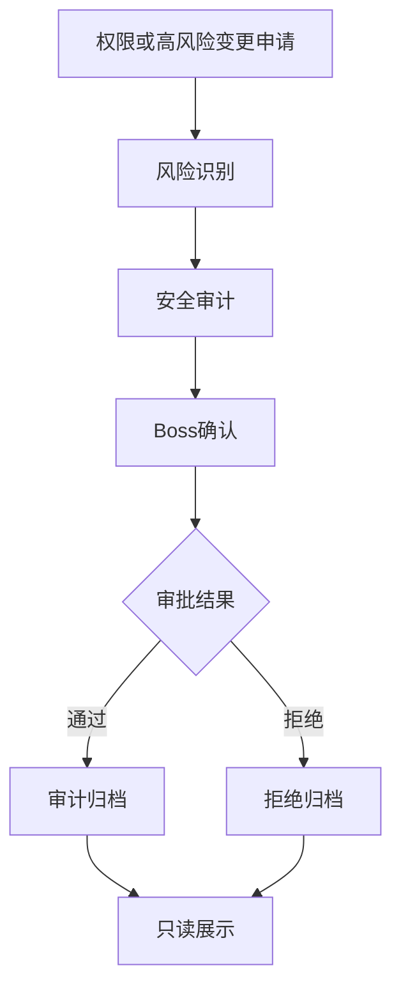

# Sprint62.13-A AI员工权限与安全体系架构设计 V1

## 1. 阶段边界

本阶段只做权限、安全架构设计。

禁止：

- 不写代码
- 不修改权限系统
- 不创建数据库
- 不创建 migration
- 不接真实权限控制
- 不接 OpenClaw
- 不接 n8n
- 不接 Execution Engine

目标：

设计 Tiantong AI AI员工长期安全治理体系，覆盖 AI Workforce、Organization、Skill Center、Knowledge OS、Memory、Growth、Audit、Task Center。

## 2. 产品定位

产品名称：

```text
AI员工权限与安全体系 V1 / AI Employee Security Governance
```

定位：

- AI员工权限与安全体系是天统AI企业大脑的长期治理层。
- V1 只定义权限模型、权限范围、高风险审批、安全审计流程和 Audit Center 关系。
- V1 不接真实权限控制，不改变现有 `roles / permissions / users` 表，不修改任何权限配置。

核心原则：

- 技能不等于权限。
- 成长等级不等于权限。
- 专家身份不等于权限。
- 会议建议不等于审批通过。
- 记忆沉淀不等于自动学习。
- 审计记录不等于自动处置。

禁止：

- 自动授权
- 自动升级权限
- 自动修改安全规则
- 自动修改员工状态
- 自动创建任务
- 自动执行任务
- 自动进入 Execution Engine

## 3. 现有安全基础

当前项目已有可复用基础：

| 模块 | 当前能力 | 关系 |
| --- | --- | --- |
| `backend/auth.py` | 登录、会话、角色权限检查 | 基础认证与菜单权限 |
| `backend/auth_data.py` | `owner/admin/operator/customer_service/designer/editor/finance` 角色别名与菜单配置 | 当前角色体系 |
| `roles / permissions / role_permissions` | 数据库权限基础 | 可作为未来权限扩展基础 |
| `TaskCenterAuditLog` | Task Center 审计日志 | 任务安全追踪 |
| `RiskEvent` | 员工风险事件 | 成长与审计风险来源 |
| `backend/security/tian_shen/*` | 天神审批策略、风险拦截、审计记录 | 高风险动作识别雏形 |
| `tool_center/gateway.py` | 工具权限检查、审批要求 | 工具调用安全模型参考 |
| `enterprise_brain_console.py` | readonly、安全状态、风险摘要 | 总控台安全展示 |

V1 设计要求：

- 复用现有角色与权限基础。
- 长期角色设计不等于立即变更当前系统。
- 所有高风险动作必须保留 `boss_confirm=true` 与 `security_audited=true`。

## 4. AI员工权限模型

### 4.1 角色层级

```text
Boss
↓
Admin
↓
部门负责人
↓
AI员工管理员
↓
普通员工
↓
Viewer
```

角色定义：

| 角色 | 定位 | 典型权限 | V1 边界 |
| --- | --- | --- | --- |
| Boss | 企业最高确认人 | 全局查看、高风险确认、最终审批 | 不绕过审计 |
| Admin | 系统管理员 | 管理范围查看、配置审核、报告查看 | 不自动授权 |
| 部门负责人 | 部门管理者 | 查看部门员工、部门任务、部门风险 | 不跨部门越权 |
| AI员工管理员 | AI员工运维/管理角色 | 查看员工档案、能力、任务、风险 | 不自动创建员工 |
| 普通员工 | 业务或AI员工自身角色 | 查看自身或授权范围数据 | 不查看敏感全局数据 |
| Viewer | 观察者 | 只读查看允许页面 | 不访问高风险明细 |

### 4.2 与当前角色映射

| 长期角色 | 当前可映射角色 | 说明 |
| --- | --- | --- |
| Boss | `owner` / `boss` alias | 最高确认人 |
| Admin | `admin` / `administrator` alias | 管理员 |
| 部门负责人 | 未来 Organization 角色 | 当前不落地 |
| AI员工管理员 | 未来 Organization 角色或 `admin` 子权限 | 当前不落地 |
| 普通员工 | `operator`、`customer_service`、`designer`、`editor`、`finance` | 按业务角色限制范围 |
| Viewer | 未来只读角色 | 当前部分接口已按 viewer 禁止访问 |

## 5. AI员工权限范围

### 5.1 权限范围总览

| 权限范围 | 说明 | 主管模块 | V1 边界 |
| --- | --- | --- | --- |
| 查看权限 | 查看员工、任务、技能、知识、风险摘要 | AI Workforce / Organization | 只读 |
| 知识权限 | 查看 SOP、Prompt、案例、知识文章 | Knowledge OS | 不发布、不修改 |
| 技能权限 | 查看技能、版本、风险、审核状态 | Skill Center | 不安装、不升级、不调用 |
| 任务权限 | 查看任务、状态、结果、验收、审计 | Task Center | 不创建、不分配、不改状态 |
| 数据权限 | 查看经营数据、员工数据、风险数据 | Organization / Audit | 不导出敏感数据 |

### 5.2 查看权限

查看权限分级：

```text
company_view
department_view
employee_view
self_view
public_summary_view
```

规则：

- Boss 可查看企业级摘要和高风险明细。
- Admin 可查看管理范围内数据。
- 部门负责人只查看本部门员工、任务、风险。
- 普通员工只查看自身或授权范围。
- Viewer 只查看公开只读摘要。

### 5.3 知识权限

知识权限分级：

```text
knowledge_summary_read
knowledge_article_read
sop_read
prompt_read_masked
prompt_read_full
case_read
knowledge_publish_review
```

规则：

- Prompt 默认脱敏展示。
- 完整 Prompt 查看必须有明确权限。
- 知识发布、Prompt修改、SOP修改必须人工审核。
- 失败案例和风险案例按敏感等级限制。

### 5.4 技能权限

技能权限分级：

```text
skill_summary_read
skill_detail_read
skill_version_read
skill_usage_read
skill_bind_review
skill_risk_review
```

规则：

- 技能可见不等于技能可用。
- 技能熟练度不等于技能授权。
- 技能绑定、升级、废弃必须经过审核。
- 高风险技能必须 `boss_confirm=true` 与 `security_audited=true`。

### 5.5 任务权限

任务权限分级：

```text
task_summary_read
task_detail_read
task_result_read
task_audit_read
task_create_review
task_status_change_review
```

规则：

- V1 只读展示任务。
- 任务创建、分配、开始、验收、状态修改不属于本阶段。
- 高风险任务不得从 AI员工生态页面直接进入执行。

### 5.6 数据权限

数据权限分级：

```text
data_summary_read
department_data_read
company_data_read
sensitive_data_masked_read
sensitive_data_full_read
data_export_review
```

规则：

- 默认脱敏。
- 敏感经营数据、账号数据、客户数据必须分级展示。
- 数据导出必须审批。
- AI员工不得越权查看跨部门敏感数据。

## 6. 高风险操作审批模型

### 6.1 高风险操作清单

| 操作 | 风险 | 必须条件 |
| --- | --- | --- |
| 修改技能 | 可能扩大能力边界 | `boss_confirm=true`、`security_audited=true` |
| 修改知识库 | 可能污染正式知识 | `boss_confirm=true`、`security_audited=true` |
| 升级能力 | 可能影响员工等级和推荐 | `boss_confirm=true`、`security_audited=true` |
| 调整权限 | 可能越权访问或执行 | `boss_confirm=true`、`security_audited=true` |
| 执行任务 | 可能触发真实业务动作 | `boss_confirm=true`、`security_audited=true` |
| 创建任务 | 可能进入工作流 | `boss_confirm=true`、`security_audited=true` |
| 发布 Prompt | 可能影响AI输出 | `boss_confirm=true`、`security_audited=true` |
| 发布 SOP | 可能影响业务流程 | `boss_confirm=true`、`security_audited=true` |

### 6.2 审批状态机

```text
draft
↓
risk_detected
↓
security_review_required
↓
boss_confirm_required
↓
approved / rejected
↓
archived
```

状态说明：

| 状态 | 说明 |
| --- | --- |
| `draft` | 仅为建议或草稿 |
| `risk_detected` | 命中风险规则 |
| `security_review_required` | 需要安全审计 |
| `boss_confirm_required` | 需要 Boss确认 |
| `approved` | 审批通过，但不代表自动执行 |
| `rejected` | 审批拒绝 |
| `archived` | 审计归档 |

### 6.3 审批对象结构

```json
{
  "approval_id": "approval_xxx",
  "source_module": "skill_center",
  "target_module": "organization",
  "operation_type": "modify_skill",
  "risk_level": "high",
  "request_summary": "申请修改某AI员工技能范围",
  "security_audited": true,
  "boss_confirm": true,
  "approved": false,
  "auto_execute": false,
  "created_at": "datetime"
}
```

关键原则：

- 审批通过不等于自动执行。
- 审批记录必须进入 Audit Center。
- 高风险操作必须可追溯到申请人、来源模块、目标模块和风险理由。

## 7. 安全审计流程

### 7.1 标准流程



### 7.2 事件记录

每个安全事件必须记录：

- 事件编号
- 来源模块
- 目标模块
- 关联员工
- 关联任务
- 操作类型
- 风险等级
- 风险原因
- 审计状态
- Boss确认状态
- 安全审核状态
- 创建时间
- 审计人
- 处理结果

### 7.3 风险分级

| 等级 | 定义 | 处理 |
| --- | --- | --- |
| low | 只读查看、公开摘要 | 记录即可 |
| medium | 涉及部门数据、技能详情、知识引用 | 需要审计记录 |
| high | 涉及权限、技能绑定、任务执行、知识发布 | 必须双确认 |
| critical | 涉及资金、外部平台、账号、真实执行 | 默认阻断 |

## 8. 与 Audit Center 关系

Audit Center 是安全体系的记录、追踪和报告中心。

| 安全体系 | Audit Center |
| --- | --- |
| 定义权限模型 | 展示权限审计结果 |
| 定义高风险操作 | 记录高风险事件 |
| 定义审批状态机 | 展示审批链 |
| 定义安全规则 | 展示命中规则 |
| 定义禁止动作 | 展示阻断记录 |

数据流：

```text
AI Workforce / Organization / Skill / Knowledge / Memory / Growth / Task
↓
风险识别
↓
审批模型
↓
Audit Center
↓
Boss查看 / 安全复盘 / 归档
```

边界：

- Audit Center 不自动处置。
- Audit Center 不自动封禁员工。
- Audit Center 不自动修改权限。
- Audit Center 不自动执行任务。

## 9. 与各中心关系

| 模块 | 安全关系 | 禁止 |
| --- | --- | --- |
| AI Workforce | 展示员工权限、风险、审计状态 | 不修改员工状态 |
| Organization | 定义组织、角色、权限边界 | 不自动授权 |
| Skill Center | 展示技能风险与审核状态 | 不自动安装或升级技能 |
| Knowledge OS | 展示知识权限和发布状态 | 不自动发布知识 |
| Memory | 记录经验和决策记忆 | 不自动学习修改自身 |
| Growth | 展示成长评分和建议 | 不自动晋升或改权 |
| Audit Center | 汇总审计和风险 | 不自动处置 |
| Task Center | 提供任务状态与审计日志 | 不自动创建、分配、执行任务 |

## 10. V1 / V2 / V3 演进路线

### V1：安全架构设计

目标：

- 定义长期角色模型。
- 定义权限范围。
- 定义高风险审批模型。
- 定义与 Audit Center 的关系。

限制：

- 不接真实权限控制。
- 不修改现有权限系统。
- 不创建数据库和 migration。

### V2：只读安全展示

目标：

- 在 AI Workforce、Organization、Audit Center 中展示权限范围和风险状态。
- 汇总现有 `roles / permissions / TaskCenterAuditLog / RiskEvent`。
- 保持只读。

限制：

- 不提供权限修改按钮。
- 不自动授权。

### V3：人工审批工作流

目标：

- 支持权限变更申请草稿。
- 支持技能变更、知识发布、能力升级的审批单。
- 支持 Audit Center 统一追踪审批链。

限制：

- 审批通过后仍不自动执行。
- 真实权限修改必须由受控后台或人工流程完成。

## 11. 总安全边界

安全状态必须保持：

```json
{
  "security_architecture_only": true,
  "permission_system_modified": false,
  "database_created": false,
  "migration_created": false,
  "real_permission_control_connected": false,
  "auto_grant_permission": false,
  "auto_upgrade_permission": false,
  "auto_modify_security_rule": false,
  "auto_execute_task": false,
  "execution_engine_called": false,
  "openclaw_connected": false,
  "n8n_connected": false
}
```

高风险必须：

```json
{
  "boss_confirm": true,
  "security_audited": true
}
```

## 12. 验收结论

Sprint62.13-A 只完成 AI员工权限与安全体系架构设计 V1。

验收项：

- 已设计 Boss、Admin、部门负责人、AI员工管理员、普通员工、Viewer 权限模型。
- 已设计查看权限、知识权限、技能权限、任务权限、数据权限。
- 已设计高风险操作审批模型。
- 已设计安全审计流程。
- 已设计 V1/V2/V3 演进路线。
- 已说明与 Audit Center 的关系。
- 已明确禁止自动授权、自动升级权限、自动修改安全规则。

未执行事项：

- 未写代码。
- 未修改权限系统。
- 未创建数据库。
- 未创建 migration。
- 未接真实权限控制。
- 未接 OpenClaw。
- 未接 n8n。
- 未接 Execution Engine。
