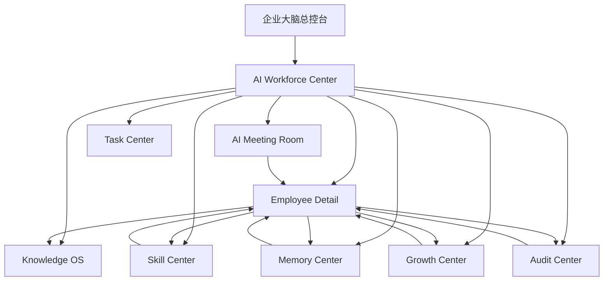
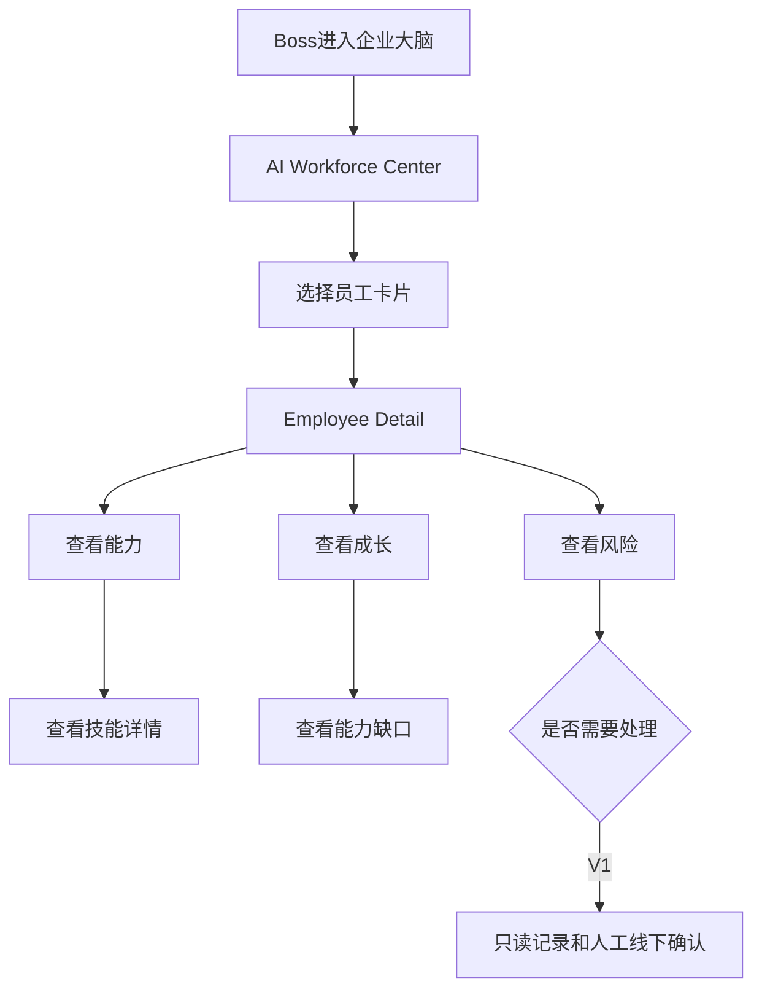

# Sprint62.15-A AI员工生态前端产品统一设计 V1

## 1. 阶段边界

本阶段只做前端产品设计。

禁止：

- 不写代码
- 不创建 HTML
- 不修改现有页面
- 不新增 API
- 不创建数据库
- 不接 OpenClaw
- 不接 n8n
- 不接 Execution Engine

目标：

设计 Tiantong AI AI员工生态统一前端产品体验，覆盖 AI Workforce Center、Employee Detail、Skill Center、Knowledge OS、Memory Center、Growth Center、Audit Center、AI Meeting Room。

## 2. 设计原则

复用现有系统：

- 沿用企业大脑总控台和 AI Workforce Center 的左侧深色导航。
- 沿用顶部状态栏、只读模式 pill、白色 8px 卡片、空状态、风险 tag。
- 保持页面为管理型、信息密集型界面，不做营销页。
- V1 只展示，不提供执行、升级、改权入口。

统一安全表达：

```text
readonly安全模式
只读展示
当前未接入真实业务数据
当前数据暂不可用
技能 ≠ 权限
高风险必须 boss_confirm=true + security_audited=true
```

## 3. 产品导航结构

### 3.1 一级导航

建议 AI员工生态使用统一左侧导航：

```text
天统AI企业大脑
├── 企业大脑总控台
├── AI Workforce Center
├── Employee Detail
├── Skill Center
├── Knowledge OS
├── Memory Center
├── Growth Center
├── Audit Center
├── AI Meeting Room
└── Task Center
```

### 3.2 页面入口关系

| 页面 | 当前/未来页面 | 入口 |
| --- | --- | --- |
| AI Workforce Center | `frontend/ai-workforce.html` | AI员工生态主入口 |
| Employee Detail | `frontend/ai-employee-detail.html` | 员工卡片下钻 |
| Skill Center | `frontend/skill-center.html`、`frontend/skill-detail.html` | 能力入口 |
| Knowledge OS | `frontend/tiancang.html`、`frontend/knowledge-center.html` | 知识入口 |
| Memory Center | `frontend/memory-center.html` | 未来只读记忆入口 |
| Growth Center | `frontend/growth-center.html` | 未来只读成长入口 |
| Audit Center | `frontend/audit-center.html` | 未来只读审计入口 |
| AI Meeting Room | `frontend/ai-meeting-room.html` | 未来只读会议入口 |

V1 导航策略：

- 已存在页面直接进入。
- 未实现页面显示“设计中 / 暂未开放”状态。
- 不使用假数据填充未实现页面。
- 不隐藏安全状态。

## 4. 页面关系图



页面职责：

| 页面 | 职责 | 不负责 |
| --- | --- | --- |
| AI Workforce Center | 员工大厅、中心入口、生态摘要 | 不创建员工、不执行任务 |
| Employee Detail | 单员工身份、能力、知识、任务、成长、风险 | 不启动员工、不改权限 |
| Skill Center | 技能资产、版本、风险、审核状态 | 不安装技能、不升级技能 |
| Knowledge OS | SOP、Prompt、案例、知识资产 | 不自动发布知识 |
| Memory Center | 成功/失败经验、决策记忆、项目记忆 | 不自动学习修改 |
| Growth Center | 成长评分、能力缺口、晋升建议 | 不自动晋升 |
| Audit Center | 风险事件、审计记录、审批链 | 不自动处置 |
| AI Meeting Room | 多AI讨论、方案草稿、决策草稿 | 不自动创建任务 |

## 5. 页面统一布局

### 5.1 基础布局

所有 AI员工生态页面建议使用：

```text
页面
├── 左侧导航
├── 顶部状态栏
│   ├── 页面名称
│   ├── 当前组织
│   ├── 当前数据状态
│   └── readonly安全模式
├── Hero / 页面说明
├── 页面状态提示
├── 数据总览卡片
├── 主体内容区
└── 安全边界提示
```

### 5.2 响应式结构

桌面端：

- 左侧导航固定宽度约 248px。
- 主体内容使用 `grid` 布局。
- 总览卡片 4 列或 6 列。
- 列表卡片 3 到 4 列。

移动端：

- 隐藏左侧导航。
- 顶部状态栏换行。
- 卡片单列。
- 表格允许横向滚动。

## 6. 统一组件设计

### 6.1 状态卡片

用途：

- 员工数量
- 任务数量
- 技能数量
- 记忆数量
- 风险数量
- 待确认事项

结构：

```text
状态卡片
├── 标签
├── 数值
├── 状态说明
└── 子指标
```

状态：

| 状态 | 颜色语义 | 示例 |
| --- | --- | --- |
| healthy / low | 绿色 | 正常、低风险 |
| partial / medium | 黄色/橙色 | 部分接入、中风险 |
| high / blocked / failed | 红色 | 高风险、阻塞、失败 |
| designing / empty | 灰色 | 设计中、暂无数据 |
| readonly | 蓝色 | 只读模式 |

### 6.2 能力卡片

用途：

- 员工能力摘要
- Skill Center 技能卡
- 能力入口卡

结构：

```text
能力卡片
├── 名称
├── 类型 / 分类
├── 描述
├── 版本
├── 风险等级
├── 审核状态
└── 查看详情
```

按钮限制：

- 允许：查看、进入、查看详情
- 禁止：安装、升级、运行、执行、授权

### 6.3 风险卡片

用途：

- 高风险员工
- 高风险技能
- 阻塞任务
- 待 Boss 确认
- 待安全审计

结构：

```text
风险卡片
├── 风险等级
├── 来源模块
├── 关联员工
├── 关联任务
├── 风险说明
├── 审计状态
└── 只读查看
```

安全文案：

```text
高风险事项必须 boss_confirm=true 且 security_audited=true。
```

### 6.4 成长曲线

用途：

- Growth Center 成长趋势
- 员工详情页成长摘要
- 技能熟练度变化

V1 表达方式：

- 首期可用表格或趋势摘要，不强制图表库。
- 无数据时显示“暂无成长数据”。
- 不用假数据生成曲线。

结构：

```text
成长曲线
├── 当前评分
├── 成长等级
├── 成功率
├── 技能变化
├── 能力缺口
└── 最近复盘
```

### 6.5 技能展示

用途：

- Employee Detail 能力中心
- AI Employee Capability
- Skill Center

结构：

```text
技能展示
├── 技能名称
├── 技能版本
├── 技能状态
├── 熟练度
├── 风险等级
├── 审核状态
└── 适用员工
```

强制提示：

```text
技能 ≠ 权限
```

### 6.6 审计记录

用途：

- Audit Center
- Employee Detail 风险中心
- Skill Center 风险状态
- Growth Center 高风险建议

结构：

```text
审计记录
├── 事件类型
├── 来源模块
├── 关联员工
├── 关联对象
├── 风险等级
├── 审计状态
├── Boss确认状态
└── 发生时间
```

禁止：

- 自动修复
- 自动封禁
- 自动改权
- 自动执行

## 7. 页面设计摘要

### 7.1 AI Workforce Center

核心区域：

- 顶部状态栏
- 员工大厅
- 部门筛选
- 员工卡片
- 八个能力入口
- 安全边界提示

员工卡片字段：

- 员工名称
- 员工编号
- 部门
- 岗位
- 状态
- 技能数量
- 当前任务
- 风险等级
- 查看员工

### 7.2 Employee Detail

核心区域：

- 顶部员工身份卡
- 员工身份档案
- 能力中心
- 知识中心
- 工作记录
- 成长中心
- 风险中心
- 审计状态

关键约束：

- 只读页面。
- 危险操作入口隐藏。
- 不显示执行、启动、升级、改权按钮。

### 7.3 Skill Center

核心区域：

- 技能总览
- 技能列表
- 技能详情
- 技能版本
- 风险等级
- 审核状态

关键约束：

- 技能只是能力资产。
- 不提供安装、升级、调用技能入口。

### 7.4 Knowledge OS

核心区域：

- 知识资产总览
- SOP
- Prompt
- 案例
- 课程
- 知识状态

关键约束：

- Prompt 默认脱敏。
- 不自动发布知识。
- 不自动生成正式 SOP。

### 7.5 Memory Center

核心区域：

- 记忆总览
- 员工记忆
- 项目记忆
- 决策记忆
- 成功案例
- 失败案例
- 记忆搜索

关键约束：

- 只查看、只分析。
- 不自动学习修改自身。
- 不自动改变技能或权限。

### 7.6 Growth Center

核心区域：

- 成长总览
- AI员工成长排名
- 能力变化
- 技能成长曲线
- 成功率变化
- 能力缺口

关键约束：

- 晋升建议不等于自动晋升。
- 成长评分不等于权限。
- 不自动调整技能。

### 7.7 Audit Center

核心区域：

- 风险总览
- 审计事件列表
- AI员工行为记录
- 技能调用记录
- 权限变化记录
- 安全状态
- 审批链

关键约束：

- Audit Center 只记录和展示。
- 不自动修复。
- 不自动封禁员工。
- 不自动修改权限。

### 7.8 AI Meeting Room

核心区域：

- 会议列表
- 创建会议设计区
- 参与 AI员工
- 讨论记录
- 方案总结
- 决策草稿
- 风险提示

关键约束：

- 会议只生成草稿。
- 不自动创建任务。
- 不自动执行方案。

## 8. Boss 用户操作流程

Boss 核心路径：

```text
查看员工
↓
查看能力
↓
查看成长
↓
查看风险
```

详细流程：



V1 操作按钮白名单：

- 查看
- 进入
- 查看详情
- 返回
- 筛选
- 搜索

V1 禁止按钮：

- 执行
- 启动
- 自动运行
- 自动升级
- 安装技能
- 升级技能
- 修改权限
- 授权
- 创建任务
- 发布知识

## 9. 空数据与异常状态

### 9.1 空数据

统一文案：

```text
当前未接入真实业务数据
暂无数据
暂无成长数据
暂无记忆数据
暂无审计事件
```

规则：

- 不生成假数据。
- 不用“0”冒充真实业务稳定状态。
- 空状态要说明是否为设计中、未接入、无权限或无数据。

### 9.2 API 异常

统一文案：

```text
当前数据暂不可用
页面加载失败
无权限查看
请重新登录
```

规则：

- 单模块异常不影响其他模块展示。
- 错误状态不能出现执行兜底按钮。
- 无权限状态不能暴露敏感详情。

## 10. V1 / V2 / V3 页面演进路线

### V1：统一只读产品体验

目标：

- 明确页面导航、页面关系、组件规范。
- 已有页面保持稳定。
- 未来页面先设计，不创建 HTML。

限制：

- 不写代码。
- 不新增 API。
- 不接执行系统。

### V2：只读页面补齐

目标：

- 补齐 Memory Center、Growth Center、Audit Center、AI Meeting Room 只读页面。
- 页面先支持空状态。
- 复用统一组件样式。

限制：

- 不提供执行按钮。
- 不提供自动升级或改权按钮。

### V3：统一生态联动

目标：

- AI Workforce 下钻到各中心。
- Employee Detail 聚合能力、知识、记忆、成长、审计。
- Audit Center 统一展示高风险审批链。

限制：

- 仍不自动执行。
- 仍不自动授权。
- 高风险只能生成人工确认事项。

## 11. 安全边界

页面必须禁止：

- 执行按钮
- 自动升级按钮
- 自动修改权限按钮
- 自动安装技能按钮
- 自动调用技能按钮
- 自动发布知识按钮
- 自动创建任务按钮
- OpenClaw 入口
- n8n 入口
- Execution Engine 入口

页面必须展示：

```json
{
  "readonly": true,
  "execution_button_visible": false,
  "auto_upgrade_button_visible": false,
  "permission_modify_button_visible": false,
  "execution_engine_called": false,
  "openclaw_connected": false,
  "n8n_connected": false,
  "high_risk_requires": {
    "boss_confirm": true,
    "security_audited": true
  }
}
```

## 12. 验收结论

Sprint62.15-A 只完成 AI员工生态前端产品统一设计 V1。

验收项：

- 已设计产品导航结构。
- 已设计页面关系图。
- 已设计统一组件：状态卡片、能力卡片、风险卡片、成长曲线、技能展示、审计记录。
- 已设计 Boss 用户操作流程。
- 已规划 V1/V2/V3 页面演进路线。
- 已明确禁止执行按钮、自动升级按钮、自动修改权限按钮。

未执行事项：

- 未写代码。
- 未创建 HTML。
- 未修改现有页面。
- 未新增 API。
- 未创建数据库。
- 未接 OpenClaw。
- 未接 n8n。
- 未接 Execution Engine。
