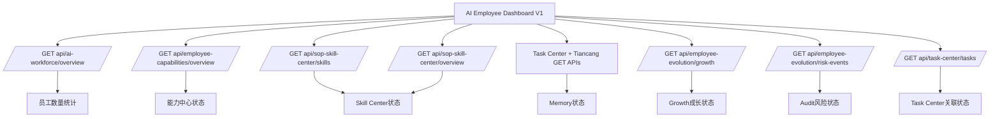

# Sprint62.17-F AI员工生态驾驶舱产品设计 V1

## 1. 阶段边界

本阶段只做产品设计，不进入开发。

禁止：

- 不修改数据库。
- 不创建 migration。
- 不修改前端页面。
- 不修改后端业务逻辑。
- 不接 Execution Engine。
- 不接 OpenClaw。
- 不接 n8n。
- 不自动执行任何动作。

目标页面：

```text
frontend/ai-employee-dashboard.html
```

定位：

AI Employee Dashboard V1 是 AI员工生态的老板级总览页，用于统一查看 AI员工数量、能力、技能、记忆、成长、审计、会议和 Task Center 关联状态。

## 2. 产品定位

AI员工生态驾驶舱是 AI Workforce Center 上层的状态汇总入口。

它回答 8 个问题：

1. 当前有多少 AI员工？
2. 员工能力中心是否可用？
3. Skill Center 是否有技能资产？
4. Memory 是否沉淀了经验？
5. Growth 是否有成长记录？
6. Audit 是否存在风险？
7. Meeting 是否有协作会议？
8. Task Center 当前任务状态如何？

V1 原则：

- 只读展示。
- 只做聚合视图。
- 优先复用已有 API。
- 没有数据时显示空状态。
- 不提供执行、升级、授权、自动化入口。

## 3. 页面结构设计

```text
AI Employee Dashboard V1
├── 顶部状态栏
│   ├── AI Employee Dashboard
│   ├── 当前组织：天统AI
│   ├── 当前Sprint：Sprint62.17-F
│   └── readonly安全模式
├── AI员工数量统计
│   ├── AI员工总数
│   ├── working
│   ├── idle
│   ├── frozen
│   └── 部门数量
├── 八大生态状态卡
│   ├── AI Workforce
│   ├── Capability Center
│   ├── Skill Center
│   ├── Memory Center
│   ├── Growth Center
│   ├── Audit Center
│   ├── AI Meeting Room
│   └── Task Center
├── 生态健康摘要
│   ├── 可用模块
│   ├── 部分可用模块
│   ├── 暂无数据模块
│   └── 高风险模块
├── 最近状态
│   ├── 最近任务
│   ├── 最近风险
│   ├── 最近成长记录
│   └── 最近记忆更新
└── 安全边界
    ├── readonly=true
    ├── execution_engine_called=false
    ├── openclaw_connected=false
    ├── n8n_connected=false
    └── 高风险必须 boss_confirm=true + security_audited=true
```

## 4. 核心区域设计

### 4.1 AI员工数量统计

展示字段：

| 字段 | 说明 | 数据来源 |
| --- | --- | --- |
| AI员工总数 | 当前员工数量 | `/api/ai-workforce/overview.employees.total` |
| working | 工作中员工数 | `/api/ai-workforce/overview.employees.working` |
| idle | 空闲员工数 | `/api/ai-workforce/overview.employees.idle` |
| frozen | 冻结员工数 | `/api/ai-workforce/overview.employees.frozen` |
| 部门数量 | 部门分布数量 | `/api/ai-workforce/overview.departments` |

空状态：

```text
暂无数据
```

异常状态：

```text
当前数据不可用
```

### 4.2 能力中心状态

展示字段：

| 字段 | 说明 | 数据来源 |
| --- | --- | --- |
| 能力档案数量 | 已配置能力档案 | `/api/employee-capabilities/overview.summary.configured_capabilities` |
| 缺失能力数量 | 待补齐能力 | `/api/employee-capabilities/overview.summary.missing_capability_count` |
| 平均成熟度 | 能力成熟度 | `/api/employee-capabilities/overview.summary.average_maturity_level` |
| 平均成功率 | 能力表现 | `/api/employee-capabilities/overview.summary.average_success_rate` |

页面入口：

```text
/ai-employee-capability.html
```

按钮白名单：

- 查看
- 进入

### 4.3 Skill Center 状态

展示字段：

| 字段 | 说明 | 数据来源 |
| --- | --- | --- |
| 技能数量 | Skill 总数 | `/api/sop-skill-center/skills` |
| SOP 数量 | SOP 总数 | `/api/sop-skill-center/overview.total_sops` |
| Prompt 数量 | Prompt 总数 | `/api/sop-skill-center/overview.total_prompt_templates` |
| 高风险技能 | high / critical 统计 | `/api/sop-skill-center/skills` |

页面入口：

```text
/skill-center.html
```

安全说明：

```text
技能 ≠ 权限
技能可见 ≠ 可执行
```

### 4.4 Memory 状态

展示字段：

| 字段 | 说明 | 数据来源 |
| --- | --- | --- |
| 记忆数量 | 任务、文章、SOP、Prompt、案例聚合 | `/api/task-center/tasks` + `/api/tiancang/*` |
| 最近更新 | 聚合更新时间 | 现有只读数据最大更新时间 |
| 记忆类型 | Experience / DecisionHistory / LearningRecord / SuccessCase / FailureCase | 前端聚合 |
| 风险记忆 | failure / rejected / bug case 统计 | Task Center + 天藏 Bug |

页面入口：

```text
/ai-employee-memory.html
```

空状态：

```text
暂无数据
```

### 4.5 Growth 成长状态

展示字段：

| 字段 | 说明 | 数据来源 |
| --- | --- | --- |
| 成长记录 | Growth 记录总数 | `/api/employee-evolution/growth` |
| 成长等级 | 平均成长评分推导 | `/api/employee-evolution/growth` |
| 技能成长趋势 | skill_growth / score 推导 | `/api/employee-evolution/growth` |
| 风险成长事件 | 风险事件数量 | `/api/employee-evolution/risk-events` |

页面入口：

```text
/ai-employee-growth.html
```

禁止：

- 不调用 `POST /api/employee-evolution/analyze`。
- 不自动升级员工。
- 不自动修改技能。
- 不自动调整权限。

### 4.6 Audit 风险状态

V1 页面未开发独立 Audit Center 时，先复用现有风险来源：

| 字段 | 说明 | 数据来源 |
| --- | --- | --- |
| 风险数量 | 风险事件总数 | `/api/employee-evolution/risk-events` |
| 高风险数量 | high / critical 统计 | `/api/employee-evolution/risk-events` |
| 审计状态 | 只读审计状态 | 前端聚合 |
| Boss确认事项 | 高风险待确认统计 | 风险事件 + Task Center 审核状态 |

未来页面入口：

```text
/audit-center.html
```

V1 空状态：

```text
Audit Center 暂未接入，当前只显示风险摘要。
```

### 4.7 Meeting 状态

V1 会议中心未开发时，先显示设计占位：

| 字段 | 说明 | 数据来源 |
| --- | --- | --- |
| 会议数量 | AI会议数量 | 暂无统一 API |
| 草稿方案 | 方案草稿数量 | 暂无统一 API |
| 参与员工 | 参与员工数量 | 暂无统一 API |
| 风险提示 | 会议风险提示 | 暂无统一 API |

未来页面入口：

```text
/ai-meeting-room.html
```

空状态：

```text
暂无会议数据
```

安全边界：

- AI会议只生成讨论与方案草稿。
- 不自动创建任务。
- 不自动执行方案。

### 4.8 Task Center 关联状态

展示字段：

| 字段 | 说明 | 数据来源 |
| --- | --- | --- |
| 总任务 | Task Center 总任务 | `/api/task-center/tasks` |
| running | 运行中任务 | `/api/task-center/tasks` |
| pending | 待处理任务 | `/api/task-center/tasks` |
| blocked | 阻塞 / rejected 任务 | `/api/task-center/tasks` |
| 待验收 | result_submitted / accepted review pending | `/api/task-center/tasks` |

页面入口：

```text
/task-center.html
```

安全边界：

- Dashboard 只读展示任务状态。
- 不创建任务。
- 不修改任务状态。
- 不启动任务。

## 5. 数据流设计



数据策略：

- 所有数据只读 GET。
- 单个接口失败时，该模块显示 `当前数据不可用`。
- 全部接口为空时，显示 `当前未接入真实业务数据`。
- 不生成假数据。
- 不因模块异常影响其他模块展示。

## 6. 空状态设计

统一空状态文案：

| 场景 | 文案 |
| --- | --- |
| 无员工 | `暂无AI员工数据` |
| 无能力 | `暂无能力数据` |
| 无技能 | `暂无Skill数据` |
| 无记忆 | `暂无Memory数据` |
| 无成长 | `暂无Growth数据` |
| 无风险 | `暂无风险数据` |
| 无会议 | `暂无会议数据` |
| 无任务 | `暂无Task Center数据` |
| API失败 | `当前数据不可用` |
| 未接真实业务 | `当前未接入真实业务数据` |

## 7. 前端组件设计

建议组件：

| 组件 | 用途 |
| --- | --- |
| `MetricCard` | 员工数量、技能数量、风险数量等指标 |
| `CenterStatusCard` | 八大中心状态卡 |
| `RiskBadge` | low / medium / high / critical |
| `ReadonlyBanner` | readonly 安全提示 |
| `EmptyState` | 空数据展示 |
| `RecentActivityList` | 最近任务、记忆、成长记录 |
| `SafetyBoundaryPanel` | 安全边界说明 |

按钮白名单：

- 查看
- 进入
- 查看详情

禁止按钮：

- 执行
- 启动
- 自动运行
- 升级
- 授权
- 修改权限
- 创建任务
- 调用技能

## 8. 安全边界

Dashboard V1 必须保持：

```json
{
  "readonly": true,
  "execution_engine_called": false,
  "openclaw_connected": false,
  "n8n_connected": false,
  "auto_execute": false
}
```

高风险信息只展示，不处理。

高风险操作必须满足：

```text
boss_confirm=true
security_audited=true
```

禁止：

- 自动执行任何动作。
- 自动创建任务。
- 自动修改 Task Center 状态。
- 自动升级员工。
- 自动安装技能。
- 自动修改权限。
- 自动调用 Execution Engine。
- 自动接入 OpenClaw。
- 自动接入 n8n。

## 9. API 复用清单

V1 优先复用：

| 模块 | API |
| --- | --- |
| AI员工数量统计 | `GET /api/ai-workforce/overview` |
| 能力中心状态 | `GET /api/employee-capabilities/overview` |
| Skill Center 状态 | `GET /api/sop-skill-center/skills`, `GET /api/sop-skill-center/overview` |
| Memory 状态 | `GET /api/task-center/tasks`, `GET /api/tiancang/articles/search`, `GET /api/tiancang/sops`, `GET /api/tiancang/prompts`, `GET /api/tiancang/bugs` |
| Growth 状态 | `GET /api/employee-evolution/growth` |
| Audit 风险状态 | `GET /api/employee-evolution/risk-events` |
| Meeting 状态 | V1 空状态，后续统一 API |
| Task Center 状态 | `GET /api/task-center/tasks` |

明确不使用：

- `POST /api/employee-evolution/analyze`
- `/api/execution/*`
- `/api/brain/start`
- OpenClaw 相关接口
- n8n 相关接口

## 10. 开发拆分建议

### Sprint62.18-A 页面骨架

修改文件：

- `frontend/ai-employee-dashboard.html`
- `tests/test_ai_employee_dashboard.py`

验收标准：

- 页面存在。
- 包含八大中心状态卡。
- 包含 readonly 安全模式。
- 不存在执行、升级、授权、修改权限入口。

### Sprint62.18-B 只读数据聚合

修改文件：

- `frontend/ai-employee-dashboard.html`
- `tests/test_ai_employee_dashboard.py`

验收标准：

- 复用现有 GET API。
- 单模块异常不影响全页。
- 无数据展示空状态。
- 不新增后端 API。

### Sprint62.18-C 页面验收

验收内容：

- 页面加载正常。
- 空状态正常。
- API失败降级正常。
- 安全边界通过。

## 11. 验收标准

设计阶段通过条件：

- 已定义 `frontend/ai-employee-dashboard.html` 页面结构。
- 已覆盖 AI员工数量、能力、Skill、Memory、Growth、Audit、Meeting、Task Center。
- 已明确 API 复用策略。
- 已明确空状态。
- 已明确安全边界。
- 未写代码。
- 未修改数据库。
- 未创建 migration。
- 未接 Execution Engine / OpenClaw / n8n。
