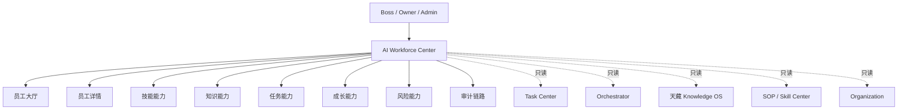

# Sprint62.1 AI员工工作台 V2 产品架构设计报告

## 阶段边界

本阶段只做产品架构设计，不写代码，不修改前端，不修改后端，不创建数据库，不创建 migration，不接真实业务数据，不接 OpenClaw，不接 n8n，不接 Execution Engine。

设计原则：

- 先复用已有系统，不推倒重来。
- V2 首期保持只读展示。
- 不新增自动执行能力。
- 不修改 Task Center 核心流程。
- 不改变现有员工、权限、数据库结构。

## 一、现有员工系统分析

### 1. 已有系统结构

当前项目是 FastAPI 后端 + 静态 HTML 前端 + PostgreSQL + Redis + Worker + Nginx 的结构。

核心入口：

- 后端入口：`backend/main.py`
- AI员工模型：`backend/models.py`
- AI员工 API：`backend/routers/ai_employees.py`
- 员工工作台 API：`backend/routers/employee_workspace.py`
- Task Center：`backend/routers/task_center.py`
- Orchestrator：`backend/routers/orchestrator.py`
- Knowledge OS / 天藏：`backend/routers/tiancang.py`、`backend/routers/knowledge_center.py`
- SOP / Skill Center 雏形：`backend/routers/sop_skill_center.py`
- Skill 能力雏形：`backend/routers/employee_capabilities.py`
- Growth 雏形：`backend/routers/employee_evolution.py`
- Organization 雏形：`backend/employee_organization/*`
- Audit 日志雏形：`backend/routers/employee_activity_log.py`、`backend/routers/employee_activity_trace.py`
- 总控台只读聚合：`backend/routers/enterprise_brain_console.py`

现有关键页面：

- `frontend/ai-employees.html`
- `frontend/ai-employee-detail.html`
- `frontend/employee-workspace.html`
- `frontend/task-center.html`
- `frontend/orchestrator.html`
- `frontend/tiancang.html`
- `frontend/sop-skill-center.html`
- `frontend/deploy-center.html`
- `frontend/enterprise-brain-console.html`

### 2. 员工档案能力

基础模型：`AiEmployee`

已有字段：

- `employee_code`
- `employee_name`
- `legion`
- `duty`
- `status`
- `task_types`
- `default_permissions`
- `is_legacy`
- `sort_order`
- `created_at`
- `updated_at`

已有 API：

- `GET /api/ai-employees`
- `GET /api/ai-employees/runtime-status`
- `GET /api/ai-employees/{employee_code}`
- `GET /api/ai-employees/{employee_id}/detail`

风险 API：

- `POST /api/ai-employees`
- `PATCH /api/ai-employees/{employee_code}`
- `POST /api/ai-employees/{employee_code}/enable`
- `POST /api/ai-employees/{employee_code}/disable`
- `POST /api/ai/tasks/{task_id}/run`

V2 工作台原则：只调用 GET，不暴露创建、编辑、启停、运行按钮。

### 3. 部门归属能力

现有字段：

- `AiEmployee.legion`

Organization 雏形：

- `backend/employee_organization/department_system.py`
- `backend/employee_organization/org_relationships.py`
- `backend/employee_organization/organization_permissions.py`
- `backend/employee_organization/organization_center.py`

已有能力：

- 按 `legion` 聚合部门。
- 推导部门负责人。
- 推导上下级关系与协作关系。
- 输出只读权限矩阵。

当前限制：

- 没有独立组织表。
- 组织关系主要由静态配置 + 员工表推导。
- 暂无公开 router，可在 V2 通过新只读聚合 API 调用内部 builder。

### 4. 技能能力

已有来源：

- `AiEmployee.task_types`
- `AiEmployee.default_permissions`
- `backend/routers/sop_skill_center.py` 的静态 SOP / Skill / Prompt / 员工绑定配置
- `backend/routers/employee_capabilities.py` 的能力画像配置

已有页面：

- `employee-capabilities.html`
- `sop-skill-center.html`
- `skill-plugin-center.html`

已有 API：

- `GET /api/sop-skill-center/overview`
- `GET /api/sop-skill-center/skills`
- `GET /api/sop-skill-center/employees`
- `GET /api/sop-skill-center/task-types`
- `GET /api/employee-capabilities/overview`
- `GET /api/employee-capabilities/employees`
- `GET /api/employee-capabilities/employees/{employee_code}`

当前限制：

- Skill Center 仍是配置型/只读雏形。
- 尚未有正式 Skill Profile 数据表。
- 技能与权限已区分，但仍需在页面上持续强调“技能 ≠ 权限”。

### 5. 知识能力

已有模型：

- `KnowledgeFile`
- `KnowledgeArticle`
- `SopLibrary`
- `PromptLibrary`
- `BugCase`
- `CourseLesson`

已有只读 API：

- `GET /api/tiancang/files`
- `GET /api/tiancang/articles/search`
- `GET /api/tiancang/sops`
- `GET /api/tiancang/prompts`
- `GET /api/tiancang/bugs`
- `GET /api/tiancang/courses`

风险 API：

- 上传文件
- AI总结
- AI分类
- 生成文章
- 发布文章

V2 工作台原则：

- 只展示员工相关知识能力摘要。
- 不上传资料。
- 不生成文章。
- 不发布知识。
- 不调用 AI 总结/分类。

### 6. 任务能力

已有模型：

- `TaskCenterTask`
- `TaskCenterResult`
- `TaskCenterReview`
- `TaskCenterAuditLog`

已有只读 API：

- `GET /api/task-center/tasks`
- `GET /api/task-center/tasks/{task_id}`
- `GET /api/task-center/tasks/{task_id}/audit-logs`

风险 API：

- 创建任务
- 分配员工
- 开始任务
- 提交结果
- 提交验收
- 提交审计
- 提交汇总
- 修改任务状态

V2 工作台原则：

- 只读展示任务数量、当前任务、历史任务、阻塞任务、待确认任务。
- 不在工作台内提供任务创建、分配、开始、验收、审计、汇总按钮。

### 7. 成长能力

已有模型：

- `EmployeeGrowth`
- `ReviewAnalysis`
- `SkillSuggestion`
- `RiskEvent`

已有 API：

- `GET /api/employee-evolution/profile/{code}`
- `GET /api/employee-evolution/growth`
- `GET /api/employee-evolution/risk-events`

风险 API：

- `POST /api/employee-evolution/analyze`

V2 工作台原则：

- 首期只读展示成长评分、评分变化、风险事件、技能建议。
- 不触发成长分析。
- 不自动升级员工。
- 不自动修改技能或权限。

### 8. 风险能力

已有风险来源：

- Task Center 阻塞状态：`rejected`、`failed`、`blocked`
- Employee Workspace 的 `has_blocker`
- Employee Evolution 的 `RiskEvent`
- SOP / Skill Center 的 `risk_level`、`requires_boss_confirmation`、`requires_security_audit`
- Enterprise Brain Console 的风险摘要

V2 工作台展示：

- 员工风险等级
- 阻塞任务数
- 近期风险事件
- 高风险能力标记
- 必须确认的安全边界

### 9. 审计能力

已有审计来源：

- `TaskCenterAuditLog`
- `EmployeeLog`
- `employee_activity_log`
- `employee_activity_trace`
- `DeployRecord`
- `OrchestratorAnalysisRecord`
- `OrchestratorTaskLink`

已有 API：

- `GET /api/employee-activity-log/overview`
- `GET /api/employee-activity-trace/trace-overview`
- `GET /api/employee-activity-trace/employees/{employee_code}/trace`
- `GET /api/task-center/tasks/{task_id}/audit-logs`

V2 工作台展示：

- 员工最近动作
- 任务审计链路
- Orchestrator 来源链路
- 风险/阻塞/老板确认记录

## 二、AI员工工作台 V2 定位

产品名称：

```text
AI Workforce Center
```

中文定位：

```text
AI员工数字办公室
```

目标：

- 让老板在一个入口查看所有 AI员工状态。
- 让部门负责人按部门理解 AI员工能力与风险。
- 让 AI员工画像从“名册”升级为“员工 + 能力 + 知识 + 任务 + 成长 + 审计”的综合工作台。
- 保持只读，不替代 Task Center、Orchestrator、Execution Engine。

V2 包含：

- 员工大厅
- 员工详情
- 技能能力
- 知识能力
- 任务能力
- 成长能力
- 风险能力
- 审计链路

产品边界：



明确不做：

- 不自动创建员工。
- 不自动升级员工。
- 不自动分配任务。
- 不自动启动任务。
- 不自动执行技能。
- 不接 Execution Engine。

## 三、页面架构设计

### 1. 新页面

规划新增页面：

```text
frontend/ai-workforce.html
```

页面定位：

- 作为 V2 AI员工统一入口。
- 不替换已有 `ai-employees.html`、`ai-employee-detail.html`、`employee-workspace.html`。
- 先以只读聚合页面接入，稳定后再逐步整合导航。

### 2. 页面整体结构

```text
顶部状态栏
├── 当前组织
├── 员工数量
├── 系统状态
└── 安全模式

主页面
├── 左侧筛选与部门导航
│   ├── 全部AI员工
│   ├── 部门分类
│   ├── 状态筛选
│   ├── 风险筛选
│   └── 技能筛选
│
├── 员工大厅
│   ├── 员工卡片网格
│   ├── 部门分组视图
│   └── 空数据状态
│
└── 右侧员工详情抽屉 / 详情面板
    ├── 基础信息
    ├── 技能
    ├── 知识
    ├── 任务
    ├── 成长
    └── 审计
```

### 3. 顶部状态栏

字段：

- 当前组织：`天统AI`
- 员工数量：来自 `AiEmployee` 非 legacy 员工数
- 系统状态：Backend / Database / Redis / Worker 只读状态
- 安全模式：`readonly`

展示建议：

- `只读模式`
- `不接 Execution Engine`
- `不接 OpenClaw`
- `不接 n8n`
- `高风险必须 boss_confirm=true + security_audited=true`

### 4. 员工大厅

筛选维度：

- 全部 AI员工
- 部门 / 军团
- 状态：active / inactive / working / reviewing / blocked / standby
- 风险：low / medium / high / blocked
- 技能分类：来自 SOP / Skill Center、Employee Capabilities

展示指标：

- AI员工总数
- 活跃员工数
- 工作中员工数
- 阻塞员工数
- 待老板确认数
- 待天检验收数
- 待天监审计数

### 5. 员工卡片

卡片字段：

- 名称
- 员工编号
- 部门
- 岗位 / 职责
- 状态
- 技能数量
- 任务数量
- 当前任务
- 风险等级
- 最近更新时间

卡片操作：

- 查看详情

禁止出现：

- 创建任务
- 分配任务
- 启动任务
- 执行任务
- 启用/停用员工
- 修改权限
- 绑定技能

### 6. 员工详情

详情结构：

```text
员工详情
├── 基础信息
│   ├── 员工名称
│   ├── employee_code
│   ├── 部门
│   ├── 岗位 / 职责
│   ├── 状态
│   └── 权限范围摘要
│
├── 技能
│   ├── task_types
│   ├── SOP绑定
│   ├── Skill绑定
│   ├── Prompt绑定
│   ├── 推荐模型
│   └── 禁用工具 / 风险工具
│
├── 知识
│   ├── SOP
│   ├── Prompt
│   ├── 知识文章
│   ├── Bug案例
│   └── 课程资料
│
├── 任务
│   ├── 当前任务
│   ├── 历史任务
│   ├── 任务成功率
│   ├── 待验收
│   └── 阻塞任务
│
├── 成长
│   ├── 当前成长评分
│   ├── Review Analysis
│   ├── Skill Suggestion
│   └── Risk Event
│
├── 风险
│   ├── 风险等级
│   ├── 最近错误
│   ├── 高风险技能
│   └── 安全确认要求
│
└── 审计
    ├── 最近动作
    ├── 任务审计日志
    ├── Orchestrator来源
    └── 追溯链路
```

## 四、技术架构设计

### 1. 建议新增页面

```text
frontend/ai-workforce.html
```

页面性质：

- 静态 HTML
- 只读页面
- 复用现有页面风格
- 不引入前端构建系统

### 2. 建议新增 API

为了避免前端调用大量分散接口，建议新增一个只读聚合 router：

```text
backend/routers/ai_workforce.py
```

建议 API：

```text
GET /api/ai-workforce/overview
GET /api/ai-workforce/employees/{employee_code}
```

说明：

- 只读聚合。
- 不写入数据库。
- 不调用 Execution Engine。
- 不调用外部平台。
- 不新增数据库表。
- 不修改 Task Center 状态。

### 3. `GET /api/ai-workforce/overview` 返回设计

```json
{
  "readonly": true,
  "mode": "readonly",
  "system": {
    "name": "AI Workforce Center",
    "sprint": "Sprint62",
    "security_mode": "readonly"
  },
  "summary": {
    "total_employees": 0,
    "active_count": 0,
    "working_count": 0,
    "blocked_count": 0,
    "pending_boss_confirmations": 0,
    "pending_reviews": 0,
    "pending_audits": 0
  },
  "departments": [],
  "employees": [],
  "filters": {},
  "safety": {
    "readonly": true,
    "execution_engine_called": false,
    "openclaw_connected": false,
    "n8n_connected": false,
    "auto_execute": false,
    "high_risk_requires": {
      "boss_confirm": true,
      "security_audited": true
    }
  }
}
```

### 4. `GET /api/ai-workforce/employees/{employee_code}` 返回设计

```json
{
  "readonly": true,
  "employee": {},
  "organization": {},
  "skills": {},
  "knowledge": {},
  "tasks": {},
  "growth": {},
  "risk": {},
  "audit": {},
  "safety": {
    "dangerous_action_entrypoints_hidden": true,
    "does_not_trigger_execution": true
  }
}
```

### 5. 建议组件

前端组件块：

- `TopStatusBar`
- `DepartmentFilter`
- `EmployeeStatusFilter`
- `RiskFilter`
- `EmployeeCardGrid`
- `EmployeeDetailPanel`
- `SkillCapabilityPanel`
- `KnowledgePanel`
- `TaskPanel`
- `GrowthPanel`
- `RiskPanel`
- `AuditTimelinePanel`
- `EmptyState`
- `ErrorState`

实现方式：

- V2 初期仍用原生 HTML/CSS/JS。
- 不引入 React/Vue。
- 不重构已有页面。

### 6. 可复用 API

直接复用：

- `GET /api/me`
- `GET /api/health`
- `GET /api/ai-employees`
- `GET /api/ai-employees/runtime-status`
- `GET /api/ai-employees/{employee_code}/detail`
- `GET /api/employee-workspace/overview`
- `GET /api/employee-workspace/employees/{employee_code}/home`
- `GET /api/task-center/tasks`
- `GET /api/task-center/tasks/{task_id}`
- `GET /api/task-center/tasks/{task_id}/audit-logs`
- `GET /api/employee-activity-log/overview`
- `GET /api/employee-activity-trace/employees/{employee_code}/trace`
- `GET /api/sop-skill-center/overview`
- `GET /api/sop-skill-center/employees`
- `GET /api/sop-skill-center/skills`
- `GET /api/employee-evolution/profile/{code}`
- `GET /api/employee-evolution/risk-events`
- `GET /api/tiancang/sops`
- `GET /api/tiancang/prompts`
- `GET /api/tiancang/articles/search`

建议内部复用：

- `build_employee_workspace_overview`
- `build_employee_home`
- `build_employee_organization_center`
- `build_activity_logs`
- `build_trace_response`
- `build_enterprise_brain_console_overview` 中的 health 构造思路

### 7. 不复用 / 不暴露的接口

禁止在 V2 页面调用：

- `POST /api/ai-employees`
- `PATCH /api/ai-employees/{employee_code}`
- `POST /api/ai-employees/{employee_code}/enable`
- `POST /api/ai-employees/{employee_code}/disable`
- `POST /api/ai/tasks/{task_id}/run`
- `POST /api/task-center/tasks`
- `PATCH /api/task-center/tasks/{task_id}/status`
- `POST /api/task-center/tasks/{task_id}/assign`
- `POST /api/task-center/tasks/{task_id}/start`
- `POST /api/task-center/tasks/{task_id}/results`
- `POST /api/task-center/tasks/{task_id}/reviews`
- `POST /api/task-center/tasks/{task_id}/audits`
- `POST /api/task-center/tasks/{task_id}/summary`
- `POST /api/employee-evolution/analyze`
- `POST /api/tiancang/files/upload`
- `POST /api/tiancang/files/{file_id}/summarize`
- `POST /api/tiancang/files/{file_id}/classify`
- `POST /api/tiancang/files/{file_id}/generate-article`
- `POST /api/tiancang/articles/{article_id}/publish`
- `POST /api/execution/*`

## 五、数据流设计

### 1. 总体只读数据流

```mermaid
flowchart TD
    Page[frontend/ai-workforce.html]
    Page --> API[/api/ai-workforce/overview]
    API --> Employee[AiEmployee]
    API --> Organization[Organization builders]
    API --> Skill[SOP / Skill Center]
    API --> Knowledge[Knowledge OS / 天藏]
    API --> Memory[Memory / Review / Knowledge Feedback]
    API --> Growth[Employee Evolution]
    API --> Audit[Activity Log / Trace]
    API --> Task[Task Center]
    Task --> AuditLog[TaskCenterAuditLog]
    API --> Safety[Readonly Safety Payload]
```

### 2. Organization 读取

来源：

- `AiEmployee.legion`
- `employee_organization.department_system`
- `employee_organization.org_relationships`
- `employee_organization.organization_permissions`

用途：

- 部门分组
- 负责人展示
- 协作关系展示
- 权限边界摘要

只读边界：

- 不创建部门。
- 不调整负责人。
- 不移动员工。
- 不修改权限。

### 3. Skill Center 读取

来源：

- `AiEmployee.task_types`
- `AiEmployee.default_permissions`
- `sop_skill_center` 静态绑定
- `employee_capabilities` 能力画像

用途：

- 技能数量
- 技能分类
- SOP 绑定
- Prompt 绑定
- 推荐模型
- 风险技能标记

只读边界：

- 不安装技能。
- 不升级技能。
- 不授权技能。
- 不调用危险技能。

### 4. Knowledge OS 读取

来源：

- `SopLibrary`
- `PromptLibrary`
- `KnowledgeArticle`
- `BugCase`
- `CourseLesson`

用途：

- 员工可关联知识摘要
- SOP / Prompt / 案例 / 课程展示

只读边界：

- 不上传资料。
- 不生成文章。
- 不发布知识。
- 不自动学习。

### 5. Memory 读取

当前 Memory 没有独立正式模块表，V2 可先从以下来源近似表达：

- `TaskCenterResult`
- `TaskCenterReview`
- `TaskCenterAuditLog`
- `ReviewAnalysis`
- `KnowledgeFeedback`
- `BugCase`
- `OrchestratorAnalysisRecord`

用途：

- 成功案例
- 失败案例
- 复盘记录
- 最近经验

只读边界：

- 不自动写入长期记忆。
- 不自动修改员工档案。
- 不自动触发学习。

### 6. Growth 读取

来源：

- `EmployeeGrowth`
- `ReviewAnalysis`
- `SkillSuggestion`
- `RiskEvent`

用途：

- 成长评分
- 成长趋势
- 技能建议
- 风险事件

只读边界：

- 不调用 `POST /api/employee-evolution/analyze`。
- 不自动晋升。
- 不自动降级。
- 不自动改权限。

### 7. Audit 读取

来源：

- `TaskCenterAuditLog`
- `EmployeeLog`
- `employee_activity_log`
- `employee_activity_trace`
- `DeployRecord`
- `OrchestratorTaskLink`

用途：

- 员工行为时间线
- 任务状态变化
- 审核记录
- 风险追溯
- 来源链路

只读边界：

- 不写审计日志。
- 不改变任务状态。
- 不触发部署。

### 8. Task Center 读取

来源：

- `TaskCenterTask`
- `TaskCenterResult`
- `TaskCenterReview`
- `TaskCenterAuditLog`

用途：

- 当前任务
- 历史任务
- 任务统计
- 成功率
- 阻塞任务
- 待验收 / 待审计 / 待确认事项

只读边界：

- 不创建任务。
- 不分配任务。
- 不启动任务。
- 不提交结果。
- 不验收。
- 不审计。

## 六、安全边界

### 1. 页面安全边界

`frontend/ai-workforce.html` 禁止出现：

- 执行按钮
- 启动按钮
- 创建员工按钮
- 创建任务按钮
- 分配任务按钮
- 修改权限按钮
- 技能安装按钮
- 技能升级按钮
- OpenClaw 入口
- n8n 入口
- Execution Engine 入口

仅允许：

- 查看详情
- 筛选
- 搜索
- 展开/收起
- 跳转到已有只读页面

### 2. API 安全边界

新增 API 必须返回：

```json
{
  "readonly": true,
  "execution_engine_called": false,
  "openclaw_connected": false,
  "n8n_connected": false,
  "auto_execute": false
}
```

禁止：

- 自动创建员工
- 自动升级员工
- 自动修改权限
- 自动分配高风险技能
- 自动执行任务
- 自动调用外部平台
- 修改 Task Center 状态
- 修改 Execution Engine 状态
- 写入 Growth 分析结果
- 写入 Memory / Knowledge

高风险必须：

```text
security_audited=true
boss_confirm=true
```

### 3. 权限设计

首期建议：

- `owner`：可查看全部员工工作台。
- `admin`：可查看全部员工工作台。
- `boss`：可查看全部员工工作台，如现有总控台保持兼容。
- `viewer`：默认禁止访问或只允许基础列表，Sprint62.2 实施前需确认。
- 员工账号：未来只可查看自身信息，V2 首期可暂不开放。

### 4. 敏感字段过滤

返回内容禁止包含：

- password
- password_hash
- secret
- token
- api_key
- authorization
- bearer
- cookie
- database_url
- redis_url
- raw prompt
- full prompt draft
- 外部账号凭证

## 七、Sprint62.2 开发计划

### 步骤 1：新增只读聚合 API

修改文件：

- `backend/routers/ai_workforce.py`
- `backend/main.py`
- `tests/test_ai_workforce.py`

开发内容：

- 新增 `GET /api/ai-workforce/overview`
- 新增 `GET /api/ai-workforce/employees/{employee_code}`
- 聚合员工、部门、任务、技能、知识、成长、审计摘要
- 返回安全字段

风险：

- 聚合多个模块，容易引入导入循环。
- 查询任务/审计数据可能过重。
- 误调用写接口会破坏只读边界。

测试方式：

- API 未登录返回 401。
- 低权限返回 403。
- owner/admin/boss 返回 200。
- 返回 `readonly=true`。
- 返回 `execution_engine_called=false`。
- 不改变 Task Center 状态。
- 不包含敏感字段。

验收标准：

- API 只读。
- 无数据库结构变化。
- 无外部调用。
- 无 Execution Engine 调用。

### 步骤 2：新增 `frontend/ai-workforce.html`

修改文件：

- `frontend/ai-workforce.html`
- `backend/main.py`
- `tests/test_ai_workforce_frontend.py`

开发内容：

- 顶部状态栏
- 左侧部门/状态/风险筛选
- 员工大厅卡片
- 员工详情面板
- 空数据状态
- 错误状态
- 只读安全提示

风险：

- 页面可能误暴露旧 Task Center 操作入口。
- 页面可能链接到执行中心。
- 文案可能让用户误认为可执行。

测试方式：

- 页面可访问。
- 页面包含 AI Workforce Center / 只读模式。
- 页面不包含 `/api/execution`。
- 页面不包含 OpenClaw / n8n 外部入口。
- 页面不包含“立即执行”“创建任务”“修改权限”等危险按钮。
- API 失败时显示不可用。
- 空数据时显示“当前未接入真实业务数据或暂无员工数据”。

验收标准：

- 页面加载稳定。
- 只读展示完整。
- 无执行入口。
- 无危险操作按钮。

### 步骤 3：联动现有导航但不替换旧页面

修改文件：

- `frontend/enterprise-brain-console.html`
- 可选：现有菜单页面中的导航列表
- `tests/test_enterprise_brain_console.py`
- `tests/test_ai_workforce_frontend.py`

开发内容：

- 在企业大脑总控台增加 AI Workforce Center 入口。
- 保留原 `employee-workspace.html`、`ai-employees.html`、`ai-employee-detail.html`。
- 不重构旧页面。

风险：

- 导航范围扩大后权限展示需一致。
- 旧页面仍有执行/写入按钮，不能误认为 V2 工作台能力。

测试方式：

- 总控台入口存在。
- 旧页面仍可访问。
- 新页面不影响现有 `test_employee_workspace.py`、`test_ai_employee_detail.py`、`test_enterprise_brain_console.py`。

验收标准：

- 新入口可达。
- 旧页面不回归。
- 无业务逻辑改变。

### 步骤 4：Sprint62.2 安全验收

修改文件：

- `docs/SPRINT62_2_ACCEPTANCE_REPORT.md`

测试范围：

- `pytest tests/test_ai_workforce.py`
- `pytest tests/test_ai_workforce_frontend.py`
- `pytest tests/test_employee_workspace.py`
- `pytest tests/test_ai_employee_detail.py`
- `pytest tests/test_task_center.py`
- `pytest tests/test_enterprise_brain_console.py`
- 全量 `pytest`

风险：

- 新聚合 API 可能增加测试耗时。
- 前端静态测试需要覆盖危险文案和危险 URL。

验收标准：

- 全量测试通过。
- 没有数据库变更。
- 没有 migration。
- 没有 Execution Engine 调用。
- 没有 OpenClaw / n8n 接入。
- 没有自动执行入口。

## 结论

Sprint62.1 建议将 AI员工工作台 V2 定位为 `AI Workforce Center`，作为老板查看 AI员工组织、能力、知识、任务、成长、风险和审计的统一只读入口。

V2 不推翻现有 AI员工名册、员工详情页、员工工作台、Task Center、Orchestrator、天藏、SOP / Skill Center、Deploy Center、企业大脑总控台，而是在它们之上新增一个只读聚合层。

等待确认后，Sprint62.2 可进入开发阶段。
