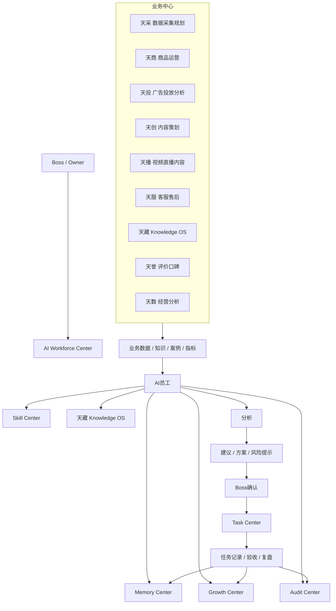

# Sprint62.20 AI员工生态中心业务接入架构设计

文档名称：《AI员工生态中心业务接入架构设计 V1》

阶段：Sprint62.20

状态：设计完成，等待确认

## 1. 阶段边界

本阶段只做产品与架构设计。

禁止事项：

- 不写代码
- 不修改前端
- 不修改后端
- 不创建数据库
- 不创建 migration
- 不修改现有业务逻辑
- 不接 Execution Engine
- 不接 OpenClaw
- 不接 n8n
- 不自动执行任务
- 不自动创建任务
- 不自动修改权限

Sprint62.20 的目标不是让 AI员工直接执行业务动作，而是设计 AI员工如何读取业务中心数据、形成分析建议，并在 Boss 确认后进入 Task Center。

## 2. 产品定位

AI员工生态中心业务接入层，是连接“业务中心”和“AI员工生态”的只读分析与建议层。

定位：

```text
业务中心数据
  ↓
AI员工读取与理解
  ↓
分析、判断、建议
  ↓
Boss确认
  ↓
Task Center 记录与跟进
```

核心原则：

- AI员工服务业务，但不直接执行业务。
- AI员工输出建议，但不自动发布、投放、调价、上架、退款或改权限。
- Task Center 是 Boss 确认后的承接中心，不被 AI员工自动改状态。
- Execution Engine、OpenClaw、n8n 不进入本阶段。

## 3. 总体架构图



## 4. 业务中心连接方式

### 4.1 连接原则

AI员工与业务中心的连接方式分为三类：

| 类型 | 说明 | V1 允许 |
|---|---|---|
| 数据读取 | 读取业务中心已有只读数据、指标、报告 | 允许 |
| 知识引用 | 引用 SOP、Prompt、案例、历史经验 | 允许 |
| 建议输出 | 输出分析结论、方案草稿、风险提醒 | 允许 |
| 业务执行 | 修改商品、广告、订单、权限、价格 | 禁止 |
| 外部平台调用 | 登录京东、OpenClaw、n8n、平台 API | 禁止 |

V1 只做只读读取与建议输出。

### 4.2 各业务中心连接设计

| 业务中心 | 输入给 AI员工 | AI员工输出 | 禁止事项 |
|---|---|---|---|
| 天采 | 店铺、商品、订单、广告、库存、评价、市场数据规划 | 数据缺口、采集建议、数据质量问题 | 自动采集、登录平台、调用真实接口 |
| 天商 | 商品运营状态、店铺策略、商品生命周期 | 商品优化建议、店铺运营建议、问题诊断 | 自动改商品、自动上架、自动调价 |
| 天投 | 广告花费、ROI、关键词、计划表现 | 广告分析、预算浪费提示、投放建议 | 自动投广告、自动改计划、自动调预算 |
| 天创 | 文案、详情页、卖点、内容方案 | 内容优化建议、卖点草稿、页面结构建议 | 自动发布内容、自动改详情页 |
| 天播 | 视频脚本、直播话术、短视频素材规划 | 视频脚本建议、直播话术草稿、内容节奏建议 | 自动开播、自动发布视频 |
| 天服 | 客服问题、售后原因、投诉、退换货反馈 | 客服SOP建议、售后问题归因、体验优化建议 | 自动回复客户、自动退款、自动处理售后 |
| 天藏 | SOP、Prompt、案例、知识文章、业务经验 | 知识引用、案例匹配、复盘依据 | 自动发布正式知识、自动改核心知识 |
| 天誉 | 评价、口碑、评分、差评原因、用户反馈 | 口碑风险、差评归因、产品改进建议 | 自动删评、自动回复、自动操控评价 |
| 天数 | 销售、利润、流量、转化率、库存、趋势 | 经营分析、异常发现、趋势判断 | 自动生成经营动作、自动修改业务 |

## 5. AI员工职责模型

每个 AI员工面向真实业务时，都必须具备以下职责字段。

```text
员工身份
技能
知识库
记忆
任务来源
输出结果
```

### 5.1 员工身份

字段：

- employee_code
- employee_name
- department
- role
- owner
- status
- risk_level

示例：

```text
天商 AI员工
部门：业务部门
岗位：商品运营AI经理
职责：商品分析、竞品分析、店铺运营建议
```

### 5.2 技能

字段：

- skill_name
- skill_version
- skill_status
- skill_scope
- risk_level
- audit_status

原则：

- 技能表示能力，不代表权限。
- 高风险技能必须 `security_audited=true`。
- 技能不能自动安装、自动升级、自动执行。

示例：

```text
商品分析Skill v1.0
竞品分析Skill v1.0
经营诊断Skill v1.1
```

### 5.3 知识库

字段：

- knowledge_source
- sop_list
- prompt_list
- case_list
- version
- visibility_scope

原则：

- 知识可见不等于可执行。
- 引用 Prompt 和 SOP 时必须保留来源。
- 进入天藏正式知识必须人工审核。

### 5.4 记忆

字段：

- recent_context
- success_cases
- failure_cases
- decision_history
- learning_record

原则：

- Memory 提供历史经验。
- Memory 不直接修改员工等级。
- Memory 不自动改变技能或权限。

### 5.5 任务来源

来源类型：

- Boss 手动提出目标
- AI会议室形成方案草稿
- 天数发现经营异常
- 天采发现数据缺口
- 天服发现售后问题
- 天誉发现口碑风险
- Task Center 已有任务

原则：

- V1 任务来源只作为输入。
- AI员工不能自动创建任务。
- 进入 Task Center 必须 Boss 确认。

### 5.6 输出结果

输出类型：

- 分析报告
- 运营建议
- 风险提示
- 方案草稿
- SOP草案
- Prompt草案
- 复盘摘要
- Task Center 建议项

输出必须包含：

- 结论
- 数据依据
- 使用知识
- 使用技能
- 风险等级
- 是否需要 Boss 确认
- 是否需要安全审计

## 6. 业务数据流设计

目标数据流：

```text
业务数据
 ↓
AI员工
 ↓
分析
 ↓
建议
 ↓
老板确认
 ↓
Task Center
```

### 6.1 数据输入

输入对象：

- 店铺指标
- 商品指标
- 广告指标
- 库存指标
- 客服售后记录
- 评价口碑数据
- 知识文章
- SOP
- Prompt
- 成功案例
- 失败案例

输入要求：

- 标明来源
- 标明更新时间
- 标明权限范围
- 标明是否脱敏
- 标明数据质量

### 6.2 AI员工分析

分析步骤：

1. 判断任务类型
2. 匹配所属业务中心
3. 匹配 AI员工职责
4. 匹配技能
5. 读取知识库
6. 参考 Memory
7. 生成分析结论
8. 生成风险提示

禁止：

- 不调用 Execution Engine
- 不调用 OpenClaw
- 不调用 n8n
- 不访问外部平台
- 不自动触发业务动作

### 6.3 建议输出

建议结构：

```json
{
  "mode": "readonly",
  "business_center": "天商",
  "employee_code": "tianshang_operator",
  "task_source": "business_signal",
  "summary": "商品转化率下降，需要检查价格、主图、评价和广告流量质量。",
  "evidence": [],
  "skills_used": [],
  "knowledge_used": [],
  "risk_level": "medium",
  "requires_boss_confirm": true,
  "security_audited_required": true,
  "suggested_task_center_payload": {
    "title": "检查某手表商品转化率下降原因",
    "description": "由 AI员工建议生成，等待 Boss 确认后进入 Task Center。",
    "priority": "normal"
  },
  "execution_allowed": false
}
```

说明：

- `suggested_task_center_payload` 只是建议草稿。
- 未经 Boss 确认，不创建 Task Center 任务。
- `execution_allowed=false` 固定保留。

### 6.4 Boss确认

Boss 确认节点判断：

- 是否采纳建议
- 是否需要转成任务
- 是否需要 AI会议室讨论
- 是否需要补充数据
- 是否需要安全审计

高风险必须：

```text
boss_confirm=true
security_audited=true
```

### 6.5 Task Center 承接

Task Center 承接内容：

- Boss 确认后的任务标题
- 任务描述
- 来源业务中心
- 来源 AI员工
- 风险等级
- 建议证据
- 验收标准

边界：

- AI员工不能自动创建任务。
- AI员工不能自动修改任务状态。
- Task Center 不被业务建议层绕过。
- 任务执行仍不接 Execution Engine。

## 7. 业务场景示例

### 7.1 商品销量下降

输入：

- 天数发现商品销量下降
- 天采提供竞品和市场数据
- 天誉提供评价变化
- 天投提供广告 ROI

AI员工：

- 天商：商品运营分析
- 天数：趋势与异常分析
- 天投：广告问题判断
- 天誉：口碑风险判断
- 天藏：历史案例引用

输出：

- 销量下降原因分析
- 证据链
- 优化建议
- 风险提示
- Task Center 建议草稿

Boss确认后：

- 进入 Task Center 跟进。

### 7.2 广告 ROI 异常

输入：

- 天投广告数据
- 天数经营指标
- 天商商品转化数据

AI员工：

- 天投：投放分析
- 天数：ROI趋势
- 天商：商品承接能力

输出：

- 关键词浪费预算提示
- 广告计划优化建议
- 商品页面承接问题

禁止：

- 自动改预算
- 自动暂停广告
- 自动新建广告计划

### 7.3 差评上升

输入：

- 天誉评价数据
- 天服售后反馈
- 天藏历史投诉案例

AI员工：

- 天誉：口碑分析
- 天服：客服售后分析
- 天商：商品问题归因

输出：

- 差评原因归类
- 客服话术建议
- 产品优化建议
- SOP草案

禁止：

- 自动删评
- 自动回复用户
- 自动退款

## 8. 与现有系统关系

| 系统 | 关系 | V1边界 |
|---|---|---|
| AI Workforce Center | 展示 AI员工与业务职责 | 只读 |
| AI Employee Detail | 查看员工身份、技能、知识、任务、风险 | 只读 |
| Skill Center | 提供技能资产和版本 | 不自动安装 |
| 天藏 Knowledge OS | 提供 SOP、Prompt、案例 | 不自动发布 |
| Memory Center | 提供经验与历史上下文 | 不自动学习修改 |
| Growth Center | 记录表现和成长 | 不自动晋升 |
| Audit Center | 记录风险和审批要求 | 不自动修复 |
| AI Meeting Room | 多员工讨论方案草稿 | 不自动创建任务 |
| Task Center | Boss确认后的任务承接 | 不自动创建、不自动改状态 |
| Execution Engine | 本阶段不接入 | 禁止 |
| OpenClaw | 本阶段不接入 | 禁止 |
| n8n | 本阶段不接入 | 禁止 |

## 9. 安全权限模型

### 9.1 权限原则

- 业务数据访问需要 Organization 授权。
- 技能不等于权限。
- 知识可见不等于业务执行。
- AI员工等级不自动提升权限。
- Boss 确认不等于绕过安全审计。

### 9.2 风险分级

| 风险等级 | 示例 | 要求 |
|---|---|---|
| low | 普通分析、只读报告 | 可展示 |
| medium | 运营调整建议、广告优化建议 | Boss确认 |
| high | 价格、广告预算、售后赔付、权限相关 | `boss_confirm=true` + `security_audited=true` |

### 9.3 禁止行为

AI员工不得：

- 自动创建业务任务
- 自动执行任务
- 自动修改商品
- 自动修改广告
- 自动回复客户
- 自动处理售后
- 自动修改知识库正式内容
- 自动调整员工权限
- 自动调用 Execution Engine
- 自动调用 OpenClaw
- 自动调用 n8n

## 10. V1 / V2 / V3 路线

### V1：只读业务建议层

目标：

- 业务中心数据只读接入设计
- AI员工职责模型设计
- 建议输出结构设计
- Boss确认后进入 Task Center 的流程设计

不做：

- 不接真实外部平台
- 不自动创建任务
- 不自动执行

### V2：业务建议工作流

目标：

- 前端展示业务建议列表
- AI会议室讨论建议草稿
- Boss 手动确认后生成 Task Center 任务

仍然禁止：

- 自动执行
- 自动改业务

### V3：受控任务生成

目标：

- 在明确权限、审计、确认链后，支持 Boss 手动确认创建任务
- 引入更完整的风险审批链

仍然不进入：

- Execution Engine
- OpenClaw
- n8n

## 11. 验收结论

Sprint62.20 已完成 AI员工生态中心业务接入架构设计。

本设计明确：

- AI员工与天采、天商、天投、天创、天播、天服、天藏、天誉、天数的连接方式
- 员工身份、技能、知识库、记忆、任务来源、输出结果模型
- 业务数据到 AI员工、分析、建议、Boss确认、Task Center 的流程
- V1 只读建议边界
- 禁止接入 Execution Engine / OpenClaw / n8n
- 禁止自动执行和自动修改业务逻辑

等待确认后再进入后续阶段。
