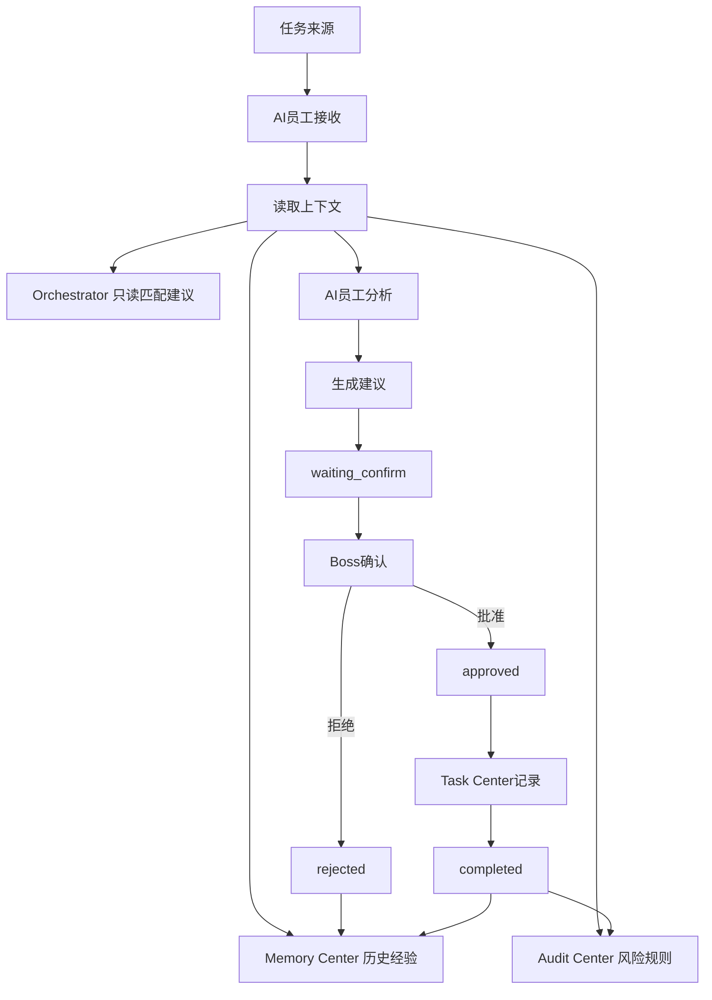
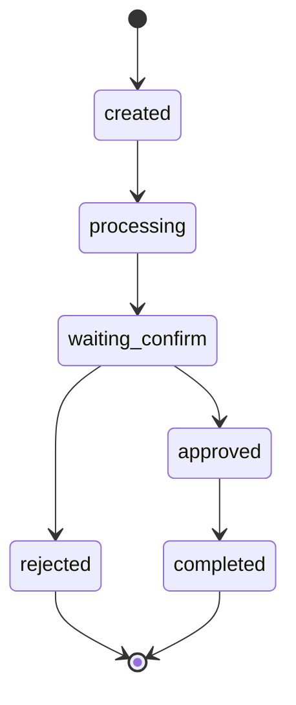

# Sprint62.21 AI员工任务闭环架构设计

文档名称：《AI员工任务闭环架构设计 V1》

阶段：Sprint62.21

状态：设计完成，等待确认

## 1. 阶段边界

本阶段只做产品与架构设计。

禁止事项：

- 不写代码
- 不修改前端
- 不修改后端
- 不创建数据库
- 不创建 migration
- 不修改现有业务逻辑
- 不接 Execution Engine
- 不接 OpenClaw
- 不接 n8n
- 不自动执行任务
- 不自动创建任务
- 不自动修改 Task Center 状态
- 不自动修改 AI员工权限

Sprint62.21 只设计 AI员工如何接收任务、分析任务、生成建议，并在 Boss 确认后进入 Task Center 记录。

## 2. 产品定位

AI员工任务闭环是 AI Employee Ecosystem 从“业务信号”到“任务记录”的标准流程。

核心定位：

```text
任务来源
 ↓
AI员工接收
 ↓
分析
 ↓
生成建议
 ↓
老板确认
 ↓
Task Center记录
```

它不负责：

- 执行业务动作
- 调用执行引擎
- 调用外部平台
- 自动创建任务
- 自动改变任务状态
- 自动批准自己的建议

## 3. 总体架构图



## 4. 任务生命周期设计

### 4.1 生命周期主流程

```text
任务来源
↓
AI员工接收
↓
分析
↓
生成建议
↓
老板确认
↓
Task Center记录
```

### 4.2 生命周期说明

| 阶段 | 输入 | 处理 | 输出 | 边界 |
|---|---|---|---|---|
| 任务来源 | Boss目标、业务异常、AI会议室草稿、Task Center已有任务 | 识别来源、业务域、风险级别 | Task Intake | 不自动创建任务 |
| AI员工接收 | Task Intake | 匹配员工职责、技能、知识范围 | Employee Task Context | 不修改员工状态 |
| 分析 | 业务数据、知识、记忆、任务上下文 | 归因、对比、风险判断 | Analysis Draft | 不调用执行系统 |
| 生成建议 | Analysis Draft | 生成方案、证据、风险、建议任务草稿 | Suggestion Draft | 不写入 Task Center |
| 老板确认 | Suggestion Draft | Boss采纳、拒绝、退回补充 | Approved / Rejected | 高风险需安全审计 |
| Task Center记录 | Approved Suggestion | 人工确认后记录任务 | Task Center Record | 不自动执行 |

## 5. AI员工任务状态设计

状态枚举：

```text
created
processing
waiting_confirm
approved
completed
rejected
```

### 5.1 状态定义

| 状态 | 含义 | 进入条件 | 退出条件 |
|---|---|---|---|
| created | 任务建议对象已形成 | 来源被识别，生成 intake 草稿 | AI员工开始分析 |
| processing | AI员工正在分析 | 员工职责、技能、知识范围匹配通过 | 生成建议草稿 |
| waiting_confirm | 等待 Boss 确认 | 建议草稿完成 | Boss批准或拒绝 |
| approved | Boss已确认 | Boss确认采纳 | 进入 Task Center 记录 |
| completed | Task Center 已记录或建议闭环完成 | 任务记录完成、复盘完成 | 归档 |
| rejected | Boss拒绝或退回 | Boss不采纳，或风险不通过 | 归档或重新分析 |

### 5.2 状态机



### 5.3 状态边界

- `created` 不等于 Task Center 已创建任务。
- `waiting_confirm` 不允许绕过 Boss。
- `approved` 只代表建议被批准，不代表执行。
- `completed` 只代表记录闭环完成，不代表业务动作完成。
- `rejected` 需要记录原因，用于 Memory 和 Audit 复盘。

## 6. AI员工任务对象模型草案

本模型只做设计，不建表。

```json
{
  "employee_task_id": "draft-id",
  "status": "waiting_confirm",
  "source": {
    "source_type": "business_signal",
    "business_center": "天商",
    "source_ref": "optional"
  },
  "employee": {
    "employee_code": "tianshang_operator",
    "employee_name": "天商 AI员工",
    "department": "业务部门",
    "role": "商品运营AI经理"
  },
  "context": {
    "business_data_refs": [],
    "knowledge_refs": [],
    "memory_refs": [],
    "task_refs": []
  },
  "analysis": {
    "summary": "分析摘要",
    "evidence": [],
    "risk_level": "medium"
  },
  "suggestion": {
    "title": "建议标题",
    "description": "建议内容",
    "expected_output": "预期结果",
    "acceptance_criteria": []
  },
  "approval": {
    "boss_confirm": false,
    "security_audited": false,
    "confirmed_by": null,
    "confirmed_at": null
  },
  "task_center_payload": {
    "title": "待确认任务标题",
    "description": "待确认任务描述",
    "priority": "normal",
    "source": "ai_employee_suggestion"
  },
  "safety": {
    "readonly": true,
    "execution_allowed": false,
    "execution_engine_called": false,
    "openclaw_connected": false,
    "n8n_connected": false
  }
}
```

## 7. 与 Task Center 关系

### 7.1 Task Center 职责

Task Center 负责：

- 记录 Boss 确认后的任务
- 展示任务状态
- 保存任务结果
- 保存验收记录
- 保存审计日志

Task Center 不负责：

- 自动采纳 AI员工建议
- 自动执行业务动作
- 自动修改员工能力
- 自动绕过审批

### 7.2 AI员工到 Task Center 的边界

AI员工输出的是：

```text
Task Center 建议草稿
```

不是：

```text
已创建任务
```

进入 Task Center 前必须满足：

- Boss确认
- 高风险安全审计
- 任务标题明确
- 任务描述明确
- 验收标准明确
- 风险等级明确

高风险要求：

```text
boss_confirm=true
security_audited=true
```

## 8. 与 Orchestrator 关系

### 8.1 Orchestrator 职责

Orchestrator 在本阶段只提供任务匹配与协作建议。

可读取：

- 员工部门
- 员工职责
- 员工技能
- 员工历史表现
- 风险记录
- 任务类型

可输出：

- 推荐主责 AI员工
- 推荐协作 AI员工
- 推荐审核 AI员工
- 推荐任务拆解草案

禁止：

- 自动分配任务
- 自动创建任务
- 自动修改任务状态
- 自动调用 Execution Engine
- 自动启动 OpenClaw / n8n

### 8.2 Orchestrator 输出示例

```json
{
  "mode": "readonly",
  "task_type": "商品运营分析",
  "primary_employee": "tianshang_operator",
  "collaborators": ["tianshu_analyst", "tiantou_ads"],
  "reviewers": ["tianan_security", "tianfa_compliance"],
  "reason": "任务涉及商品、数据、广告，需要多员工协作。",
  "execution_allowed": false
}
```

## 9. 与 Memory Center 关系

Memory Center 提供历史上下文，不直接改变任务状态。

读取内容：

- 历史任务
- 成功案例
- 失败案例
- 决策记录
- 复盘记录
- 用户偏好

写入边界：

- V1 不自动写入长期记忆。
- Boss确认后的任务结果可作为候选记忆。
- 候选记忆进入正式知识或长期记忆必须人工审核。

Memory 用于：

- 避免重复犯错
- 引用历史成功经验
- 标记相似失败风险
- 支持建议证据链

禁止：

- Memory 自动修改员工等级
- Memory 自动改变技能
- Memory 自动创建任务
- Memory 自动执行任务

## 10. 与 Audit Center 关系

Audit Center 提供任务闭环的安全边界。

审计对象：

- 任务来源
- 员工接收记录
- 技能使用范围
- 知识引用范围
- 建议内容
- Boss确认记录
- 风险等级
- Task Center 记录结果

高风险拦截：

- 涉及价格
- 涉及广告预算
- 涉及售后赔付
- 涉及权限
- 涉及外部平台账号
- 涉及真实执行动作

要求：

```text
boss_confirm=true
security_audited=true
```

Audit Center 不负责：

- 自动修复
- 自动封禁员工
- 自动修改权限
- 自动执行任务

## 11. 未来业务中心统一任务模型

覆盖业务中心：

- 天采
- 天商
- 天投
- 天创
- 天播
- 天服

### 11.1 统一字段

```json
{
  "business_task_type": "business_analysis",
  "business_center": "天商",
  "business_object": {
    "object_type": "product",
    "object_id": "optional",
    "object_name": "optional"
  },
  "trigger": {
    "trigger_type": "boss_request | data_anomaly | meeting_draft | manual_review",
    "description": "触发原因"
  },
  "input": {
    "data_refs": [],
    "knowledge_refs": [],
    "memory_refs": []
  },
  "required_capability": {
    "skills": [],
    "knowledge_scope": [],
    "risk_level": "low"
  },
  "expected_output": {
    "output_type": "analysis_report | suggestion | sop_draft | content_draft",
    "format": "structured_summary"
  },
  "approval": {
    "boss_confirm_required": true,
    "security_audited_required": false
  },
  "safety": {
    "readonly": true,
    "execution_allowed": false
  }
}
```

### 11.2 各中心任务类型

| 业务中心 | 任务类型 | 输入 | 输出 |
|---|---|---|---|
| 天采 | 数据缺口分析、数据质量检查、采集规划 | 数据资产、字段、更新时间 | 数据问题报告、采集建议 |
| 天商 | 商品诊断、店铺运营、竞品分析 | 商品、店铺、竞品、销售 | 运营建议、商品优化草稿 |
| 天投 | 广告诊断、ROI分析、关键词分析 | 广告计划、花费、转化 | 投放优化建议、风险提示 |
| 天创 | 文案优化、卖点提炼、详情页结构 | 商品信息、用户画像、案例 | 文案草稿、详情页建议 |
| 天播 | 视频脚本、直播话术、内容节奏 | 商品卖点、平台风格、案例 | 脚本草稿、直播话术 |
| 天服 | 客服问题、售后归因、SOP优化 | 客服记录、评价、退换货 | 客服SOP建议、售后改进建议 |

### 11.3 统一状态流

所有业务中心任务统一使用：

```text
created
processing
waiting_confirm
approved
completed
rejected
```

不同业务中心只改变输入数据和输出格式，不改变安全边界。

## 12. 安全模型

### 12.1 只读原则

AI员工任务闭环 V1：

- 只读读取业务数据
- 只读读取知识
- 只读读取记忆
- 只读读取任务记录
- 只生成建议
- 不执行

### 12.2 禁止行为

禁止：

- 自动执行任务
- 自动创建 Task Center 任务
- 自动修改 Task Center 状态
- 自动修改 AI员工状态
- 自动修改员工权限
- 自动调用 Execution Engine
- 自动调用 OpenClaw
- 自动调用 n8n
- 自动操作真实业务平台

### 12.3 安全字段

所有任务建议必须包含：

```json
{
  "readonly": true,
  "execution_allowed": false,
  "execution_engine_called": false,
  "openclaw_connected": false,
  "n8n_connected": false,
  "boss_confirm_required": true,
  "security_audited_required": true
}
```

## 13. V1 / V2 / V3 路线

### V1：任务闭环设计

目标：

- 统一任务生命周期
- 统一任务状态
- 统一业务中心任务模型
- 明确 Task Center / Orchestrator / Memory / Audit 边界

不做：

- 不自动创建任务
- 不自动执行
- 不接执行系统

### V2：只读任务建议中心

目标：

- 展示 AI员工建议草稿
- 展示任务来源
- 展示建议状态
- 展示 Boss确认需求

仍然禁止：

- 自动执行
- 自动修改业务

### V3：Boss确认后任务创建

目标：

- 在明确权限、审批、审计后，允许 Boss 手动确认生成 Task Center 记录
- 保留完整审计链

仍然不接：

- Execution Engine
- OpenClaw
- n8n

## 14. 验收结论

Sprint62.21 已完成 AI员工任务闭环架构设计。

本设计明确：

- 任务来源到 Task Center 记录的生命周期
- `created / processing / waiting_confirm / approved / completed / rejected` 状态模型
- AI员工与 Task Center、Orchestrator、Memory Center、Audit Center 的关系
- 天采、天商、天投、天创、天播、天服统一任务模型
- 禁止接入 Execution Engine / OpenClaw / n8n
- 禁止自动执行和修改现有业务逻辑

等待确认后再进入后续阶段。
