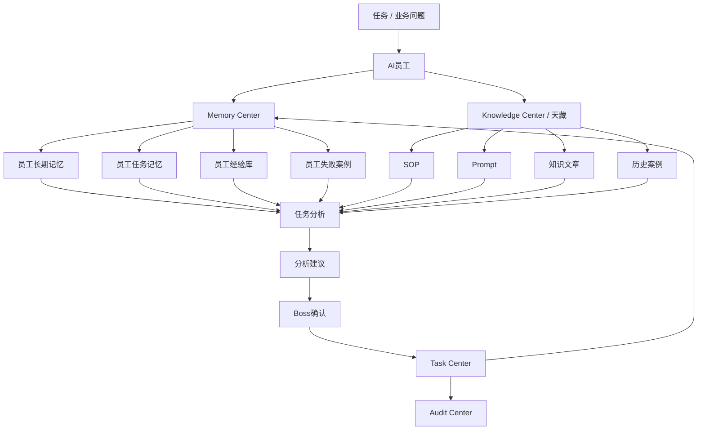

# Sprint62.22 AI员工知识与记忆调用架构设计

文档名称：《AI员工知识与记忆调用架构设计 V1》

阶段：Sprint62.22

状态：设计完成，等待确认

## 1. 阶段边界

本阶段只做产品与架构设计。

禁止事项：

- 不写代码
- 不修改前端
- 不修改后端
- 不创建数据库
- 不创建 migration
- 不修改现有业务逻辑
- 不接 Execution Engine
- 不接 OpenClaw
- 不接 n8n
- 不自动学习修改自己
- 不自动执行任务
- 不自动发布知识
- 不自动修改权限

Sprint62.22 只设计 AI员工如何调用企业知识和历史经验，用于任务分析和建议生成。

## 2. 产品定位

AI员工知识与记忆调用体系，是 AI员工在分析任务前读取企业知识、历史案例、个人经验和风险记录的标准链路。

核心链路：

```text
AI员工
↓
Memory Center
↓
Knowledge Center / 天藏
↓
历史案例
↓
任务分析
```

定位说明：

- Memory Center 提供 AI员工长期经验和任务上下文。
- Knowledge Center / 天藏 提供正式知识、SOP、Prompt、案例资产。
- 历史案例提供成功/失败参考。
- Task Center 提供任务记录、结果、验收和复盘来源。
- Audit Center 提供权限、审计和风险边界。

## 3. 总体架构图



## 4. 记忆类型定义

### 4.1 员工长期记忆

定义：

员工长期记忆记录 AI员工长期稳定的经验、偏好、擅长领域、风险边界和历史表现。

包含：

- 员工职责理解
- 长期擅长技能
- 常用知识范围
- 高成功率任务类型
- 常见风险类型
- Boss 偏好
- 部门协作经验

用途：

- 判断当前任务是否适合该员工
- 辅助 Orchestrator 做员工匹配
- 支持任务分析时引用历史经验
- 支持 Growth 形成成长轨迹

边界：

- 不自动改变员工等级。
- 不自动改变员工权限。
- 不自动绑定新技能。
- 不自动学习修改自身。

### 4.2 员工任务记忆

定义：

员工任务记忆记录 AI员工参与过的任务上下文、分析过程、建议结果、Boss反馈和验收结果。

包含：

- 任务标题
- 任务来源
- 任务状态
- 使用技能
- 使用知识
- 分析摘要
- 输出结果
- Boss确认状态
- 验收结果
- 复盘摘要

用途：

- 当前任务分析时查找相似任务
- 判断历史方案是否可复用
- 避免重复错误
- 支持 Task Center 复盘

边界：

- 任务记忆不等于任务执行。
- 任务记忆不能自动创建新任务。
- 任务记忆不能自动修改 Task Center 状态。

### 4.3 员工经验库

定义：

员工经验库是从长期记忆、任务记忆、成功案例、会议讨论和知识沉淀中提炼出的可复用经验集合。

包含：

- 成功模式
- 复用条件
- 操作建议
- 判断规则
- SOP草案
- Prompt草案
- 业务经验摘要

用途：

- 生成建议时提供经验依据
- 形成 SOP 候选
- 形成 Prompt 候选
- 支持天藏沉淀正式知识

边界：

- 经验库内容进入天藏正式知识前必须人工审核。
- 经验库不能自动发布。
- 经验库不能自动修改员工能力。

### 4.4 员工失败案例

定义：

员工失败案例记录任务失败、建议未采纳、风险事件、错误判断和不适用经验。

包含：

- 失败任务
- 失败原因
- 风险等级
- 触发条件
- 避免策略
- 审计记录
- 是否需要 Boss 确认
- 是否需要安全审计

用途：

- 分析任务时提供风险提醒
- 避免重复使用失败方案
- 支持 Audit Center 风险判断
- 支持 Growth 识别能力缺口

边界：

- 失败案例不用于自动惩罚员工。
- 失败案例不自动降低权限。
- 失败案例不自动冻结员工。

## 5. 知识与记忆调用流程

### 5.1 标准调用流程

```text
任务进入
↓
识别任务类型
↓
识别 AI员工职责和权限
↓
读取 Memory Center
↓
读取天藏 Knowledge Center
↓
匹配历史案例
↓
过滤权限不可见内容
↓
生成任务分析上下文
↓
输出分析建议
```

### 5.2 调用步骤说明

| 步骤 | 输入 | 处理 | 输出 |
|---|---|---|---|
| 任务识别 | 任务标题、业务中心、问题描述 | 判断业务域、任务类型、风险级别 | Task Context |
| 记忆检索 | 员工编号、任务类型、关键词 | 检索长期记忆、任务记忆、经验库、失败案例 | Memory Context |
| 知识检索 | 业务域、技能、关键词 | 检索 SOP、Prompt、知识文章、案例 | Knowledge Context |
| 权限过滤 | 员工权限、知识权限、数据权限 | 移除不可见内容 | Authorized Context |
| 版本选择 | 知识版本、案例版本、Prompt版本 | 选择有效版本 | Versioned Context |
| 审计检查 | 风险等级、敏感内容、权限范围 | 标记审计要求 | Audit Context |
| 任务分析 | Authorized Context | 归因、对比、建议 | Analysis Draft |

## 6. 与天藏连接设计

### 6.1 天藏职责

天藏负责正式知识资产管理：

- 知识文章
- SOP
- Prompt
- 成功案例
- 失败案例
- 产品方案
- 业务制度
- 技术文档

Memory Center 负责经验上下文：

- 员工历史经验
- 任务过程记忆
- 决策记忆
- 失败风险记忆
- 用户偏好
- 临时复盘

### 6.2 边界

| 模块 | 负责 | 不负责 |
|---|---|---|
| 天藏 | 正式知识资产、版本、审核、发布状态 | 自动学习、自动执行 |
| Memory Center | 经验上下文、任务记忆、员工记忆 | 自动发布正式知识 |

### 6.3 记忆进入天藏流程

```text
任务结果 / 会议结论 / 复盘记录
↓
Memory Center 形成候选经验
↓
人工审核
↓
天藏生成候选知识
↓
安全审核
↓
正式知识版本
```

要求：

- 人工审核前不得成为正式知识。
- 高风险知识必须 `security_audited=true`。
- 涉及经营决策必须 `boss_confirm=true`。

## 7. 与 Task Center 连接设计

Task Center 是任务记忆的重要来源。

读取内容：

- 任务标题
- 任务来源
- 任务状态
- 任务描述
- AI员工分配
- 结果提交
- 验收记录
- 审计日志
- 失败原因

Memory Center 从 Task Center 提取：

- 任务经验
- 成功案例
- 失败案例
- 决策记录
- 风险记录

边界：

- Memory Center 只读读取 Task Center。
- Memory Center 不自动创建任务。
- Memory Center 不自动修改任务状态。
- AI员工调用记忆后只生成建议，不执行。

## 8. 与 Audit Center 连接设计

Audit Center 负责知识和记忆调用的安全边界。

审计内容：

- 谁调用了知识
- 哪个 AI员工调用了记忆
- 调用了哪些知识版本
- 是否包含敏感数据
- 是否越权访问
- 是否引用失败案例
- 是否触发高风险提示

高风险场景：

- 读取敏感业务数据
- 使用高风险 Prompt
- 引用未审核知识
- 使用失败案例生成重要建议
- 涉及价格、广告预算、售后赔付、权限调整

要求：

```text
boss_confirm=true
security_audited=true
```

Audit Center 不负责：

- 自动修复
- 自动封禁员工
- 自动修改权限
- 自动执行任务

## 9. 知识来源设计

知识来源必须可追溯。

| 来源 | 类型 | 示例 | 使用要求 |
|---|---|---|---|
| 天藏知识文章 | 正式知识 | 京东运营方法、商品策略 | 使用版本化知识 |
| SOP库 | 流程知识 | 客服处理流程、广告复盘流程 | 展示 SOP 版本 |
| Prompt库 | AI提示资产 | 商品分析 Prompt、客服 Prompt | 默认脱敏，记录版本 |
| 成功案例 | 案例知识 | 爆款打造案例 | 标明复用条件 |
| 失败案例 | 风险知识 | 投放失败案例 | 标明避免策略 |
| Task Center | 任务记录 | 历史任务、验收结果 | 只读引用 |
| AI会议室 | 协作记录 | 方案讨论、观点汇总 | 只读引用 |
| Audit Center | 风险记录 | 审计事件、风险等级 | 只读引用 |

每次调用知识必须保留：

- source_type
- source_id
- title
- version
- owner
- last_updated
- permission_scope
- audit_status

## 10. 权限控制设计

### 10.1 权限维度

| 权限 | 说明 |
|---|---|
| 员工权限 | AI员工是否可查看该知识或记忆 |
| 部门权限 | 所属部门是否可访问 |
| 知识权限 | 知识资产是否允许该角色读取 |
| 任务权限 | 是否可读取相关 Task Center 记录 |
| 数据权限 | 是否可读取业务数据 |
| 审计权限 | 是否可查看风险与审计内容 |

### 10.2 控制原则

- 技能不等于知识权限。
- 员工等级不等于数据权限。
- 知识可见不等于可执行。
- Prompt 可见必须考虑脱敏。
- 失败案例可见必须考虑风险等级。

### 10.3 拒绝策略

当 AI员工无权限读取某知识或记忆：

- 不返回敏感内容。
- 返回“权限不足”摘要。
- Audit Center 记录访问尝试。
- 不自动申请权限。
- 不自动提升权限。

## 11. 版本管理设计

需要版本化的对象：

- 知识文章
- SOP
- Prompt
- 成功案例
- 失败案例
- 任务复盘
- 经验规则

字段草案：

```json
{
  "asset_id": "knowledge-id",
  "asset_type": "sop",
  "version": "v1.0",
  "status": "approved",
  "effective_from": "2026-07-10",
  "deprecated_at": null,
  "owner": "tiancang",
  "security_audited": true,
  "boss_confirm": true
}
```

调用规则：

- 默认使用 approved 最新版本。
- deprecated 版本仅用于历史追溯。
- draft / review 版本不能作为正式分析依据。
- 高风险 Prompt 必须有安全审核记录。

## 12. 数据更新机制

### 12.1 更新来源

| 更新来源 | 进入位置 | 审核要求 |
|---|---|---|
| Task Center 任务完成 | 员工任务记忆 | 任务验收后进入候选记忆 |
| Boss确认建议 | 决策记忆 | Boss确认后可沉淀 |
| AI会议室报告 | 项目记忆 / 决策记忆 | 人工审核 |
| 天藏知识更新 | Knowledge Center | 知识审核 |
| Audit 风险事件 | 失败案例 / 风险记忆 | 安全审核 |

### 12.2 更新流程

```text
候选数据产生
↓
进入候选记忆
↓
人工复核
↓
安全审计
↓
进入正式记忆或天藏知识
↓
版本更新
```

### 12.3 更新边界

禁止：

- 自动学习修改自己
- 自动覆盖正式知识
- 自动删除失败案例
- 自动清除审计记录
- 自动修改 Prompt
- 自动改变员工能力或权限

## 13. 任务分析上下文结构

AI员工在任务分析前生成统一上下文：

```json
{
  "mode": "readonly",
  "employee_code": "tianshang_operator",
  "task_context": {
    "task_type": "商品运营分析",
    "business_center": "天商",
    "risk_level": "medium"
  },
  "memory_context": {
    "long_term_memory": [],
    "task_memory": [],
    "experience_base": [],
    "failure_cases": []
  },
  "knowledge_context": {
    "sops": [],
    "prompts": [],
    "articles": [],
    "historical_cases": []
  },
  "permission_context": {
    "authorized": true,
    "filtered_assets": [],
    "data_scope": "department"
  },
  "version_context": {
    "knowledge_versions": [],
    "prompt_versions": [],
    "sop_versions": []
  },
  "audit_context": {
    "security_audited_required": true,
    "boss_confirm_required": true,
    "risk_notes": []
  },
  "safety": {
    "readonly": true,
    "execution_allowed": false,
    "execution_engine_called": false,
    "openclaw_connected": false,
    "n8n_connected": false
  }
}
```

## 14. 安全模型

### 14.1 只读调用

AI员工调用知识与记忆时只允许：

- 查询
- 引用
- 摘要
- 关联
- 生成建议

禁止：

- 执行
- 发布
- 覆盖
- 删除
- 修改权限
- 调用外部平台

### 14.2 高风险控制

高风险知识或记忆包括：

- 经营策略
- 价格策略
- 广告预算
- 售后赔付
- 账号权限
- 敏感客户数据
- 未审核 Prompt
- 失败案例中的规避策略

必须：

```text
boss_confirm=true
security_audited=true
```

### 14.3 外部系统边界

本阶段不接：

- Execution Engine
- OpenClaw
- n8n
- 真实业务平台 API
- 浏览器自动化

## 15. V1 / V2 / V3 路线

### V1：知识与记忆调用设计

目标：

- 定义记忆类型
- 定义知识来源
- 定义权限控制
- 定义版本管理
- 定义任务分析上下文

不做：

- 不开发 API
- 不写数据库
- 不接执行系统

### V2：只读调用 API

目标：

- 提供员工知识上下文 API
- 提供员工记忆上下文 API
- 支持任务分析前只读聚合

仍然禁止：

- 自动学习
- 自动执行

### V3：人工审核沉淀机制

目标：

- 将任务结果、会议结果、复盘记录进入候选记忆
- 经人工审核后进入正式记忆或天藏知识
- 建立版本历史

仍然不允许：

- 自动发布正式知识
- 自动修改员工能力
- 自动调用执行系统

## 16. 验收结论

Sprint62.22 已完成 AI员工知识与记忆调用架构设计。

本设计明确：

- AI员工到 Memory Center、Knowledge Center、历史案例、任务分析的调用链路
- 员工长期记忆、员工任务记忆、员工经验库、员工失败案例定义
- 天藏、Memory Center、Task Center、Audit Center 的连接关系
- 知识来源、权限控制、版本管理、数据更新机制
- 禁止接入 Execution Engine / OpenClaw / n8n
- 禁止自动学习修改自己和自动执行

等待确认后再进入后续阶段。
