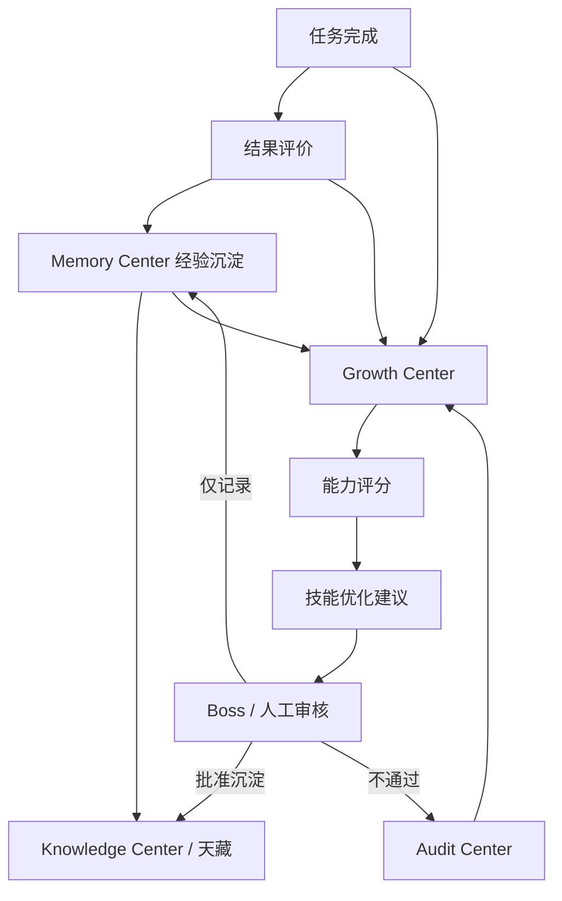

# Sprint62.23 AI员工成长进化架构设计

文档名称：《AI员工成长进化架构设计 V1》

阶段：Sprint62.23

状态：设计完成，等待确认

## 1. 阶段边界

本阶段只做产品与架构设计。

禁止事项：

- 不写代码
- 不修改前端
- 不修改后端
- 不创建数据库
- 不创建 migration
- 不修改现有业务逻辑
- 不自动修改自身代码
- 不自动升级权限
- 不自动安装技能
- 不自动修改知识
- 不接 Execution Engine
- 不接 OpenClaw
- 不接 n8n
- 不自动执行任务

Sprint62.23 只设计 AI员工长期成长机制，不实现自动进化。

## 2. 产品定位

AI员工成长进化体系，是 AI员工从任务实践到能力建议的长期观察与评价机制。

核心闭环：

```text
任务完成
 ↓
结果评价
 ↓
经验沉淀
 ↓
能力评分
 ↓
技能优化建议
```

定位说明：

- Task Center 提供任务记录、结果和验收。
- Memory Center 沉淀任务经验、成功案例和失败案例。
- Knowledge Center / 天藏沉淀正式知识、SOP、Prompt 和案例资产。
- Growth Center 计算成长指标、能力评分和技能优化建议。
- Audit Center 提供风险、错误、合规和审批边界。

## 3. 总体架构图



## 4. 员工成长模型

### 4.1 标准成长闭环

```text
任务完成
↓
结果评价
↓
经验沉淀
↓
能力评分
↓
技能优化建议
```

### 4.2 阶段说明

| 阶段 | 输入 | 处理 | 输出 | 边界 |
|---|---|---|---|---|
| 任务完成 | Task Center 任务结果、验收记录 | 识别任务类型、员工贡献、结果状态 | Task Outcome |
| 结果评价 | Boss评价、验收状态、业务结果、风险记录 | 计算质量、准确率、满意度、风险扣分 | Evaluation Record |
| 经验沉淀 | 任务过程、成功/失败原因、复盘 | 形成任务记忆、成功案例、失败案例 | Memory Candidate |
| 能力评分 | 评价记录、经验、历史趋势 | 计算成长评分和能力缺口 | Growth Score |
| 技能优化建议 | 技能使用、成功率、错误模式 | 生成学习建议、技能升级候选 | Skill Suggestion |

### 4.3 成长闭环边界

- 成长评分不等于权限。
- 技能优化建议不等于技能升级。
- 高评分不自动晋升。
- 低评分不自动降级。
- 错误记录不自动冻结员工。
- Growth Center 不修改员工代码。

## 5. 成长指标设计

### 5.1 核心指标

| 指标 | 说明 | 来源 | 方向 |
|---|---|---|---|
| 任务数量 | 员工参与或负责的任务总量 | Task Center | 量化工作经验 |
| 完成率 | 已完成任务 / 总任务 | Task Center | 衡量稳定交付 |
| 准确率 | 采纳或验收通过结果 / 已提交结果 | Task Center + Boss评价 | 衡量建议质量 |
| 用户评价 | Boss、部门负责人、业务用户评分 | Growth / Review | 衡量主观满意度 |
| 错误记录 | 失败任务、阻塞、风险事件 | Audit Center / Task Center | 衡量风险和稳定性 |
| 知识贡献 | SOP、Prompt、案例、复盘候选 | Memory / Knowledge Center | 衡量沉淀能力 |

### 5.2 扩展指标

| 指标 | 说明 |
|---|---|
| 复盘质量 | 失败后是否能生成清晰复盘 |
| 风险发现能力 | 是否能提前识别高风险 |
| 协作质量 | AI会议室参与质量和方案贡献 |
| 技能使用深度 | 单个技能使用频率和成功率 |
| 知识引用质量 | 引用知识是否准确、可追溯 |
| 版本稳定性 | 员工版本、技能版本、知识版本变更后表现是否稳定 |

### 5.3 评分模型草案

```text
growth_score =
  task_completion_score * 0.25
+ accuracy_score * 0.25
+ user_rating_score * 0.15
+ knowledge_contribution_score * 0.15
+ stability_score * 0.10
+ collaboration_score * 0.10
- risk_penalty
```

说明：

- `risk_penalty` 来源于错误记录、高风险事件、违规引用、未通过审核建议。
- 评分只用于观察和建议。
- 评分变化必须保留来源证据。

## 6. 指标计算设计

### 6.1 任务数量

来源：

- Task Center 当前任务
- Task Center 历史任务
- AI会议室方案任务候选

计算：

```text
task_count = assigned_task_count + contributed_task_count
```

注意：

- 只统计已记录任务。
- 建议草稿不等于正式任务。

### 6.2 完成率

计算：

```text
completion_rate = completed_task_count / total_task_count
```

完成状态来源：

- completed
- accepted
- audited
- summarized

边界：

- 完成率不代表业务成功率。
- 完成率不自动触发晋升。

### 6.3 准确率

计算：

```text
accuracy_rate = accepted_result_count / submitted_result_count
```

评价来源：

- Boss采纳
- 验收通过
- 业务结果达标
- 人工复审评分

边界：

- 准确率必须结合任务难度和风险等级。
- 不单独作为权限依据。

### 6.4 用户评价

评价来源：

- Boss评分
- 部门负责人评价
- 使用者反馈
- 验收意见

评价维度：

- 清晰度
- 可执行性
- 证据充分性
- 风险提示质量
- 业务价值

边界：

- 用户评价不自动改等级。
- 低评价需要复盘，不自动惩罚。

### 6.5 错误记录

来源：

- Task Center 失败任务
- Audit Center 风险事件
- 失败案例
- 结果被拒绝
- 权限越界尝试

分类：

- 数据错误
- 逻辑错误
- 知识引用错误
- 风险遗漏
- 权限边界错误
- 输出格式错误

处理：

- 进入失败案例候选。
- 进入 Growth 风险扣分。
- 进入 Audit Center 审计。
- 不自动冻结或降权。

### 6.6 知识贡献

来源：

- SOP草案
- Prompt草案
- 成功案例
- 失败案例
- 任务复盘
- 业务经验摘要

评价：

- 是否被采纳
- 是否经过审核
- 是否进入天藏正式知识
- 是否被后续任务复用

边界：

- 知识贡献不能自动发布。
- 知识贡献不能自动提升权限。

## 7. 与 Growth Center 关系

Growth Center 是成长评分和能力变化的主管模块。

负责：

- 汇总成长指标
- 计算成长评分
- 展示成长趋势
- 展示能力缺口
- 输出技能优化建议
- 标记待人工审核事项

不负责：

- 自动升级员工
- 自动修改员工代码
- 自动调整权限
- 自动安装技能
- 自动执行任务

Growth Center 输出：

```json
{
  "employee_code": "tianshang_operator",
  "growth_score": 82,
  "growth_level": "L3 稳定成长",
  "strengths": ["商品分析", "竞品判断"],
  "gaps": ["广告ROI归因不足"],
  "skill_suggestions": [],
  "risk_notes": [],
  "requires_review": true
}
```

## 8. 与 Memory Center 关系

Memory Center 提供成长评分的经验基础。

读取：

- 员工长期记忆
- 员工任务记忆
- 成功案例
- 失败案例
- 决策记忆
- 复盘记录

写入边界：

- 任务完成后可形成候选记忆。
- 候选记忆需人工审核。
- Memory 不自动学习修改自身。
- Memory 不自动改变能力和权限。

Memory 对 Growth 的作用：

- 提供历史表现证据
- 提供失败模式
- 提供复用经验
- 支持能力趋势判断

## 9. 与 Knowledge Center / 天藏关系

Knowledge Center / 天藏提供正式知识与知识贡献归档。

Growth 读取：

- SOP版本
- Prompt版本
- 知识文章版本
- 成功案例
- 失败案例
- 知识贡献采纳状态

Growth 输出：

- SOP优化建议
- Prompt优化建议
- 案例沉淀建议
- 知识缺口建议

边界：

- Growth 不自动改知识。
- Growth 不自动发布知识。
- Growth 不自动替换 Prompt。
- 知识版本变化需要人工审核。

## 10. 与 Audit Center 关系

Audit Center 是成长进化的安全约束。

提供：

- 风险事件
- 权限越界记录
- 高风险建议记录
- 审批链
- 安全审计结果

Growth 使用 Audit：

- 计算风险扣分
- 标记高风险员工行为
- 判断技能优化建议是否需要审核
- 判断知识贡献是否合规

Audit 不负责：

- 自动降级员工
- 自动冻结员工
- 自动修改权限
- 自动执行安全动作

高风险成长建议必须：

```text
boss_confirm=true
security_audited=true
```

## 11. 与 Task Center 关系

Task Center 是成长指标的主要事实来源。

读取：

- 任务数量
- 任务状态
- 任务结果
- 验收记录
- 审计日志
- 被拒绝任务
- 阻塞任务

Growth 从 Task Center 形成：

- 完成率
- 准确率
- 错误记录
- 复盘质量
- 成功/失败样本

边界：

- Growth 不自动创建任务。
- Growth 不自动修改任务状态。
- Growth 不调用任务执行。
- Task Center 仍保持现有核心流程。

## 12. 版本机制设计

### 12.1 员工版本

员工版本用于记录 AI员工身份、职责、能力画像和成长状态的变化。

字段草案：

```json
{
  "employee_code": "tianshang_operator",
  "employee_version": "employee-v1.2",
  "role": "商品运营AI经理",
  "capability_snapshot": [],
  "growth_score": 82,
  "risk_level": "medium",
  "changed_reason": "任务表现更新",
  "approved_by": "boss",
  "security_audited": true,
  "effective_at": "2026-07-10"
}
```

规则：

- 员工版本只记录变化，不自动升级权限。
- 版本变化需要人工审核。
- 高风险变化必须安全审计。

### 12.2 技能版本

技能版本用于记录技能能力、输入输出、适用范围和风险等级变化。

字段草案：

```json
{
  "skill_code": "product_analysis",
  "skill_version": "v1.1",
  "status": "approved",
  "proficiency_level": "skilled",
  "risk_level": "medium",
  "suggested_by_growth": true,
  "security_audited": true
}
```

规则：

- Growth 可以建议技能优化。
- Growth 不能自动升级技能版本。
- Skill Center 负责技能版本管理。
- 技能版本变化不等于权限变化。

### 12.3 知识版本

知识版本用于记录 SOP、Prompt、案例和知识文章的更新。

字段草案：

```json
{
  "knowledge_id": "sop-product-review",
  "knowledge_version": "v2.0",
  "asset_type": "sop",
  "status": "approved",
  "source": "task_review",
  "contributed_by": "tianshang_operator",
  "boss_confirm": true,
  "security_audited": true
}
```

规则：

- 知识贡献可进入候选版本。
- 正式知识版本必须人工审核。
- Prompt 版本必须做安全审计。
- deprecated 版本只能历史追溯。

## 13. 成长事件模型草案

本模型只做设计，不建表。

```json
{
  "growth_event_id": "event-id",
  "employee_code": "tianshang_operator",
  "event_type": "task_completed | result_reviewed | memory_added | score_updated | skill_suggested",
  "source": {
    "task_id": null,
    "memory_id": null,
    "knowledge_id": null,
    "audit_event_id": null
  },
  "metrics": {
    "task_count": 20,
    "completion_rate": 0.85,
    "accuracy_rate": 0.8,
    "user_rating": 4.6,
    "error_count": 2,
    "knowledge_contribution_count": 3
  },
  "score_change": {
    "before": 78,
    "after": 82,
    "reason": "任务验收通过并贡献 SOP 草案"
  },
  "review": {
    "boss_confirm": false,
    "security_audited": false,
    "manual_review_required": true
  },
  "safety": {
    "readonly": true,
    "execution_allowed": false,
    "permission_changed": false,
    "self_code_modified": false
  }
}
```

## 14. 安全模型

### 14.1 明确禁止

AI员工成长进化体系禁止：

- 自动修改自身代码
- 自动升级权限
- 自动修改角色
- 自动晋升等级
- 自动安装技能
- 自动升级技能
- 自动修改知识版本
- 自动创建任务
- 自动执行任务
- 接入 Execution Engine
- 接入 OpenClaw
- 接入 n8n

### 14.2 高风险变更

以下属于高风险：

- 员工版本升级
- 技能熟练度进入专家候选
- 技能版本升级建议
- 知识版本进入正式发布
- 权限相关建议
- 涉及业务执行的建议

必须：

```text
boss_confirm=true
security_audited=true
```

### 14.3 人工审核机制

人工审核对象：

- 成长评分大幅变化
- 晋升建议
- 技能优化建议
- 专家候选
- 知识贡献进入正式知识
- 高风险错误复盘

审核结果：

- approve
- reject
- need_more_evidence
- archive_only

## 15. V1 / V2 / V3 路线

### V1：成长架构设计

目标：

- 定义成长模型
- 定义成长指标
- 定义模块连接关系
- 定义版本机制
- 明确安全边界

不做：

- 不开发 API
- 不写数据库
- 不执行成长动作

### V2：只读成长中心

目标：

- 展示成长总览
- 展示员工成长评分
- 展示技能优化建议
- 展示知识贡献
- 展示风险记录

仍然禁止：

- 自动升级权限
- 自动执行

### V3：人工审核成长工作流

目标：

- 人工审核成长建议
- 人工确认知识贡献
- 人工确认专家候选
- 保留版本历史

仍然不允许：

- 自动修改自身代码
- 自动调用执行系统

## 16. 验收结论

Sprint62.23 已完成 AI员工成长进化架构设计。

本设计明确：

- 任务完成、结果评价、经验沉淀、能力评分、技能优化建议的成长闭环
- 任务数量、完成率、准确率、用户评价、错误记录、知识贡献等成长指标
- Growth Center、Memory Center、Knowledge Center、Audit Center、Task Center 的连接关系
- 员工版本、技能版本、知识版本机制
- 禁止自动修改自身代码、自动升级权限、接入 Execution Engine / OpenClaw / n8n 和自动执行

等待确认后再进入后续阶段。
