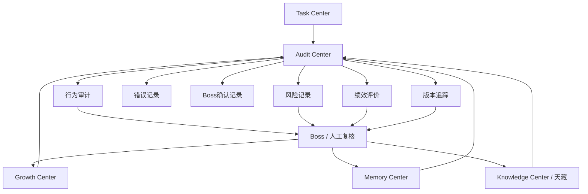

# Sprint62.24 AI员工审计评价中心架构设计

文档名称：《AI员工审计评价中心架构设计 V1》

阶段：Sprint62.24

状态：设计完成，等待确认

## 1. 阶段边界

本阶段只做产品与架构设计。

禁止事项：

- 不写代码
- 不修改前端
- 不修改后端
- 不创建数据库
- 不创建 migration
- 不修改现有业务逻辑
- 不自动处罚
- 不自动修改员工
- 不自动升级权限
- 不接 Execution Engine
- 不接 OpenClaw
- 不接 n8n
- 不自动执行任务

Sprint62.24 只设计 AI员工行为审计、绩效评价、风险记录和版本追踪体系。

## 2. 产品定位

AI员工审计评价中心是 AI Employee Ecosystem 的安全监督与绩效评价中枢。

定位：

```text
AI员工行为
↓
Audit Center 记录
↓
风险与错误归档
↓
绩效评价
↓
Growth / Memory / Knowledge 只读联动
↓
Boss 人工判断
```

核心职责：

- 记录 AI员工行为轨迹。
- 记录任务、分析、输出、确认、错误、修改等过程。
- 形成绩效评价指标。
- 形成风险记录。
- 追踪员工、技能、知识、评价版本。

不负责：

- 自动处罚员工。
- 自动封禁员工。
- 自动降级员工。
- 自动升级权限。
- 自动修改知识或技能。
- 自动执行任务。

## 3. 总体架构图



## 4. Audit Center 记录体系

Audit Center 需要记录以下对象。

### 4.1 任务记录

记录 AI员工与任务的关系。

字段草案：

```json
{
  "audit_type": "task_record",
  "task_id": "task-id",
  "employee_code": "tianshang_operator",
  "task_status": "completed",
  "task_source": "boss_request",
  "assigned_role": "primary",
  "created_at": "2026-07-10T00:00:00Z"
}
```

来源：

- Task Center
- AI员工任务闭环
- AI会议室方案草稿

用途：

- 计算任务数量
- 计算完成率
- 追溯任务来源
- 形成绩效评价依据

### 4.2 分析记录

记录 AI员工分析任务时使用的上下文和推理摘要。

字段草案：

```json
{
  "audit_type": "analysis_record",
  "task_id": "task-id",
  "employee_code": "tianshang_operator",
  "analysis_summary": "商品转化下降原因分析",
  "knowledge_refs": [],
  "memory_refs": [],
  "risk_level": "medium",
  "created_at": "2026-07-10T00:00:00Z"
}
```

用途：

- 追踪建议来源
- 判断知识引用是否合规
- 判断分析是否可解释
- 支持错误复盘

### 4.3 输出结果

记录 AI员工输出的报告、建议、草稿、SOP候选和复盘内容。

字段草案：

```json
{
  "audit_type": "output_record",
  "task_id": "task-id",
  "employee_code": "tianshang_operator",
  "output_type": "analysis_report",
  "result_quality": "pending_review",
  "accepted": false,
  "created_at": "2026-07-10T00:00:00Z"
}
```

用途：

- 计算结果质量
- 计算准确率
- 判断知识贡献
- 形成 Growth 评分依据

### 4.4 老板确认记录

记录 Boss 对建议、任务、知识、版本变更的确认。

字段草案：

```json
{
  "audit_type": "boss_confirm_record",
  "target_type": "task_suggestion",
  "target_id": "suggestion-id",
  "boss_confirm": true,
  "confirmed_by": "boss",
  "confirmed_at": "2026-07-10T00:00:00Z",
  "security_audited": true
}
```

适用场景：

- 高风险任务建议
- 技能优化建议
- 知识正式发布
- 员工版本变化
- 权限相关建议

### 4.5 错误记录

记录 AI员工任务失败、分析错误、知识引用错误、权限越界尝试和输出不合格。

字段草案：

```json
{
  "audit_type": "error_record",
  "employee_code": "tianshang_operator",
  "task_id": "task-id",
  "error_type": "knowledge_mismatch",
  "risk_level": "medium",
  "description": "引用知识版本不适用于当前商品类目",
  "requires_review": true,
  "created_at": "2026-07-10T00:00:00Z"
}
```

错误类型：

- data_error
- logic_error
- knowledge_mismatch
- permission_boundary_error
- risk_missing
- output_format_error
- task_rejected

边界：

- 错误记录不自动处罚。
- 错误记录不自动降权。
- 错误记录不自动冻结员工。

### 4.6 修改记录

记录人工审核后的修改、版本变更和纠正动作。

字段草案：

```json
{
  "audit_type": "change_record",
  "target_type": "knowledge_version",
  "target_id": "sop-product-review",
  "change_type": "manual_review_update",
  "before_version": "v1.0",
  "after_version": "v1.1",
  "changed_by": "boss",
  "boss_confirm": true,
  "security_audited": true,
  "created_at": "2026-07-10T00:00:00Z"
}
```

边界：

- Audit Center 记录修改，不执行修改。
- 修改必须由对应主管模块完成。
- 高风险修改必须人工确认。

## 5. 评价模型设计

评价模型用于形成 AI员工绩效视图。

核心指标：

```text
任务完成率
结果质量
错误率
知识贡献
成长趋势
```

### 5.1 任务完成率

定义：

```text
task_completion_rate = completed_task_count / total_task_count
```

来源：

- Task Center
- Task Center 审计日志

注意：

- 建议草稿不计入正式任务。
- 完成率不代表业务收益。
- 完成率不自动触发晋升。

### 5.2 结果质量

评价维度：

- 是否被 Boss 采纳
- 是否通过验收
- 证据是否完整
- 风险提示是否充分
- 是否符合输出格式
- 是否产生业务价值

结果质量评分草案：

```text
result_quality_score =
  acceptance_score * 0.35
+ evidence_score * 0.20
+ risk_notice_score * 0.20
+ business_value_score * 0.15
+ format_score * 0.10
```

### 5.3 错误率

定义：

```text
error_rate = error_count / submitted_result_count
```

错误来源：

- Task Center rejected / failed / blocked
- Audit Center error_record
- Boss 退回
- 知识引用错误
- 权限越界尝试

注意：

- 错误率用于复盘。
- 错误率不自动处罚员工。
- 高风险错误必须进入人工审核。

### 5.4 知识贡献

定义：

员工对企业知识资产的贡献度。

贡献类型：

- SOP草案
- Prompt草案
- 成功案例
- 失败案例
- 任务复盘
- 经验规则
- 知识纠错建议

评价维度：

- 是否被采纳
- 是否进入天藏正式知识
- 是否被后续任务复用
- 是否通过安全审核

边界：

- 知识贡献不自动发布。
- 知识贡献不自动提升权限。

### 5.5 成长趋势

定义：

AI员工随时间在任务质量、准确率、错误率、知识贡献和风险控制上的变化趋势。

趋势状态：

```text
up
stable
down
watch
```

来源：

- Growth Center
- Memory Center
- Audit Center
- Task Center

## 6. 综合评价分模型

综合评价分草案：

```text
employee_evaluation_score =
  task_completion_rate_score * 0.25
+ result_quality_score * 0.30
+ knowledge_contribution_score * 0.15
+ growth_trend_score * 0.15
+ audit_compliance_score * 0.15
- error_penalty
```

评价等级：

| 分数 | 等级 | 含义 |
|---|---|---|
| 90-100 | excellent | 表现优秀 |
| 75-89 | good | 稳定可靠 |
| 60-74 | watch | 需要观察 |
| 0-59 | risk | 需要人工复盘 |

边界：

- 评价等级不等于员工等级。
- 评价分不自动改变权限。
- 评价分不自动触发奖惩。
- `risk` 只代表需要人工复盘。

## 7. 系统连接设计

### 7.1 与 Task Center

读取：

- 任务记录
- 任务状态
- 输出结果
- 验收记录
- 审计日志
- rejected / failed / blocked 记录

写入边界：

- Audit Center 不自动写 Task Center。
- Audit Center 不自动改任务状态。
- Task Center 核心流程不变。

### 7.2 与 Memory Center

读取：

- 员工长期记忆
- 员工任务记忆
- 成功案例
- 失败案例
- 复盘摘要

输出：

- 审计后的失败案例候选
- 风险复盘候选
- 行为轨迹摘要

边界：

- 不自动写入正式记忆。
- 不自动学习修改员工。

### 7.3 与 Growth Center

读取：

- 成长评分
- 能力趋势
- 技能优化建议
- 成长事件

输出：

- 错误率
- 结果质量
- 风险扣分
- 审计合规评分

边界：

- 不自动改变成长等级。
- 不自动升级员工。

### 7.4 与 Knowledge Center / 天藏

读取：

- 知识版本
- SOP版本
- Prompt版本
- 案例版本
- 知识审核状态

输出：

- 知识引用审计
- 知识贡献评价
- 知识版本风险记录

边界：

- 不自动发布知识。
- 不自动修改知识版本。
- 不自动替换 Prompt。

## 8. 版本追踪设计

需要追踪：

```text
员工版本
技能版本
知识版本
评价版本
```

### 8.1 员工版本

追踪内容：

- 员工身份
- 部门
- 岗位
- 职责
- 状态
- 成长评分
- 风险等级

审计点：

- 谁提出变化
- 谁审核变化
- 是否 Boss 确认
- 是否安全审计
- 生效时间

边界：

- Audit Center 只记录版本变化。
- 不自动修改员工版本。

### 8.2 技能版本

追踪内容：

- 技能名称
- 技能版本
- 技能状态
- 风险等级
- 使用员工
- 审核状态

审计点：

- 技能是否被高风险任务使用
- 技能版本是否通过审核
- 技能调用是否越权

边界：

- 技能版本由 Skill Center 管理。
- Audit Center 不自动升级技能。

### 8.3 知识版本

追踪内容：

- 知识文章版本
- SOP版本
- Prompt版本
- 成功案例版本
- 失败案例版本

审计点：

- 使用时版本
- 是否 approved
- 是否 deprecated
- 是否需要安全审计
- 是否被错误引用

边界：

- 知识版本由天藏管理。
- Audit Center 不自动发布或修改知识。

### 8.4 评价版本

定义：

评价版本记录某一时间点的评价模型、指标权重、评分结果和人工审核状态。

字段草案：

```json
{
  "evaluation_version": "eval-v1.0",
  "employee_code": "tianshang_operator",
  "model_version": "employee_evaluation_v1",
  "score": 82,
  "grade": "good",
  "metric_weights": {
    "task_completion": 0.25,
    "result_quality": 0.30,
    "knowledge_contribution": 0.15,
    "growth_trend": 0.15,
    "audit_compliance": 0.15
  },
  "review_status": "pending_manual_review",
  "boss_confirm": false,
  "security_audited": false
}
```

边界：

- 评价版本可追溯。
- 评价版本不自动改变员工权限。
- 模型权重变化必须记录。

## 9. 审计事件模型草案

本模型只做设计，不建表。

```json
{
  "audit_event_id": "audit-id",
  "event_type": "task_record | analysis_record | output_record | boss_confirm_record | error_record | change_record",
  "employee_code": "tianshang_operator",
  "task_id": "task-id",
  "source_module": "Task Center",
  "risk_level": "medium",
  "summary": "AI员工输出商品运营分析报告",
  "version_refs": {
    "employee_version": "employee-v1.2",
    "skill_version": "product_analysis-v1.1",
    "knowledge_version": "sop-v2.0",
    "evaluation_version": "eval-v1.0"
  },
  "approval": {
    "boss_confirm": false,
    "security_audited": false,
    "review_status": "pending"
  },
  "safety": {
    "readonly": true,
    "auto_punish_enabled": false,
    "permission_changed": false,
    "employee_modified": false,
    "execution_engine_called": false,
    "openclaw_connected": false,
    "n8n_connected": false
  }
}
```

## 10. 安全治理

### 10.1 禁止行为

Audit Center 禁止：

- 自动处罚
- 自动封禁
- 自动修改员工
- 自动升级权限
- 自动修改技能
- 自动修改知识
- 自动创建任务
- 自动执行任务
- 接 Execution Engine
- 接 OpenClaw
- 接 n8n

### 10.2 高风险要求

以下必须人工确认：

- 高风险错误记录
- 权限相关变更
- 评价模型权重变化
- 员工版本变化
- 技能版本变化
- 知识版本正式发布
- 评价等级进入 risk

必须：

```text
boss_confirm=true
security_audited=true
```

### 10.3 审计透明原则

所有审计必须：

- 可查看
- 可解释
- 可追踪
- 可复盘
- 可回溯版本

## 11. V1 / V2 / V3 路线

### V1：架构设计

目标：

- 定义审计记录体系
- 定义评价模型
- 定义系统连接关系
- 定义版本追踪
- 明确安全边界

不做：

- 不开发 API
- 不建表
- 不接执行系统

### V2：只读审计评价页面

目标：

- 展示审计总览
- 展示行为记录
- 展示错误记录
- 展示评价分
- 展示版本追踪

仍然禁止：

- 自动处罚
- 自动修改员工
- 自动升级权限

### V3：人工复核工作流

目标：

- 支持 Boss 手动复核评价
- 支持安全人员手动标记审计状态
- 支持版本差异查看

仍然不允许：

- 自动执行处罚
- 自动调用执行系统

## 12. 验收结论

Sprint62.24 已完成 AI员工审计评价中心架构设计。

本设计明确：

- Audit Center 记录任务记录、分析记录、输出结果、老板确认记录、错误记录、修改记录
- 任务完成率、结果质量、错误率、知识贡献、成长趋势评价模型
- Audit Center 与 Task Center、Memory Center、Growth Center、Knowledge Center 的连接关系
- 员工版本、技能版本、知识版本、评价版本追踪机制
- 禁止自动处罚、自动修改员工、自动升级权限
- 禁止接入 Execution Engine / OpenClaw / n8n

等待确认后再进入后续阶段。
