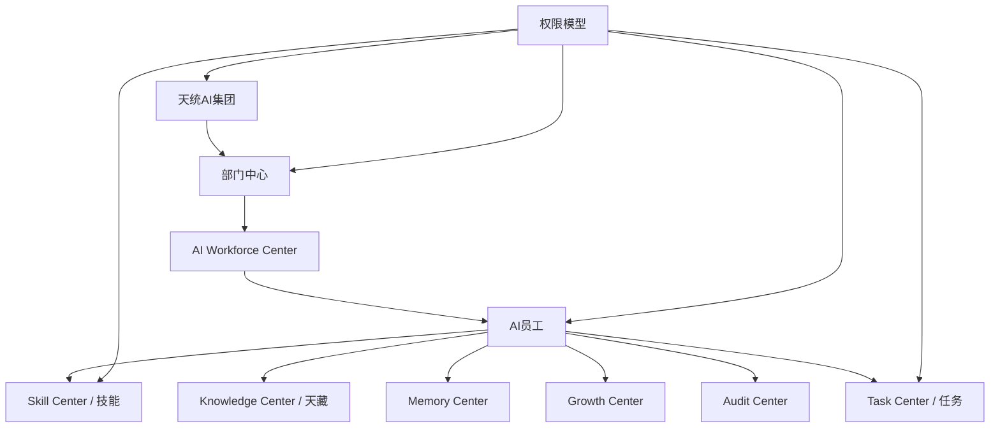

# Sprint62.25 AI员工权限与组织架构设计

文档名称：《AI员工权限与组织架构设计 V1》

阶段：Sprint62.25

状态：设计完成，等待确认

## 1. 阶段边界

本阶段只做产品与架构设计。

禁止事项：

- 不写代码
- 不修改前端
- 不修改后端
- 不创建数据库
- 不创建 migration
- 不修改现有权限系统
- 不自动提升权限
- 不自动修改权限
- 不自动创建员工
- 不自动执行任务
- 不接 Execution Engine
- 不接 OpenClaw
- 不接 n8n

Sprint62.25 只设计天统AI员工组织权限体系，不实施真实权限变更。

## 2. 产品定位

AI员工权限与组织架构是 AI Employee Ecosystem 的组织治理和访问控制蓝图。

核心结构：

```text
集团
 ↓
部门中心
 ↓
AI员工
 ↓
技能
 ↓
任务
```

核心原则：

- 组织归属不等于权限。
- 岗位不等于权限。
- 技能不等于权限。
- 成长等级不等于权限。
- 审计记录不等于处罚。
- 权限变更必须人工审核。

## 3. 总体架构图



## 4. AI员工组织设计

### 4.1 组织层级

```text
天统AI集团
 ↓
部门中心
 ↓
AI员工
 ↓
技能
 ↓
任务
```

### 4.2 集团层

集团层负责：

- 企业级组织结构
- Boss 总控权限
- 跨部门风险查看
- 企业级审计
- 企业级知识和数据边界

集团层不负责：

- 自动创建员工
- 自动授权员工
- 自动执行业务任务

### 4.3 部门中心

部门中心按业务能力划分：

| 部门 | AI员工示例 | 主要职责 |
|---|---|---|
| 战略部门 | 天策 | 战略分析、经营优先级、长期规划 |
| 数据部门 | 天采、天数 | 数据资产、经营分析、异常发现 |
| 知识部门 | 天藏 | 知识资产、SOP、Prompt、案例 |
| 业务部门 | 天商、天投、天创、天播、天服、天财、天法、天安 | 电商运营、广告、内容、客服、财务、法务、安全 |
| 技术部门 | 天盾、天检、天智 | 部署、安全、测试、技术治理 |

部门中心负责：

- 部门归属
- 部门负责人
- 部门任务范围
- 部门数据边界
- 部门知识边界

部门中心不负责：

- 自动任命负责人
- 自动提升权限
- 自动跨部门授权

### 4.4 AI员工层

AI员工身份包含：

- employee_code
- employee_name
- department
- role
- responsibility
- status
- manager
- skill_scope
- knowledge_scope
- task_scope
- audit_scope

AI员工权限原则：

- 只能读取授权范围内的数据。
- 只能调用授权范围内的知识。
- 只能使用授权范围内的技能进行分析。
- 不能自动创建或执行任务。
- 不能自己修改自己的权限。

### 4.5 技能层

技能层连接 Skill Center。

技能包含：

- skill_code
- skill_name
- skill_version
- skill_status
- risk_level
- allowed_employee_scope
- audit_status

关键原则：

```text
拥有技能 ≠ 拥有执行权限
技能熟练 ≠ 自动授权
高阶技能 ≠ 高权限
```

### 4.6 任务层

任务层连接 Task Center。

任务权限包含：

- 任务查看
- 任务详情查看
- 任务结果查看
- 审计日志查看
- 任务创建申请
- 任务状态变更审核

V1 边界：

- AI员工生态只读展示任务。
- 任务创建必须人工确认。
- 任务状态变更不由 AI员工生态自动触发。

## 5. 权限模型

### 5.1 角色层级

```text
老板权限
↓
管理员权限
↓
部门负责人权限
↓
AI员工权限
```

### 5.2 老板权限

Boss / Owner 权限定位：

- 企业级总览查看
- 所有部门摘要查看
- 高风险事项确认
- 关键版本变更确认
- 审计报告查看

Boss 权限边界：

- Boss 确认不等于绕过安全审计。
- Boss 确认不等于自动执行。
- 高风险仍需 `security_audited=true`。

### 5.3 管理员权限

Admin 权限定位：

- 管理范围内组织查看
- 页面配置查看
- 员工档案查看
- 风险摘要查看
- 审计记录查看

Admin 权限边界：

- 不自动授权。
- 不自动修改角色。
- 不自动创建员工。
- 不自动执行任务。

### 5.4 部门负责人权限

部门负责人权限定位：

- 查看本部门 AI员工
- 查看本部门任务
- 查看本部门风险
- 查看本部门知识与技能范围
- 提交权限变更申请

部门负责人权限边界：

- 不能跨部门查看敏感数据。
- 不能直接提升员工权限。
- 不能绕过 Boss 和 Audit Center。

### 5.5 AI员工权限

AI员工权限定位：

- 查看自身档案
- 读取授权知识
- 使用授权技能生成分析
- 查看关联任务上下文
- 输出建议草稿

AI员工权限边界：

- 不自动提升权限。
- 不自动修改权限。
- 不自动创建任务。
- 不自动执行任务。
- 不访问未授权知识或数据。

## 6. 权限范围设计

### 6.1 数据查看权限

范围：

- 集团数据摘要
- 部门数据
- 员工数据
- 任务数据
- 风险数据
- 经营数据

控制规则：

- Boss 可查看全局摘要和高风险明细。
- Admin 查看管理范围。
- 部门负责人查看本部门。
- AI员工查看自身和授权任务上下文。
- 默认敏感数据脱敏。

### 6.2 任务创建权限

任务创建权限分级：

```text
task_suggestion_create
task_create_request
task_create_approve
task_create_record
```

V1 规则：

- AI员工只能生成任务建议草稿。
- 部门负责人可提交任务创建申请。
- Boss 确认后才可进入 Task Center。
- 生态中心不自动创建任务。

### 6.3 知识调用权限

知识调用权限分级：

```text
knowledge_summary_read
knowledge_article_read
sop_read
prompt_read_masked
prompt_read_full
case_read
knowledge_publish_review
```

规则：

- Prompt 默认脱敏。
- 失败案例按风险等级限制。
- 未审核知识不能作为正式分析依据。
- 知识调用必须记录来源和版本。

### 6.4 技能调用权限

技能调用权限分级：

```text
skill_summary_read
skill_detail_read
skill_context_use
skill_risk_review
skill_bind_review
```

规则：

- V1 只允许技能用于分析上下文。
- 不允许技能触发执行。
- 高风险技能必须安全审核。
- 技能绑定和升级必须人工审核。

### 6.5 审计查看权限

审计查看权限分级：

```text
audit_summary_read
audit_event_read
audit_risk_read
audit_sensitive_read
audit_report_review
```

规则：

- Boss 可查看高风险审计。
- Admin 可查看管理范围审计。
- 部门负责人可查看本部门审计。
- AI员工只能查看与自身相关的非敏感审计摘要。

## 7. 系统连接设计

### 7.1 AI Workforce Center

连接职责：

- 展示 AI员工组织归属
- 展示部门分布
- 展示员工状态
- 展示能力和风险摘要

权限作用：

- 决定谁能看哪些员工。
- 决定员工详情可见范围。

边界：

- 不自动创建员工。
- 不自动修改员工权限。

### 7.2 Task Center

连接职责：

- 提供任务记录
- 提供任务状态
- 提供验收和审计日志
- 承接 Boss 确认后的任务

权限作用：

- 控制任务查看范围。
- 控制任务创建申请和确认边界。

边界：

- 不自动创建任务。
- 不自动修改任务状态。
- 不触发执行。

### 7.3 Memory Center

连接职责：

- 提供员工记忆
- 提供任务记忆
- 提供经验库
- 提供失败案例

权限作用：

- 控制员工能读取哪些历史经验。
- 控制敏感失败案例可见范围。

边界：

- 不自动学习修改自身。
- 不自动改变权限。

### 7.4 Growth Center

连接职责：

- 提供成长评分
- 提供技能优化建议
- 提供能力缺口
- 提供成长趋势

权限作用：

- 控制谁能查看成长评价。
- 控制谁能审核成长建议。

边界：

- 成长评分不等于权限。
- 不自动升级员工。

### 7.5 Audit Center

连接职责：

- 提供审计记录
- 提供风险事件
- 提供权限变更追踪
- 提供高风险审批链

权限作用：

- 控制风险和审计明细可见范围。
- 高风险变更必须经过审计。

边界：

- 不自动处罚。
- 不自动修改权限。
- 不自动执行安全动作。

### 7.6 Knowledge Center / 天藏

连接职责：

- 提供知识文章
- 提供 SOP
- 提供 Prompt
- 提供成功/失败案例
- 提供知识版本

权限作用：

- 控制知识可见范围。
- 控制 Prompt 是否脱敏。
- 控制未审核知识不可正式引用。

边界：

- 不自动发布知识。
- 不自动修改知识版本。

## 8. 权限申请与审批流程

### 8.1 权限申请流程

```text
权限需求产生
↓
提交申请草稿
↓
部门负责人初审
↓
Audit Center 风险检查
↓
Boss 确认
↓
人工配置权限
↓
审计归档
```

### 8.2 高风险审批要求

高风险权限包括：

- 跨部门数据查看
- Prompt 完整查看
- 高风险技能调用
- 任务创建确认
- 审计敏感明细查看
- 知识发布审核

必须：

```text
boss_confirm=true
security_audited=true
```

### 8.3 明确禁止

禁止：

- AI员工自己申请并自动通过权限
- Growth 根据高分自动提升权限
- Skill Center 根据熟练度自动授权
- Memory 根据经验自动扩大访问范围
- Orchestrator 自动分配高风险权限
- Audit Center 自动处罚或自动改权限

## 9. 权限对象模型草案

本模型只做设计，不建表。

```json
{
  "permission_scope_id": "scope-id",
  "subject": {
    "subject_type": "ai_employee",
    "employee_code": "tianshang_operator",
    "department": "业务部门"
  },
  "role": {
    "role_type": "ai_employee",
    "role_level": "department"
  },
  "scopes": {
    "data_view": ["department_summary"],
    "task": ["task_summary_read", "task_detail_read"],
    "knowledge": ["knowledge_summary_read", "sop_read", "prompt_read_masked"],
    "skill": ["skill_summary_read", "skill_context_use"],
    "audit": ["audit_summary_read"]
  },
  "approval": {
    "boss_confirm": false,
    "security_audited": false,
    "approved_by": null,
    "approved_at": null
  },
  "safety": {
    "readonly": true,
    "auto_permission_upgrade": false,
    "permission_mutation_enabled": false,
    "execution_allowed": false,
    "execution_engine_called": false,
    "openclaw_connected": false,
    "n8n_connected": false
  }
}
```

## 10. 安全治理

### 10.1 禁止行为

AI员工权限与组织体系禁止：

- 自动提升权限
- 自动修改权限
- 自动创建角色
- 自动创建员工
- 自动任命负责人
- 自动执行任务
- 自动调用 Execution Engine
- 自动调用 OpenClaw
- 自动调用 n8n

### 10.2 审计要求

必须审计：

- 权限申请
- 权限审批
- 权限拒绝
- 高风险知识调用
- 高风险技能调用
- 跨部门数据查看
- 审计敏感明细查看

### 10.3 权限失效与复审

复审场景：

- 员工岗位变化
- 部门归属变化
- 技能风险等级变化
- 知识敏感等级变化
- 审计风险升高
- 任务类型变化

边界：

- 复审只生成提醒。
- 不自动撤销权限。
- 不自动新增权限。

## 11. V1 / V2 / V3 路线

### V1：组织权限架构设计

目标：

- 定义组织层级
- 定义角色模型
- 定义权限范围
- 定义系统连接关系
- 明确安全边界

不做：

- 不开发 API
- 不建表
- 不改权限系统

### V2：只读组织权限中心

目标：

- 展示组织树
- 展示部门和员工
- 展示权限范围
- 展示风险和审计状态

仍然禁止：

- 自动授权
- 自动改权限

### V3：人工权限审批工作流

目标：

- 支持权限申请草稿
- 支持部门负责人初审
- 支持 Audit Center 风险检查
- 支持 Boss 人工确认

仍然不允许：

- AI员工自动提升权限
- 系统自动执行任务
- 接入执行系统

## 12. 验收结论

Sprint62.25 已完成 AI员工权限与组织架构设计。

本设计明确：

- 集团、部门中心、AI员工、技能、任务的组织层级
- 老板权限、管理员权限、部门负责人权限、AI员工权限模型
- 数据查看权限、任务创建权限、知识调用权限、技能调用权限、审计查看权限
- AI Workforce Center、Task Center、Memory Center、Growth Center、Audit Center、Knowledge Center 的连接关系
- 禁止自动提升权限、自动修改权限、自动执行任务
- 禁止接入 Execution Engine / OpenClaw / n8n

等待确认后再进入后续阶段。
