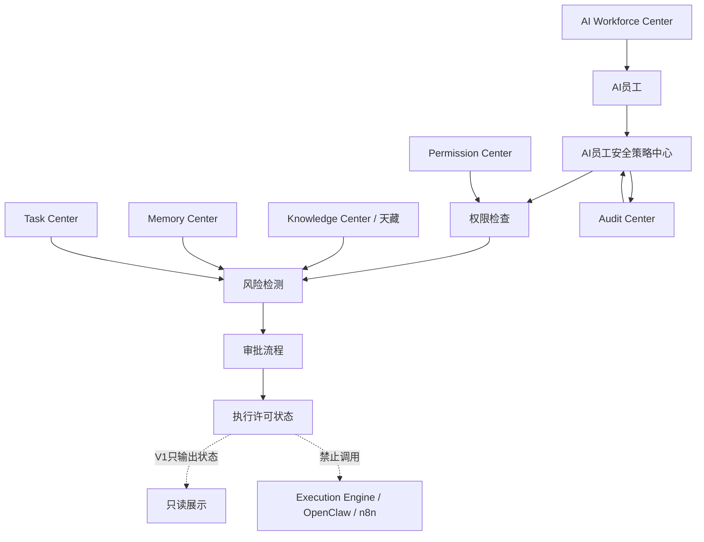
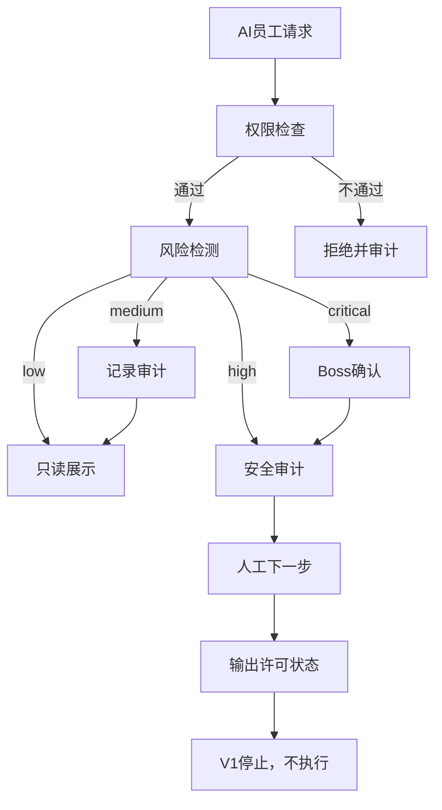

# Sprint62.26 AI员工安全策略中心设计

文档名称：《AI员工安全策略中心架构设计 V1》

阶段：Sprint62.26

状态：设计完成，等待确认

## 1. 阶段边界

本阶段只做产品与安全架构设计。

禁止事项：

- 不写代码
- 不修改前端
- 不修改后端
- 不创建数据库
- 不创建 migration
- 不修改现有权限系统
- 不自动执行任务
- 不自动提升权限
- 不自动修改权限
- 不自动调用 Execution Engine
- 不自动接入 OpenClaw
- 不自动接入 n8n

Sprint62.26 只设计天统AI员工安全治理体系，不落地真实安全策略执行。

## 2. 产品定位

AI员工安全策略中心是 AI Employee Ecosystem 的安全治理中枢。

定位：

- 统一管理 AI员工在数据、技能、知识、API、任务建议中的安全边界。
- 在 AI员工产生分析、建议、任务草稿、技能调用请求前进行权限和风险校验设计。
- 通过 Audit Center 记录安全检查、风险检测、审批状态和异常事件。
- V1 只做只读安全策略设计，不具备自动执行、自动封禁、自动授权能力。

核心原则：

- 权限通过不等于允许执行。
- 技能可见不等于技能可调用。
- 知识可读不等于可外发。
- API 可见不等于可调用。
- Boss 确认不等于绕过安全审计。
- 审计发现风险不等于自动处罚。

## 3. 安全中心总体架构

```text
AI员工
 ↓
权限检查
 ↓
风险检测
 ↓
审批流程
 ↓
执行许可
```

V1 解释：

- AI员工：产生查看、分析、调用、任务建议等请求。
- 权限检查：读取 Permission Center / Organization 的授权范围。
- 风险检测：检查数据敏感度、技能风险、API风险、成本、任务风险。
- 审批流程：对高风险事项要求人工审批。
- 执行许可：V1 只输出许可状态，不接 Execution Engine，不执行动作。

## 4. 总体架构图



## 5. 安全策略中心核心模块

### 5.1 权限检查模块

负责检查：

- AI员工身份
- 所属部门
- 岗位角色
- 数据查看范围
- 知识调用范围
- 技能调用范围
- 任务操作范围
- 审计查看范围

检查来源：

- Permission Center
- Organization
- AI Workforce Center
- Audit Center 历史风险记录

输出：

```json
{
  "permission_checked": true,
  "allowed": false,
  "scope": "department",
  "reason": "requires_boss_confirm",
  "boss_confirm_required": true,
  "security_audited_required": true
}
```

### 5.2 风险检测模块

负责识别：

- 数据敏感风险
- 技能风险
- API调用风险
- 成本风险
- 任务风险
- 知识泄露风险
- 历史失败风险
- 跨部门越权风险

风险等级：

| 等级 | 定义 | 处理方式 |
|---|---|---|
| low | 普通只读查看、低敏数据、无执行动作 | 允许只读展示 |
| medium | 涉及部门数据、内部知识、任务建议 | 记录审计，必要时部门确认 |
| high | 涉及敏感数据、高风险技能、外部接口、权限变化 | 必须 `security_audited=true` |
| critical | 涉及执行动作、资金、账号、权限、外部平台 | 必须 `boss_confirm=true` + `security_audited=true`，V1 不执行 |

### 5.3 审批流程模块

审批流程：

```text
AI员工请求
 ↓
权限检查
 ↓
风险检测
 ↓
生成审批事项
 ↓
部门负责人初审
 ↓
Audit Center 安全审计
 ↓
Boss 确认
 ↓
输出许可状态
```

审批原则：

- 高风险必须 `boss_confirm=true`。
- 高风险必须 `security_audited=true`。
- 审批通过只代表允许进入下一步人工流程。
- V1 不自动调用 Execution Engine。
- V1 不自动创建或修改 Task Center 状态。

### 5.4 执行许可状态模块

V1 只设计许可状态，不执行。

许可状态：

```text
not_required
pending_review
security_reviewed
boss_confirmed
approved_for_manual_next_step
rejected
blocked
```

许可状态说明：

| 状态 | 说明 | 是否执行 |
|---|---|---|
| not_required | 低风险只读查看，无需审批 | 否 |
| pending_review | 等待安全或业务审核 | 否 |
| security_reviewed | 已完成安全审计 | 否 |
| boss_confirmed | Boss 已确认 | 否 |
| approved_for_manual_next_step | 允许人工进入下一步 | 否 |
| rejected | 审批拒绝 | 否 |
| blocked | 风险拦截 | 否 |

## 6. 数据安全设计

### 6.1 数据分级

| 数据类型 | 示例 | 默认权限 | 风险 |
|---|---|---|---|
| 公开摘要 | 员工数量、模块状态 | Viewer 可看 | low |
| 部门数据 | 部门员工、部门任务 | 部门负责人可看 | medium |
| 企业数据 | 全局经营摘要、跨部门风险 | Boss/Admin 可看 | medium |
| 敏感数据 | 客户、财务、账号、供应链明细 | 需专项授权 | high |
| 高危数据 | 密钥、账号密码、支付、权限配置 | V1 禁止展示 | critical |

### 6.2 数据安全规则

- 默认最小可见。
- 默认敏感字段脱敏。
- Prompt、账号、密钥、客户隐私不得明文展示。
- 跨部门数据查看必须记录审计。
- 数据导出属于高风险，V1 不提供入口。
- 真实业务数据接入前必须完成数据权限设计。

## 7. 技能调用安全设计

技能调用安全原则：

- 技能资产不等于权限。
- 员工拥有技能不等于可以调用技能。
- 技能版本升级不等于调用权限升级。
- 高风险技能调用必须人工审核。

技能风险检查字段：

```json
{
  "skill_id": "skill.jd.ad.analysis",
  "skill_version": "v1.0",
  "risk_level": "medium",
  "approved_status": "approved",
  "employee_allowed": true,
  "permission_required": "skill_usage_read",
  "execution_allowed": false
}
```

禁止：

- 自动安装技能
- 自动升级技能
- 自动调用高风险技能
- 通过 Skill Center 绕过 Permission Center
- 通过技能调用直接进入 Execution Engine

## 8. API调用安全设计

API调用安全覆盖：

- 内部只读 API
- 员工生态聚合 API
- Task Center 只读 API
- Knowledge Center 只读 API
- Memory Center 只读 API
- Audit Center 只读 API

API风险分级：

| API 类型 | 示例 | V1 策略 |
|---|---|---|
| 只读摘要 | `/api/ai-employee-ecosystem/overview` | 允许按权限查看 |
| 只读详情 | 员工详情、技能详情、审计详情 | 按范围查看 |
| 任务创建 | 创建任务、分配任务 | V1 不开放自动入口 |
| 状态修改 | 修改任务、员工、权限 | V1 禁止 |
| 执行调用 | Execution Engine / OpenClaw / n8n | V1 禁止 |

API安全要求：

- 默认只读。
- 默认不产生副作用。
- 高风险 API 必须具备 `boss_confirm=true` 与 `security_audited=true`。
- V1 不新增自动执行接口。
- API 异常必须返回安全降级状态，不触发自动重试执行。

## 9. 成本限制设计

成本风险来源：

- 大量知识检索
- 大量模型调用
- 高频会议分析
- 大规模任务分析
- 重复生成报告
- 外部服务调用

成本控制维度：

| 维度 | 控制方式 | V1策略 |
|---|---|---|
| 单次请求成本 | 估算 token / 查询 / 计算量 | 只展示设计 |
| 员工日额度 | 按员工限制每日消耗 | 只展示设计 |
| 部门额度 | 按部门限制预算 | 只展示设计 |
| 高成本动作 | 需要 Boss 确认 | 保留审批字段 |
| 异常消耗 | 触发风险记录 | 进入 Audit Center |

成本审批字段：

```json
{
  "cost_level": "high",
  "estimated_cost": "manual_review_required",
  "boss_confirm": false,
  "security_audited": false,
  "allowed": false
}
```

## 10. 风险等级体系

### 10.1 风险来源

风险来源包括：

- 数据敏感度
- 技能风险等级
- API副作用
- 成本消耗
- 历史失败记录
- 员工权限范围
- 任务业务影响
- 是否涉及外部平台
- 是否涉及账号、资金、价格、权限

### 10.2 风险评分模型

设计草案：

```text
risk_score =
数据敏感度 * 0.20
+ 技能风险 * 0.20
+ API风险 * 0.20
+ 成本风险 * 0.10
+ 历史失败风险 * 0.10
+ 权限越界风险 * 0.10
+ 业务影响风险 * 0.10
```

风险映射：

| 分数 | 等级 | 处理 |
|---|---|---|
| 0-25 | low | 只读展示，记录基本日志 |
| 26-50 | medium | 审计记录，必要时部门确认 |
| 51-75 | high | 必须安全审计 |
| 76-100 | critical | 必须 Boss 确认和安全审计，V1 禁止执行 |

## 11. 审计联动设计

Audit Center 记录：

- 权限检查结果
- 风险检测结果
- 审批状态变化
- Boss 确认记录
- 安全审计记录
- 高风险拦截记录
- API访问记录
- 知识访问记录
- 技能调用请求记录
- 成本风险记录

审计事件结构草案：

```json
{
  "audit_event_id": "audit_20260710_001",
  "employee_id": "ai_employee_001",
  "source_module": "AI Workforce Center",
  "target_module": "Knowledge Center",
  "action_type": "knowledge_read_request",
  "risk_level": "medium",
  "permission_checked": true,
  "security_audited": true,
  "boss_confirm": false,
  "execution_engine_called": false,
  "openclaw_connected": false,
  "n8n_connected": false
}
```

## 12. 与现有系统连接

### 12.1 AI Workforce Center

连接方式：

- 提供员工身份、部门、状态、风险等级。
- 展示员工当前安全状态。
- 不提供自动执行入口。
- 不提供自动权限修改入口。

### 12.2 Permission Center

连接方式：

- 提供角色、权限范围、部门边界。
- 输出权限检查结果。
- V1 不修改真实权限系统。
- 权限变更必须人工流程。

### 12.3 Audit Center

连接方式：

- 记录权限检查、风险检测、审批状态。
- 生成风险事件和安全报告。
- 不自动封禁、不自动处罚、不自动改权限。

### 12.4 Task Center

连接方式：

- 提供任务摘要、任务风险、任务状态。
- 接收人工确认后的任务记录设计。
- V1 不自动创建任务。
- V1 不修改任务状态。

### 12.5 Memory Center

连接方式：

- 提供历史经验、失败案例、风险记忆。
- 帮助风险检测判断员工历史表现。
- Memory 不能自动修改员工权限或任务状态。

### 12.6 Knowledge Center / 天藏

连接方式：

- 提供 SOP、Prompt、案例、知识文章的权限分级。
- 支持知识访问风险评估。
- V1 不自动发布知识。
- V1 不自动修改知识。

## 13. 安全策略对象草案

```json
{
  "security_policy_id": "policy_ai_employee_v1",
  "scope": "ai_employee_ecosystem",
  "mode": "readonly",
  "employee_id": "ai_employee_001",
  "permission_scope": {
    "data_read": "department",
    "knowledge_read": "approved_scope",
    "skill_usage": "readonly_review",
    "task_access": "readonly",
    "audit_access": "department"
  },
  "risk_control": {
    "risk_level": "medium",
    "boss_confirm_required": false,
    "security_audited_required": true,
    "cost_review_required": false
  },
  "safety_flags": {
    "readonly": true,
    "auto_execute_enabled": false,
    "auto_permission_upgrade_enabled": false,
    "execution_engine_called": false,
    "openclaw_connected": false,
    "n8n_connected": false
  }
}
```

## 14. 安全审批流程图



## 15. 高风险场景清单

高风险场景包括：

- 查看敏感客户、财务、账号、供应链数据
- 调用高风险 Skill
- 读取完整 Prompt
- 访问跨部门知识和任务
- 生成可能影响价格、广告、库存、账号的建议
- 创建任务或修改任务状态
- 申请权限变更
- 发起大成本分析
- 连接外部平台
- 调用 Execution Engine / OpenClaw / n8n

处理要求：

- `security_audited=true`
- `boss_confirm=true`
- 记录 Audit Center
- V1 不执行

## 16. V1/V2/V3 路线规划

### 16.1 V1 只读安全策略中心

目标：

- 设计安全策略模型。
- 展示权限检查、风险等级、审批状态。
- 接入 Audit Center 设计。
- 保持只读。

禁止：

- 自动执行
- 自动授权
- 自动修复
- 自动调用执行系统

### 16.2 V2 安全策略配置中心

目标：

- 增加策略配置页面。
- 支持不同部门的风险阈值配置。
- 支持安全报告和风险趋势。
- 保持人工审批。

边界：

- 配置变更必须人工确认。
- 不自动改变员工权限。

### 16.3 V3 半自动安全网关

目标：

- 对接真实权限系统。
- 对接更完整的 API 安全网关。
- 支持安全策略预检。

边界：

- 执行类动作仍需审批。
- 高风险必须 `boss_confirm=true` 与 `security_audited=true`。

## 17. 验收结论

Sprint62.26 已完成 AI员工安全策略中心设计。

本设计覆盖：

- AI员工 → 权限检查 → 风险检测 → 审批流程 → 执行许可 的安全链路
- 数据安全、技能调用安全、API调用安全、成本限制、风险等级、审计联动
- AI Workforce Center、Permission Center、Audit Center、Task Center、Memory Center、Knowledge Center 的连接关系
- 禁止自动执行任务、自动提升权限、自动调用 Execution Engine、自动接入 OpenClaw、自动接入 n8n

本阶段没有代码修改、数据库修改、migration 创建、执行系统接入。
