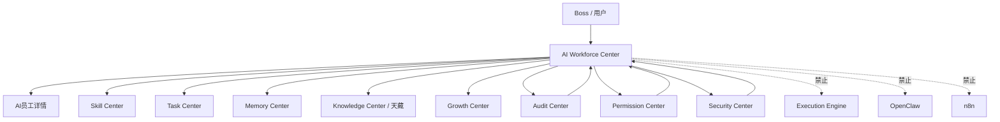

# Sprint62.27 AI员工工作台产品整合设计

文档名称：《AI Workforce Center 产品页面整合设计 V1》

阶段：Sprint62.27

状态：设计完成，等待确认

## 1. 阶段边界

本阶段只做产品整合设计。

禁止事项：

- 不写代码
- 不修改已有页面
- 不修改前端
- 不修改后端
- 不修改数据库
- 不创建 migration
- 不接入 Execution Engine
- 不接入 OpenClaw
- 不接入 n8n
- 不自动执行任务
- 不自动创建任务
- 不自动修改权限
- 不自动升级员工

Sprint62.27 只设计 AI Workforce Center 产品页面，不进入开发。

## 2. 产品定位

AI Workforce Center 是天统AI企业大脑中的 AI员工数字办公室。

它不是执行中心，也不是权限编辑中心。

它负责：

- 统一查看 AI员工状态
- 统一查看员工能力、任务、知识、记忆、成长、风险
- 统一展示员工权限与安全边界
- 连接 Skill Center、Task Center、Memory Center、Knowledge Center、Growth Center、Audit Center、Permission Center、Security Center
- 为 Boss、部门负责人、AI员工提供不同粒度的只读视图

核心原则：

- 查看不等于执行。
- 能力不等于权限。
- 技能不等于授权。
- 成长不等于自动升级。
- 风险展示不等于自动处置。
- Boss 确认不等于绕过安全审计。

## 3. 整合模块范围

AI Workforce Center V1 整合以下模块：

| 模块 | 在工作台中的作用 | V1边界 |
|---|---|---|
| AI Workforce Center | 员工大厅、员工状态、员工详情入口 | 只读展示 |
| Skill Center | 技能数量、技能状态、技能风险 | 不安装、不升级、不调用 |
| Task Center | 最近任务、任务状态、任务风险 | 不创建、不修改、不执行 |
| Memory Center | 经验、案例、历史上下文 | 不自动学习、不自动修改 |
| Knowledge Center | SOP、Prompt、知识资产 | 不发布、不修改、不外发 |
| Growth Center | 成长评分、能力趋势、成长建议 | 不自动晋升、不自动调整权限 |
| Audit Center | 风险事件、审计记录、安全状态 | 不自动处罚、不自动修复 |
| Permission Center | 权限范围、角色范围、可见范围 | 不自动授权、不编辑权限 |
| Security Center | 风险等级、审批状态、安全策略 | 不接执行系统 |

## 4. 页面结构

目标页面：

```text
frontend/ai-workforce.html
```

页面布局：

```text
顶部状态栏
├── 产品名称：AI Workforce Center
├── 当前组织
├── 员工数量
├── 系统状态
└── readonly安全模式

左侧导航
├── 员工大厅
├── 员工详情
├── 技能能力
├── 知识资产
├── 任务中心
├── 记忆中心
├── 成长中心
├── 风险审计
├── 权限范围
└── 安全策略

主区域
├── Boss/角色摘要区
├── AI员工总览
├── 部门分布
├── 员工卡片列表
├── 能力中心摘要
├── 任务状态摘要
├── 知识与记忆摘要
├── 成长趋势摘要
├── 风险审计摘要
└── 安全边界提示

右侧状态栏
├── 待确认事项
├── 高风险提示
├── 最近审计事件
└── 数据更新时间
```

## 5. 信息架构

### 5.1 一级信息

一级信息用于快速判断整个 AI员工体系是否稳定：

- AI员工总数
- 在线 / 空闲 / 工作中 / 冻结 / 离线状态
- 部门分布
- 技能总数
- 当前任务总数
- 风险数量
- 高风险事项
- 安全模式

### 5.2 二级信息

二级信息用于理解员工能力和业务关系：

- 员工所属部门
- 员工岗位
- 员工职责
- 技能数量
- 知识资产数量
- Memory 记录数量
- Growth 状态
- Audit 风险状态
- Permission 范围
- Security 策略状态

### 5.3 三级信息

三级信息通过下钻页面查看：

- 员工详情
- 技能详情
- 任务详情
- 记忆详情
- 成长详情
- 审计详情
- 知识详情
- 安全策略详情

V1 中三级信息只提供查看入口，不提供执行、修改、升级、授权按钮。

## 6. 用户操作流程

### 6.1 Boss视角流程

```text
进入 AI Workforce Center
 ↓
查看企业级员工总览
 ↓
查看部门分布和风险总览
 ↓
查看高风险员工或待确认事项
 ↓
进入员工详情
 ↓
查看技能、知识、任务、成长、审计
 ↓
人工判断是否需要后续处理
```

Boss 可看到：

- 全局员工摘要
- 全部门分布
- 高风险摘要
- 跨部门风险
- 审计摘要
- 待确认事项
- 安全策略状态

Boss 不直接执行：

- 不启动 AI员工
- 不自动创建任务
- 不直接修改权限
- 不跳过安全审计

### 6.2 部门负责人视角流程

```text
进入 AI Workforce Center
 ↓
查看本部门 AI员工
 ↓
查看本部门任务状态
 ↓
查看本部门技能和知识使用情况
 ↓
查看本部门风险与审计摘要
 ↓
提出人工处理建议
```

部门负责人可看到：

- 本部门员工列表
- 本部门员工状态
- 本部门任务摘要
- 本部门技能能力
- 本部门知识资产
- 本部门风险记录

部门负责人不可看到：

- 其他部门敏感数据
- 企业级高危详情，除非授权
- 完整 Prompt 或敏感知识，除非授权
- 权限修改入口

### 6.3 AI员工视角流程

```text
进入 AI Workforce Center
 ↓
查看自身档案
 ↓
查看自身技能和知识范围
 ↓
查看自身任务记录
 ↓
查看自身成长和审计状态
 ↓
查看安全边界
```

AI员工可看到：

- 自身身份信息
- 自身技能范围
- 自身知识范围
- 自身任务历史
- 自身成长状态
- 自身风险提示

AI员工不可执行：

- 自己提升权限
- 自己绑定高级技能
- 自己修改成长评分
- 自己隐藏审计记录
- 自己创建或执行任务

## 7. 员工卡片设计

员工卡片字段：

| 字段 | 说明 | 数据来源 |
|---|---|---|
| 员工名称 | AI员工名称 | AI Workforce Center |
| 员工编号 | employee_id / employee_code | AI Workforce Center |
| 部门 | 所属部门 | Permission Center / Organization |
| 岗位 | 岗位或角色 | Permission Center / Organization |
| 当前状态 | working / idle / frozen / offline | AI Workforce Center |
| 技能数量 | 已关联技能数量 | Skill Center |
| 当前任务 | 当前任务数量或最近任务状态 | Task Center |
| 风险等级 | low / medium / high / critical | Audit Center / Security Center |
| 权限范围 | self / department / company / restricted | Permission Center |

卡片按钮白名单：

- 查看员工
- 查看能力
- 查看任务
- 查看审计

禁止按钮：

- 执行
- 启动
- 自动运行
- 升级
- 授权
- 安装技能
- 调用外部系统

## 8. 数据来源设计

AI Workforce Center 数据读取关系：

```text
AI Workforce Center
 ↓
AI员工基础数据
 ↓
Skill Center
 ↓
Knowledge Center
 ↓
Memory Center
 ↓
Growth Center
 ↓
Audit Center
 ↓
Permission Center
 ↓
Security Center
 ↓
Task Center
```

数据来源表：

| 页面区域 | 主要数据 | 来源模块 | V1策略 |
|---|---|---|---|
| 顶部状态栏 | 员工数、系统状态、安全模式 | AI Workforce / Security | 只读 |
| 员工大厅 | 员工列表、状态、部门 | AI Workforce / Permission | 只读 |
| 能力摘要 | 技能数量、技能风险 | Skill Center | 只读 |
| 知识摘要 | SOP、Prompt、案例数量 | Knowledge Center | 只读 |
| 任务摘要 | 任务总数、状态、风险 | Task Center | 只读 |
| 记忆摘要 | 经验、成功/失败案例 | Memory Center | 只读 |
| 成长摘要 | 成长评分、趋势 | Growth Center | 只读 |
| 审计摘要 | 风险事件、审计记录 | Audit Center | 只读 |
| 权限展示 | 查看范围、角色范围 | Permission Center | 只读 |
| 安全状态 | 风险等级、审批状态 | Security Center | 只读 |

空数据策略：

- 无真实业务数据：显示“暂无数据”。
- API不可用：显示“当前数据不可用”。
- 部分模块异常：其他模块继续展示。
- 禁止制造假数据。

## 9. 权限展示设计

### 9.1 权限展示区域

页面需要展示：

- 当前用户角色
- 当前可查看范围
- 当前部门范围
- 当前知识范围
- 当前技能范围
- 当前任务范围
- 当前审计范围
- 高风险审批要求

### 9.2 角色可见范围

| 角色 | 可见范围 | 隐藏内容 |
|---|---|---|
| Boss | 企业级摘要、全局风险、所有部门只读信息 | 密钥、账号密码、未授权敏感原文 |
| Admin | 管理范围内员工、任务、风险、配置摘要 | 超出授权范围的敏感数据 |
| 部门负责人 | 本部门员工、任务、技能、风险 | 其他部门敏感信息 |
| AI员工 | 自身档案、授权技能、授权知识、个人成长 | 其他员工敏感信息、权限配置 |
| Viewer | 公开摘要、允许页面 | 风险明细、审计详情、敏感知识 |

### 9.3 权限安全提示

统一页面提示：

```text
readonly安全模式
技能 ≠ 权限
成长等级 ≠ 权限
高风险必须 boss_confirm=true + security_audited=true
```

## 10. 安全边界

AI Workforce Center V1 禁止：

- 自动执行任务
- 自动创建任务
- 自动修改任务状态
- 自动提升权限
- 自动修改权限
- 自动创建员工
- 自动升级员工
- 自动安装技能
- 自动升级技能
- 自动调用技能
- 自动修改知识
- 自动修改记忆
- 自动调整成长评分
- 自动修复风险
- 自动调用 Execution Engine
- 自动接入 OpenClaw
- 自动接入 n8n

高风险事项必须：

```json
{
  "boss_confirm": true,
  "security_audited": true,
  "readonly": true,
  "execution_engine_called": false,
  "openclaw_connected": false,
  "n8n_connected": false
}
```

## 11. 页面关系图



## 12. V1验收标准

产品设计验收标准：

- 页面结构覆盖顶部状态栏、导航、员工大厅、能力摘要、任务摘要、风险摘要、安全提示。
- 信息架构覆盖员工、技能、任务、知识、记忆、成长、审计、权限、安全。
- 明确 Boss、部门负责人、AI员工可见范围。
- 明确所有数据来源为只读。
- 明确无真实数据时显示空状态。
- 明确禁止执行、授权、升级、自动调用外部系统。

## 13. 后续开发建议

建议拆分：

1. Sprint62.28：AI Workforce Center 页面结构收敛与导航统一。
2. Sprint62.29：权限展示与角色视图只读接入。
3. Sprint62.30：安全策略状态只读接入。
4. Sprint62.31：员工详情与能力/记忆/成长/审计联动优化。

所有后续开发仍应保持：

- 先只读。
- 先空状态。
- 先复用已有 API。
- 不接执行系统。
- 不修改数据库结构，除非单独设计并确认。

## 14. 验收结论

Sprint62.27 已完成 AI员工工作台产品整合设计。

本设计覆盖：

- AI Workforce Center、Skill Center、Task Center、Memory Center、Knowledge Center、Growth Center、Audit Center、Permission Center、Security Center 的页面整合方式
- 页面结构、信息架构、用户操作流程、数据来源、权限展示、安全边界
- Boss、部门负责人、AI员工三类视角
- 禁止修改已有页面、数据库、接入 Execution Engine / OpenClaw / n8n、自动执行

本阶段没有代码修改、数据库修改、migration 创建或执行系统接入。
