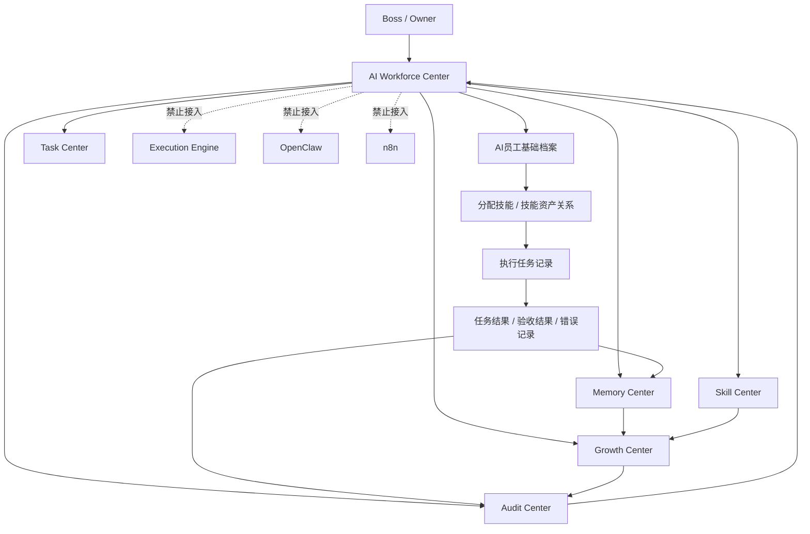

# Sprint62.37 AI员工工作台数据联动设计

文档名称：《Sprint62.37 AI Workforce Center 数据联动设计》

阶段：Sprint62.37

状态：设计完成，等待确认

## 1. 阶段边界

本阶段只做数据关系和 API 规划设计。

禁止事项：

- 不写代码
- 不修改前端
- 不修改后端
- 不创建数据库
- 不创建 migration
- 不修改 Task Center
- 不接入 Execution Engine
- 不接入 OpenClaw
- 不接入 n8n
- 不自动执行任务
- 不自动调用技能
- 不自动修改员工权限

Sprint62.37 只设计 AI Workforce Center、Skill Center、Task Center、Memory Center、Growth Center、Audit Center 的数据联动关系。

## 2. 设计目标

目标：

- 让老板从 AI Workforce Center 看清每个 AI员工的完整数据链路。
- 明确员工、技能、任务、记录、记忆、成长、审计之间如何只读关联。
- 为后续 Sprint62.38-Sprint62.40 的实现提供拆分依据。

核心原则：

```text
只读联动
人工确认
数据可追溯
技能不等于权限
成长不等于自动升级
审计不等于自动处罚
```

## 3. 数据流架构图



说明：

- AI Workforce Center 是统一入口。
- Skill Center 提供技能资产和员工技能关系。
- Task Center 提供任务事实记录。
- Memory Center 沉淀经验、案例和上下文。
- Growth Center 计算成长状态和能力趋势。
- Audit Center 记录风险、审计、审批和异常。
- V1/V2 均保持人工确认模式，不接执行系统。

## 4. AI员工生命周期

AI员工生命周期：

```text
创建
→ 分配技能
→ 执行任务
→ 产生记录
→ 经验沉淀
→ 能力成长
→ 审计
```

### 4.1 创建

主管模块：

- AI Workforce Center
- Organization / Permission Center

核心数据：

- employee_id
- employee_name
- department
- role
- status
- responsibility
- permission_scope

边界：

- 不自动创建员工。
- 不自动授权。
- 不自动修改组织关系。

### 4.2 分配技能

主管模块：

- Skill Center
- AI Workforce Center

核心数据：

- skill_id
- skill_name
- skill_version
- employee_id
- risk_level
- audit_status

边界：

- 技能分配只做关系展示。
- 技能不等于权限。
- 不自动安装技能。
- 不自动升级技能。
- 不自动调用技能。

### 4.3 执行任务

主管模块：

- Task Center

核心数据：

- task_id
- task_title
- assigned_ai_employee_code
- task_status
- task_result
- review_status
- updated_at

边界：

- Sprint62 工作台只读取任务。
- 不创建任务。
- 不修改任务状态。
- 不触发执行。

### 4.4 产生记录

主管模块：

- Task Center
- Audit Center

核心数据：

- task_result
- audit_log
- review_record
- error_record
- success/failure status

边界：

- 记录来自事实系统。
- 不伪造任务结果。
- 不覆盖审计日志。

### 4.5 经验沉淀

主管模块：

- Memory Center
- Knowledge Center / 天藏

核心数据：

- success_case
- failure_case
- experience
- decision_history
- learning_record

边界：

- 不自动学习修改自身。
- 不自动写入核心知识。
- 知识沉淀必须人工审核。

### 4.6 能力成长

主管模块：

- Growth Center
- Skill Center
- Memory Center

核心数据：

- growth_score
- skill_progress
- performance_record
- success_rate
- capability_gap

边界：

- 成长只做分析和建议。
- 不自动晋升员工。
- 不自动调整权限。
- 不自动升级技能。

### 4.7 审计

主管模块：

- Audit Center

核心数据：

- risk_event
- audit_event
- approval_record
- security_check
- boss_confirm
- security_audited

边界：

- 审计只记录和提示。
- 不自动处罚。
- 不自动封禁。
- 不自动修改权限。

## 5. 各中心数据关系

### 5.1 AI Workforce Center

定位：

- AI员工生态统一入口。

读取：

- 员工基础信息
- 员工状态
- 技能摘要
- 当前任务
- Memory 状态
- Growth 状态
- Audit 风险

输出：

- 统一员工卡片
- 员工详情入口
- 各中心只读下钻入口

数据关系：

```text
AI Workforce Center
→ Skill Center
→ Task Center
→ Memory Center
→ Growth Center
→ Audit Center
```

### 5.2 Skill Center

定位：

- 员工技能资产关系中心。

读取：

- AI员工列表
- 技能定义
- 技能版本
- 任务使用记录
- 审计风险

输出：

- 员工技能列表
- 技能使用次数
- 成功率
- 风险等级

关联：

- `employee_id` 连接 AI Workforce Center。
- `task_id` 连接 Task Center。
- `risk_event` 连接 Audit Center。
- `growth_score` 连接 Growth Center。

### 5.3 Task Center

定位：

- 任务事实来源。

读取：

- 员工分配
- 任务状态
- 任务结果
- 验收记录
- 审计日志

输出：

- 当前任务
- 历史任务
- 成功/失败状态
- 使用次数统计来源

关联：

- 为 Skill Center 提供使用次数和成功率。
- 为 Memory Center 提供成功/失败案例。
- 为 Growth Center 提供任务表现指标。
- 为 Audit Center 提供风险和状态变化。

### 5.4 Memory Center

定位：

- 经验、案例、决策和上下文沉淀中心。

读取：

- Task Center 任务结果
- Knowledge Center SOP / Prompt / 案例
- Audit Center 风险事件

输出：

- 成功案例
- 失败案例
- 经验记录
- 决策记录
- 学习记录

关联：

- 为 Growth Center 提供成长依据。
- 为 AI Workforce Center 提供员工经验摘要。
- 为 Audit Center 提供风险复盘背景。

### 5.5 Growth Center

定位：

- 员工能力成长分析中心。

读取：

- Skill Center 技能资产
- Task Center 任务表现
- Memory Center 成功/失败案例
- Audit Center 风险记录

输出：

- 成长评分
- 技能成长趋势
- 能力缺口
- 晋升建议

关联：

- 为 AI Workforce Center 提供成长状态。
- 为 Audit Center 提供风险辅助判断。

边界：

- Growth 建议不等于权限变更。
- Growth 建议不等于自动升级。

### 5.6 Audit Center

定位：

- 安全、风险、审批和追溯中心。

读取：

- AI Workforce Center 员工状态
- Skill Center 高风险技能
- Task Center 任务异常
- Memory Center 失败案例
- Growth Center 风险变化

输出：

- 风险等级
- 审计事件
- 审批记录
- 安全状态

关联：

- 为所有中心提供安全边界。
- 高风险必须 `boss_confirm=true` + `security_audited=true`。

## 6. API规划

### 6.1 已有 API

| 模块 | API | 用途 |
|---|---|---|
| AI Workforce Center | `GET /api/ai-workforce/overview` | 员工总览、员工卡片、任务/风险摘要 |
| AI员工生态 | `GET /api/ai-employee-ecosystem/overview` | 生态总览聚合 |
| AI员工健康 | `GET /api/ai-employee-health/overview` | 模块健康、API健康、数据更新时间 |
| Skill Center | `GET /api/ai-employee-skills/skills` | 员工技能资产列表 |
| Skill Center | `GET /api/ai-employee-skills/skills/{skill_id}` | 技能详情 |
| Skill Center | `GET /api/ai-employee-skills/employees/{employee_id}/skills` | 员工技能关系 |
| Task Center | `GET /api/task-center/tasks` | 任务列表 |

### 6.2 建议新增聚合 API

#### 6.2.1 员工全链路详情

```text
GET /api/ai-workforce/employees/{employee_id}/full-profile
```

返回：

```json
{
  "mode": "readonly",
  "employee": {},
  "skills": [],
  "tasks": [],
  "memory": {},
  "growth": {},
  "audit": {},
  "security": {
    "readonly": true,
    "execution_engine_called": false,
    "openclaw_connected": false,
    "n8n_connected": false
  }
}
```

#### 6.2.2 员工任务记忆成长链路

```text
GET /api/ai-workforce/employees/{employee_id}/activity-chain
```

用途：

- 展示任务记录 → Memory → Growth → Audit 的时间线。

#### 6.2.3 技能使用表现聚合

```text
GET /api/ai-employee-skills/employees/{employee_id}/performance
```

用途：

- 展示技能使用次数、成功率、失败记录、风险等级。

#### 6.2.4 审计联动摘要

```text
GET /api/ai-workforce/audit-linkage/overview
```

用途：

- 聚合高风险技能、异常任务、失败案例、低成长员工。

### 6.3 API安全规则

所有 API 必须：

```json
{
  "mode": "readonly",
  "security": {
    "readonly": true,
    "execution_engine_called": false,
    "openclaw_connected": false,
    "n8n_connected": false
  }
}
```

禁止 API 类型：

- POST 自动执行任务
- POST 自动调用技能
- PATCH 修改权限
- PATCH 修改员工等级
- PATCH 修改任务状态
- Execution Engine 调用
- OpenClaw 调用
- n8n 调用

## 7. 后续开发拆分

### 7.1 Sprint62.38：员工全链路详情 API 设计与实现

目标：

- 设计并实现 `GET /api/ai-workforce/employees/{employee_id}/full-profile`
- 聚合员工基础信息、技能、任务、Memory、Growth、Audit。

范围：

- 只读 API。
- 不新增数据库表。
- 不修改 Task Center。

验收：

- API 返回完整结构。
- 空数据可用。
- 安全字段完整。

### 7.2 Sprint62.39：员工详情页联动增强

目标：

- 在员工详情页接入 full-profile。
- 展示技能、任务、记忆、成长、审计联动视图。

范围：

- 只修改员工详情页展示。
- 不新增执行按钮。
- 不修改权限系统。

验收：

- 页面加载正常。
- 空数据和错误状态正常。
- 无执行入口。

### 7.3 Sprint62.40：Skill / Task / Memory / Growth / Audit 时间线

目标：

- 设计并实现员工工作时间线。
- 展示任务产生记录、经验沉淀、成长变化、审计风险。

范围：

- 只读时间线。
- 不写 Memory。
- 不自动更新 Growth。
- 不自动处罚或调整权限。

验收：

- 时间线数据可追溯。
- 高风险清晰标记。
- 保持人工确认模式。

## 8. 安全边界

必须保持：

- 不接入 Execution Engine
- 不接入 OpenClaw
- 不接入 n8n
- 不自动执行任务
- 不自动调用技能
- 不自动修改任务状态
- 不自动修改员工权限
- 不自动晋升员工
- 不自动写入 Memory
- 不自动修改 Growth
- 不自动处罚或封禁

高风险事项：

```json
{
  "boss_confirm": true,
  "security_audited": true,
  "action_available": false,
  "readonly": true
}
```

## 9. 验收结论

Sprint62.37 已完成 AI员工工作台数据联动设计。

本设计覆盖：

- 数据流架构图
- AI员工生命周期：创建 → 分配技能 → 执行任务 → 产生记录 → 经验沉淀 → 能力成长 → 审计
- AI Workforce Center、Skill Center、Task Center、Memory Center、Growth Center、Audit Center 数据关系
- API规划
- Sprint62.38 / Sprint62.39 / Sprint62.40 后续开发拆分
- 禁止接入 Execution Engine / OpenClaw / n8n，保持人工确认模式

等待确认后再进入下一阶段。
