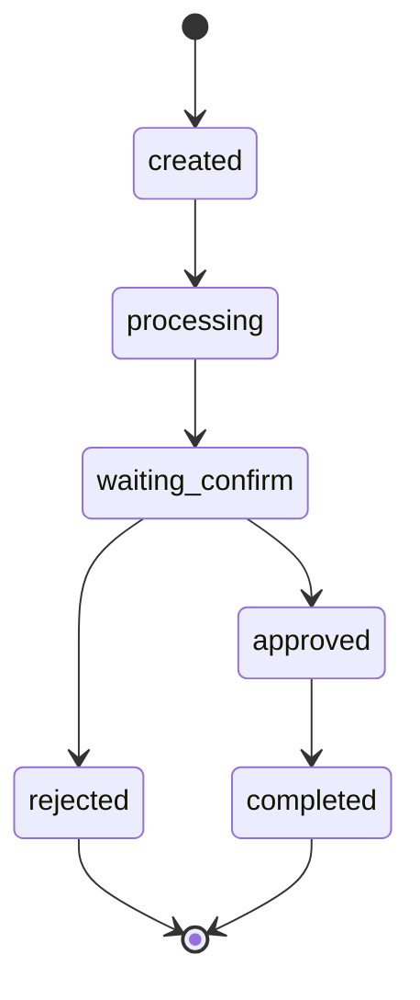
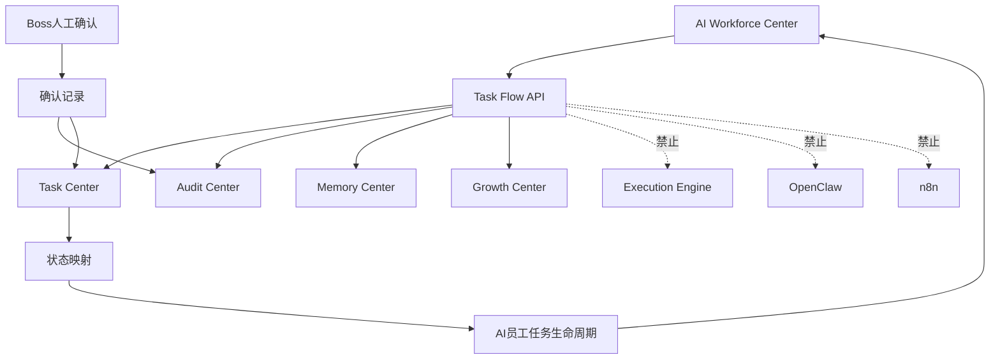

# Sprint62.38 AI员工任务流 API 设计

文档名称：《Sprint62.38 AI Workforce Center × Task Center 任务生命周期接口设计》

阶段：Sprint62.38

状态：设计完成，等待确认

## 1. 阶段边界

本阶段只做 API 架构设计。

禁止事项：

- 不写代码
- 不修改前端
- 不修改后端
- 不创建数据库
- 不创建 migration
- 不修改 Task Center 核心流程
- 不接入 Execution Engine
- 不接入 OpenClaw
- 不接入 n8n
- 不自动执行任务
- 不自动修改任务状态
- 不自动创建执行动作

Sprint62.38 只设计 AI Workforce Center 与 Task Center 的任务生命周期接口，保持 Boss 人工确认模式。

## 2. 设计目标

目标：

- 让 AI Workforce Center 能以只读方式展示 AI员工任务生命周期。
- 明确 AI员工任务状态与 Task Center 状态之间的映射关系。
- 为后续员工详情页、任务时间线、审计记录联动提供 API 设计基础。
- 保持 Task Center 作为任务事实来源。

核心原则：

```text
AI Workforce Center 只展示
Task Center 是任务事实来源
Boss 人工确认
高风险必须 security_audited=true
approved 不等于自动执行
completed 不等于外部业务动作完成
```

## 3. AI员工任务生命周期

任务生命周期状态：

```text
created
↓
processing
↓
waiting_confirm
↓
approved
↓
completed
↓
rejected
```

### 3.1 状态定义

| 状态 | 含义 | 数据来源 | 边界 |
|---|---|---|---|
| `created` | AI员工任务草稿或任务建议已形成 | AI Workforce / Task Center created | 不代表已执行 |
| `processing` | AI员工正在分析或任务处理中 | Task Center assigned/running/in_progress | 不调用 Execution Engine |
| `waiting_confirm` | 等待 Boss 确认建议或验收 | Task Center result_submitted / review_pending | 不允许绕过 Boss |
| `approved` | Boss 已确认建议或验收通过 | Task Center accepted/audited | 不代表自动执行 |
| `completed` | 任务闭环完成，可进入归档/复盘 | Task Center summarized/completed | 不代表外部平台已操作 |
| `rejected` | Boss 拒绝、风险拦截或任务失败 | Task Center rejected/failed/blocked | 需要 Audit 记录 |

### 3.2 状态映射

| AI员工任务状态 | Task Center 状态建议 | 说明 |
|---|---|---|
| `created` | `created`、`split` | 任务已产生但未处理 |
| `processing` | `assigned`、`running`、`in_progress` | 员工或流程正在处理 |
| `waiting_confirm` | `result_submitted`、`review_pending` | 等待 Boss 或审核人确认 |
| `approved` | `accepted`、`audited` | 已确认，允许进入归档或总结 |
| `completed` | `summarized`、`completed` | 任务记录闭环完成 |
| `rejected` | `rejected`、`failed`、`blocked` | 被拒绝、失败或阻塞 |

### 3.3 状态机



禁止状态跳转：

- `created` 直接进入 `completed`
- `processing` 绕过 `waiting_confirm` 直接执行
- `waiting_confirm` 未 Boss 确认进入执行
- `rejected` 自动重试
- 任意状态自动调用 Execution Engine

## 4. Task Center 与 AI Workforce 数据关系

### 4.1 AI Workforce Center 读取 Task Center

AI Workforce Center 读取：

- 当前任务
- 历史任务
- 任务状态
- 任务结果
- 任务审核状态
- 任务风险等级
- 任务审计记录

展示：

- 员工卡片当前任务
- 员工详情任务列表
- 员工任务生命周期
- 员工任务风险
- Boss 待确认事项

### 4.2 Task Center 作为事实来源

Task Center 保持职责：

- 任务创建事实
- 任务状态事实
- 任务分配事实
- 结果提交事实
- 验收事实
- 审计日志事实

AI Workforce Center 不替代 Task Center。

### 4.3 数据关联键

| 数据 | 关联字段 |
|---|---|
| AI员工 | `employee_code` / `employee_id` |
| Task Center | `assigned_ai_employee_code` |
| 任务 | `task_id` |
| 审计 | `task_id` + `employee_code` |
| Growth | `employee_code` + `task_id` |
| Memory | `task_id` + `employee_code` |

### 4.4 数据流



## 5. API接口设计

### 5.1 员工任务流总览

接口：

```text
GET /api/ai-workforce/employees/{employee_id}/task-flow
```

用途：

- 返回某个 AI员工任务生命周期概览。
- 支持员工详情页任务流区域。

响应示例：

```json
{
  "mode": "readonly",
  "employee": {
    "employee_id": "tianshang",
    "employee_name": "天商",
    "department": "业务部门"
  },
  "summary": {
    "total": 12,
    "created": 1,
    "processing": 2,
    "waiting_confirm": 1,
    "approved": 3,
    "completed": 4,
    "rejected": 1
  },
  "tasks": [],
  "security": {
    "readonly": true,
    "execution_engine_called": false,
    "openclaw_connected": false,
    "n8n_connected": false
  }
}
```

### 5.2 任务生命周期详情

接口：

```text
GET /api/ai-workforce/tasks/{task_id}/lifecycle
```

用途：

- 展示单个任务从 created 到 completed/rejected 的生命周期。
- 用于任务详情页或员工时间线。

响应示例：

```json
{
  "mode": "readonly",
  "task": {
    "task_id": 1001,
    "title": "分析某手表销量下降",
    "employee_id": "tianshu",
    "current_status": "waiting_confirm",
    "task_center_status": "result_submitted"
  },
  "lifecycle": [
    {"status": "created", "time": "2026-07-10T10:00:00+08:00", "source": "Task Center"},
    {"status": "processing", "time": "2026-07-10T10:10:00+08:00", "source": "Task Center"},
    {"status": "waiting_confirm", "time": "2026-07-10T10:30:00+08:00", "source": "Task Center"}
  ],
  "audit": [],
  "security": {
    "readonly": true,
    "execution_engine_called": false,
    "openclaw_connected": false,
    "n8n_connected": false
  }
}
```

### 5.3 Boss 待确认任务

接口：

```text
GET /api/ai-workforce/tasks/waiting-confirm
```

用途：

- 返回需要 Boss 人工确认的任务或建议。
- 支持 AI Workforce Center 首页待确认区域。

响应示例：

```json
{
  "mode": "readonly",
  "items": [
    {
      "task_id": 1001,
      "employee_id": "tianshu",
      "employee_name": "天数",
      "title": "分析销量下降原因",
      "status": "waiting_confirm",
      "risk_level": "medium",
      "boss_confirm_required": true,
      "security_audited_required": false
    }
  ],
  "security": {
    "readonly": true,
    "action_available": false,
    "execution_engine_called": false,
    "openclaw_connected": false,
    "n8n_connected": false
  }
}
```

### 5.4 任务确认记录设计接口

V1 只设计，不实现写入。

未来接口建议：

```text
POST /api/ai-workforce/tasks/{task_id}/confirm-request
```

注意：

- Sprint62.38 不实现 POST。
- 未来若实现，必须只创建确认记录，不执行任务。
- 高风险必须 `boss_confirm=true` 与 `security_audited=true`。
- 必须进入 Audit Center。

## 6. 权限确认流程

### 6.1 Boss 人工确认流程

```text
AI员工任务进入 waiting_confirm
↓
AI Workforce Center 展示待确认
↓
Boss 查看任务详情、证据、风险、审计信息
↓
低风险：Boss 确认
↓
高风险：Audit Center 安全审计
↓
Boss 二次确认
↓
Task Center 记录确认结果
```

### 6.2 权限规则

| 角色 | 可见范围 | 可确认范围 |
|---|---|---|
| Boss / Owner | 全部任务 | 全部任务确认 |
| Admin | 管理范围内任务 | 低/中风险确认建议，最终仍需 Boss |
| 部门负责人 | 本部门任务 | 本部门初审 |
| Viewer | 公开摘要 | 不可确认 |
| AI员工 | 自身任务摘要 | 不可确认 |

### 6.3 高风险确认要求

高风险任务必须：

```json
{
  "boss_confirm": true,
  "security_audited": true,
  "manual_confirm": true,
  "auto_execute": false
}
```

高风险包括：

- 涉及价格、库存、广告、账号、权限
- 涉及敏感数据
- 涉及外部平台
- 涉及高风险技能
- 任务失败或阻塞后再次处理

## 7. Audit记录设计

### 7.1 审计事件类型

| 事件类型 | 触发点 |
|---|---|
| `task_flow_viewed` | 用户查看任务流 |
| `waiting_confirm_detected` | 任务进入 waiting_confirm |
| `boss_confirm_required` | 任务需要 Boss 确认 |
| `security_audit_required` | 高风险任务需要安全审计 |
| `boss_confirmed` | Boss 确认 |
| `boss_rejected` | Boss 拒绝 |
| `task_flow_completed` | 任务生命周期闭环完成 |

### 7.2 审计记录结构

只设计，不建表。

```json
{
  "audit_event_id": "audit_task_flow_1001_001",
  "task_id": 1001,
  "employee_id": "tianshu",
  "event_type": "boss_confirm_required",
  "from_status": "processing",
  "to_status": "waiting_confirm",
  "risk_level": "medium",
  "boss_confirm": false,
  "security_audited": false,
  "operator_role": "owner",
  "created_at": "2026-07-10T10:30:00+08:00",
  "readonly": true
}
```

### 7.3 Audit Center 关系

Audit Center 负责：

- 记录任务生命周期关键节点。
- 标记高风险任务。
- 保存 Boss 确认/拒绝记录。
- 支持后续 Memory 和 Growth 复盘。

Audit Center 不负责：

- 自动处罚。
- 自动执行。
- 自动修改权限。
- 自动重试任务。

## 8. 后续 Sprint 拆分

### 8.1 Sprint62.39：任务流只读 API 实现

目标：

- 实现 `GET /api/ai-workforce/employees/{employee_id}/task-flow`
- 实现 `GET /api/ai-workforce/tasks/{task_id}/lifecycle`
- 实现 `GET /api/ai-workforce/tasks/waiting-confirm`

范围：

- 只读 API。
- 复用 Task Center 数据。
- 不写 Task Center。
- 不创建 migration。

### 8.2 Sprint62.40：员工详情页任务流联动

目标：

- 在员工详情页展示任务生命周期。
- 展示 waiting_confirm、approved、completed、rejected 状态。
- 展示 Boss 人工确认提示。

范围：

- 只改展示。
- 不新增执行按钮。
- 不改任务状态。

### 8.3 Sprint62.41：Audit / Memory / Growth 任务闭环联动

目标：

- 将任务生命周期与 Audit、Memory、Growth 做只读联动。
- 展示任务结果如何进入经验、成长和风险。

范围：

- 只读联动。
- 不自动写 Memory。
- 不自动更新 Growth。
- 不自动处罚。

## 9. 安全边界

必须保持：

- 不接入 Execution Engine
- 不接入 OpenClaw
- 不接入 n8n
- 不自动执行任务
- 不自动调用技能
- 不自动创建执行动作
- 不自动修改 Task Center 状态
- 不自动修改员工权限
- 不自动绕过 Boss

所有任务流 API 必须返回：

```json
{
  "mode": "readonly",
  "security": {
    "readonly": true,
    "manual_confirm_required": true,
    "execution_engine_called": false,
    "openclaw_connected": false,
    "n8n_connected": false,
    "auto_execute": false
  }
}
```

## 10. 验收结论

Sprint62.38 已完成 AI员工任务流 API 设计。

本设计覆盖：

- AI员工任务生命周期：created → processing → waiting_confirm → approved → completed → rejected
- Task Center 与 AI Workforce 数据关系
- API接口设计
- 权限确认流程
- Audit记录设计
- 后续 Sprint 拆分
- 禁止接入 Execution Engine / OpenClaw / n8n，保持 Boss 人工确认模式

等待确认后再进入实现阶段。
