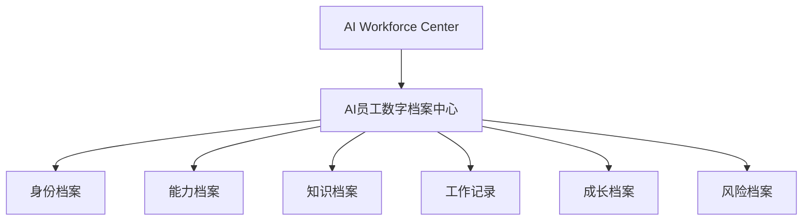
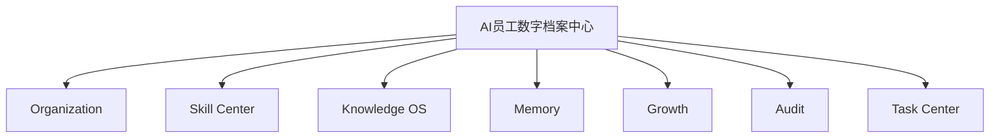

# Sprint62.3-A AI员工详情页 V2 产品架构设计

## 1. 阶段边界

本阶段只做产品设计。

禁止：

- 不写代码
- 不修改页面
- 不创建数据库
- 不创建 migration
- 不接真实业务
- 不接 OpenClaw
- 不接 n8n
- 不接 Execution Engine

目标：

设计 AI员工数字档案中心，让老板可以在单个员工维度查看身份、能力、知识、任务、成长、风险与审计状态。

## 2. 产品定位

页面名称：

```text
AI员工数字档案中心
```

建议页面：

```text
frontend/ai-employee-detail.html V2
```

定位：

- 员工详情页是 AI Workforce Center 的下钻页面。
- 员工详情页只负责查看单个 AI员工完整档案。
- 员工详情页不负责启动员工、不负责执行任务、不负责修改权限、不负责技能授权。

与现有页面关系：



## 3. 员工身份档案

展示字段：

- 员工名称
- 员工编号
- 所属部门
- 岗位
- 当前状态
- 负责人

建议字段来源：

| 字段 | 来源 | 说明 |
| --- | --- | --- |
| 员工名称 | `AiEmployee.employee_name` | 为空时显示“未命名AI员工” |
| 员工编号 | `AiEmployee.employee_code` | 详情页主键 |
| 所属部门 | `AiEmployee.legion` / Organization | 为空时显示“未分配部门” |
| 岗位 | `AiEmployee.duty` | 当前可用职责描述 |
| 当前状态 | AI Workforce / Task Center 推导 | `working / idle / frozen / offline` |
| 负责人 | Organization 推导 | V2 先从部门负责人规则或默认 Boss 推导 |

身份卡片设计：

```text
顶部员工信息
├── 员工名称
├── employee_code
├── 部门 / 岗位
├── 当前状态
├── 负责人
└── readonly 安全标记
```

## 4. 能力档案

展示内容：

- 技能列表
- Skill 版本
- 技能熟练度
- 可使用范围

能力档案结构：

```text
能力档案
├── 技能列表
│   ├── skill_code
│   ├── skill_name
│   ├── skill_category
│   └── source
├── Skill版本
│   ├── current_version
│   ├── version_status
│   └── last_reviewed_at
├── 技能熟练度
│   ├── 未掌握
│   ├── 学习中
│   ├── 已掌握
│   ├── 熟练
│   └── 专家
└── 可使用范围
    ├── allowed_task_types
    ├── allowed_tools
    ├── forbidden_tools
    └── required_approval
```

数据来源：

- `AiEmployee.task_types`
- `AiEmployee.default_permissions`
- `SOP / Skill Center`
- `Employee Capabilities`
- 未来 Skill Profile

关键原则：

```text
技能 ≠ 权限
Skill版本 ≠ 自动授权
熟练度 ≠ 可执行权限
专家身份 ≠ 高风险权限
```

页面展示要求：

- 技能用只读标签和列表展示。
- 高风险技能显示“需要审核”。
- 不提供“安装技能”“升级技能”“授权技能”“执行技能”按钮。

## 5. 知识档案

展示内容：

- 使用知识
- SOP
- Prompt
- 案例

知识档案结构：

```text
知识档案
├── 使用知识
│   ├── 知识文章
│   ├── 关联主题
│   └── 最近调用摘要
├── SOP
│   ├── SOP名称
│   ├── 所属部门
│   └── 状态
├── Prompt
│   ├── Prompt名称
│   ├── Prompt类型
│   └── 版本
└── 案例
    ├── 成功案例
    ├── 失败案例
    └── Bug案例
```

数据来源：

- `KnowledgeArticle`
- `SopLibrary`
- `PromptLibrary`
- `BugCase`
- `CourseLesson`
- `TaskCenterResult`
- `TaskCenterReview`
- 未来 Memory

安全要求：

- 不展示完整 Prompt 原文。
- 不展示敏感资料原文。
- 不触发 AI 总结、分类、生成文章、发布知识。
- 只展示摘要、标题、状态和关联关系。

## 6. 工作记录

展示内容：

- 历史任务
- 完成情况
- 评价

工作记录结构：

```text
工作记录
├── 当前任务
│   ├── task_id
│   ├── title
│   ├── status
│   └── updated_at
├── 历史任务
│   ├── 最近任务
│   ├── 已完成任务
│   ├── 失败/阻塞任务
│   └── 待验收任务
├── 完成情况
│   ├── 总任务数
│   ├── 成功数
│   ├── 失败数
│   └── 成功率
└── 评价
    ├── 天检验收
    ├── 天监审计
    └── Boss确认记录
```

数据来源：

- `TaskCenterTask`
- `TaskCenterResult`
- `TaskCenterReview`
- `TaskCenterAuditLog`
- `OrchestratorTaskLink`

只读要求：

- 只能查看任务。
- 不创建任务。
- 不分配任务。
- 不启动任务。
- 不提交结果。
- 不验收。
- 不审计。
- 不汇总。

## 7. 成长档案

展示内容：

- 成长评分
- 优势能力
- 待提升能力

成长档案结构：

```text
成长档案
├── 成长评分
│   ├── employee_growth_score
│   ├── growth_level
│   ├── success_rate
│   └── failure_count
├── 优势能力
│   ├── 高成功率技能
│   ├── 高评价任务类型
│   └── 稳定协作领域
└── 待提升能力
    ├── 失败案例集中领域
    ├── 风险事件类型
    └── 技能建议
```

数据来源：

- `EmployeeGrowth`
- `ReviewAnalysis`
- `SkillSuggestion`
- `RiskEvent`
- Task Center 任务表现

安全要求：

- 不调用成长分析写入接口。
- 不自动晋升。
- 不自动降级。
- 不自动调整权限。
- 成长建议只展示，不执行。

## 8. 风险档案

展示内容：

- 风险等级
- 审计记录
- 安全状态

风险档案结构：

```text
风险档案
├── 风险等级
│   ├── low
│   ├── medium
│   └── high
├── 审计记录
│   ├── TaskCenterAuditLog
│   ├── EmployeeLog
│   ├── Activity Trace
│   └── DeployRecord
└── 安全状态
    ├── readonly
    ├── execution_engine_called=false
    ├── openclaw_connected=false
    ├── n8n_connected=false
    └── high_risk_requires
```

高风险展示：

- 显示“需要审核”。
- 显示 `security_audited=true` 和 `boss_confirm=true` 要求。
- 不提供“处理”“执行”“绕过”“授权”按钮。

## 9. 页面结构设计

页面布局：

```text
┌───────────────────────────────────────────────┐
│ 顶部员工信息                                  │
│ 名称 / 编号 / 部门 / 岗位 / 状态 / 负责人      │
├───────────────┬─────────────────┬─────────────┤
│ 左侧导航       │ 中间能力展示     │ 右侧风险状态 │
│               │                 │             │
│ 身份档案       │ 能力档案         │ 风险等级     │
│ 能力档案       │ 知识档案         │ 审计状态     │
│ 知识档案       │ 工作记录         │ 安全边界     │
│ 工作记录       │ 成长档案         │ 待确认事项   │
│ 成长档案       │                 │             │
│ 风险档案       │                 │             │
└───────────────┴─────────────────┴─────────────┘
```

顶部员工信息：

- 使用紧凑信息条。
- 明确显示只读模式。
- 展示返回 AI Workforce Center 的入口。

左侧导航：

- 身份档案
- 能力档案
- 知识档案
- 工作记录
- 成长档案
- 风险档案

中间能力展示：

- 卡片分区展示。
- 每个区块显示来源、更新时间、空状态。
- 所有区块只读。

右侧风险状态：

- 风险等级
- 最近错误
- 审计摘要
- 高风险确认要求
- 安全边界

## 10. 数据来源设计

只读来源：



数据映射：

| 模块 | 数据 | 用途 |
| --- | --- | --- |
| Organization | 部门、负责人、组织角色 | 身份档案 |
| Skill Center | 技能、SOP、Prompt绑定、风险等级 | 能力档案 |
| Knowledge OS | 知识文章、SOP、Prompt、案例 | 知识档案 |
| Memory | 成功案例、失败案例、复盘记录 | 知识与成长档案 |
| Growth | 成长评分、技能建议、风险事件 | 成长档案 |
| Audit | 审计日志、活动追溯、部署记录 | 风险档案 |
| Task Center | 当前任务、历史任务、验收评价 | 工作记录 |

建议 API：

```text
GET /api/ai-employees/{employee_code}/detail-v2
```

或在当前详情 API 后续扩展：

```text
GET /api/ai-employees/{employee_code}/detail
```

建议首选新增 V2 API，避免影响现有详情页和测试。

返回结构草案：

```json
{
  "readonly": true,
  "employee": {},
  "identity": {},
  "capabilities": {},
  "knowledge": {},
  "work_records": {},
  "growth": {},
  "risk": {},
  "audit": {},
  "security": {
    "readonly": true,
    "execution_engine_called": false,
    "openclaw_connected": false,
    "n8n_connected": false,
    "high_risk_requires": {
      "boss_confirm": true,
      "security_audited": true
    }
  }
}
```

## 11. 安全边界

员工详情页可以：

- 查看员工身份。
- 查看技能能力。
- 查看知识资产。
- 查看任务记录。
- 查看成长评分。
- 查看风险与审计。
- 跳转回 AI Workforce Center。

员工详情页不能：

- 启动员工。
- 停用/启用员工。
- 修改权限。
- 绑定技能。
- 自动升级。
- 自动执行任务。
- 调用 Execution Engine。
- 调用 OpenClaw。
- 调用 n8n。
- 自动发布知识。
- 自动生成任务。

必须保留：

```text
readonly=true
execution_engine_called=false
openclaw_connected=false
n8n_connected=false
security_audited=true
boss_confirm=true
```

## 12. Sprint62.3-B 开发建议

开发顺序：

1. 新增只读 V2 详情 API。

   修改文件：

   - `backend/routers/ai_employees.py` 或新增 `backend/routers/ai_employee_detail_v2.py`
   - `tests/test_ai_employee_detail_v2.py`

   验收：

   - API 只读。
   - 返回结构完整。
   - 不包含敏感字段。
   - 不调用 Execution Engine。

2. 改造详情页 V2 展示，但不删除旧内容。

   修改文件：

   - `frontend/ai-employee-detail.html`
   - `tests/test_ai_employee_detail_frontend.py`

   验收：

   - 页面加载正常。
   - 空数据正常。
   - API异常正常。
   - 无危险按钮。

3. 与 AI Workforce Center 联动。

   修改文件：

   - `frontend/ai-workforce.html`
   - `tests/test_ai_workforce.py`

   验收：

   - 员工卡片“查看员工”跳转正确。
   - 详情页读取 `code` 参数正常。
   - 不影响 AI员工名册旧入口。

## 13. Sprint62.3-A 设计验收结论

本设计满足：

- 只做产品设计。
- 不修改页面。
- 不写代码。
- 不创建数据库。
- 不创建 migration。
- 不接真实业务。
- 不接 OpenClaw / n8n / Execution Engine。
- 明确员工详情页 V2 只读、安全、可追溯边界。

等待确认后进入 Sprint62.3-B 开发。
