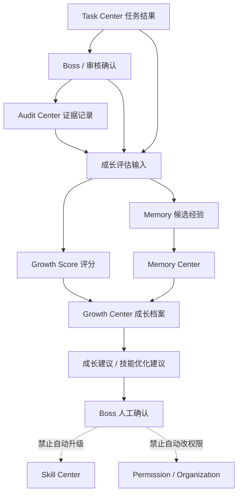

# Sprint62.40 AI员工成长评估设计

文档名称：《AI Workforce Center 任务结果到成长评分闭环设计 V1》

阶段：Sprint62.40

状态：设计完成，等待确认

## 1. 阶段边界

本阶段只做产品与数据闭环设计。

禁止事项：

- 不写代码
- 不修改前端
- 不修改后端
- 不修改数据库
- 不创建 migration
- 不修改 Task Center 核心流程
- 不接入 Execution Engine
- 不接入 OpenClaw
- 不接入 n8n
- 不自动升级技能
- 不自动调整权限
- 不自动执行任务

Sprint62.40 只设计 AI Workforce Center 中“任务结果 -> 成长评分 -> Memory -> Growth Center”的只读评估闭环，保持 Boss 人工确认模式。

## 2. 设计目标

目标：

- 将 Task Center 的任务结果、验收记录、风险记录转化为 AI员工成长评估输入。
- 设计 Growth Center 的评分结构、数据结构和 API 规划。
- 明确 Memory Center 与 Growth Center 的关系。
- 明确 Audit Center 在评分中的证据来源作用。
- 为 Sprint62.41 后续开发拆分提供可执行边界。

核心原则：

```text
Task Center 是任务事实来源
Audit Center 是证据来源
Memory Center 是经验沉淀
Growth Center 是评分与趋势分析
Boss 人工确认是高风险变化前置条件
评分不等于权限
成长建议不等于自动升级
```

## 3. 总体闭环



## 4. AI员工评分体系

### 4.1 评分维度

| 维度 | 说明 | 主要来源 | 权重建议 |
|---|---|---|---|
| 任务完成率 | 员工参与任务中完成闭环的比例 | Task Center | 20% |
| 任务质量 | 输出结果是否被接受、是否可复用、是否满足目标 | Task Center + Boss评价 | 25% |
| 成功率 | 提交结果中通过验收或被采纳的比例 | Task Center Review | 20% |
| 风险记录 | 失败、阻塞、违规引用、高风险事件 | Audit Center | -20% 上限扣分 |
| 用户评价 | Boss、管理员、部门负责人对结果评分 | Review / Audit | 15% |
| 技能使用效果 | 技能使用后的结果质量、风险、稳定性 | Skill Center + Task Center | 20% |

### 4.2 综合评分公式

```text
employee_growth_score =
  task_completion_score * 0.20
+ task_quality_score * 0.25
+ success_rate_score * 0.20
+ user_rating_score * 0.15
+ skill_effectiveness_score * 0.20
- risk_penalty
```

说明：

- 分数范围建议为 `0-100`。
- `risk_penalty` 单独扣分，避免高风险员工被高完成率掩盖。
- 缺少数据时不制造假分数，返回 `available=false` 和 `reason=no_data`。
- 成长评分只用于观察、建议和人工复核，不触发自动升级。

### 4.3 维度计算规则

#### 任务完成率

```text
task_completion_rate = completed_task_count / total_assigned_task_count
```

完成状态包括：

- `accepted`
- `audited`
- `summarized`
- `completed`

边界：

- 完成率不等于业务成功率。
- 完成率不代表可以自动提高权限。

#### 任务质量

输入：

- 结果是否被 Boss 接受
- 结果是否被审计通过
- 结果是否进入总结
- 是否产生可复用 Memory
- 是否形成知识候选

评分建议：

| 条件 | 分数 |
|---|---|
| Boss 接受并审计通过 | 90-100 |
| Boss 接受但未审计 | 75-89 |
| 已提交等待确认 | 60-74 |
| 被拒绝但有有效复盘 | 40-59 |
| 被拒绝且无复盘 | 0-39 |

#### 成功率

```text
success_rate = accepted_or_audited_task_count / submitted_result_count
```

边界：

- 成功率必须结合任务难度、风险等级和任务类型。
- 高成功率不等于自动成为专家。

#### 风险记录

风险扣分来源：

- `rejected`
- `failed`
- `blocked`
- 高风险审计事件
- 权限越界尝试
- 知识引用错误
- 未经确认的高风险建议

扣分建议：

| 风险等级 | 扣分 |
|---|---|
| low | 0-3 |
| medium | 4-10 |
| high | 11-20 |

高风险变化必须：

```json
{
  "boss_confirm": true,
  "security_audited": true
}
```

#### 用户评价

用户评价来源：

- Boss 验收评分
- 管理员复核评分
- 部门负责人反馈
- 任务结果采纳情况

边界：

- 用户评价必须可追溯。
- 不允许 AI员工给自己评分作为最终评分。

#### 技能使用效果

输入：

- 使用的 Skill
- Skill 版本
- 任务结果
- 使用次数
- 成功率
- 风险记录

输出：

- 员工-技能熟练度
- 技能使用风险
- 技能优化建议

边界：

- 技能效果评分不等于技能权限。
- 技能优化建议不等于自动升级技能。

## 5. Growth Center 数据结构设计

本节只设计数据结构，不创建表。

### 5.1 GrowthProfile

用途：记录 AI员工成长总览。

字段草案：

```json
{
  "employee_code": "tianwang",
  "employee_name": "天王：后端开发中心",
  "growth_score": 82.5,
  "growth_level": "stable",
  "task_completion_rate": 0.91,
  "success_rate": 0.86,
  "risk_score": 8,
  "last_evaluated_at": "2026-07-10T00:00:00Z",
  "available": true
}
```

### 5.2 GrowthEvaluationRecord

用途：记录一次任务或周期评估结果。

字段草案：

```json
{
  "evaluation_id": "growth-eval-001",
  "employee_code": "tianwang",
  "task_id": 1001,
  "evaluation_type": "task_result",
  "task_quality_score": 88,
  "success_score": 90,
  "user_rating_score": 85,
  "skill_effectiveness_score": 82,
  "risk_penalty": 4,
  "final_score": 85.2,
  "evidence_refs": [],
  "boss_confirm": true,
  "security_audited": true,
  "created_at": "2026-07-10T00:00:00Z"
}
```

### 5.3 SkillGrowthRecord

用途：记录员工在某个技能上的成长趋势。

字段草案：

```json
{
  "employee_code": "tianwang",
  "skill_id": "backend-api-skill",
  "skill_name": "后端 API Skill",
  "skill_version": "v1.0",
  "usage_count": 32,
  "success_rate": 0.88,
  "risk_count": 1,
  "proficiency": "熟练",
  "recommendation": "保持观察",
  "updated_at": "2026-07-10T00:00:00Z"
}
```

### 5.4 GrowthSuggestion

用途：记录成长建议，不自动执行。

字段草案：

```json
{
  "suggestion_id": "growth-suggestion-001",
  "employee_code": "tianwang",
  "suggestion_type": "skill_optimization",
  "title": "提升任务复盘质量",
  "reason": "失败任务复盘字段不完整",
  "risk_level": "medium",
  "requires_boss_confirm": true,
  "requires_security_audit": false,
  "status": "draft"
}
```

边界：

- `GrowthSuggestion` 只能作为建议。
- 不自动修改员工等级。
- 不自动修改 Skill Center。
- 不自动修改权限。

## 6. Memory Center 与 Growth Center 关系

### 6.1 职责边界

| 模块 | 职责 | 不负责 |
|---|---|---|
| Memory Center | 记录任务经验、上下文、成功案例、失败案例 | 不计算最终成长等级 |
| Growth Center | 计算评分、趋势、能力缺口、成长建议 | 不自动修改记忆、不自动升级员工 |

### 6.2 数据流

```text
Task Center 任务结果
↓
Boss 确认 / Review
↓
Audit Center 记录证据
↓
Memory Center 沉淀经验
↓
Growth Center 读取任务、审计、记忆
↓
生成成长评分和建议
```

### 6.3 Memory 输入 Growth 的内容

Memory Center 可向 Growth Center 提供：

- 成功案例数量
- 失败案例数量
- 复盘质量
- 相似任务复用次数
- 知识引用质量
- 长期稳定表现
- 常见错误模式

### 6.4 Growth 反向输出 Memory 的内容

Growth Center 可向 Memory Center 输出：

- 成长评估摘要
- 能力变化摘要
- 技能优化建议摘要
- 风险趋势摘要

边界：

- Growth 输出到 Memory 也必须是记录型数据。
- 不允许 Growth 直接覆盖 Memory。
- 高风险成长结论进入正式知识前必须人工审核。

## 7. Audit Center 数据来源

Audit Center 在成长评估中负责提供证据链。

### 7.1 任务审计数据

来源：

- 任务创建
- 任务分配
- 任务开始
- 结果提交
- 验收通过 / 拒绝
- 安全审计
- 总结归档

用途：

- 计算任务完成率
- 计算成功率
- 追踪 Boss 确认
- 判断任务是否闭环

### 7.2 风险审计数据

来源：

- 高风险任务
- rejected / failed / blocked 状态
- 权限越界尝试
- 知识引用错误
- 未通过审核的建议

用途：

- 计算风险扣分
- 生成安全提醒
- 支持 Boss 复核

### 7.3 评价证据

来源：

- Boss Review
- Admin Review
- 部门负责人反馈
- 任务采纳记录
- 业务结果回填

用途：

- 支持任务质量评分
- 支持用户评价评分
- 支持技能效果评分

### 7.4 审计边界

- Audit Center 不自动处罚员工。
- Audit Center 不自动修改权限。
- Audit Center 不自动创建任务。
- Audit Center 不自动触发执行。

## 8. API规划

本节只做 API 规划，不新增接口。

### 8.1 员工成长总览

```text
GET /api/ai-workforce/employees/{employee_id}/growth-evaluation
```

返回：

```json
{
  "mode": "readonly",
  "employee": {},
  "growth_profile": {},
  "score_breakdown": {
    "task_completion_score": 0,
    "task_quality_score": 0,
    "success_rate_score": 0,
    "user_rating_score": 0,
    "skill_effectiveness_score": 0,
    "risk_penalty": 0
  },
  "memory_summary": {},
  "audit_summary": {},
  "suggestions": [],
  "security": {
    "readonly": true,
    "boss_confirm_required": true,
    "security_audited_required": true,
    "execution_engine_called": false,
    "openclaw_connected": false,
    "n8n_connected": false
  }
}
```

### 8.2 员工技能成长

```text
GET /api/ai-workforce/employees/{employee_id}/skill-growth
```

返回：

- Skill 列表
- Skill 版本
- 使用次数
- 成功率
- 风险次数
- 熟练度
- 建议

### 8.3 任务成长评估详情

```text
GET /api/ai-workforce/tasks/{task_id}/growth-evaluation
```

返回：

- 任务结果
- 验收记录
- 评分拆解
- Memory 候选
- Audit 证据
- Boss 确认状态

### 8.4 Growth Center 总览

```text
GET /api/growth-center/overview
```

返回：

- 员工总数
- 可评估员工数
- 平均成长评分
- 高风险员工数
- 技能成长趋势
- 待 Boss 确认建议数

### 8.5 安全要求

所有 Growth API 必须返回：

```json
{
  "mode": "readonly",
  "security": {
    "readonly": true,
    "execution_engine_called": false,
    "openclaw_connected": false,
    "n8n_connected": false
  }
}
```

禁止设计以下接口：

- 自动升级员工接口
- 自动修改权限接口
- 自动安装技能接口
- 自动执行任务接口
- 自动修改 Memory 接口

## 9. Boss 人工确认模式

必须人工确认的场景：

- Growth 建议员工升级
- Growth 建议技能升级
- Growth 建议权限变化
- Growth 识别高风险员工
- Growth 建议将 Memory 进入正式知识库
- Growth 建议将失败案例转为 SOP

高风险必须：

```json
{
  "boss_confirm": true,
  "security_audited": true
}
```

说明：

- Growth Center 可以生成建议。
- Boss 可以查看建议。
- 系统不自动执行建议。
- 权限、技能、员工等级变化必须走后续人工审批流程。

## 10. Sprint62.41 后续开发拆分

### Sprint62.41-A Growth Evaluation 后端设计

目标：

- 设计 Growth Evaluation 只读后端实现方案。
- 明确 Router / Service / 数据来源。
- 明确是否复用 Sprint62.39 Task Flow API。

输出：

- 后端设计文档
- API JSON 示例
- 测试计划

禁止：

- 写代码
- 创建 migration
- 修改数据库

### Sprint62.41-B Growth Evaluation API MVP 实现

目标：

- 实现只读员工成长评估 API。
- 复用 Task Center、Task Flow、Audit 现有数据。
- 无数据时返回 `available=false`。

建议接口：

- `GET /api/ai-workforce/employees/{employee_id}/growth-evaluation`
- `GET /api/ai-workforce/tasks/{task_id}/growth-evaluation`

验收：

- pytest 覆盖权限、空数据、只读、安全字段。
- 静态检查无执行系统接入。

### Sprint62.41-C Growth Center 前端设计

目标：

- 设计员工成长评分页面。
- 展示评分拆解、Memory 摘要、Audit 证据、待确认建议。

禁止：

- 自动升级按钮
- 自动授权按钮
- 自动执行按钮

### Sprint62.41-D Growth Center 前端 MVP 实现

目标：

- 实现只读 Growth 页面。
- 接入 Growth Evaluation API。
- 显示空数据、加载、错误状态。

### Sprint62.41-E 成长评估验收

目标：

- 验收 Growth Evaluation API 与前端展示。
- 检查 Boss 人工确认边界。
- 检查无数据库变更、无执行接入、无自动升级。

## 11. 风险分析

| 风险 | 说明 | 控制方式 |
|---|---|---|
| 评分被误认为权限依据 | 高分员工可能被误认为可自动授权 | 页面和 API 明确 `score_only=true` |
| 数据不足导致误判 | 早期任务数据少，评分不稳定 | 返回 `available=false` 或低置信度 |
| 风险扣分过重 | 单次失败影响长期成长 | 引入时间窗口和人工复核 |
| Memory 被自动固化 | 经验未经审核进入正式知识 | 必须 Boss 确认和安全审计 |
| 技能自动升级 | 成长建议被误用为技能升级 | 禁止自动升级，Skill Center 独立审核 |
| 执行链路误接入 | Growth 建议触发执行 | API 不设计执行入口 |

## 12. 验收标准

Sprint62.40 通过标准：

- 只新增设计文档。
- 不修改代码。
- 不修改数据库。
- 不创建 migration。
- 不接入 Execution Engine。
- 不接入 OpenClaw。
- 不接入 n8n。
- 明确任务结果到成长评分闭环。
- 明确 Memory、Growth、Audit 的职责边界。
- 明确 Boss 人工确认模式。

## 13. 结论

Sprint62.40 完成 AI员工成长评估设计。

本设计将 Task Center 任务事实、Boss 确认、Audit 证据、Memory 经验沉淀与 Growth Center 成长评分连接为只读闭环。

下一阶段可进入 Sprint62.41，优先做 Growth Evaluation 后端设计，再进入只读 API MVP 实现。
