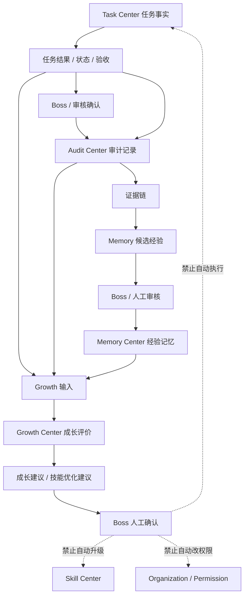
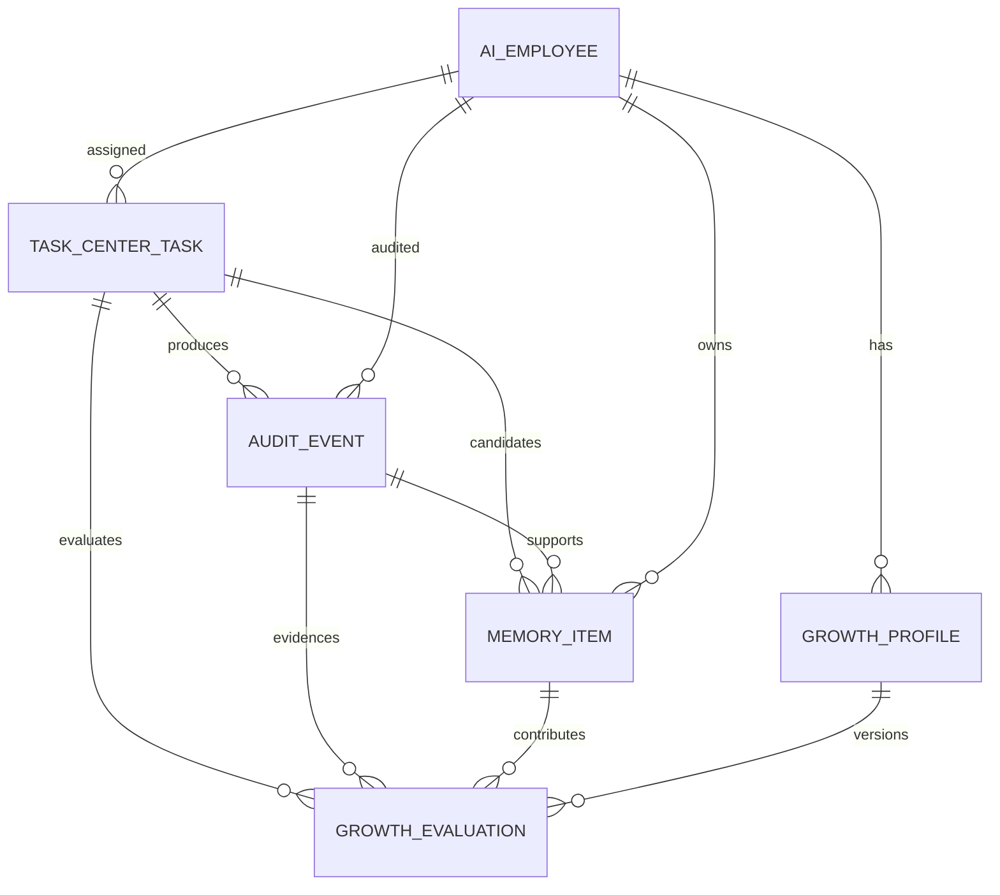

# Sprint62.41 AI员工 Audit Memory Growth 闭环设计

文档名称：《AI员工任务结果到审计、记忆、成长评价闭环设计 V1》

阶段：Sprint62.41

状态：设计完成，等待确认

## 1. 阶段边界

本阶段只做产品与架构设计。

禁止事项：

- 不写代码
- 不修改前端
- 不修改后端
- 不修改数据库
- 不创建 migration
- 不修改 Task Center 核心流程
- 不接入 Execution Engine
- 不接入 OpenClaw
- 不接入 n8n
- 不自动学习
- 不自动升级技能
- 不自动修改权限
- 不自动执行任务

Sprint62.41 设计 AI员工：

```text
任务结果
↓
审计记录
↓
经验记忆
↓
成长评价
```

完整闭环，并保持 Boss 人工确认模式。

## 2. 产品定位

Audit Memory Growth 闭环是 AI员工生态的长期评价底座。

定位：

- Task Center 记录任务事实。
- Audit Center 记录任务过程、确认、风险和证据。
- Memory Center 沉淀可复用经验、成功案例、失败案例。
- Growth Center 基于事实、证据和经验计算成长评价。

核心原则：

```text
事实来自 Task Center
证据来自 Audit Center
经验进入 Memory Center
评价进入 Growth Center
Boss 决定是否采纳建议
系统不自动学习修改自己
系统不自动升级技能
系统不自动执行任务
```

## 3. 总体闭环图



## 4. Audit Center 数据来源

Audit Center 是闭环中的证据层，不负责自动处罚、自动升级或自动执行。

### 4.1 Task Center 来源

| 数据 | 来源字段 / 事件 | 用途 |
|---|---|---|
| 任务创建 | `task_created` | 记录任务起点 |
| 任务分配 | `ai_employee_assigned` | 记录负责员工 |
| 任务开始 | `task_started` | 记录进入处理状态 |
| 结果提交 | `result_submitted` | 记录员工输出 |
| 验收记录 | `acceptance_reviewed` | 记录 Boss / 审核结果 |
| 安全审计 | `task_audited` | 记录安全复核 |
| 总结归档 | `task_summarized` | 记录任务闭环 |

### 4.2 AI Workforce 来源

来源：

- 员工身份
- 员工部门
- 员工岗位
- 当前状态
- 风险等级
- 任务流状态

用途：

- 让审计记录能关联到具体员工。
- 支持员工级风险和成长分析。
- 支持部门级审计统计。

### 4.3 Skill Center 来源

来源：

- Skill 名称
- Skill 版本
- 使用员工
- 风险等级
- 审核状态

用途：

- 记录任务中使用的技能上下文。
- 评估技能使用效果。
- 支持技能风险回溯。

边界：

- Audit 只记录技能使用证据。
- 不自动修改技能。
- 不自动升级技能。

### 4.4 Knowledge / Memory 来源

来源：

- 知识引用
- SOP 引用
- Prompt 引用
- 成功案例引用
- 失败案例引用

用途：

- 判断输出结果是否可追溯。
- 判断知识版本是否适用。
- 识别可沉淀经验和错误模式。

边界：

- Audit 不自动发布知识。
- Audit 不自动修改 Memory。

### 4.5 Boss 确认来源

必须记录：

```json
{
  "boss_confirm": true,
  "confirmed_by": "boss",
  "confirmed_at": "2026-07-10T00:00:00Z",
  "security_audited": true,
  "confirm_scope": "task_result"
}
```

适用：

- 高风险任务结果
- 任务验收
- 失败复盘
- 成长建议采纳
- 技能优化建议采纳
- 记忆进入正式知识候选

## 5. Memory Center 经验沉淀规则

Memory Center 是经验层，负责沉淀任务上下文、案例、复盘和经验候选。

### 5.1 可沉淀对象

| 类型 | 说明 | 来源 |
|---|---|---|
| TaskMemory | 单个任务的上下文和结果 | Task Center + Audit |
| SuccessCase | 成功任务案例 | accepted / audited / summarized |
| FailureCase | 失败或拒绝任务案例 | rejected / failed / blocked |
| LearningRecord | 复盘和学习记录 | Boss Review + Audit |
| DecisionMemory | 决策依据和确认记录 | Boss Confirm |
| SkillExperience | 某技能使用经验 | Skill Center + Task Result |

### 5.2 沉淀触发条件

允许进入 Memory 候选的条件：

- 任务有明确结果。
- 任务有审计记录。
- 任务有员工归属。
- 任务状态进入 `accepted`、`audited`、`summarized`、`rejected`、`failed`、`blocked`。
- 高风险任务必须具备 `security_audited=true`。

必须人工确认的条件：

- 经验将进入正式知识库。
- 失败案例将进入 SOP。
- 高风险经验将被复用。
- 技能优化建议来自该经验。

### 5.3 成功案例规则

成功案例来源：

- Boss 接受结果。
- 安全审计通过。
- 任务进入 summarized / completed。
- 输出结果可复用。

成功案例字段草案：

```json
{
  "memory_type": "success_case",
  "employee_code": "tianwang",
  "task_id": 1001,
  "task_title": "分析店铺销量下降",
  "used_skills": [],
  "knowledge_refs": [],
  "result_summary": "识别广告ROI下降和转化率下降问题",
  "success_reason": "数据分析准确，建议被采纳",
  "boss_confirm": true,
  "security_audited": true
}
```

### 5.4 失败案例规则

失败案例来源：

- 任务被 rejected。
- 任务 failed / blocked。
- 输出结果被判定为错误。
- 出现知识引用错误或风险事件。

失败案例字段草案：

```json
{
  "memory_type": "failure_case",
  "employee_code": "tianwang",
  "task_id": 1002,
  "risk_level": "medium",
  "failure_reason": "引用知识版本不适用",
  "avoidance_rule": "同类任务需检查知识版本",
  "requires_review": true,
  "boss_confirm": true,
  "security_audited": true
}
```

边界：

- 失败案例不自动惩罚员工。
- 失败案例不自动降低权限。
- 失败案例不自动冻结员工。
- 失败案例不自动改写 Prompt 或 SOP。

### 5.5 经验沉淀状态

建议状态：

```text
candidate
↓
reviewing
↓
approved
↓
archived
↓
rejected
```

说明：

- `candidate`：系统识别出的经验候选。
- `reviewing`：等待 Boss / 管理员审核。
- `approved`：可作为 Memory 正式记录。
- `archived`：历史保留。
- `rejected`：不进入正式 Memory。

禁止：

- 自动从 `candidate` 进入 `approved`。
- 自动发布到天藏正式知识。
- 自动变更员工技能或权限。

## 6. Growth Center 评分更新规则

Growth Center 是评价层，负责基于 Task、Audit、Memory 生成评分和趋势。

### 6.1 输入数据

输入来源：

- Task Center 任务状态
- Task Center 结果
- Task Center Review
- Audit Center 证据链
- Memory Center 成功/失败案例
- Skill Center 使用记录
- Boss 人工评价

### 6.2 更新触发点

可触发成长评估重算的事件：

| 事件 | 是否更新评分 | 说明 |
|---|---|---|
| 任务创建 | 否 | 仅记录任务数量候选 |
| 任务分配 | 否 | 不代表员工产出 |
| 结果提交 | 部分 | 可更新待确认指标 |
| Boss 接受 | 是 | 更新成功率和质量分 |
| Boss 拒绝 | 是 | 更新失败和风险指标 |
| 安全审计通过 | 是 | 更新稳定性和风险分 |
| 总结归档 | 是 | 更新完成率和复盘指标 |
| Memory 审核通过 | 是 | 更新经验沉淀和知识贡献 |

### 6.3 评分组成

```text
growth_score =
  task_completion_score * 0.20
+ task_quality_score * 0.25
+ success_rate_score * 0.20
+ user_rating_score * 0.15
+ memory_contribution_score * 0.10
+ skill_effectiveness_score * 0.10
- risk_penalty
```

说明：

- 评分必须可追溯到任务、审计和记忆记录。
- 数据不足时返回 `available=false`。
- 评分变动需要保留版本。

### 6.4 评分版本

每次评分建议生成一个评价版本：

```json
{
  "evaluation_version": "growth-eval-v1.0",
  "employee_code": "tianwang",
  "source_window": {
    "from": "2026-07-01",
    "to": "2026-07-10"
  },
  "score": 82.5,
  "evidence_refs": [],
  "created_at": "2026-07-10T00:00:00Z"
}
```

边界：

- 评价版本不改变员工等级。
- 评价版本不改变技能等级。
- 评价版本不改变权限。

### 6.5 成长建议状态

建议状态：

```text
draft
↓
waiting_boss_confirm
↓
confirmed
↓
rejected
```

说明：

- `draft`：Growth 生成建议草稿。
- `waiting_boss_confirm`：等待 Boss 确认。
- `confirmed`：Boss 确认可进入后续人工流程。
- `rejected`：Boss 拒绝。

禁止：

- `confirmed` 自动升级技能。
- `confirmed` 自动调整权限。
- `confirmed` 自动执行任务。

## 7. Task Center 结果进入成长体系

### 7.1 标准数据链路

```text
Task Center result_submitted
↓
Boss Review accepted / rejected
↓
Audit Center 记录确认与风险
↓
Memory Center 生成经验候选
↓
Growth Center 更新评价输入
↓
Boss 查看成长建议
```

### 7.2 accepted 路径

```text
result_submitted
↓
accepted
↓
audited
↓
summarized
↓
SuccessCase 候选
↓
Growth 成功率 / 质量 / Memory贡献增加
```

### 7.3 rejected 路径

```text
result_submitted
↓
rejected
↓
Audit 风险记录
↓
FailureCase 候选
↓
Growth 风险扣分 / 能力缺口识别
```

### 7.4 waiting_confirm 路径

```text
result_submitted
↓
waiting_confirm
↓
不更新最终成长评分
↓
仅标记待确认评价输入
```

说明：

- 未 Boss 确认的任务结果不能进入正式成长评分。
- 可以作为 pending evidence 展示。
- 不能作为技能升级依据。

## 8. 三中心数据关系图



### 8.1 数据边界

| 中心 | 数据定位 | 可写来源 | 可读方 |
|---|---|---|---|
| Task Center | 任务事实 | Task Center 原流程 | AI Workforce / Audit / Memory / Growth |
| Audit Center | 证据与风险 | 审计流程 / Task Center 事件 | Memory / Growth / Boss |
| Memory Center | 经验与案例 | 人工审核后的经验沉淀 | Growth / Knowledge / AI Workforce |
| Growth Center | 评分与建议 | Growth 评价流程 | AI Workforce / Boss / Audit |

## 9. API规划

本节只做 API 规划，不新增接口。

### 9.1 Audit 闭环接口

```text
GET /api/ai-workforce/tasks/{task_id}/audit-memory-growth
```

用途：

- 返回单个任务的审计、记忆候选、成长评价输入。

返回示例：

```json
{
  "mode": "readonly",
  "task": {},
  "audit": {
    "events": [],
    "boss_confirm": true,
    "security_audited": true
  },
  "memory": {
    "candidate_available": true,
    "candidate_type": "success_case",
    "status": "candidate"
  },
  "growth": {
    "evaluation_available": true,
    "score_delta": 2.5,
    "pending_boss_confirm": false
  },
  "security": {
    "readonly": true,
    "execution_engine_called": false,
    "openclaw_connected": false,
    "n8n_connected": false
  }
}
```

### 9.2 员工闭环总览接口

```text
GET /api/ai-workforce/employees/{employee_id}/audit-memory-growth
```

用途：

- 返回员工级 Audit / Memory / Growth 总览。

返回：

- 审计事件数
- 成功案例数
- 失败案例数
- Growth 当前评分
- 评分趋势
- 待 Boss 确认事项

### 9.3 Memory 候选接口

```text
GET /api/memory-center/candidates?employee_id={employee_id}
```

用途：

- 返回待审核经验候选。

边界：

- 只读展示。
- 不提供自动审核。
- 不自动进入正式知识库。

### 9.4 Growth 评价接口

```text
GET /api/growth-center/employees/{employee_id}/evaluation
```

用途：

- 返回员工成长评分、评分拆解、证据来源、建议草稿。

### 9.5 安全字段标准

所有接口必须返回：

```json
{
  "mode": "readonly",
  "security": {
    "readonly": true,
    "boss_confirm_required": true,
    "security_audited_required": true,
    "execution_engine_called": false,
    "openclaw_connected": false,
    "n8n_connected": false,
    "auto_learning": false,
    "auto_skill_upgrade": false
  }
}
```

## 10. Boss 人工确认模式

必须 Boss 确认的节点：

- 任务结果验收
- 高风险任务进入 Memory
- 失败案例进入复盘库
- Memory 候选进入正式知识库
- Growth 建议员工成长路径
- Growth 建议技能优化
- Growth 建议权限或岗位变化

必须安全审计的节点：

- 高风险任务
- 高风险技能
- 涉及权限的成长建议
- 涉及知识正式发布的经验沉淀
- 涉及外部业务影响的建议

标准字段：

```json
{
  "boss_confirm": true,
  "security_audited": true
}
```

## 11. Sprint62.42 后续开发拆分

### Sprint62.42-A 后端架构设计

目标：

- 设计 Audit Memory Growth 只读聚合 API。
- 明确 Router / Service / 数据来源。
- 确认复用 Sprint62.39 Task Flow API。

输出：

- `docs/SPRINT62_42_A_AMG_BACKEND_ARCHITECTURE.md`

禁止：

- 写代码
- 创建 migration
- 修改数据库

### Sprint62.42-B 只读 API MVP 实现

目标：

- 新增只读聚合接口。
- 读取 Task Center、Task Flow、Audit 日志、现有 Memory/Growth 占位数据。
- 无数据时返回空状态。

建议接口：

- `GET /api/ai-workforce/tasks/{task_id}/audit-memory-growth`
- `GET /api/ai-workforce/employees/{employee_id}/audit-memory-growth`

测试：

- 权限检查
- 空数据
- waiting_confirm 不进入正式 Growth
- rejected 产生风险标识
- 安全字段
- 不修改 Task Center 数据

### Sprint62.42-C 前端设计

目标：

- 设计员工详情页中的 Audit / Memory / Growth 闭环展示。
- 展示任务证据链、经验候选、评分影响、Boss 确认状态。

禁止：

- 自动学习按钮
- 自动升级技能按钮
- 自动执行按钮

### Sprint62.42-D 前端 MVP 实现

目标：

- 实现只读闭环展示。
- 接入 Sprint62.42-B API。
- 保持空数据、错误状态、权限展示。

### Sprint62.42-E 安全验收

目标：

- 验证无数据库变更。
- 验证无执行系统接入。
- 验证无自动学习、自动升级、自动执行。
- 验证 Boss 人工确认模式保留。

## 12. 风险分析

| 风险 | 说明 | 控制方式 |
|---|---|---|
| Audit 被误认为处罚系统 | 审计记录可能被用于自动处罚 | 明确 Audit 只记录和展示 |
| Memory 自动学习风险 | 经验候选未经审核进入正式记忆 | candidate 必须人工审核 |
| Growth 自动升级风险 | 评分高后被误用为自动升级 | 评分和权限、技能升级解耦 |
| 未确认结果进入评分 | waiting_confirm 数据进入正式评分 | waiting_confirm 只能作为 pending evidence |
| 高风险经验复用 | 失败经验或高风险经验被错误复用 | 必须 security_audited=true |
| 数据来源不一致 | Task、Audit、Memory 状态不同步 | Task Center 作为事实来源 |

## 13. 验收标准

Sprint62.41 通过标准：

- 只新增设计文档。
- 不修改代码。
- 不修改数据库。
- 不创建 migration。
- 不接入 Execution Engine。
- 不接入 OpenClaw。
- 不接入 n8n。
- 不自动学习。
- 不自动升级技能。
- 明确 Audit、Memory、Growth 三中心职责。
- 明确 Task Center 结果进入成长体系的规则。
- 明确 Boss 人工确认模式。

## 14. 结论

Sprint62.41 完成 AI员工 Audit Memory Growth 闭环设计。

该设计将 Task Center 任务事实转化为 Audit 证据，再通过 Memory 沉淀经验，最后进入 Growth 评价体系。

下一阶段建议进入 Sprint62.42-A，先做只读聚合 API 后端架构设计，再进入 MVP 实现。
