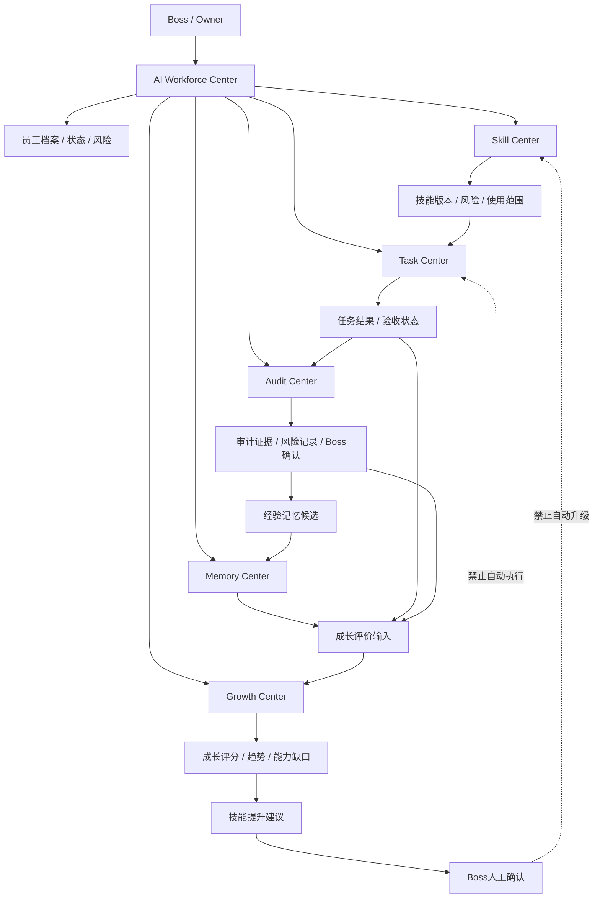

# Sprint62.42 AI员工成长系统 MVP 总体设计

文档名称：《AI Workforce Center V2 成长系统 MVP 总架构设计》

阶段：Sprint62.42

状态：设计完成，等待确认

## 1. 阶段边界

本阶段只做产品与技术架构设计。

禁止事项：

- 不写代码
- 不修改前端
- 不修改后端
- 不修改数据库
- 不创建 migration
- 不修改 Task Center 核心流程
- 不接入 Execution Engine
- 不接入 OpenClaw
- 不接入 n8n
- 不自动学习
- 不自动升级技能
- 不自动修改权限
- 不自动执行任务

Sprint62.42 只设计 AI Workforce Center V2 的成长系统 MVP，保持人工确认模式。

## 2. 产品定位

AI员工成长系统 MVP 是 AI Workforce Center V2 中用于观察 AI员工长期表现、经验沉淀、能力变化和成长建议的只读管理系统。

核心定位：

```text
AI Workforce Center 统一查看
Task Center 提供任务事实
Audit Center 提供审计证据
Memory Center 提供经验沉淀
Growth Center 提供评分与趋势
Skill Center 提供技能资产上下文
Boss 人工确认所有高风险变化
```

MVP 不负责：

- 自动创建员工
- 自动训练员工
- 自动学习修改自身
- 自动升级技能
- 自动修改权限
- 自动执行任务
- 自动调用外部平台

## 3. AI员工生命周期

### 3.1 生命周期主链路

```text
创建
↓
训练
↓
执行任务
↓
Audit记录
↓
Memory沉淀
↓
Growth评分
↓
技能提升建议
↓
Boss人工确认
```

### 3.2 阶段说明

| 阶段 | 主责中心 | 输入 | 输出 | 安全边界 |
|---|---|---|---|---|
| 创建 | AI Workforce / Organization | 员工身份、部门、岗位 | 员工档案 | 不自动创建 |
| 训练 | Skill / Knowledge / Memory | 技能、知识、历史案例 | 能力准备状态 | 不自动训练模型 |
| 执行任务 | Task Center | Boss任务、任务分配 | 任务结果 | 不接 Execution Engine |
| Audit记录 | Audit Center | 任务过程、结果、确认 | 审计证据 | 不自动处罚 |
| Memory沉淀 | Memory Center | 成功/失败案例、复盘 | 经验记忆候选 | 不自动学习 |
| Growth评分 | Growth Center | 任务、审计、记忆、技能 | 成长评分和趋势 | 不自动升级 |
| 技能提升建议 | Growth + Skill Center | 能力缺口、技能效果 | 建议草稿 | 必须 Boss 确认 |

### 3.3 生命周期状态

建议 V1/MVP 使用以下状态：

```text
profile_created
training_ready
task_active
audit_recorded
memory_candidate
growth_evaluated
suggestion_pending
boss_confirmed
```

说明：

- 状态只用于展示和分析。
- 不驱动自动执行。
- 不驱动自动权限变化。

## 4. 五大中心关系图

用户要求列出五大中心，但实际涉及六个中心：AI Workforce Center、Skill Center、Task Center、Audit Center、Memory Center、Growth Center。MVP 按六中心关系设计。



## 5. 中心职责边界

| 中心 | 职责 | 不负责 |
|---|---|---|
| AI Workforce Center | 统一展示员工、任务、能力、成长、风险 | 不替代 Task Center，不执行任务 |
| Skill Center | 管理技能资产、版本、风险和员工技能关系 | 不自动安装、不自动升级、不自动授权 |
| Task Center | 记录任务事实、状态、结果、验收和审计日志 | 不负责成长评分 |
| Audit Center | 记录证据链、风险、确认、版本追踪 | 不自动处罚、不自动封禁 |
| Memory Center | 沉淀经验、案例、复盘和上下文 | 不自动学习修改自身 |
| Growth Center | 计算评分、趋势、能力缺口、建议 | 不自动升级技能、不改权限 |

## 6. 数据流设计

### 6.1 主数据流

```text
Boss 创建或确认任务
↓
Task Center 记录任务事实
↓
AI员工提交结果
↓
Boss Review / Audit
↓
Audit Center 形成证据链
↓
Memory Center 生成经验候选
↓
Growth Center 更新评分输入
↓
AI Workforce Center 展示成长状态
↓
Boss 查看技能提升建议
```

### 6.2 数据对象流转

| 数据对象 | 产生中心 | 流向 | 用途 |
|---|---|---|---|
| EmployeeProfile | AI Workforce / Organization | Skill / Task / Audit / Growth | 员工身份和归属 |
| SkillProfile | Skill Center | Task / Audit / Growth | 技能上下文 |
| TaskResult | Task Center | Audit / Memory / Growth | 任务事实和结果 |
| AuditEvent | Audit Center | Memory / Growth / Workforce | 证据、风险、确认 |
| MemoryItem | Memory Center | Growth / Workforce | 经验、案例、复盘 |
| GrowthEvaluation | Growth Center | Workforce / Boss | 成长评分和建议 |

### 6.3 数据状态规则

| 场景 | 进入 Audit | 进入 Memory | 进入 Growth |
|---|---|---|---|
| `created` / `assigned` | 是 | 否 | 否 |
| `running` | 是 | 否 | 否 |
| `result_submitted` | 是 | 候选 | pending evidence |
| `accepted` | 是 | 成功案例候选 | 可计入评分 |
| `audited` | 是 | 可进入审核 | 可计入评分 |
| `summarized` | 是 | 可归档 | 可计入趋势 |
| `rejected` | 是 | 失败案例候选 | 风险扣分 |

### 6.4 空数据处理

MVP 必须支持：

```json
{
  "available": false,
  "reason": "no_data",
  "message": "暂无成长数据"
}
```

禁止：

- 制造假评分。
- 用 mock 数据覆盖真实空状态。
- 将待确认数据计入正式评分。

## 7. API规划

本节只做 API 规划，不新增接口。

### 7.1 成长系统总览

```text
GET /api/ai-workforce/growth-system/overview
```

用途：

- 返回成长系统整体状态。

返回草案：

```json
{
  "mode": "readonly",
  "employees": {
    "total": 0,
    "evaluated": 0,
    "pending_review": 0
  },
  "growth": {
    "average_score": null,
    "available": false,
    "top_growth_employees": []
  },
  "memory": {
    "success_cases": 0,
    "failure_cases": 0,
    "pending_candidates": 0
  },
  "audit": {
    "events": 0,
    "high_risk": 0,
    "waiting_boss_confirm": 0
  },
  "security": {
    "readonly": true,
    "execution_engine_called": false,
    "openclaw_connected": false,
    "n8n_connected": false,
    "auto_learning": false,
    "auto_skill_upgrade": false
  }
}
```

### 7.2 员工成长档案

```text
GET /api/ai-workforce/employees/{employee_id}/growth-profile
```

用途：

- 返回员工成长评分、任务表现、Memory 摘要、Audit 摘要、技能建议。

### 7.3 任务成长影响

```text
GET /api/ai-workforce/tasks/{task_id}/growth-impact
```

用途：

- 返回单个任务对员工成长评分、Memory 和 Audit 的影响。

### 7.4 技能提升建议

```text
GET /api/ai-workforce/employees/{employee_id}/skill-improvement-suggestions
```

用途：

- 返回技能提升建议草稿。

边界：

- 只读。
- 不自动升级技能。
- 不提供执行按钮。

### 7.5 Boss 待确认成长建议

```text
GET /api/ai-workforce/growth-system/waiting-confirm
```

用途：

- 展示待 Boss 确认的成长建议、Memory 候选、高风险评分变化。

## 8. 权限设计

### 8.1 角色视图

| 角色 | 可查看范围 | 可确认范围 | 禁止事项 |
|---|---|---|---|
| Boss / Owner | 全部员工成长系统 | 全部高风险建议 | 不允许自动执行 |
| Admin | 管理范围内员工 | 普通建议确认，重大事项需 Boss | 不允许改权限 |
| 部门负责人 | 本部门员工 | 部门内低风险建议 | 不允许升级技能 |
| AI员工管理员 | 员工档案和成长记录 | 无最终确认权 | 不允许授权 |
| Viewer | 只读摘要 | 无 | 不允许任何确认 |

### 8.2 权限边界

成长系统 V1/MVP 权限原则：

- 查看权限独立于执行权限。
- 技能能力不等于操作权限。
- 成长评分不等于员工等级。
- 成长建议不等于自动审批。
- Boss 确认不等于外部平台执行。

### 8.3 高风险权限规则

以下场景必须：

```json
{
  "boss_confirm": true,
  "security_audited": true
}
```

场景：

- 建议升级技能。
- 建议调整权限。
- 建议修改员工等级。
- 高风险失败案例进入正式 Memory。
- 高风险经验进入天藏知识库。
- 成长评分大幅变化并影响岗位判断。

## 9. Boss确认流程

### 9.1 标准确认流程

```text
Growth 生成建议草稿
↓
Audit 检查风险等级
↓
AI Workforce 展示待确认事项
↓
Boss 查看证据链
↓
Boss 确认 / 拒绝
↓
记录 Audit
↓
后续人工流程处理
```

### 9.2 Boss确认对象

Boss 需要确认：

- 成长评价采纳
- 技能提升建议
- Memory 候选进入正式经验
- 失败案例进入复盘库
- 高风险评分变化
- 任何涉及权限、等级、技能版本变化的建议

### 9.3 确认后边界

确认后只表示：

- 建议被 Boss 认可。
- 可以进入后续人工流程。
- 可以记录到 Audit。

确认后不表示：

- 自动升级技能。
- 自动修改权限。
- 自动启动任务。
- 自动执行外部动作。

## 10. MVP 页面结构建议

本节为后续 Sprint62.43 提供页面拆分依据，不开发。

### 10.1 AI Workforce Center 成长总览区

展示：

- 可评估员工数量
- 平均成长评分
- 待确认成长建议
- 高风险成长事件
- Memory 候选数量

### 10.2 员工详情成长区

展示：

- 当前成长评分
- 评分拆解
- 最近任务影响
- 成功案例
- 失败案例
- 技能提升建议
- Audit 证据链

### 10.3 Boss 待确认区

展示：

- 成长建议
- 技能提升建议
- 高风险 Memory 候选
- 失败案例复盘

不展示：

- 自动升级按钮
- 自动执行按钮
- 自动授权按钮

## 11. Sprint62.43 开发拆分方案

### Sprint62.43-A 后端架构设计

目标：

- 设计 Growth System MVP 后端结构。
- 明确 Router / Service / 数据来源。
- 确认复用 Sprint62.39 Task Flow API 和现有 Task Center 审计日志。

输出：

- `docs/SPRINT62_43_A_GROWTH_SYSTEM_BACKEND_DESIGN.md`

禁止：

- 写代码
- 创建 migration
- 修改数据库

### Sprint62.43-B Growth System 只读 API MVP

目标：

- 新增只读 API。
- 返回员工成长总览、任务成长影响、待确认建议。
- 数据不足时返回空状态。

建议新增：

- `backend/routers/ai_employee_growth_system.py`
- `backend/services/ai_employee_growth_system.py`
- `tests/test_ai_employee_growth_system.py`

禁止：

- 修改 Task Center 核心逻辑。
- 创建 migration。
- 接执行系统。

### Sprint62.43-C 前端产品设计

目标：

- 设计 AI Workforce Center 中成长系统页面和员工详情成长区。
- 明确 Boss / Admin / Viewer 视图差异。

输出：

- `docs/SPRINT62_43_C_GROWTH_SYSTEM_FRONTEND_DESIGN.md`

### Sprint62.43-D 前端 MVP 实现

目标：

- 新增或增强只读页面。
- 接入 Sprint62.43-B API。
- 展示成长总览、员工成长卡片、待确认事项。

禁止：

- 自动升级按钮。
- 自动执行按钮。
- 自动授权按钮。

### Sprint62.43-E 安全与回归验收

目标：

- 验证只读边界。
- 验证无数据库变更。
- 验证无 Execution Engine / OpenClaw / n8n。
- 验证 Boss 人工确认保留。
- 验证 Task Center 和 AI Workforce 现有测试不回归。

## 12. 风险分析

| 风险 | 说明 | 控制方式 |
|---|---|---|
| 成长评分被误认为员工等级 | 评分可能被误读为自动晋升依据 | 页面标注评分只作参考 |
| 技能建议被误认为升级操作 | 建议不等于执行 | 禁止升级按钮，必须 Boss 确认 |
| Memory 候选自动固化 | 经验未经审核进入正式记忆 | candidate/review/approved 状态分离 |
| waiting_confirm 进入正式评分 | 未确认结果影响成长评分 | 只作为 pending evidence |
| Audit 被用于自动处罚 | 风险记录误触发处罚 | Audit 只记录，不处罚 |
| 与 Task Center 职责重叠 | 成长系统修改任务状态 | 只读读取 Task Center |

## 13. 验收标准

Sprint62.42 通过标准：

- 只新增设计文档。
- 不修改代码。
- 不修改数据库。
- 不创建 migration。
- 不接入 Execution Engine。
- 不接入 OpenClaw。
- 不接入 n8n。
- 不自动学习。
- 不自动升级技能。
- 明确 AI员工生命周期。
- 明确六中心关系。
- 明确数据流、API、权限、Boss确认流程。
- 明确 Sprint62.43 开发拆分。

## 14. 结论

Sprint62.42 完成 AI Workforce Center V2 成长系统 MVP 总体设计。

该设计将员工生命周期、任务事实、审计证据、经验记忆、成长评分和技能提升建议整合为只读、可追溯、人工确认的 MVP 架构。

下一阶段建议进入 Sprint62.43-A，先完成 Growth System MVP 后端架构设计，再进入只读 API 实现。
