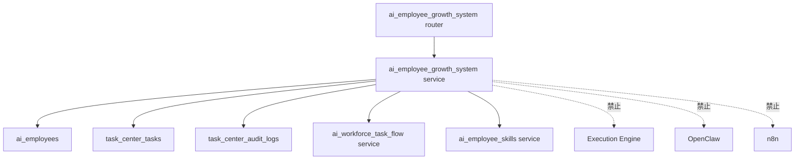

# Sprint62.43 AI员工成长系统 MVP 开发拆分设计

文档名称：《AI Workforce Growth System MVP 开发计划 V1》

阶段：Sprint62.43

状态：设计完成，等待确认

## 1. 阶段边界

本阶段只输出开发拆分设计文档。

禁止事项：

- 不写代码
- 不修改前端
- 不修改后端
- 不修改数据库
- 不创建 migration
- 不修改 Task Center 核心流程
- 不接入 Execution Engine
- 不接入 OpenClaw
- 不接入 n8n
- 不自动学习
- 不自动升级技能
- 不自动修改权限
- 不自动执行任务

Sprint62.43 基于 Sprint62.42 设计，将 AI Workforce Growth System MVP 拆分为可开发、可测试、可验收的任务包。

## 2. MVP功能范围

### 2.1 MVP目标

实现 AI Workforce Center V2 的成长系统只读 MVP，让 Boss 能查看：

- AI员工成长总览
- 单个员工成长档案
- 任务对成长评分的影响
- Audit 证据摘要
- Memory 经验沉淀摘要
- 技能提升建议草稿
- Boss 待确认成长事项

### 2.2 MVP包含

| 模块 | MVP能力 | 数据来源 |
|---|---|---|
| 成长总览 | 员工数量、可评估员工、平均评分、风险数量 | AI Workforce + Task Center |
| 员工成长档案 | 完成率、成功率、风险扣分、成长评分 | Task Center + Audit |
| 任务成长影响 | 单任务状态、验收结果、评分影响 | Task Flow API |
| Memory 摘要 | 成功案例候选、失败案例候选、经验候选 | Task Center 状态推导 |
| Audit 摘要 | 审计事件数量、Boss确认、安全审计状态 | Task Center Audit Log |
| 技能建议 | 根据任务表现生成只读建议草稿 | Skill Center + Growth 推导 |
| Boss 待确认 | waiting_confirm、建议草稿、高风险候选 | Task Flow + Growth |

### 2.3 MVP不包含

- 不创建真实 Growth 数据表。
- 不写入 Memory。
- 不写入 Audit。
- 不修改 Skill Center。
- 不修改员工等级。
- 不修改权限。
- 不创建任务。
- 不执行任务。
- 不调用外部平台。

## 3. 后端模块拆分

### 3.1 新增 Router 建议

建议新增：

```text
backend/routers/ai_employee_growth_system.py
```

职责：

- 暴露 Growth System 只读 API。
- 复用现有登录与角色校验方式。
- 不承载复杂计算逻辑。
- 不修改 Task Center 数据。

建议路由前缀：

```text
/api/ai-employee-growth-system
```

### 3.2 新增 Service 建议

建议新增：

```text
backend/services/ai_employee_growth_system.py
```

职责：

- 读取 AI员工基础数据。
- 读取 Task Center 任务和审计日志。
- 复用 `ai_workforce_task_flow` 的生命周期映射。
- 计算只读成长评分。
- 生成 Memory 候选摘要。
- 生成技能提升建议草稿。
- 返回统一空数据和安全字段。

### 3.3 模块依赖



### 3.4 复用模块

优先复用：

- `backend/routers/ai_workforce.py` 的权限模式
- `backend/services/ai_workforce_task_flow.py` 的生命周期映射
- `TaskCenterTask`
- `TaskCenterAuditLog`
- `AiEmployee`
- `backend/services/ai_employee_skills.py` 的只读技能数据

不复用：

- Execution Engine
- OpenClaw
- n8n
- 任何自动执行路由

## 4. 数据表设计建议

本节只做未来表结构建议，不创建表，不创建 migration。

### 4.1 MVP阶段

MVP 不新增数据库表。

原因：

- 当前只读评分可从 Task Center 和 Audit Log 推导。
- Memory / Growth 当前处于架构与展示阶段。
- 避免过早固化数据结构。

### 4.2 未来建议表

#### employee_growth_profiles

用途：员工成长总览。

字段建议：

| 字段 | 类型建议 | 说明 |
|---|---|---|
| id | integer | 主键 |
| employee_code | string | AI员工编号 |
| growth_score | numeric | 综合成长评分 |
| growth_level | string | 成长状态 |
| task_completion_rate | numeric | 任务完成率 |
| success_rate | numeric | 成功率 |
| risk_score | numeric | 风险分 |
| last_evaluated_at | datetime | 最近评价时间 |
| created_at | datetime | 创建时间 |
| updated_at | datetime | 更新时间 |

#### employee_growth_evaluations

用途：单次评价记录。

字段建议：

| 字段 | 类型建议 | 说明 |
|---|---|---|
| id | integer | 主键 |
| employee_code | string | AI员工编号 |
| task_id | integer | 关联任务 |
| evaluation_type | string | task / periodic |
| task_quality_score | numeric | 任务质量 |
| success_score | numeric | 成功率分 |
| user_rating_score | numeric | 用户评价 |
| skill_effectiveness_score | numeric | 技能效果 |
| risk_penalty | numeric | 风险扣分 |
| final_score | numeric | 综合评分 |
| evidence_refs_json | text | 证据引用 |
| boss_confirm | boolean | Boss确认 |
| security_audited | boolean | 安全审计 |
| created_at | datetime | 创建时间 |

#### employee_memory_candidates

用途：Memory 候选经验。

字段建议：

| 字段 | 类型建议 | 说明 |
|---|---|---|
| id | integer | 主键 |
| employee_code | string | AI员工编号 |
| task_id | integer | 关联任务 |
| candidate_type | string | success_case / failure_case / learning_record |
| status | string | candidate / reviewing / approved / rejected |
| summary | text | 摘要 |
| risk_level | string | 风险等级 |
| boss_confirm | boolean | Boss确认 |
| security_audited | boolean | 安全审计 |
| created_at | datetime | 创建时间 |

#### growth_suggestions

用途：成长建议和技能提升建议。

字段建议：

| 字段 | 类型建议 | 说明 |
|---|---|---|
| id | integer | 主键 |
| employee_code | string | AI员工编号 |
| suggestion_type | string | skill_improvement / review / risk_control |
| title | string | 建议标题 |
| reason | text | 建议原因 |
| risk_level | string | 风险等级 |
| status | string | draft / waiting_boss_confirm / confirmed / rejected |
| boss_confirm | boolean | Boss确认 |
| security_audited | boolean | 安全审计 |
| created_at | datetime | 创建时间 |

## 5. API列表

### 5.1 成长系统总览

```text
GET /api/ai-employee-growth-system/overview
```

返回：

- 员工总数
- 可评估员工数
- 平均成长评分
- 高风险成长事件
- Memory 候选数量
- 待 Boss 确认数量

### 5.2 员工成长档案

```text
GET /api/ai-employee-growth-system/employees/{employee_id}/profile
```

返回：

- 员工基础信息
- 成长评分
- 评分拆解
- 任务统计
- Audit 摘要
- Memory 摘要
- 技能建议

### 5.3 任务成长影响

```text
GET /api/ai-employee-growth-system/tasks/{task_id}/impact
```

返回：

- 任务状态
- 生命周期状态
- Boss确认状态
- 是否计入正式评分
- 评分影响
- Memory 候选类型
- Audit 证据

### 5.4 待 Boss 确认成长事项

```text
GET /api/ai-employee-growth-system/waiting-confirm
```

返回：

- 待确认任务结果
- 待确认 Memory 候选
- 待确认技能提升建议
- 高风险成长变化

### 5.5 员工技能提升建议

```text
GET /api/ai-employee-growth-system/employees/{employee_id}/skill-suggestions
```

返回：

- 技能名称
- 技能版本
- 使用次数
- 成功率
- 风险次数
- 建议类型
- 建议状态

### 5.6 统一安全字段

所有 API 必须返回：

```json
{
  "mode": "readonly",
  "security": {
    "readonly": true,
    "boss_confirm_required": true,
    "security_audited_required": true,
    "execution_engine_called": false,
    "openclaw_connected": false,
    "n8n_connected": false,
    "auto_learning": false,
    "auto_skill_upgrade": false,
    "auto_permission_change": false,
    "auto_task_execution": false
  }
}
```

## 6. 前端页面规划

### 6.1 页面文件

MVP 建议新增：

```text
frontend/ai-employee-growth-system.html
```

不改动：

- `frontend/task-center.html`
- `frontend/enterprise-brain-console.html`
- 登录页面
- Boss Dashboard

### 6.2 页面结构

```text
AI Employee Growth System
├── 顶部状态栏
│   ├── readonly模式
│   ├── 当前Sprint
│   └── 安全状态
├── 成长总览
│   ├── 员工总数
│   ├── 可评估员工
│   ├── 平均成长评分
│   ├── 高风险数量
│   └── 待Boss确认
├── 员工成长列表
│   ├── 员工名称
│   ├── 部门
│   ├── 成长评分
│   ├── 完成率
│   ├── 成功率
│   └── 风险等级
├── 任务成长影响
│   ├── 最近任务
│   ├── 生命周期状态
│   ├── 是否计入评分
│   └── Audit证据
├── Memory候选
│   ├── 成功案例候选
│   ├── 失败案例候选
│   └── 复盘候选
└── Boss待确认
    ├── 成长建议
    ├── 技能建议
    └── 高风险事项
```

### 6.3 页面交互

允许：

- 查看员工成长档案
- 查看任务影响
- 查看审计证据
- 查看 Memory 候选
- 查看待确认事项

禁止：

- 自动确认
- 自动升级技能
- 自动修改权限
- 自动执行任务
- 自动学习

### 6.4 空数据状态

必须显示：

```text
暂无成长数据
```

或：

```text
当前数据暂不可用
```

禁止：

- 使用假评分。
- 使用假员工表现。
- 用 mock 覆盖真实 API 空结果。

## 7. 测试方案

### 7.1 后端测试

建议新增：

```text
tests/test_ai_employee_growth_system.py
```

覆盖：

- API 登录鉴权
- owner / admin / boss 可访问
- viewer 只读限制或拒绝策略
- 成长总览返回结构
- 员工成长档案返回结构
- 任务影响返回结构
- waiting_confirm 不进入正式评分
- rejected 产生风险扣分
- 无任务时返回 `available=false`
- 安全字段完整
- GET 请求不改变 Task Center 任务和审计数量
- 静态扫描无 Execution Engine / OpenClaw / n8n 接入

### 7.2 前端测试

建议新增：

```text
tests/test_ai_employee_growth_system_frontend.py
```

覆盖：

- 页面文件存在
- 页面包含 Growth System 标识
- 页面包含 readonly 安全模式
- 页面包含空数据状态
- 页面不存在执行按钮
- 页面不存在自动升级按钮
- 页面不存在权限修改入口
- 页面不存在 Execution Engine / OpenClaw / n8n 入口

### 7.3 回归测试

建议执行：

```text
pytest tests/test_ai_employee_growth_system.py
pytest tests/test_ai_workforce_task_flow.py
pytest tests/test_task_center.py
pytest tests/test_ai_workforce.py
```

目标：

- 确认 Task Center 不回归。
- 确认 AI Workforce 不回归。
- 确认成长系统只读。

## 8. 安全风险

| 风险 | 说明 | 控制方式 |
|---|---|---|
| 成长评分误用为员工等级 | 分数可能被误读为自动晋升 | API 和页面标注评分只读 |
| 技能建议误用为升级动作 | 建议可能被误当作操作 | 不提供升级按钮 |
| pending 数据进入正式评分 | waiting_confirm 未确认结果影响评分 | pending evidence 独立展示 |
| Audit 被误用于自动处罚 | 风险记录可能触发处罚 | 只展示，不执行处罚 |
| Memory 候选自动学习 | 候选经验未经审核进入正式记忆 | candidate 状态必须 Boss 确认 |
| Task Center 被侵入 | 成长系统修改任务状态 | 只读 Service，无写入 |
| 执行系统误接入 | 成长建议触发执行 | 静态测试禁止相关入口 |

## 9. Sprint62.44 开发任务拆分

### Sprint62.44-A 后端只读 API 实现

目标：

- 新增 `backend/routers/ai_employee_growth_system.py`
- 新增 `backend/services/ai_employee_growth_system.py`
- 新增 `tests/test_ai_employee_growth_system.py`
- 注册 router

实现接口：

- `GET /api/ai-employee-growth-system/overview`
- `GET /api/ai-employee-growth-system/employees/{employee_id}/profile`
- `GET /api/ai-employee-growth-system/tasks/{task_id}/impact`
- `GET /api/ai-employee-growth-system/waiting-confirm`
- `GET /api/ai-employee-growth-system/employees/{employee_id}/skill-suggestions`

限制：

- 不创建数据库。
- 不创建 migration。
- 不修改 Task Center。
- 不接执行系统。

### Sprint62.44-B 前端只读页面实现

目标：

- 新增 `frontend/ai-employee-growth-system.html`
- 新增 `tests/test_ai_employee_growth_system_frontend.py`

页面能力：

- 成长总览
- 员工成长列表
- 任务影响
- Memory 候选
- Boss 待确认
- 空数据 / 错误状态

限制：

- 不修改 Boss Dashboard。
- 不修改 Task Center。
- 不新增执行按钮。

### Sprint62.44-C 数据联动增强

目标：

- 将 Growth System 页面与 AI Workforce Center 建立入口关系。
- 只做入口和只读数据联动。

限制：

- 不重构现有页面。
- 不改变登录系统。
- 不改变权限系统。

### Sprint62.44-D 安全验收

目标：

- Docker Python 3.12 执行 pytest。
- 检查无数据库变更。
- 检查无 Execution Engine / OpenClaw / n8n。
- 检查无自动学习 / 自动升级 / 自动执行。
- 输出 Sprint62.44 验收报告。

## 10. Boss人工确认模式

MVP 中所有高风险动作均只能展示为待确认事项。

必须人工确认：

- 技能提升建议
- 成长评分大幅变化
- 高风险 Memory 候选
- 失败案例复盘
- 涉及权限、等级、岗位、技能版本的任何建议

标准字段：

```json
{
  "boss_confirm_required": true,
  "security_audited_required": true,
  "action_available": false
}
```

说明：

- MVP 不提供确认写接口。
- MVP 不执行建议。
- MVP 不改变状态。

## 11. 验收标准

Sprint62.43 通过标准：

- 只新增设计文档。
- 不修改代码。
- 不修改数据库。
- 不创建 migration。
- 不接入 Execution Engine。
- 不接入 OpenClaw。
- 不接入 n8n。
- 不自动学习。
- 不自动升级技能。
- 明确 MVP 功能范围。
- 明确后端、前端、测试、安全拆分。
- 明确 Sprint62.44 开发任务。

## 12. 结论

Sprint62.43 完成 AI Workforce Growth System MVP 开发拆分设计。

建议 Sprint62.44 先实现后端只读 API，再实现前端只读页面，最后进行安全验收。整个开发过程必须继续保持 Boss 人工确认模式，不进入自动执行或自动升级阶段。
