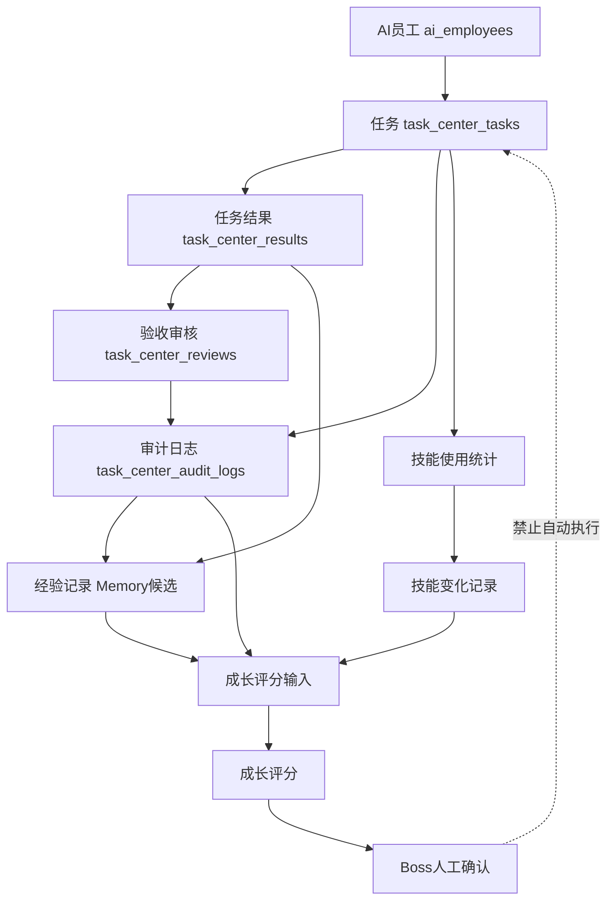

# Sprint62.47 AI员工成长系统数据链路设计报告

文档名称：《Sprint62.47 AI员工成长系统数据链路设计报告》

阶段：Sprint62.47

状态：设计完成，等待确认

## 1. 阶段边界

本阶段只做设计，不修改代码。

禁止事项：

- 不写代码
- 不修改前端
- 不修改后端
- 不修改数据库
- 不创建 migration
- 不修改 Task Center
- 不修改登录系统
- 不修改 Boss Dashboard
- 不接入 Execution Engine
- 不接入 OpenClaw
- 不接入 n8n
- 不自动执行
- 不自动升级
- 不自动学习

Sprint62.47 输出后续 Sprint62.48 的开发依据。

## 2. 已读取与检查范围

已检查：

- `README.md`
- `backend/`
- `frontend/`
- `tests/`
- `docs/SPRINT62_46_ACCEPTANCE_REPORT.md`
- `docs/SPRINT62_46_AI_EMPLOYEE_GROWTH_SYSTEM_MVP_DEVELOPMENT_PLAN.md`

检查结论：

- 当前项目已具备 AI员工基础档案、Task Center、Skill Center、Audit 日志、Growth System MVP API 和 Growth System 前端页面。
- Sprint62.46-A 已完成 `frontend/ai-employee-growth-system.html`，并只读接入 Growth System API。
- 当前成长系统数据主要从现有表和现有只读 service 推导，不依赖新增表。
- 下一阶段可增强数据链路，但仍应保持只读 GET 接口。

## 3. 当前已有数据来源分析

### 3.1 AI员工数据来源

主要来源：

- `ai_employees`
- `backend/models.py::AiEmployee`
- `backend/routers/ai_workforce.py`
- `backend/services/ai_employee_growth_system.py`

核心字段：

| 字段 | 用途 |
|---|---|
| `employee_code` | 员工唯一编号 |
| `employee_name` | 员工名称 |
| `legion` | 部门 / 组织归属 |
| `duty` | 岗位职责 |
| `status` | 员工状态 |
| `task_types` | 技能 / 任务类型线索 |
| `default_permissions` | 默认权限展示 |
| `is_legacy` | 是否历史员工 |

当前能力：

- 可读取员工列表。
- 可按 `employee_code` 关联任务。
- 可展示员工部门、岗位、状态。
- 可作为 Growth Profile 的基础身份数据。

边界：

- 不自动创建员工。
- 不自动修改员工状态。
- 不自动修改权限。

### 3.2 Task Center 数据来源

主要来源：

- `task_center_tasks`
- `task_center_results`
- `task_center_reviews`
- `task_center_audit_logs`
- `backend/routers/task_center.py`
- `backend/services/ai_workforce_task_flow.py`

核心字段：

| 表 | 字段 | 用途 |
|---|---|---|
| `task_center_tasks` | `id`, `title`, `status`, `assigned_ai_employee_code` | 任务事实和员工关联 |
| `task_center_tasks` | `priority`, `source`, `created_at`, `updated_at` | 风险、来源、时间 |
| `task_center_results` | `result_content`, `ai_employee_code` | 任务输出 |
| `task_center_reviews` | `review_type`, `review_status`, `comment` | 验收和审计 |
| `task_center_audit_logs` | `action`, `from_status`, `to_status` | 状态流转证据 |

当前任务生命周期映射：

| Growth生命周期 | Task Center状态 |
|---|---|
| `created` | `created`, `split` |
| `processing` | `assigned`, `running`, `in_progress` |
| `waiting_confirm` | `result_submitted`, `review_pending` |
| `approved` | `accepted`, `audited` |
| `completed` | `summarized`, `completed` |
| `rejected` | `rejected`, `failed`, `blocked` |

边界：

- Growth System 只读 Task Center。
- 不修改任务状态。
- 不新增任务。
- 不绕过 Boss 确认。

### 3.3 Skill Center 数据来源

主要来源：

- `backend/services/ai_employee_skills.py`
- `backend/routers/ai_employee_skills.py`
- `backend/routers/sop_skill_center.py`
- `AiEmployee.task_types`
- Task Center 的任务成功/失败统计

当前可用信息：

| 数据 | 用途 |
|---|---|
| skill_id | 技能唯一标识 |
| skill_name | 技能名称 |
| skill_version | 技能版本 |
| employee_id | 员工绑定 |
| usage_count | 使用次数 |
| success_rate | 成功率 |
| risk_level | 风险等级 |
| audit_status | 审核状态 |

当前能力：

- 可读取员工技能列表。
- 可通过任务状态推导技能使用效果。
- 可生成只读技能提升建议。

边界：

- 技能建议不等于技能升级。
- 技能不等于权限。
- 不自动安装技能。
- 不自动调用技能。
- 不自动升级技能。

### 3.4 Audit 数据来源

主要来源：

- `task_center_audit_logs`
- `task_center_reviews`
- `backend/routers/employee_activity_log.py`
- `backend/routers/employee_activity_trace.py`
- `backend/services/ai_employee_growth_system.py`

当前审计事件：

| action | 含义 |
|---|---|
| `task_created` | 任务创建 |
| `ai_employee_assigned` | 分配AI员工 |
| `task_started` | 任务开始 |
| `result_submitted` | 结果提交 |
| `acceptance_reviewed` | 验收审核 |
| `task_audited` | 安全审计 |
| `task_summarized` | 总结归档 |

当前能力：

- 可为任务成长影响提供证据链。
- 可为 Growth 评分提供 Boss 确认和安全审计依据。
- 可识别 rejected / failed / blocked 风险任务。

边界：

- Audit 不自动处罚。
- Audit 不自动修改权限。
- Audit 不自动修复。
- Audit 不自动执行。

### 3.5 Memory 数据来源

当前直接数据来源：

- Growth System 由 Task Center 状态推导 Memory 候选。
- `backend/services/ai_employee_growth_system.py` 中的 `memory_summary` / `memory_candidate`。
- `frontend/ai-employee-growth-system.html` 只读展示 Memory 候选摘要。

当前可推导类型：

| 类型 | 来源 |
|---|---|
| `success_case` | accepted / audited / summarized / completed |
| `failure_case` | rejected / failed / blocked |
| `pending_review` | result_submitted / review_pending |
| `task_memory` | 任务事实记录 |

当前能力：

- 可展示成功案例候选数量。
- 可展示失败案例候选数量。
- 可展示待确认候选数量。

边界：

- 当前不写入正式 Memory 表。
- 不自动学习。
- 不自动进入知识库。
- 不自动生成 SOP。

## 4. 数据关系设计

### 4.1 AI员工成长数据链路

```text
员工
 ↓
任务
 ↓
任务结果
 ↓
审核
 ↓
经验记录
 ↓
技能变化
 ↓
成长评分
```

### 4.2 关系图



### 4.3 数据职责

| 环节 | 数据职责 | 当前实现 |
|---|---|---|
| 员工 | 身份、部门、岗位、状态 | `ai_employees` |
| 任务 | 任务事实、状态、分配 | `task_center_tasks` |
| 任务结果 | 输出内容、附件、提交人 | `task_center_results` |
| 审核 | 验收、安全审计 | `task_center_reviews` |
| 经验记录 | 成功/失败/待确认候选 | 当前推导，未来可建表 |
| 技能变化 | 使用次数、成功率、风险 | 当前推导，未来可建表 |
| 成长评分 | 完成率、成功率、风险扣分 | 当前推导，未来可持久化 |

### 4.4 状态规则

| Task状态 | Memory影响 | Skill影响 | Growth影响 |
|---|---|---|---|
| `created` / `split` | 无 | 无 | 不计分 |
| `assigned` / `running` | 无 | 使用中 | 不计正式分 |
| `result_submitted` | pending_review | 待评估 | pending evidence |
| `accepted` | success_case候选 | 成功+1 | 正向计分 |
| `audited` | success_case候选 | 成功+1 | 正向计分 |
| `summarized` | success_case归档候选 | 成功+1 | 正向计分 |
| `rejected` | failure_case候选 | 失败+1 | 风险扣分 |
| `failed` / `blocked` | failure_case候选 | 失败+1 | 风险扣分 |

## 5. API规划

本阶段只设计 GET 接口。

禁止：

- POST
- PATCH
- DELETE
- 自动执行
- 自动升级
- 自动学习
- 自动改权限

### 5.1 员工成长总览

```text
GET /api/ai-employee-growth-system/overview
```

当前已实现，可继续作为总览入口。

后续增强字段建议：

```json
{
  "employees": {
    "total": 0,
    "evaluated": 0,
    "pending_review": 0
  },
  "growth": {
    "average_score": null,
    "top_growth_employees": []
  },
  "memory": {
    "success_cases": 0,
    "failure_cases": 0,
    "pending_candidates": 0
  },
  "audit": {
    "events": 0,
    "high_risk": 0,
    "waiting_boss_confirm": 0
  }
}
```

### 5.2 员工成长详情

```text
GET /api/ai-employee-growth-system/employees/{employee_id}/profile
```

当前已实现，可继续增强。

建议增加：

- 最近任务影响列表
- 最近 Audit 事件
- Memory 候选列表
- 技能变化摘要
- 评分版本信息

### 5.3 技能变化记录

```text
GET /api/ai-employee-growth-system/employees/{employee_id}/skill-changes
```

用途：

- 展示员工技能使用变化。
- 展示技能成功率变化。
- 展示风险变化。

返回草案：

```json
{
  "mode": "readonly",
  "employee": {},
  "skill_changes": [
    {
      "skill_id": "backend",
      "skill_name": "后端API技能",
      "usage_count": 3,
      "success_count": 2,
      "failure_count": 1,
      "success_rate": 0.66,
      "risk_level": "medium",
      "change_type": "usage_stat_changed",
      "updated_at": "2026-07-10T00:00:00Z"
    }
  ],
  "security": {}
}
```

说明：

- MVP 可由现有 `ai_employee_skills` 只读数据推导。
- 不写入 Skill Center。
- 不升级技能。

### 5.4 任务影响分析

```text
GET /api/ai-employee-growth-system/tasks/{task_id}/impact
```

当前已实现，可继续增强。

建议增强：

- 任务结果摘要
- 审核记录摘要
- Audit证据链
- Memory候选类型
- Skill影响
- Growth score delta

### 5.5 员工任务影响列表

```text
GET /api/ai-employee-growth-system/employees/{employee_id}/task-impacts
```

用途：

- 展示某员工所有任务对成长评分的影响。

返回：

- task_id
- task_title
- task_status
- lifecycle_status
- included_in_growth_score
- score_delta
- memory_candidate_type
- risk_level

### 5.6 员工 Memory 候选

```text
GET /api/ai-employee-growth-system/employees/{employee_id}/memory-candidates
```

用途：

- 展示成功案例候选、失败案例候选、待确认经验。

要求：

- 只读。
- 不自动进入正式知识库。
- 不自动学习。

### 5.7 员工 Audit 摘要

```text
GET /api/ai-employee-growth-system/employees/{employee_id}/audit-summary
```

用途：

- 展示员工相关任务审计事件。
- 展示 Boss 确认、安全审计、高风险数量。

### 5.8 安全字段标准

所有 GET 接口必须返回：

```json
{
  "mode": "readonly",
  "security": {
    "readonly": true,
    "boss_confirm": true,
    "boss_confirm_required": true,
    "security_audited": true,
    "security_audited_required": true,
    "execution_engine_called": false,
    "openclaw_connected": false,
    "n8n_connected": false,
    "auto_execute": false,
    "auto_learning": false,
    "auto_skill_upgrade": false,
    "auto_permission_change": false
  }
}
```

## 6. 数据库影响分析

### 6.1 当前可复用已有表

| 表 | 用途 |
|---|---|
| `ai_employees` | 员工身份、部门、岗位、状态 |
| `task_center_tasks` | 任务事实、状态、员工关联 |
| `task_center_results` | 任务结果 |
| `task_center_reviews` | 验收与安全审计 |
| `task_center_audit_logs` | 审计证据链 |
| `employee_growth` | 已存在成长记录表，可未来只读接入 |
| `skill_suggestions` | 已存在技能建议表，可未来只读接入 |
| `risk_events` | 风险事件，可用于风险扣分 |
| `review_analysis` | 复盘分析，可用于 Memory 候选 |

### 6.2 当前阶段不需要新增表

Sprint62.47 只是设计。

Sprint62.48 如果只做只读增强，也不需要新增表。

原因：

- 任务事实可从 Task Center 获取。
- 审计证据可从 `task_center_audit_logs` 获取。
- 技能统计可从任务和 `ai_employee_skills` 推导。
- Memory 候选可从任务状态推导。
- Growth 评分可从任务、审计、技能数据推导。

### 6.3 未来可能需要新增表

仅作为未来设计，不在本阶段创建。

#### employee_growth_snapshots

用途：

- 保存每次成长评分快照。
- 支持趋势图。
- 支持评分版本。

#### employee_memory_candidates

用途：

- 保存 Memory 候选。
- 支持审核状态。
- 支持进入天藏知识库前的人工流程。

#### employee_skill_change_logs

用途：

- 记录技能使用变化。
- 记录成功率变化。
- 记录技能风险变化。

#### employee_growth_evidence_refs

用途：

- 记录成长评分证据来源。
- 关联 task、audit、memory、skill。

### 6.4 migration 边界

本阶段禁止：

- 创建 migration。
- 修改 `models.py`。
- 修改现有表结构。
- 写入真实 Growth / Memory / Skill 数据。

## 7. 安全边界

必须保持：

```json
{
  "boss_confirm": true,
  "security_audited": true,
  "readonly": true
}
```

禁止接入：

- Execution Engine
- OpenClaw
- n8n

禁止能力：

- 自动执行任务。
- 自动确认任务。
- 自动升级技能。
- 自动修改权限。
- 自动学习写入 Memory。
- 自动发布知识。
- 自动修改员工状态。

高风险场景：

| 场景 | 要求 |
|---|---|
| 失败案例进入 Memory | `boss_confirm=true`, `security_audited=true` |
| 技能升级建议 | `boss_confirm=true`, `security_audited=true` |
| 成长评分影响岗位判断 | `boss_confirm=true`, `security_audited=true` |
| 高风险任务影响 Growth | `boss_confirm=true`, `security_audited=true` |

## 8. Sprint62.48 开发建议

Sprint62.48 可拆分为：

### Sprint62.48-A 后端 GET API 增强

只新增 GET：

- `GET /api/ai-employee-growth-system/employees/{employee_id}/skill-changes`
- `GET /api/ai-employee-growth-system/employees/{employee_id}/task-impacts`
- `GET /api/ai-employee-growth-system/employees/{employee_id}/memory-candidates`
- `GET /api/ai-employee-growth-system/employees/{employee_id}/audit-summary`

限制：

- 不新增 POST。
- 不新增 migration。
- 不修改 Task Center。

### Sprint62.48-B 前端数据链路展示增强

增强：

- `frontend/ai-employee-growth-system.html`

展示：

- 技能变化记录
- 任务影响列表
- Memory 候选列表
- Audit 摘要

限制：

- 不增加执行按钮。
- 不增加确认按钮。
- 不增加升级按钮。

### Sprint62.48-C 测试与安全验收

新增 / 更新：

- `tests/test_ai_employee_growth_system.py`
- `tests/test_ai_employee_growth_system_frontend.py`

覆盖：

- GET 结构。
- 空数据。
- 只读边界。
- 无 Execution Engine / OpenClaw / n8n。
- 无 POST。
- Task Center 不回归。

## 9. 验收标准

Sprint62.47 通过标准：

- 只新增设计报告。
- 不修改代码。
- 不修改数据库。
- 不创建 migration。
- 明确当前已有数据来源。
- 明确 AI员工成长数据链路。
- 只规划 GET API。
- 明确数据库影响。
- 明确安全边界。
- 输出 Sprint62.48 开发依据。

## 10. 结论

Sprint62.47 完成 AI员工成长系统数据链路设计。

当前系统已经具备从 AI员工、Task Center、Skill Center、Audit日志推导 Growth评分和 Memory候选的基础。下一阶段应优先做只读 GET API 增强，继续保持 Boss 人工确认模式，不进入自动执行、自动学习或自动升级阶段。
