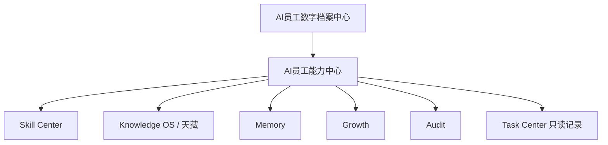
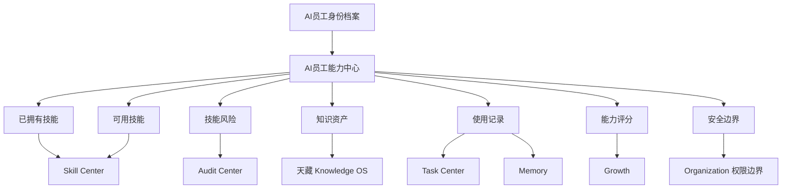
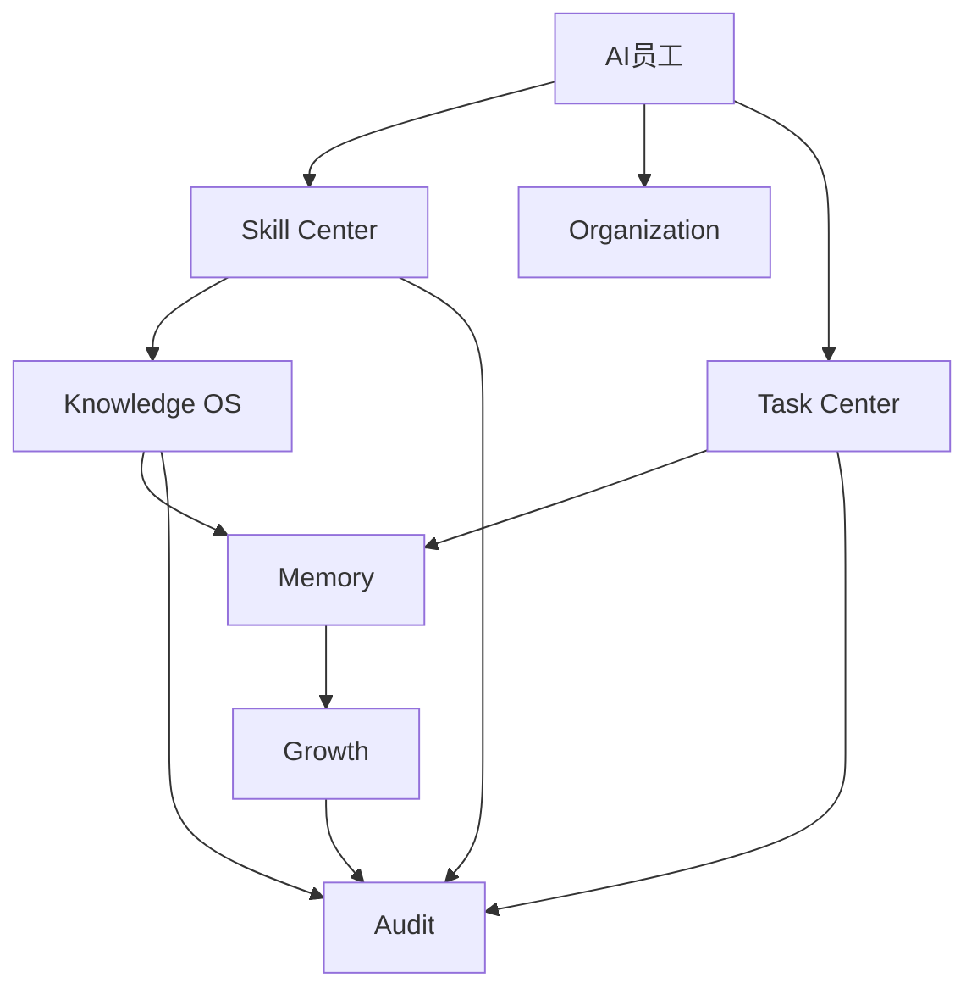
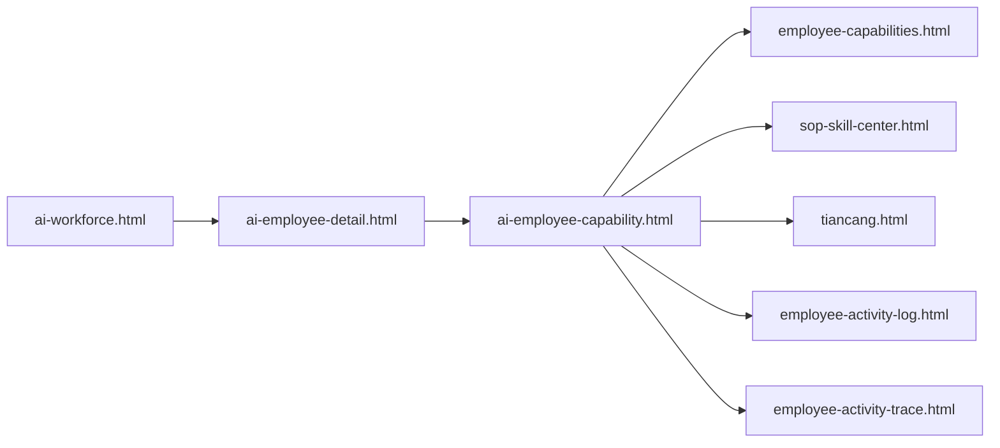

# Sprint62.4-A AI员工能力中心 Skill + Knowledge 联动产品架构设计

## 1. 阶段边界

本阶段只做产品架构设计。

禁止：

- 不写代码
- 不修改前端
- 不修改后端
- 不创建数据库
- 不创建 migration
- 不接 OpenClaw
- 不接 n8n
- 不接 Execution Engine

目标：

设计 AI员工能力中心，让每个 AI员工在身份档案之上，形成可查看、可审计、可追溯的技能档案、知识档案和能力边界。

## 2. 产品定位

页面名称：

```text
AI员工能力中心
```

建议页面：

```text
frontend/ai-employee-capability.html
```

定位：

- AI员工能力中心是 AI员工数字档案中心的能力下钻页。
- AI员工能力中心只负责展示员工“会什么、依赖什么知识、风险在哪里、边界是什么”。
- AI员工能力中心不负责安装技能、不负责升级技能、不负责技能授权、不负责执行技能。

与现有系统关系：



## 3. 总体架构



设计原则：

- 身份档案回答“这个 AI员工是谁”。
- 技能档案回答“这个 AI员工会什么”。
- 知识档案回答“这个 AI员工依据什么工作”。
- 能力边界回答“这个 AI员工不能做什么、需要谁确认”。
- 权限系统回答“这个 AI员工被允许做什么”，不能由技能中心自动推导。

## 4. Skill 能力模型

Skill 是可复用的能力资产，不等于权限。

字段草案：

| 字段 | 说明 | V1 来源建议 | 空数据展示 |
| --- | --- | --- | --- |
| `skill_id` | 技能唯一标识 | 未来 Skill Profile | 暂无数据 |
| `skill_name` | 技能名称 | `SOP / Skill Center`、员工 `task_types` 映射 | 暂无数据 |
| `skill_version` | 技能版本 | 未来 Skill Version | 暂无数据 |
| `skill_status` | 技能状态 | draft / review / testing / active / deprecated | 暂无数据 |
| `skill_category` | 技能分类 | business / data / strategy / tech / ai | 暂无数据 |
| `applicable_employees` | 适用员工 | `suitable_employees` | 暂无数据 |
| `applicable_task_types` | 适用任务类型 | `suitable_task_types` | 暂无数据 |
| `risk_level` | 风险等级 | low / medium / high / critical | low |
| `review_status` | 审核状态 | pending / approved / rejected / expired | 暂无数据 |
| `permission_required` | 所需权限说明 | Organization 只读引用 | 暂无数据 |
| `boss_confirm_required` | 是否需要老板确认 | 安全规则 | false |
| `security_audit_required` | 是否需要安全审计 | 安全规则 | false |

技能状态建议：

```text
draft 草稿
review 审核中
testing 测试中
active 正式
deprecated 废弃
```

技能风险分级：

| 风险等级 | 含义 | 页面展示 | 处理原则 |
| --- | --- | --- | --- |
| low | 只读分析、文本整理、低风险建议 | 绿色 | 可展示、不可自动执行 |
| medium | 影响业务判断或生成对外材料 | 黄色 | 需要人工复核 |
| high | 涉及权限、部署、价格、广告、客户、合同等 | 红色 | `boss_confirm=true` + `security_audited=true` |
| critical | 可能影响资金、账号、生产环境或法律风险 | 深红 | V1 只展示，禁止调用 |

核心规则：

```text
技能可见 ≠ 技能可用
技能可用 ≠ 权限已授予
技能熟练 ≠ 可自动执行
高级技能 ≠ 高权限
```

## 5. Knowledge 能力模型

Knowledge 是员工使用的知识依据，包括 SOP、Prompt、案例、知识文章和课程资料。

字段草案：

| 字段 | 说明 | V1 来源建议 | 空数据展示 |
| --- | --- | --- | --- |
| `knowledge_id` | 知识资产唯一标识 | `KnowledgeArticle` / `SopLibrary` / `PromptLibrary` | 暂无数据 |
| `knowledge_type` | 资产类型 | SOP / Prompt / article / case / course | 暂无数据 |
| `title` | 资产标题 | 天藏 | 暂无数据 |
| `version` | 知识版本 | 未来 Knowledge Version | 暂无数据 |
| `source` | 来源 | 上传、人工整理、任务沉淀、复盘沉淀 | 暂无数据 |
| `owner_department` | 归属部门 | 天藏 / Organization | 暂无数据 |
| `status` | 状态 | draft / reviewed / active / archived | 暂无数据 |
| `updated_at` | 更新时间 | 现有更新时间字段 | 暂无数据 |
| `linked_skill_ids` | 关联技能 | 未来关联表 | 暂无数据 |
| `linked_employee_ids` | 关联员工 | 未来关联表 | 暂无数据 |
| `sensitivity_level` | 敏感等级 | public / internal / sensitive / restricted | internal |

知识类型：

```text
SOP
Prompt
成功案例
失败案例
知识文章
课程资料
Bug案例
业务方案
```

展示原则：

- SOP 展示标题、部门、状态、适用任务和安全规则。
- Prompt 展示标题、类型、变量、输出格式和安全说明。
- 案例展示摘要、结果、风险和复盘结论。
- 不展示完整 Prompt 原文。
- 不展示敏感资料全文。
- 不自动生成、发布、改写知识。

## 6. 员工能力页面结构

建议页面：

```text
frontend/ai-employee-capability.html
```

页面结构：

```text
员工能力中心
├── 顶部员工能力摘要
│   ├── 员工名称
│   ├── 员工编号
│   ├── 部门
│   ├── 岗位
│   ├── 能力评分
│   ├── 风险等级
│   └── readonly 安全模式
├── 已拥有技能
│   ├── 技能名称
│   ├── 技能版本
│   ├── 技能状态
│   ├── 熟练度
│   └── 审核状态
├── 可用技能
│   ├── 适用任务
│   ├── 所需知识
│   ├── 所需权限
│   └── 可见但未授权提示
├── 技能风险
│   ├── 风险等级
│   ├── 高风险原因
│   ├── boss_confirm=true
│   └── security_audited=true
├── 知识资产
│   ├── SOP
│   ├── Prompt
│   ├── 案例
│   └── 知识版本
├── 使用记录
│   ├── 最近任务
│   ├── 最近调用知识
│   ├── 最近复盘
│   └── 最近风险
├── 能力评分
│   ├── 成功率
│   ├── 人工评价
│   ├── 稳定性
│   ├── 安全合规
│   └── 复盘质量
└── 安全边界
    ├── 技能不等于权限
    ├── 禁止自动安装
    ├── 禁止自动升级
    └── 禁止自动执行
```

页面导航建议：

```text
AI Workforce Center
  ↓
AI员工数字档案中心
  ↓
AI员工能力中心
```

V1 页面交互：

- 支持按员工编号读取能力档案。
- 支持切换“已拥有技能 / 可用技能 / 知识资产 / 风险 / 使用记录”视图。
- 只提供“查看”“返回”“筛选”类动作。
- 不提供“安装技能”“升级技能”“授权技能”“执行技能”动作。

## 7. 数据关系设计

总体数据关系：



逻辑关系：

| 关系 | 说明 |
| --- | --- |
| AI员工 -> Skill Center | 员工拥有哪些技能、技能版本、技能状态、技能风险 |
| Skill Center -> Knowledge OS | 技能依赖哪些 SOP、Prompt、案例和知识文章 |
| Knowledge OS -> Memory | 知识使用后沉淀成功案例、失败案例和复盘经验 |
| Memory -> Growth | 经验沉淀用于成长评分和能力建议 |
| Growth -> Audit | 评分变化、能力建议、高风险变化进入审计 |
| Task Center -> Memory | 任务结果沉淀为经验记录 |
| Organization -> AI员工 | 员工归属、岗位、权限边界只读引用 |

现有可复用来源：

| 来源 | 当前用途 | 本页面读取方式 |
| --- | --- | --- |
| `AiEmployee` | 员工身份、部门、职责、任务类型、默认权限 | 只读 |
| `/api/ai-employees/{employee_id}/detail` | 员工详情聚合 | 只读 |
| `/api/employee-capabilities/*` | 能力档案、模型、工具、风险、缺失能力 | 只读 |
| `/api/sop-skill-center/*` | SOP、Skill、Prompt 绑定 | 只读 |
| `KnowledgeArticle` | 知识文章 | 只读 |
| `SopLibrary` | SOP 资产 | 只读 |
| `PromptLibrary` | Prompt 资产 | 只读摘要 |
| `TaskCenterTask` | 使用记录和历史任务 | 只读 |
| `TaskCenterAuditLog` | 审计记录 | 只读 |
| `EmployeeGrowth` / `EmployeeScore` | 未来成长评分 | 只读 |

## 8. 能力评分模型

V1 只设计，不计算生产评分。

建议模型：

```text
capability_score =
  skill_success_rate * 0.25
+ manual_review_score * 0.20
+ task_quality_score * 0.20
+ knowledge_usage_score * 0.15
+ safety_compliance_score * 0.15
+ review_learning_score * 0.05
```

评分字段：

| 字段 | 说明 | 来源 |
| --- | --- | --- |
| `skill_success_rate` | 相关技能任务成功率 | Task Center |
| `manual_review_score` | 人工评价 | Review / Growth |
| `task_quality_score` | 输出质量 | Task Review |
| `knowledge_usage_score` | SOP/Prompt/案例使用规范性 | Knowledge OS / Audit |
| `safety_compliance_score` | 是否遵守权限和确认规则 | Audit |
| `review_learning_score` | 失败复盘与改进质量 | Memory / Growth |

评分展示：

- V1 页面只展示已有统计和“暂无数据”。
- 不自动改变员工等级。
- 不自动推荐高风险技能。
- 不自动授权。

## 9. 安全设计

强制原则：

```text
技能不等于权限
知识可见不等于可执行
能力评分不等于自动升级
技能版本不等于自动发布
员工熟练不等于自动授权
```

禁止：

- 自动安装技能
- 自动升级技能
- 自动执行技能
- 自动绑定高风险技能
- 自动修改员工权限
- 自动修改员工等级
- 自动发布 Prompt
- 自动发布 SOP
- 自动调用外部平台
- 自动进入 Execution Engine

高风险要求：

```text
boss_confirm=true
security_audited=true
```

高风险场景：

| 场景 | 规则 |
| --- | --- |
| 涉及资金、广告、价格、账号、合同、客户隐私 | 只展示，必须人工确认 |
| 涉及部署、数据库、权限、生产环境 | 只展示，必须安全审计 |
| 涉及外部平台操作 | V1 禁止接入 |
| 涉及完整 Prompt 或敏感知识 | 默认脱敏或摘要展示 |

页面安全要求：

- 页面顶部显示 readonly 安全模式。
- 高风险技能显示“需要审核”。
- 权限字段只显示范围摘要，不提供修改入口。
- 所有按钮限定为查看、筛选、返回。
- 不出现执行、启动、自动运行、授权、升级入口。

## 10. 与现有页面关系



复用策略：

- 复用 AI Workforce Center 的只读安全风格。
- 复用 AI员工详情页的身份卡和空数据规范。
- 复用 Employee Capability Center 的能力字段和风险口径。
- 复用 SOP / Skill 绑定中心的只读 Skill、SOP、Prompt 摘要。
- 复用天藏的知识资产摘要，不展示敏感正文。

不做：

- 不替换现有 `employee-capabilities.html`。
- 不重构 `ai-employee-detail.html`。
- 不修改现有员工 API。
- 不新增数据库表。

## 11. Sprint62.4-B 开发建议

开发顺序建议：

1. 新增静态页面骨架
   - 修改文件：`frontend/ai-employee-capability.html`
   - 风险：低，只新增页面
   - 测试：页面存在、核心文案存在、危险入口不存在
   - 验收：能通过静态前端测试

2. 新增只读聚合 API
   - 修改文件：可新增 `backend/routers/ai_employee_capability.py`
   - 风险：中，只读聚合需避免触碰现有写接口
   - 测试：API 返回结构、readonly、安全字段、空数据兼容
   - 验收：不创建数据库、不修改员工模型、不调用执行相关模块

3. 页面接入只读数据
   - 修改文件：`frontend/ai-employee-capability.html`
   - 风险：低，前端展示和异常状态
   - 测试：API 失败、空数据、字段缺失、高风险提示
   - 验收：无假数据、无执行按钮、无权限修改入口

4. 详情页联动入口
   - 修改文件：`frontend/ai-employee-detail.html`
   - 风险：低，只增加“查看能力”类入口
   - 测试：跳转链接存在、无执行语义
   - 验收：不影响员工详情页现有测试

## 12. 验收标准

Sprint62.4-A 设计验收通过条件：

- 已定义 Skill 能力模型。
- 已定义 Knowledge 能力模型。
- 已定义员工能力页面结构。
- 已定义 Skill + Knowledge + Memory + Growth + Audit 数据关系。
- 已明确技能不等于权限。
- 已明确禁止自动安装、自动升级、自动执行技能。
- 未写代码。
- 未修改前端。
- 未修改后端。
- 未创建数据库或 migration。
- 未接 OpenClaw、n8n、Execution Engine。

