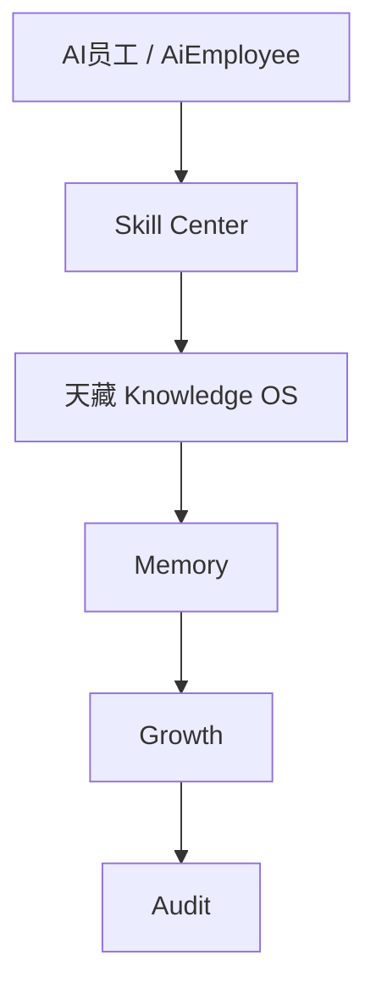

# Sprint62.4-C AI员工能力中心统一 API 架构设计

## 1. 阶段边界

本阶段只做技术架构设计。

禁止：

- 不写代码
- 不创建数据库
- 不创建 migration
- 不修改已有 API
- 不接 OpenClaw
- 不接 n8n
- 不接 Execution Engine

目标：

设计统一 AI员工能力 API，为 `AI员工能力中心` 提供单员工维度的只读聚合数据。

## 2. 统一接口设计

接口：

```http
GET /api/ai-employee-capability/{employee_id}/overview
```

定位：

- 单个 AI员工能力档案只读聚合接口。
- 聚合员工基础信息、技能列表、知识资产、SOP、Prompt、成长评分、风险状态和审计状态。
- 只读取现有模块数据，不创建任务、不修改员工、不修改权限、不触发执行。

路径参数：

| 参数 | 类型 | 必填 | 说明 |
| --- | --- | --- | --- |
| `employee_id` | string | 是 | 建议兼容 `employee_code`，例如 `tianshang`、`tianwang` |

查询参数建议：

| 参数 | 类型 | 默认 | 说明 |
| --- | --- | --- | --- |
| `include_empty` | boolean | true | 是否返回空数据结构 |
| `include_recent` | boolean | true | 是否返回最近使用记录 |
| `knowledge_limit` | integer | 10 | 知识资产摘要数量上限 |
| `audit_limit` | integer | 10 | 审计记录数量上限 |

权限：

- V1 建议复用 AI员工查看权限和能力中心查看权限。
- `owner` / `admin` 可查看完整摘要。
- `viewer` 是否可查看需按现有权限模型决定，默认建议只允许已授权查看范围。
- 未登录返回 `401`。
- 无权限返回 `403`。

## 3. 返回结构

顶层结构：

```json
{
  "mode": "readonly",
  "employee_id": "tianshang",
  "employee": {},
  "skills": [],
  "knowledge": {},
  "sops": [],
  "prompts": [],
  "growth": {},
  "risk": {},
  "audit": {},
  "relationships": {},
  "data_sources": [],
  "security": {}
}
```

字段说明：

| 字段 | 类型 | 说明 |
| --- | --- | --- |
| `mode` | string | 固定 `readonly` |
| `employee_id` | string | 请求员工编号 |
| `employee` | object | 员工基础信息 |
| `skills` | array | 员工相关 Skill 能力列表 |
| `knowledge` | object | 知识资产统计和摘要 |
| `sops` | array | 关联 SOP |
| `prompts` | array | 关联 Prompt 摘要 |
| `growth` | object | 成长评分和能力评价 |
| `risk` | object | 风险状态 |
| `audit` | object | 审计状态 |
| `relationships` | object | 能力关系链路 |
| `data_sources` | array | 本次聚合读取的数据来源 |
| `security` | object | 安全边界和禁止动作标记 |

## 4. JSON 示例

```json
{
  "mode": "readonly",
  "employee_id": "tianshang",
  "employee": {
    "employee_code": "tianshang",
    "employee_name": "天商：商品运营中心",
    "department": "业务部门",
    "role": "商品运营AI经理",
    "status": "active",
    "current_status": "idle"
  },
  "skills": [
    {
      "skill_id": "skill_market_analysis",
      "skill_name": "市场分析",
      "skill_version": "暂无数据",
      "skill_status": "readonly_configured",
      "risk_level": "medium",
      "review_status": "requires_security_review",
      "applicable_task_types": ["ecommerce_operation", "data_analysis"],
      "permission_required": ["report_generation"],
      "boss_confirm_required": true,
      "security_audit_required": true,
      "can_auto_execute": false
    }
  ],
  "knowledge": {
    "summary": {
      "article_count": 0,
      "sop_count": 1,
      "prompt_count": 0,
      "case_count": 0,
      "last_updated_at": null
    },
    "assets": []
  },
  "sops": [
    {
      "sop_code": "sop_ecommerce_operation",
      "sop_name": "电商运营分析 SOP",
      "status": "readonly_configured",
      "version": "暂无数据",
      "requires_boss_confirmation": true,
      "requires_security_audit": true
    }
  ],
  "prompts": [],
  "growth": {
    "available": false,
    "capability_score": null,
    "success_rate": null,
    "manual_review_score": null,
    "safety_compliance_score": null,
    "notes": "暂无数据"
  },
  "risk": {
    "risk_level": "medium",
    "risk_reasons": ["存在中风险业务分析技能"],
    "high_risk_requires": {
      "boss_confirm": true,
      "security_audited": true
    }
  },
  "audit": {
    "audit_status": "readonly_audited",
    "recent_logs": [],
    "risk_count": 0,
    "last_audited_at": null
  },
  "relationships": {
    "flow": [
      "AI员工",
      "Skill Center",
      "Knowledge OS",
      "Memory",
      "Growth",
      "Audit"
    ],
    "skill_not_permission": true,
    "capability_not_execution_permission": true
  },
  "data_sources": [
    "ai_employees",
    "employee_capabilities",
    "sop_skill_center",
    "knowledge_articles",
    "sop_library",
    "prompt_library",
    "task_center_audit_logs"
  ],
  "security": {
    "readonly": true,
    "auto_install_skill": false,
    "auto_upgrade_skill": false,
    "auto_execute_skill": false,
    "permission_system_modified": false,
    "execution_engine_called": false,
    "openclaw_connected": false,
    "n8n_connected": false,
    "external_api_called": false,
    "boss_confirm_required_for_high_risk": true,
    "security_audited_required_for_high_risk": true
  }
}
```

## 5. 数据来源设计

数据链路：



具体来源映射：

| 返回区块 | 现有来源 | 说明 |
| --- | --- | --- |
| `employee` | `AiEmployee`、`/api/ai-employees/{employee_id}/detail` | 员工名称、编号、部门、岗位、状态 |
| `skills` | `/api/employee-capabilities/employees/{employee_code}`、`/api/sop-skill-center/skills` | 员工能力档案和 Skill 只读配置 |
| `knowledge.summary` | `KnowledgeArticle`、`SopLibrary`、`PromptLibrary`、`BugCase` | 知识资产数量和更新时间 |
| `sops` | `/api/sop-skill-center/sops`、`SopLibrary` | SOP 摘要和安全规则 |
| `prompts` | `/api/sop-skill-center/prompts`、`PromptLibrary` | Prompt 摘要，不返回完整正文 |
| `growth` | `EmployeeGrowth`、`EmployeeScore`、Task Center 成功率 | V1 可返回 `available=false` |
| `risk` | `employee_capabilities.risks`、Skill 风险等级、审计日志 | 高风险原因和确认要求 |
| `audit` | `TaskCenterAuditLog`、员工活动日志 | 最近审计记录和风险数量 |
| `relationships` | 静态关系配置 | 页面关系链路 |
| `security` | 固定安全声明 + 聚合检查 | 确认未执行、未接外部自动化 |

聚合策略：

1. 先读取员工基础信息。
2. 读取能力档案，获取员工能力分类、风险等级、允许工具摘要、禁止动作摘要。
3. 读取 Skill Center，按 `suitable_employees`、`task_types` 或员工 `task_types` 关联技能。
4. 读取 SOP / Prompt，只返回摘要、状态、安全规则和版本占位。
5. 读取 Knowledge OS 统计，不返回敏感正文和完整 Prompt。
6. 读取 Growth / Memory 可用摘要；无数据返回空结构。
7. 读取 Audit 日志，只返回只读审计摘要。
8. 统一生成 `security` 标记。

## 6. 接口结构设计

建议后续实现文件：

```text
backend/routers/ai_employee_capability.py
```

建议注册：

```text
app.include_router(ai_employee_capability.router)
```

建议函数结构：

```text
GET /api/ai-employee-capability/{employee_id}/overview
├── require_ai_employee_capability_read()
├── load_employee_profile()
├── load_employee_skills()
├── load_employee_knowledge_assets()
├── load_employee_sops()
├── load_employee_prompts()
├── load_growth_summary()
├── load_risk_summary()
├── load_audit_summary()
└── build_security_payload()
```

错误处理：

| 场景 | 状态码 | 返回 |
| --- | --- | --- |
| 未登录 | `401` | 现有认证错误 |
| 无权限 | `403` | `no ai employee capability permission` |
| 员工不存在 | `404` | `employee not found` |
| 部分来源无数据 | `200` | 对应区块返回空数组或 `available=false` |
| 部分来源异常 | `200` 或 `503` | V1 建议接口内部降级并标记 `data_sources_unavailable` |

空数据规则：

- 列表字段返回 `[]`。
- 统计字段返回 `0`。
- 未接入模块返回 `available=false`。
- 文本字段返回 `暂无数据` 或 `null`，由前端统一展示。
- 不用模拟数据填充。

## 7. 安全边界

必须明确：

```text
技能 ≠ 权限
能力 ≠ 执行权限
知识可见 ≠ 可调用
成长评分 ≠ 自动升级
风险低 ≠ 可自动执行
```

禁止：

- 自动安装技能
- 自动升级技能
- 自动执行技能
- 自动绑定高风险技能
- 自动修改员工权限
- 自动修改员工状态
- 自动创建任务
- 自动调用外部平台
- 自动调用 Execution Engine
- 自动连接 OpenClaw
- 自动连接 n8n

高风险要求：

```text
boss_confirm=true
security_audited=true
```

安全返回字段必须包含：

```json
{
  "readonly": true,
  "auto_install_skill": false,
  "auto_upgrade_skill": false,
  "auto_execute_skill": false,
  "permission_system_modified": false,
  "execution_engine_called": false,
  "openclaw_connected": false,
  "n8n_connected": false,
  "external_api_called": false
}
```

## 8. 风险点

| 风险 | 说明 | 控制方式 |
| --- | --- | --- |
| Skill 被误解为权限 | 页面看到技能后误认为可执行 | 返回 `skill_not_permission=true` |
| 能力中心误接执行链路 | 未来可能为了演示调用执行接口 | 明确禁止调用 Execution Engine |
| Prompt 敏感内容泄露 | PromptLibrary 可能含完整模板 | 只返回摘要、变量、输出格式和安全说明 |
| 知识资产越权 | 不同部门知识权限未完善 | V1 只读且按角色/部门权限过滤 |
| 高风险技能展示不足 | 用户看不到风险原因 | 返回 `risk_reasons` 和高风险确认要求 |
| 空数据被误当系统故障 | 未接入 Growth/Memory 时为空 | 返回 `available=false` 和 data_sources |
| 修改已有 API 引发回归 | 直接改员工详情或 Skill API | 新增独立统一 API，不修改已有 API |

## 9. 测试方案

建议新增测试文件：

```text
tests/test_ai_employee_capability_api.py
```

测试用例：

1. 未登录访问
   - 请求：`GET /api/ai-employee-capability/tianshang/overview`
   - 期望：`401`

2. 无权限访问
   - 使用未授权角色
   - 期望：`403`

3. 员工不存在
   - 请求不存在员工编号
   - 期望：`404`

4. 返回结构完整
   - 期望包含：
     - `mode`
     - `employee`
     - `skills`
     - `knowledge`
     - `sops`
     - `prompts`
     - `growth`
     - `risk`
     - `audit`
     - `relationships`
     - `data_sources`
     - `security`

5. 安全字段固定
   - 期望：
     - `security.readonly == true`
     - `security.auto_install_skill == false`
     - `security.auto_upgrade_skill == false`
     - `security.auto_execute_skill == false`
     - `security.execution_engine_called == false`
     - `security.openclaw_connected == false`
     - `security.n8n_connected == false`

6. 空数据兼容
   - 在无 SOP、Prompt、Growth、Memory 数据时
   - 期望接口仍返回 `200`
   - 对应区块为空数组、`0` 或 `available=false`

7. 不调用危险模块
   - 静态测试确认新增 router 不 import：
     - `execution_engine`
     - `OpenClaw`
     - `n8n`
   - 不出现执行类路径：
     - `/api/execution`
     - `/api/brain/start`

8. Prompt 脱敏
   - 确认返回中不包含完整 Prompt 原文、密钥、授权头。

## 10. 验收标准

Sprint62.4-C 通过条件：

- 已设计统一接口 `GET /api/ai-employee-capability/{employee_id}/overview`。
- 已定义完整返回结构和 JSON 示例。
- 已定义数据来源链路：AI员工 → Skill Center → 天藏 Knowledge OS → Memory → Growth → Audit。
- 已明确 `技能 ≠ 权限`、`能力 ≠ 执行权限`。
- 已明确禁止自动安装、自动升级、自动执行技能。
- 已输出风险点和测试方案。
- 未写代码。
- 未创建数据库或 migration。
- 未修改已有 API。
- 未接 OpenClaw、n8n、Execution Engine。

