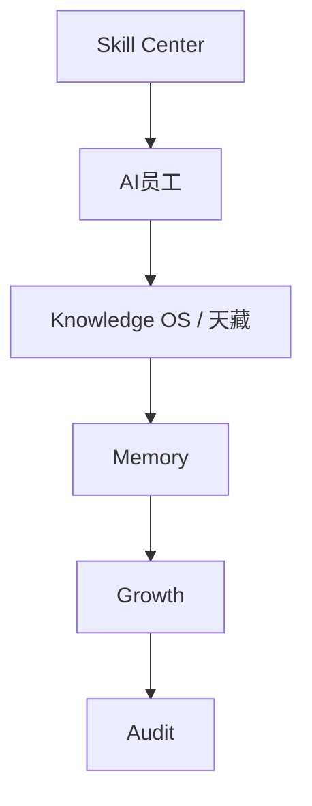

# Sprint62.5-A Skill Center V1 产品架构设计

## 1. 阶段边界

本阶段只做产品架构设计。

禁止：

- 不写代码
- 不修改前端
- 不修改后端
- 不创建数据库
- 不创建 migration
- 不接 OpenClaw
- 不接 n8n
- 不接 Execution Engine

目标：

设计天统AI Skill Center V1，作为 AI员工技能资产管理中心。

## 2. 产品定位

产品名称：

```text
Skill Center V1
```

建议首页：

```text
frontend/skill-center.html
```

建议详情页：

```text
frontend/skill-detail.html
```

定位：

- Skill Center 是天统AI的技能资产管理中心。
- Skill Center 管理技能的定义、版本、状态、适用员工、风险等级、审核状态和使用记录。
- Skill Center 只管理“能力资产”，不直接授予权限，不执行任务，不调用工具。

和现有系统关系：

- 现有 `sop-skill-center.html` 偏向 SOP / Skill / Prompt 的绑定关系展示。
- 新的 `skill-center.html` 面向老板和管理员，提供 Skill 资产总览。
- 新的 `skill-detail.html` 面向单个技能，展示版本、说明、输入输出、风险和使用记录。
- V1 先复用现有 `SOP / Skill 绑定中心` 数据口径，不重构既有页面。

## 3. Skill Center 首页设计

页面：

```text
frontend/skill-center.html
```

页面结构：

```text
Skill Center 首页
├── 顶部状态栏
│   ├── Skill Center V1
│   ├── 当前组织
│   ├── 技能数量
│   └── readonly安全模式
├── 技能总览
│   ├── 技能数量
│   ├── 技能分类
│   ├── 技能状态
│   ├── 风险等级
│   ├── 使用员工
│   └── 审核状态
├── 技能列表
│   ├── 技能名称
│   ├── 技能版本
│   ├── 技能分类
│   ├── 当前状态
│   ├── 风险等级
│   ├── 审核状态
│   ├── 使用员工数
│   └── 详情入口
├── 筛选区
│   ├── 分类筛选
│   ├── 状态筛选
│   ├── 风险筛选
│   └── 审核状态筛选
└── 安全边界
    ├── 技能只是能力资产
    ├── 技能不等于权限
    ├── 禁止自动安装技能
    ├── 禁止自动升级技能
    └── 禁止自动执行技能
```

技能总览指标：

| 指标 | 说明 | V1 来源建议 |
| --- | --- | --- |
| 技能数量 | Skill 总数 | `/api/sop-skill-center/overview.total_skills` |
| 技能分类 | business / data / strategy / tech / ai 等 | Skill `skill_category` |
| 技能状态 | draft / review / approved / deprecated | V1 可映射 `current_status` |
| 风险等级 | low / medium / high / critical | `safety_level` |
| 使用员工 | 适用员工数量或已绑定员工数 | `suitable_employees` / employee bindings |
| 审核状态 | pending / approved / rejected / expired | V1 由确认、天检、天监规则推导 |

首页交互：

- 支持查看技能列表。
- 支持筛选技能分类、状态、风险和审核状态。
- 支持进入技能详情页。
- 只提供“查看”“筛选”“进入详情”。
- 不提供“安装”“升级”“执行”“授权”。

## 4. 技能详情页设计

页面：

```text
frontend/skill-detail.html
```

页面结构：

```text
技能详情页
├── 技能基础信息
│   ├── 技能名称
│   ├── 技能编号
│   ├── 技能版本
│   ├── 技能状态
│   └── 技能说明
├── 输入输出
│   ├── 输入要求
│   ├── 输出格式
│   ├── 适用任务类型
│   └── 依赖数据 / 依赖知识
├── 使用员工
│   ├── 适用员工
│   ├── 已绑定员工
│   ├── 部门分布
│   └── 员工能力等级
├── 风险等级
│   ├── 风险等级
│   ├── 风险原因
│   ├── 所需审核
│   └── 高风险确认要求
├── 审核记录
│   ├── 审核状态
│   ├── 审核人
│   ├── 审核时间
│   └── 审核备注
├── 使用记录
│   ├── 使用次数
│   ├── 成功次数
│   ├── 失败次数
│   ├── 最近使用任务
│   └── 最近风险记录
└── 安全边界
    ├── readonly
    ├── can_auto_execute=false
    ├── boss_confirm=true
    └── security_audited=true
```

技能详情字段：

| 字段 | 说明 | V1 来源建议 |
| --- | --- | --- |
| `skill_code` | 技能编号 | `/api/sop-skill-center/skills` |
| `skill_name` | 技能名称 | Skill 配置 |
| `skill_version` | 技能版本 | V1 显示“暂无数据”，后续版本体系补齐 |
| `description` | 技能说明 | Skill `description` |
| `input_requirements` | 输入要求 | SOP required_inputs / Skill required_tools |
| `output_format` | 输出格式 | Prompt output_format / Skill expected output |
| `suitable_employees` | 使用员工 | Skill suitable_employees |
| `risk_level` | 风险等级 | Skill safety_level |
| `review_status` | 审核状态 | 由 boss/test/security/deploy flags 推导 |
| `usage_records` | 使用记录 | Task Center / Audit / Growth 后续只读聚合 |

## 5. 技能生命周期设计

生命周期状态：

```text
draft
  ↓
review
  ↓
approved
  ↓
deprecated
```

状态定义：

| 状态 | 含义 | 页面展示 | 允许动作 |
| --- | --- | --- | --- |
| `draft` | 草稿技能，尚未完成审核 | 草稿 | V1 只查看 |
| `review` | 审核中，需要人工确认 | 审核中 | V1 只查看 |
| `approved` | 已批准，可被员工能力档案引用 | 已批准 | V1 只查看 |
| `deprecated` | 废弃技能，不建议继续使用 | 已废弃 | V1 只查看 |

状态变化原则：

- V1 不提供状态变更入口。
- 技能状态变化必须由后续独立审批流程处理。
- 高风险技能进入 `approved` 前必须满足：

```text
boss_confirm=true
security_audited=true
```

状态不能由 AI 自动改变。

## 6. 技能安全模型

核心原则：

```text
技能只是能力资产
技能 ≠ 权限
技能可见 ≠ 可用
技能已批准 ≠ 可自动执行
技能高熟练度 ≠ 高权限
```

禁止：

- 自动安装技能
- 自动升级技能
- 自动执行技能
- 自动授权技能
- 自动绑定高风险技能
- 自动修改员工权限
- 自动修改技能状态
- 自动进入 Execution Engine
- 自动连接 OpenClaw
- 自动连接 n8n

高风险控制：

| 风险等级 | 处理方式 |
| --- | --- |
| low | 只读展示，可进入详情 |
| medium | 展示风险说明，需要人工复核 |
| high | 必须 `boss_confirm=true` + `security_audited=true` |
| critical | V1 只展示，不允许任何自动化入口 |

安全字段建议：

```json
{
  "readonly": true,
  "skill_is_permission": false,
  "auto_install_skill": false,
  "auto_upgrade_skill": false,
  "auto_execute_skill": false,
  "permission_system_modified": false,
  "execution_engine_called": false,
  "openclaw_connected": false,
  "n8n_connected": false
}
```

## 7. 与系统关系

总体关系：



模块边界：

| 模块 | 与 Skill Center 的关系 | 边界 |
| --- | --- | --- |
| AI员工 | 员工引用技能，展示适用员工和绑定关系 | 不自动给员工授权 |
| Knowledge OS | 技能关联 SOP、Prompt、案例和知识文章 | 不自动发布知识 |
| Memory | 技能使用后的成功/失败经验沉淀 | 不自动学习执行 |
| Growth | 技能使用效果进入成长评分 | 不自动升级员工 |
| Audit | 技能状态、风险和调用记录进入审计 | 不自动封禁或改权限 |
| Task Center | 未来提供技能使用记录 | 不修改任务状态 |
| Orchestrator | 未来只读读取技能能力用于推荐 | 不调用技能执行 |
| Execution Engine | V1 不连接 | 禁止自动执行 |

## 8. 数据结构草案

仅设计，不建表。

```text
Skill
├── skill_code
├── skill_name
├── skill_category
├── skill_version
├── skill_status
├── description
├── input_requirements
├── output_format
├── suitable_employees
├── suitable_task_types
├── required_knowledge
├── risk_level
├── review_status
├── requires_boss_confirmation
├── requires_security_audit
├── can_auto_execute=false
└── updated_at
```

技能详情关联：

```text
Skill
├── SkillVersion[]
├── SkillEmployeeBinding[]
├── SkillKnowledgeLink[]
├── SkillReviewRecord[]
├── SkillUsageRecord[]
└── SkillRiskRecord[]
```

V1 先使用现有只读来源：

- `/api/sop-skill-center/overview`
- `/api/sop-skill-center/skills`
- `/api/sop-skill-center/skills/{skill_code}`
- `/api/sop-skill-center/employees`
- `/api/sop-skill-center/task-types`
- `/api/sop-skill-center/security-rules`

## 9. 页面与 API 设计建议

V1 页面：

| 页面 | 作用 | 说明 |
| --- | --- | --- |
| `frontend/skill-center.html` | Skill Center 首页 | 技能总览、筛选、列表 |
| `frontend/skill-detail.html` | 技能详情页 | 单个技能的完整只读档案 |

V1 API 建议：

```text
GET /api/skill-center/overview
GET /api/skill-center/skills
GET /api/skill-center/skills/{skill_code}
```

设计原则：

- 统一 API 可以包装现有 `sop-skill-center`，但不修改已有 API。
- 返回必须包含 `readonly=true`。
- 返回必须包含安全字段。
- 无数据返回空数组、`0` 或 `暂无数据`，不制造假数据。

## 10. 测试方案

后续开发建议测试：

1. 首页文件存在
   - 检查 `frontend/skill-center.html` 存在。

2. 详情页文件存在
   - 检查 `frontend/skill-detail.html` 存在。

3. 首页核心结构
   - 检查技能总览、技能数量、技能分类、技能状态、风险等级、使用员工、审核状态。

4. 详情页核心结构
   - 检查技能名称、技能版本、技能说明、输入输出、使用员工、风险等级、审核记录、使用记录。

5. 安全入口检查
   - 不存在安装、升级、执行、授权、权限修改入口。
   - 不存在 `/api/execution`、OpenClaw、n8n 相关入口。

6. API 安全结构
   - `readonly=true`
   - `auto_install_skill=false`
   - `auto_upgrade_skill=false`
   - `auto_execute_skill=false`
   - `execution_engine_called=false`

7. 空数据兼容
   - 无 Skill 数据时显示“暂无数据”。

## 11. 验收标准

Sprint62.5-A 通过条件：

- 已设计 Skill Center 首页 `frontend/skill-center.html`。
- 已设计技能详情页 `frontend/skill-detail.html`。
- 已定义技能生命周期：`draft`、`review`、`approved`、`deprecated`。
- 已明确技能安全模型。
- 已明确技能只是能力资产。
- 已明确禁止自动安装、自动升级、自动执行技能。
- 已设计 Skill Center → AI员工 → Knowledge OS → Memory → Growth → Audit 系统关系。
- 未写代码。
- 未修改前端。
- 未修改后端。
- 未创建数据库或 migration。
- 未接 OpenClaw、n8n、Execution Engine。

