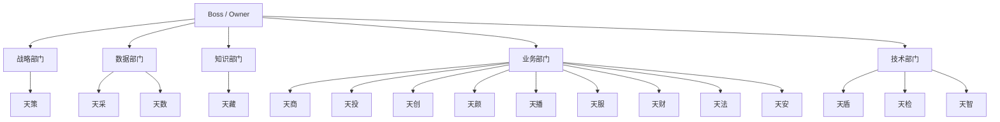
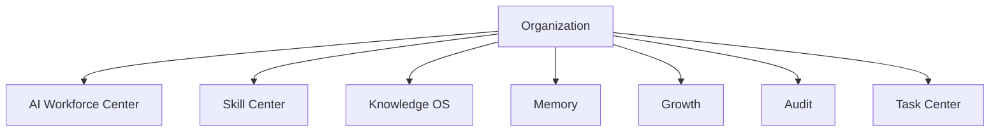

# Sprint62.6-A Organization 组织权限中心 V1 产品架构设计

## 1. 阶段边界

本阶段只做产品架构设计。

禁止：

- 不写代码
- 不修改前端
- 不修改后端
- 不创建数据库
- 不创建 migration
- 不接真实权限控制
- 不接 OpenClaw
- 不接 n8n
- 不接 Execution Engine

目标：

设计天统AI Organization 组织权限中心，作为 AI企业操作系统的组织管理层。

## 2. 产品定位

产品名称：

```text
Organization 组织权限中心 V1
```

建议页面：

```text
frontend/organization.html
```

定位：

- Organization 是 AI企业的组织管理层。
- V1 只展示组织结构、部门归属、岗位体系、角色定义、权限范围、技能访问范围和审计关系。
- V1 不接真实权限控制，不修改已有权限系统，不提供权限变更入口。

负责：

- AI员工组织关系
- 部门结构
- 岗位体系
- 角色定义
- 权限展示
- 技能访问范围
- 审计关系

不负责：

- 修改权限
- 自动授权
- 自动创建角色
- 自动创建员工
- 自动调整组织关系
- 自动执行动作

## 3. 现有基础

当前项目已有 Organization 雏形：

| 模块 | 当前能力 |
| --- | --- |
| `frontend/dashboard/organization.html` | 只读组织架构页面 |
| `backend/employee_organization/organization_center.py` | 组织中心聚合 |
| `backend/employee_organization/department_system.py` | 部门、负责人、员工聚合 |
| `backend/employee_organization/org_relationships.py` | 上下级和协作关系 |
| `backend/employee_organization/organization_permissions.py` | 组织权限矩阵 |
| `backend/models.py` | `Role`、`Permission`、`User`、`AiEmployee` 基础模型 |

V1 设计原则：

- 复用现有组织雏形。
- 不替换现有 `/dashboard/organization.html`。
- 新页面 `frontend/organization.html` 作为企业大脑的 Organization 正式入口。
- 所有数据均以只读聚合方式展示。

## 4. 页面设计

页面：

```text
frontend/organization.html
```

页面结构：

```text
Organization 组织权限中心
├── 顶部状态栏
│   ├── Organization V1
│   ├── 当前组织
│   ├── 部门数量
│   ├── AI员工数量
│   └── readonly安全模式
├── 企业组织树
│   ├── Boss
│   ├── 战略部门
│   ├── 数据部门
│   ├── 知识部门
│   ├── 业务部门
│   └── 技术部门
├── AI部门列表
│   ├── 部门名称
│   ├── 部门负责人
│   ├── 员工数量
│   ├── 当前任务数
│   └── 能力标签
├── AI员工列表
│   ├── 员工名称
│   ├── 员工编号
│   ├── 所属部门
│   ├── 岗位
│   ├── 状态
│   └── 负责人
├── 岗位展示
│   ├── 岗位名称
│   ├── 岗位职责
│   ├── 能力要求
│   └── 风险等级
├── 角色展示
│   ├── 企业总控
│   ├── 部门负责人
│   ├── 专业员工
│   ├── 审计员工
│   └── 观察者
├── 权限范围展示
│   ├── 查看范围
│   ├── 数据范围
│   ├── 技能访问范围
│   ├── 知识访问范围
│   └── 审批范围
└── 安全边界
    ├── 只读展示
    ├── 不修改权限
    ├── 不自动授权
    ├── 不创建角色
    └── 不执行动作
```

### 4.1 企业组织树

V1 组织树：



### 4.2 AI部门列表

字段：

| 字段 | 说明 | 来源建议 |
| --- | --- | --- |
| `department_id` | 部门标识 | V1 可由部门名称生成 |
| `department_name` | 部门名称 | `AiEmployee.legion` / 静态部门映射 |
| `leader_employee_code` | 部门负责人编号 | `DEPARTMENT_LEADS` |
| `leader_employee_name` | 部门负责人名称 | `AiEmployee` |
| `employee_count` | 员工数量 | `AiEmployee` 聚合 |
| `active_task_count` | 当前任务数 | `TaskCenterTask` 只读聚合 |
| `capability_tags` | 能力标签 | Employee Capability |
| `readonly` | 只读标记 | 固定 true |

### 4.3 AI员工列表

字段：

| 字段 | 说明 | 来源建议 |
| --- | --- | --- |
| `employee_code` | 员工编号 | `AiEmployee.employee_code` |
| `employee_name` | 员工名称 | `AiEmployee.employee_name` |
| `department` | 所属部门 | `AiEmployee.legion` |
| `position` | 岗位 | `AiEmployee.duty` |
| `status` | 当前状态 | `AiEmployee.status` |
| `manager_employee_code` | 负责人编号 | Organization Relationships |
| `role_code` | 组织角色 | Organization Permission Matrix |
| `permission_scope` | 权限范围摘要 | `AiEmployee.default_permissions` / Role Permission |

### 4.4 岗位展示

岗位体系：

| 岗位 | 定义 | 权限原则 |
| --- | --- | --- |
| 企业总控 AI | 统筹企业大脑和跨部门协作 | 只读展示，不能自动扩大权限 |
| 部门负责人 AI | 负责部门内工作协调和建议汇总 | 岗位不等于权限 |
| 专业员工 AI | 承担具体专业分析与产出 | 技能不等于权限 |
| 审计员工 AI | 负责风险、合规、审计检查 | 审计不等于处置 |
| 观察者 AI | 只读观察和报告 | 不能修改状态 |

### 4.5 角色展示

角色类型：

```text
owner
admin
operator
viewer
top_dispatcher
department_leader
regular_ai_employee
audit_ai_employee
```

角色展示原则：

- Role 是访问控制抽象。
- Position 是组织岗位。
- Skill 是能力资产。
- Permission 是独立授权。

必须明确：

```text
岗位 ≠ 权限
角色 ≠ 技能
技能 ≠ 权限
等级 ≠ 自动授权
```

### 4.6 权限范围展示

权限展示维度：

| 权限维度 | 示例 | V1 行为 |
| --- | --- | --- |
| 查看权限 | 可查看企业 / 部门 / 自身 | 只读展示 |
| 数据权限 | 可查看哪些数据域 | 只读展示 |
| 技能访问范围 | 可见哪些 Skill | 只读展示 |
| 知识访问范围 | 可见哪些知识资产 | 只读展示 |
| 审批权限 | 是否可参与审核 | 只读展示 |
| 任务范围 | 可查看哪些 Task Center 数据 | 只读展示 |

V1 禁止：

- 修改权限
- 新增权限
- 删除权限
- 分配角色
- 调整角色
- 自动授权

## 5. 数据模型设计

只设计，不创建数据库。

### 5.1 Organization

```text
Organization
├── organization_id
├── organization_name
├── owner_user_id
├── status
├── readonly_mode
├── created_at
└── updated_at
```

说明：

- 表示企业级组织实体。
- V1 可默认单组织：`天统AI`。
- 不在本阶段建表。

### 5.2 Department

```text
Department
├── department_id
├── organization_id
├── department_code
├── department_name
├── parent_department_id
├── leader_employee_code
├── department_type
├── status
├── risk_level
├── created_at
└── updated_at
```

部门类型：

```text
strategy
data
knowledge
business
technology
audit
finance
legal
security
```

### 5.3 Role

```text
Role
├── role_id
├── role_code
├── role_name
├── role_type
├── description
├── status
├── created_at
└── updated_at
```

角色类型：

```text
system_role
business_role
organization_role
audit_role
viewer_role
```

### 5.4 Permission

```text
Permission
├── permission_id
├── permission_code
├── permission_name
├── permission_type
├── resource_type
├── action_type
├── risk_level
├── requires_boss_confirm
├── requires_security_audit
├── status
├── created_at
└── updated_at
```

权限类型：

```text
view
analyze
suggest
review
approve
execute
admin
```

V1 只展示 `view / analyze / suggest / review` 等摘要，不触发真实权限控制。

### 5.5 Employee Scope

```text
EmployeeScope
├── scope_id
├── employee_code
├── organization_id
├── department_id
├── role_code
├── position_code
├── data_scope
├── skill_scope
├── knowledge_scope
├── task_scope
├── audit_scope
├── created_at
└── updated_at
```

说明：

- 描述 AI员工在组织中的可见范围。
- V1 只做展示，不写入、不变更。

## 6. 与现有系统关系



关系说明：

| 系统 | 关系 | 边界 |
| --- | --- | --- |
| AI Workforce Center | 展示员工归属、部门、岗位、状态 | 不创建员工 |
| Skill Center | 展示员工技能访问范围 | 不自动绑定技能 |
| Knowledge OS | 展示知识访问范围 | 不自动发布知识 |
| Memory | 展示组织经验归属 | 不自动学习执行 |
| Growth | 展示员工成长与岗位关系 | 不自动升职或授权 |
| Audit | 展示组织变更、权限访问、风险审计关系 | 不自动处置 |
| Task Center | 展示任务归属和部门任务范围 | 不修改任务状态 |

## 7. 权限安全边界

V1 只展示：

- 谁拥有权限
- 谁可以查看
- 谁属于哪个部门
- 谁负责哪个部门
- 谁与谁协作
- 哪些技能/知识/任务范围可见

禁止：

- 修改权限
- 自动授权
- 自动创建角色
- 自动创建部门
- 自动创建员工
- 自动任命负责人
- 自动调整上下级
- 自动移动员工
- 自动执行动作
- 自动调用 Execution Engine
- 自动连接 OpenClaw
- 自动连接 n8n

高风险组织变化必须：

```text
boss_confirm=true
security_audited=true
```

安全字段建议：

```json
{
  "readonly": true,
  "permission_system_modified": false,
  "role_created": false,
  "permission_granted": false,
  "employee_created": false,
  "department_created": false,
  "organization_relation_modified": false,
  "execution_engine_called": false,
  "openclaw_connected": false,
  "n8n_connected": false
}
```

## 8. V1 / V2 / V3 路线规划

### V1：只读组织权限中心

目标：

- 展示企业组织树。
- 展示 AI部门列表。
- 展示 AI员工列表。
- 展示岗位、角色、权限范围。
- 展示技能访问范围和审计关系。

边界：

- 不接真实权限控制。
- 不修改权限。
- 不创建角色。
- 不自动授权。

### V2：组织权限数据产品化

目标：

- 建立正式 Organization API。
- 建立部门、岗位、角色、权限的结构化只读 API。
- 与 AI Workforce Center、Skill Center、Audit Center 完成统一只读联动。

边界：

- 仍不提供自动授权。
- 权限变更必须走审批流程设计。

### V3：审批驱动的权限治理

目标：

- 支持权限变更申请。
- 支持组织关系变更申请。
- 支持审计中心审批记录。

边界：

- 所有变更必须人工审批。
- 高风险必须 `boss_confirm=true` 和 `security_audited=true`。
- 不允许 AI 自己提升权限。

## 9. 后续开发建议

Sprint62.6-B 可做只读页面骨架：

```text
frontend/organization.html
```

建议测试：

- 页面存在。
- 页面包含企业组织树、部门列表、员工列表、岗位、角色、权限范围。
- 不存在权限修改、授权、创建角色、创建员工、执行动作入口。
- 页面显示 `readonly安全模式`。

Sprint62.6-C 可设计统一只读 API：

```text
GET /api/organization/overview
```

数据来源：

- `AiEmployee`
- `Role`
- `Permission`
- `employee_organization/*`
- `TaskCenterTask`
- `Audit Log`

## 10. 验收标准

Sprint62.6-A 通过条件：

- 已生成设计文档。
- 已设计 `frontend/organization.html`。
- 已覆盖企业组织树、AI部门列表、AI员工列表、岗位展示、角色展示、权限范围展示。
- 已设计 Organization、Department、Role、Permission、Employee Scope 数据模型草案。
- 已说明与 AI Workforce Center、Skill Center、Knowledge OS、Memory、Growth、Audit、Task Center 的关系。
- 已明确 V1 只展示，不修改权限、不自动授权、不创建角色、不执行动作。
- 已给出 V1 / V2 / V3 路线规划。
- 未写代码。
- 未修改前端或后端。
- 未创建数据库或 migration。
- 未影响现有系统。

