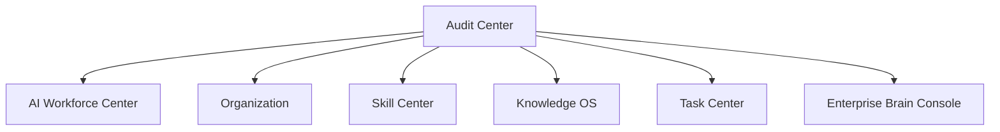

# Sprint62.7-A Audit Center 审计中心 V1 产品架构设计

## 1. 阶段边界

本阶段只做产品架构设计。

禁止：

- 不写代码
- 不修改前端
- 不修改后端
- 不创建数据库
- 不创建 migration
- 不接真实执行日志
- 不接 OpenClaw
- 不接 n8n
- 不接 Execution Engine

目标：

设计天统AI Audit Center 审计中心，作为 AI企业安全监督系统。

## 2. 产品定位

产品名称：

```text
Audit Center 审计中心 V1
```

建议页面：

```text
frontend/audit-center.html
```

定位：

- Audit Center 是天统AI企业大脑的安全监督系统。
- V1 只展示风险、审计记录和安全状态。
- V1 不做自动处置，不接真实执行日志，不接执行系统。

负责：

- AI员工行为记录展示
- 技能使用审计
- 权限风险展示
- 任务风险展示
- 安全状态展示
- 审批链设计

不负责：

- 自动修复
- 自动封禁员工
- 自动修改权限
- 自动执行任务
- 自动调用外部平台
- 自动绕过审批

## 3. 现有基础

当前项目已有可复用的审计与风险雏形：

| 模块 | 当前能力 |
| --- | --- |
| `frontend/employee-activity-log.html` | AI员工执行日志中心，只读展示任务流转、验收、审计、部署和动作 |
| `frontend/employee-activity-trace.html` | AI员工执行追溯中心，只读展示跨模块追溯链路 |
| `backend/routers/employee_activity_log.py` | 聚合任务、员工、审计日志、部署、提交摘要 |
| `backend/routers/employee_activity_trace.py` | 构建 trace_nodes、trace_edges、缺失环节、阻塞风险 |
| `TaskCenterAuditLog` | Task Center 审计日志 |
| `TaskCenterReview` | 天检验收、天监审计记录 |
| `RiskEvent` | 员工风险事件 |
| `Approval Center` | Boss 待确认事项 |
| `Enterprise Brain Console` | 总控台风险摘要和中心状态 |

V1 设计原则：

- 复用现有日志与追溯中心数据口径。
- 新页面 `frontend/audit-center.html` 作为企业大脑安全监督正式入口。
- 不替换现有 `employee-activity-log.html` 和 `employee-activity-trace.html`。
- 所有数据均只读展示。

## 4. 页面设计

页面：

```text
frontend/audit-center.html
```

页面结构：

```text
Audit Center 审计中心
├── 顶部状态栏
│   ├── Audit Center V1
│   ├── 当前组织
│   ├── 风险数量
│   ├── 审计事件数量
│   └── readonly安全模式
├── 风险总览
│   ├── 高风险事件
│   ├── 中风险事件
│   ├── 阻塞任务
│   ├── 待Boss确认
│   ├── 待安全审计
│   └── 系统安全状态
├── 审计事件列表
│   ├── 事件编号
│   ├── 事件类型
│   ├── 来源模块
│   ├── 关联员工
│   ├── 关联任务
│   ├── 风险等级
│   ├── 审计状态
│   └── 发生时间
├── AI员工行为记录
│   ├── 员工名称
│   ├── 行为类型
│   ├── 行为摘要
│   ├── 关联任务
│   └── 是否异常
├── 技能调用记录
│   ├── 技能名称
│   ├── 使用员工
│   ├── 使用任务
│   ├── 风险等级
│   └── 审计结果
├── 权限变化记录
│   ├── 变更对象
│   ├── 变更类型
│   ├── 申请人
│   ├── 审批状态
│   └── 风险提示
├── 安全状态
│   ├── readonly
│   ├── OpenClaw连接状态
│   ├── n8n连接状态
│   ├── Execution Engine调用状态
│   └── 外部平台连接状态
└── 审批链
    ├── Boss确认
    ├── 天检验收
    ├── 天监审计
    ├── 天盾部署检查
    └── 审计归档
```

### 4.1 风险总览

指标：

| 指标 | 说明 | V1 来源建议 |
| --- | --- | --- |
| 高风险事件 | high / critical 风险数量 | `RiskEvent`、Task Center 状态 |
| 中风险事件 | medium 风险数量 | `RiskEvent`、审计规则 |
| 阻塞任务 | blocked / failed / rejected 任务数量 | `TaskCenterTask` |
| 待Boss确认 | 等待老板确认数量 | Approval Center |
| 待安全审计 | accepted 后待 audit 的任务 | Task Center |
| 系统安全状态 | 是否只读、是否接外部执行 | Enterprise Brain Console safety |

### 4.2 审计事件列表

字段：

| 字段 | 说明 | 来源建议 |
| --- | --- | --- |
| `event_id` | 事件编号 | V1 可由来源模块 + 记录 id 组合 |
| `event_type` | 事件类型 | task_audit / risk_event / skill_usage / permission_change |
| `source_module` | 来源模块 | Task Center / Skill Center / Organization / Knowledge OS |
| `employee_code` | 关联员工编号 | Task / Audit / Risk |
| `employee_name` | 关联员工名称 | AiEmployee |
| `task_id` | 关联任务 | TaskCenterTask |
| `risk_level` | 风险等级 | low / medium / high / critical |
| `audit_status` | 审计状态 | pending / audited / blocked / archived |
| `created_at` | 发生时间 | 来源记录时间 |

事件类型：

```text
ai_employee_action
task_risk
skill_usage
permission_risk
knowledge_access
approval_required
security_check
system_status
```

### 4.3 AI员工行为记录

展示内容：

- 员工最近行为。
- 任务流转记录。
- 阻塞和失败记录。
- 验收和审计记录。
- 行为是否需要关注。

V1 来源：

- `employee_activity_log`
- `TaskCenterAuditLog`
- `TaskCenterReview`
- `TaskCenterTask`

### 4.4 技能调用记录

V1 只设计展示结构，不接真实技能调用日志。

字段：

| 字段 | 说明 |
| --- | --- |
| `skill_code` | 技能编号 |
| `skill_name` | 技能名称 |
| `employee_code` | 使用员工 |
| `task_id` | 关联任务 |
| `risk_level` | 风险等级 |
| `review_status` | 审核状态 |
| `used_at` | 使用时间 |

V1 空数据规则：

- 未接入真实技能调用日志时显示“暂无数据”。
- 不制造假调用记录。
- 不提供调用入口。

### 4.5 权限变化记录

V1 只设计，不接真实权限变更系统。

展示内容：

- 权限变更申请。
- 权限风险提示。
- 审批链状态。
- 是否需要 Boss 确认。
- 是否需要安全审计。

必须明确：

```text
权限变化记录只展示，不执行变更。
```

### 4.6 安全状态

安全状态字段：

```json
{
  "readonly": true,
  "auto_fix_enabled": false,
  "auto_ban_employee": false,
  "permission_system_modified": false,
  "task_execution_triggered": false,
  "execution_engine_called": false,
  "openclaw_connected": false,
  "n8n_connected": false,
  "external_platform_connected": false
}
```

## 5. 数据模型设计

只设计，不创建数据库。

### 5.1 AuditEvent

```text
AuditEvent
├── audit_event_id
├── event_type
├── source_module
├── source_id
├── employee_code
├── task_id
├── skill_code
├── permission_code
├── risk_level
├── audit_status
├── summary
├── detail
├── created_at
└── archived_at
```

说明：

- 统一审计事件。
- 聚合 Task Center、Skill Center、Organization、Knowledge OS 的审计摘要。
- V1 不建表，先设计统一结构。

### 5.2 RiskEvent

```text
RiskEvent
├── risk_event_id
├── risk_type
├── risk_level
├── source_module
├── source_id
├── employee_code
├── task_id
├── description
├── impact_scope
├── mitigation_status
├── requires_boss_confirm
├── requires_security_audit
├── created_at
└── resolved_at
```

说明：

- 当前已有 `risk_events` 雏形。
- V1 设计扩展方向，不修改现有表。

### 5.3 SecurityCheck

```text
SecurityCheck
├── security_check_id
├── check_type
├── target_type
├── target_id
├── status
├── risk_level
├── check_result
├── failed_rules
├── checked_by
├── checked_at
└── next_action
```

检查类型：

```text
readonly_boundary
permission_boundary
skill_boundary
knowledge_boundary
task_boundary
external_connection_boundary
```

### 5.4 ApprovalRecord

```text
ApprovalRecord
├── approval_id
├── approval_type
├── source_module
├── source_id
├── requested_by
├── approver_role
├── approval_status
├── boss_confirm
├── security_audited
├── comment
├── created_at
└── decided_at
```

审批类型：

```text
task_approval
skill_review
permission_change
knowledge_publish
risk_acceptance
deploy_review
```

### 5.5 AuditReport

```text
AuditReport
├── audit_report_id
├── report_type
├── report_period
├── risk_summary
├── event_summary
├── employee_summary
├── skill_summary
├── permission_summary
├── task_summary
├── conclusion
├── generated_by
├── generated_at
└── reviewed_at
```

说明：

- V1 只设计报告结构。
- 后续可生成日报、周报、Sprint 审计报告。
- 报告生成必须只读，不自动处置。

## 6. 与现有系统关系



关系说明：

| 系统 | Audit Center 读取内容 | 边界 |
| --- | --- | --- |
| AI Workforce Center | 员工状态、风险等级、当前任务、活动摘要 | 不修改员工状态 |
| Organization | 权限范围、角色、部门、组织关系 | 不修改权限 |
| Skill Center | 技能风险、审核状态、技能使用记录 | 不调用技能 |
| Knowledge OS | 知识访问、SOP、Prompt、案例沉淀状态 | 不发布知识 |
| Task Center | 任务风险、审计日志、验收状态、阻塞记录 | 不修改任务状态 |
| Enterprise Brain Console | 总控台安全状态、中心状态、风险摘要 | 不触发总控台动作 |

## 7. 审批链设计

标准审批链：


审批链状态：

```text
pending_boss_confirm
boss_confirmed
testing_required
test_passed
security_audit_required
security_audited
deploy_review_required
archived
rejected
blocked
```

高风险必须：

```text
boss_confirm=true
security_audited=true
```

V1 只展示审批链状态，不提供审批动作。

## 8. 安全边界

V1 只展示：

- 风险
- 审计记录
- 安全状态
- 审批链状态

禁止：

- 自动修复
- 自动封禁员工
- 自动修改权限
- 自动执行任务
- 自动创建任务
- 自动修改任务状态
- 自动调用技能
- 自动发布知识
- 自动调用 Execution Engine
- 自动连接 OpenClaw
- 自动连接 n8n

页面安全要求：

- 页面顶部显示 `readonly安全模式`。
- 风险项只提供查看详情入口。
- 高风险项显示 `boss_confirm=true`、`security_audited=true`。
- 不出现处置、封禁、授权、执行、运行类按钮。

## 9. V1 / V2 / V3 路线规划

### V1：只读审计中心

目标：

- 展示风险总览。
- 展示审计事件列表。
- 展示 AI员工行为记录。
- 展示技能调用记录空态或只读摘要。
- 展示权限变化记录空态或只读摘要。
- 展示安全状态和审批链。

边界：

- 不接真实执行日志。
- 不接执行系统。
- 不自动处置。

### V2：统一审计 API

目标：

- 建立统一 `GET /api/audit-center/overview`。
- 汇总 Task Center、AI Workforce、Organization、Skill Center、Knowledge OS、Enterprise Brain Console 的只读审计数据。
- 支持按员工、任务、技能、风险等级筛选。

边界：

- 不提供修复、封禁、权限修改动作。

### V3：审批驱动安全治理

目标：

- 支持人工审批记录。
- 支持审计报告归档。
- 支持风险处置建议。
- 支持与 Organization 权限申请流程联动。

边界：

- 所有高风险操作必须人工确认。
- 不允许 AI 自动封禁或自动改权限。
- 不允许 AI 自动执行任务。

## 10. 后续开发建议

Sprint62.7-B 可做只读页面骨架：

```text
frontend/audit-center.html
```

建议测试：

- 页面存在。
- 页面包含风险总览、审计事件列表、AI员工行为记录、技能调用记录、权限变化记录、安全状态。
- 页面不包含自动修复、封禁、修改权限、执行任务入口。
- 页面显示 `readonly安全模式`。

Sprint62.7-C 可设计统一只读 API：

```text
GET /api/audit-center/overview
```

建议数据来源：

- `TaskCenterAuditLog`
- `TaskCenterReview`
- `TaskCenterTask`
- `RiskEvent`
- `Approval Center`
- `Employee Activity Log`
- `Employee Activity Trace`
- `Enterprise Brain Console`

## 11. 验收标准

Sprint62.7-A 通过条件：

- 已生成设计文档。
- 已设计 `frontend/audit-center.html`。
- 已覆盖风险总览、审计事件列表、AI员工行为记录、技能调用记录、权限变化记录、安全状态。
- 已设计 AuditEvent、RiskEvent、SecurityCheck、ApprovalRecord、AuditReport 数据模型草案。
- 已说明与 AI Workforce Center、Organization、Skill Center、Knowledge OS、Task Center、Enterprise Brain Console 的关系。
- 已明确 V1 只展示风险、审计记录和状态。
- 已明确禁止自动修复、自动封禁员工、自动修改权限、自动执行任务。
- 已给出 V1 / V2 / V3 路线规划。
- 未写代码。
- 未修改前端或后端。
- 未创建数据库或 migration。
- 未接执行系统。

