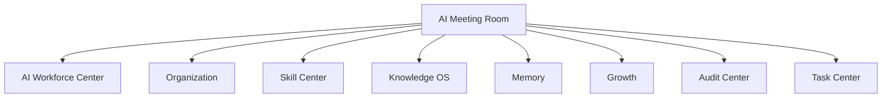

# Sprint62.8-A AI会议室 V1 产品架构设计

## 1. 阶段边界

本阶段只做产品架构设计。

禁止：

- 不写代码
- 不修改前端
- 不修改后端
- 不创建数据库
- 不创建 migration
- 不接 OpenClaw
- 不接 n8n
- 不接 Execution Engine

目标：

设计天统AI AI会议室（AI Meeting Room），作为 AI员工协作决策空间。

## 2. 产品定位

产品名称：

```text
AI会议室 V1 / AI Meeting Room
```

建议页面：

```text
frontend/ai-meeting-room.html
```

定位：

- AI会议室是多 AI员工协作讨论和方案草拟空间。
- V1 只记录讨论、汇总意见、形成方案草稿和决策草稿。
- V1 不创建任务、不执行方案、不调用技能、不修改权限。

负责：

- 多AI员工讨论
- 方案分析
- 意见汇总
- 会议记录
- 决策草稿
- 风险提示

不负责：

- 自动执行方案
- 自动创建任务
- 自动调用技能
- 自动修改权限
- 自动操作外部平台
- 自动进入 Execution Engine

## 3. 现有基础

当前项目已有 AI会议室雏形：

| 模块 | 当前能力 |
| --- | --- |
| `backend/agent_meeting/meeting_room.py` | 内存态会议创建、会议历史 |
| `backend/agent_meeting/collaboration_engine.py` | 多 AI员工讨论、共识生成、审批门预览 |
| `backend/agent_meeting/agent_message.py` | AI员工角色、观点、建议、风险提示 |
| `backend/agent_meeting/consensus.py` | 汇总最终共识 |
| `/command/meeting/create` | 受权限保护的会议创建原型 |
| `/command/meeting/history` | 会议历史原型 |
| `tests/test_agent_meeting.py` | 验证 discussion_only、can_auto_execute=false、不进入队列 |

V1 设计原则：

- 复用现有 `agent_meeting` 讨论模型。
- 新页面 `frontend/ai-meeting-room.html` 作为企业大脑 AI会议室正式入口。
- V1 页面只展示会议与草稿，不提供执行入口。
- 现有会议创建能力后续若接入页面，也必须保持“讨论草稿”语义。

## 4. 页面设计

页面：

```text
frontend/ai-meeting-room.html
```

页面结构：

```text
AI会议室 V1
├── 顶部状态栏
│   ├── AI Meeting Room
│   ├── 当前组织
│   ├── 当前会议数
│   └── readonly / discussion_only 安全模式
├── 会议列表
│   ├── 会议主题
│   ├── 会议状态
│   ├── 参与员工
│   ├── 风险等级
│   ├── 创建时间
│   └── 查看详情
├── 创建会议（设计）
│   ├── 会议目标
│   ├── 业务背景
│   ├── 需要参与的部门
│   ├── 建议参与 AI员工
│   └── 安全说明
├── 参与AI员工
│   ├── 主持AI
│   ├── 专业AI成员
│   ├── 审核AI成员
│   └── 观察AI成员
├── 讨论记录
│   ├── 员工观点
│   ├── 分析依据
│   ├── 建议
│   ├── 风险提示
│   └── 预期结果
├── 方案总结
│   ├── 方案标题
│   ├── 方案摘要
│   ├── 关键依据
│   ├── 多方共识
│   └── 分歧点
├── 决策草稿
│   ├── 推荐方案
│   ├── 可选方案
│   ├── 需要Boss确认事项
│   └── 后续建议
└── 风险提示
    ├── 执行风险
    ├── 权限风险
    ├── 数据风险
    ├── 业务风险
    └── 审批要求
```

### 4.1 会议列表

字段：

| 字段 | 说明 | V1 来源建议 |
| --- | --- | --- |
| `meeting_id` | 会议编号 | 内存态或未来会议记录 |
| `meeting_title` | 会议主题 | goal / title |
| `status` | 会议状态 | draft / discussion_completed / archived |
| `participant_count` | 参与员工数量 | invitees |
| `risk_level` | 风险等级 | consensus / approval_gate |
| `approval_required` | 是否需要审批 | consensus.approval_required |
| `created_at` | 创建时间 | meeting.created_at |

### 4.2 创建会议（设计）

V1 页面设计“创建会议”区域，但必须明确其本质：

```text
创建会议 = 创建讨论草稿 / 会议记录
不是创建任务
不是执行方案
不是调用技能
```

输入字段：

| 字段 | 说明 |
| --- | --- |
| `goal` | 会议目标 |
| `context` | 业务背景和约束 |
| `departments` | 涉及部门 |
| `invitees` | 建议参与 AI员工 |
| `risk_level` | 会议风险等级 |

V1 安全文案：

- 会议只用于讨论。
- 会议结果只是草稿。
- 任何方案执行必须另走审批。

### 4.3 参与AI员工

角色模型：

| 会议角色 | 职责 | 示例 AI员工 |
| --- | --- | --- |
| 主持AI | 定义问题、控制流程、汇总观点 | 天策 / 天统 |
| 数据AI | 提供数据口径、指标、异常分析 | 天采 / 天数 |
| 业务AI | 提供业务方案和运营判断 | 天商 / 天投 / 天服 |
| 知识AI | 提供 SOP、Prompt、案例和历史经验 | 天藏 |
| 审核AI | 提供风险、验收、合规意见 | 天检 / 天安 / 天法 |
| 技术AI | 提供系统、部署、接口风险判断 | 天盾 / 天智 |

参与原则：

- AI员工参与会议不等于获得权限。
- AI员工发言不等于方案被批准。
- AI员工建议不等于任务已创建。

### 4.4 讨论记录

讨论消息结构：

```text
Message
├── message_id
├── meeting_id
├── employee_code
├── employee_name
├── role
├── message_type
├── analysis
├── suggestion
├── evidence
├── risk
├── expected_result
└── created_at
```

消息类型：

```text
analysis
suggestion
risk
question
evidence
summary
approval_note
```

展示原则：

- 每条观点可追溯到 AI员工。
- 每条建议必须带风险提示或适用边界。
- 不展示敏感知识原文。
- 不触发模型或工具调用。

### 4.5 方案总结

方案总结结构：

```text
Proposal
├── proposal_id
├── meeting_id
├── title
├── summary
├── key_points
├── evidence_summary
├── consensus_points
├── disagreements
├── risk_level
├── approval_required
└── created_at
```

方案类型：

- 推荐方案
- 保守方案
- 激进方案
- 风险规避方案
- 待补充数据方案

### 4.6 决策草稿

决策草稿结构：

```text
DecisionDraft
├── decision_draft_id
├── meeting_id
├── recommended_decision
├── alternative_options
├── boss_confirm_items
├── security_audit_items
├── next_steps
├── forbidden_actions
├── status
└── created_at
```

状态：

```text
draft
waiting_boss_confirm
reviewed
archived
rejected
```

V1 只生成草稿，不自动进入 Task Center。

### 4.7 风险提示

风险类型：

| 类型 | 说明 |
| --- | --- |
| execution_risk | 方案若执行会产生业务或系统风险 |
| permission_risk | 涉及权限、账号、角色、数据范围 |
| data_risk | 数据缺失、数据口径不一致 |
| business_risk | 影响价格、广告、商品、客服、财务 |
| security_risk | 涉及敏感资料、Prompt、系统边界 |
| compliance_risk | 涉及法律、合规、平台规则 |

高风险必须：

```text
boss_confirm=true
security_audited=true
```

## 5. 数据模型设计

只设计，不创建数据库。

### 5.1 Meeting

```text
Meeting
├── meeting_id
├── title
├── goal
├── context_summary
├── status
├── risk_level
├── approval_required
├── created_by
├── created_at
└── archived_at
```

### 5.2 MeetingParticipant

```text
MeetingParticipant
├── participant_id
├── meeting_id
├── employee_code
├── employee_name
├── department
├── meeting_role
├── participation_status
├── contribution_score
└── joined_at
```

### 5.3 Message

```text
Message
├── message_id
├── meeting_id
├── employee_code
├── message_type
├── content_summary
├── analysis
├── suggestion
├── evidence
├── risk
├── expected_result
├── created_at
└── trace_id
```

### 5.4 Proposal

```text
Proposal
├── proposal_id
├── meeting_id
├── proposal_type
├── title
├── summary
├── key_points
├── evidence_summary
├── consensus_points
├── disagreements
├── risk_level
├── approval_required
├── created_at
└── status
```

### 5.5 DecisionDraft

```text
DecisionDraft
├── decision_draft_id
├── meeting_id
├── recommended_decision
├── alternative_options
├── boss_confirm_items
├── security_audit_items
├── next_steps
├── forbidden_actions
├── status
├── created_at
└── reviewed_at
```

## 6. 与现有系统关系



关系说明：

| 系统 | AI会议室读取内容 | 边界 |
| --- | --- | --- |
| AI Workforce Center | 员工列表、状态、部门、风险等级 | 不创建员工、不修改状态 |
| Organization | 部门、岗位、负责人、角色 | 不修改组织关系 |
| Skill Center | 技能列表、技能风险、技能适用员工 | 不调用技能 |
| Knowledge OS | SOP、Prompt、案例、知识摘要 | 不发布知识、不展示敏感全文 |
| Memory | 成功案例、失败案例、历史经验 | 不自动学习执行 |
| Growth | 员工评分、贡献记录、协作质量 | 不自动升级员工 |
| Audit Center | 风险提示、审批链、安全边界 | 不自动处置 |
| Task Center | 会议后续可能关联任务草稿 | V1 不自动创建任务 |

## 7. 安全边界

V1 允许：

- 记录讨论。
- 展示参与员工。
- 汇总观点。
- 生成方案草稿。
- 生成决策草稿。
- 标记风险提示。

V1 禁止：

- 自动执行方案
- 自动创建任务
- 自动调用技能
- 自动修改权限
- 自动修改员工状态
- 自动发布知识
- 自动改价格
- 自动调广告预算
- 自动操作外部平台
- 自动进入 Execution Engine
- 自动连接 OpenClaw
- 自动连接 n8n

安全字段建议：

```json
{
  "discussion_only": true,
  "draft_only": true,
  "auto_execute_plan": false,
  "auto_create_task": false,
  "auto_call_skill": false,
  "permission_system_modified": false,
  "employee_status_modified": false,
  "execution_engine_called": false,
  "openclaw_connected": false,
  "n8n_connected": false,
  "boss_confirm_required_for_high_risk": true,
  "security_audited_required_for_high_risk": true
}
```

页面安全要求：

- 顶部显示 `discussion_only` 和 `readonly安全模式`。
- 会议结果必须标记为“草稿”。
- 决策草稿必须显示“等待 Boss 确认”。
- 不出现执行、创建任务、调用技能、修改权限按钮。

## 8. V1 / V2 / V3 路线规划

### V1：只读会议室与决策草稿

目标：

- 展示会议列表。
- 展示参与 AI员工。
- 展示讨论记录。
- 展示方案总结。
- 展示决策草稿。
- 展示风险提示。

边界：

- 只记录讨论。
- 只生成方案草稿。
- 不自动创建任务。
- 不自动执行方案。

### V2：会议协作 API 产品化

目标：

- 建立统一 `GET /api/ai-meeting-room/overview`。
- 建立会议详情只读 API。
- 支持会议草稿保存。
- 与 AI Workforce、Organization、Skill Center、Knowledge OS、Audit Center 联动。

边界：

- 会议草稿不能直接进入执行。
- 创建任务必须另走 Boss 确认设计。

### V3：审批驱动的会议到任务闭环

目标：

- 决策草稿可提交 Boss 确认。
- Boss 确认后可进入 Task Center 草稿。
- 审计中心记录会议到任务的完整链路。

边界：

- 不允许 AI 自动批准自己的方案。
- 高风险必须 `boss_confirm=true` 和 `security_audited=true`。
- 任务创建、技能调用、执行动作必须独立审批。

## 9. 后续开发建议

Sprint62.8-B 可做只读页面骨架：

```text
frontend/ai-meeting-room.html
```

建议测试：

- 页面存在。
- 页面包含会议列表、创建会议设计、参与AI员工、讨论记录、方案总结、决策草稿、风险提示。
- 页面不包含自动执行、自动创建任务、自动调用技能、自动修改权限入口。
- 页面显示 `discussion_only` 和 `readonly安全模式`。

Sprint62.8-C 可设计统一只读 API：

```text
GET /api/ai-meeting-room/overview
GET /api/ai-meeting-room/{meeting_id}
```

建议数据来源：

- `backend/agent_meeting/*`
- AI Workforce Center
- Organization
- Skill Center
- Knowledge OS
- Audit Center

## 10. 验收标准

Sprint62.8-A 通过条件：

- 已生成设计文档。
- 已设计 `frontend/ai-meeting-room.html`。
- 已覆盖会议列表、创建会议（设计）、参与AI员工、讨论记录、方案总结、决策草稿、风险提示。
- 已设计 Meeting、MeetingParticipant、Message、Proposal、DecisionDraft 数据模型草案。
- 已说明与 AI Workforce Center、Organization、Skill Center、Knowledge OS、Memory、Growth、Audit Center、Task Center 的关系。
- 已明确 V1 只记录讨论、只生成方案草稿。
- 已明确禁止自动执行方案、自动创建任务、自动调用技能、自动修改权限。
- 已给出 V1 / V2 / V3 路线规划。
- 未写代码。
- 未修改前端或后端。
- 未创建数据库或 migration。
- 未接执行系统。

