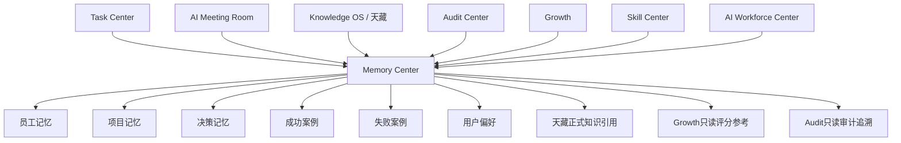

# Sprint62.9-A Memory 记忆中心 V1 产品架构设计

## 1. 阶段边界

本阶段只做产品架构设计。

禁止：

- 不写代码
- 不修改前端
- 不修改后端
- 不创建数据库
- 不创建 migration
- 不接真实执行数据
- 不接 OpenClaw
- 不接 n8n
- 不接 Execution Engine

目标：

设计天统AI Memory 记忆中心，作为 AI员工长期记忆系统。

## 2. 产品定位

产品名称：

```text
Memory 记忆中心 V1 / AI Long-Term Memory Center
```

建议页面：

```text
frontend/memory-center.html
```

定位：

- Memory 是 AI员工长期经验、工作上下文、决策记录和案例沉淀的统一查看中心。
- V1 只负责查看、分析和索引记忆资产，不自动学习、不自动改写员工能力、不自动改变权限、不执行动作。
- Memory 是 Knowledge OS、Growth、AI Meeting Room 和 Task Center 之间的经验桥梁。

负责：

- AI员工历史经验
- 工作上下文
- 决策记录
- 成功案例
- 失败案例
- 用户偏好
- 企业知识沉淀
- 记忆搜索和追溯

不负责：

- 自动学习修改自身
- 自动改变技能
- 自动修改权限
- 自动创建任务
- 自动执行动作
- 自动发布知识
- 自动接入外部平台

## 3. 现有基础分析

当前项目已有 Memory 相关雏形，但尚未形成独立 Memory Center：

| 模块 | 当前能力 | 与 Memory V1 的关系 |
| --- | --- | --- |
| `backend/knowledge_center/knowledge_learning.py` | 以 `long_term_memory_append_only` 模式沉淀执行案例、SOP、成功/失败经验、经验规则 | 可作为未来记忆来源之一 |
| `backend/decision_center/decision_memory.py` | 内存态决策记录，范围为 `in_process_readonly_decision_memory` | 可作为决策记忆雏形 |
| `docs/DECISION_LOG.md` | 项目长期决策文档 | 可作为企业级决策记忆来源 |
| `docs/AI_EMPLOYEE_MAP.md` | AI员工与部门映射 | 可辅助员工记忆归属 |
| `backend/agent_meeting/*` | AI会议讨论、共识、风险提示 | 可沉淀会议记忆和决策草稿 |
| `backend/employee_growth/*` | 成长评分、知识蒸馏、复盘建议 | 可读取记忆结果，但不能自动改写记忆 |
| `backend/routers/task_center.py` | 任务、结果、验收、审计日志 | 可作为任务经验记忆来源 |

V1 设计原则：

- 先作为只读 Memory Center 产品设计，不实施数据库和 API。
- 复用现有知识、决策、任务、成长、会议、审计数据来源。
- 明确 Memory 与 Knowledge OS 的边界：Memory 记录经验上下文，Knowledge OS 管理正式知识资产。
- 明确 Memory 与 Growth 的边界：Memory 提供历史经验，Growth 负责评分和成长轨迹。

## 4. 页面设计

页面：

```text
frontend/memory-center.html
```

页面结构：

```text
Memory 记忆中心 V1
├── 顶部状态栏
│   ├── Memory Center
│   ├── 当前组织
│   ├── 记忆条目数量
│   ├── 最近更新时间
│   └── readonly / analysis_only 安全模式
├── 记忆总览
│   ├── 员工记忆数量
│   ├── 项目记忆数量
│   ├── 决策记忆数量
│   ├── 成功案例数量
│   ├── 失败案例数量
│   └── 高风险记忆数量
├── 员工记忆
│   ├── AI员工
│   ├── 所属部门
│   ├── 相关技能
│   ├── 任务经验
│   ├── 成功经验
│   └── 风险经验
├── 项目记忆
│   ├── 项目名称
│   ├── 业务上下文
│   ├── 参与员工
│   ├── 关键节点
│   └── 沉淀结果
├── 决策记忆
│   ├── 决策主题
│   ├── 决策背景
│   ├── 参与系统
│   ├── Boss确认状态
│   └── 后续影响
├── 成功案例
│   ├── 案例标题
│   ├── 成功原因
│   ├── 复用条件
│   ├── 关联员工
│   └── 关联知识
├── 失败案例
│   ├── 案例标题
│   ├── 失败原因
│   ├── 风险等级
│   ├── 避免策略
│   └── 审计状态
└── 记忆搜索
    ├── 关键词
    ├── 记忆类型
    ├── 员工
    ├── 部门
    ├── 风险等级
    └── 时间范围
```

### 4.1 记忆总览

字段：

| 字段 | 说明 | V1 来源建议 |
| --- | --- | --- |
| `memory_total` | 记忆总数 | Knowledge / Task / Decision / Meeting 聚合 |
| `employee_memory_count` | 员工记忆数量 | AI员工 + 任务经验 |
| `project_memory_count` | 项目记忆数量 | Task Center / 文档 |
| `decision_memory_count` | 决策记忆数量 | Decision Center / AI会议室 |
| `success_case_count` | 成功案例数量 | Knowledge OS / Task结果 |
| `failure_case_count` | 失败案例数量 | Knowledge OS / Audit |
| `risk_memory_count` | 风险记忆数量 | Audit Center / RiskEvent |
| `last_updated` | 最近更新时间 | 聚合来源的最大更新时间 |

空数据状态：

```text
当前未接入真实记忆数据
```

异常状态：

```text
当前记忆数据暂不可用
```

### 4.2 员工记忆

员工记忆用于回答：

- 这个 AI员工做过什么？
- 哪些任务做得好？
- 哪些风险需要避免？
- 哪些知识和 SOP 对它有效？
- 哪些用户偏好需要记住？

展示字段：

| 字段 | 说明 |
| --- | --- |
| `employee_id` | 员工编号 |
| `employee_name` | 员工名称 |
| `department` | 所属部门 |
| `role` | 岗位 |
| `related_skills` | 关联技能 |
| `task_experience_count` | 任务经验数量 |
| `success_case_count` | 成功案例数量 |
| `failure_case_count` | 失败案例数量 |
| `risk_notes` | 风险备注 |
| `preference_notes` | 用户偏好备注 |

V1 只展示，不支持“写入记忆”“训练员工”“自动学习”。

### 4.3 项目记忆

项目记忆用于沉淀跨任务、跨员工、跨部门的业务上下文。

展示字段：

| 字段 | 说明 |
| --- | --- |
| `project_id` | 项目编号 |
| `project_name` | 项目名称 |
| `business_context` | 业务背景 |
| `participants` | 参与 AI员工 |
| `related_tasks` | 关联任务 |
| `key_decisions` | 关键决策 |
| `outcomes` | 结果摘要 |
| `lessons_learned` | 经验教训 |

典型场景：

- 京东60店经营分析项目
- 手表新品开发项目
- 爆款打造会议项目
- 广告投放复盘项目

### 4.4 决策记忆

决策记忆用于记录企业重要判断过程。

展示字段：

| 字段 | 说明 |
| --- | --- |
| `decision_id` | 决策编号 |
| `title` | 决策主题 |
| `context` | 决策背景 |
| `participants` | 参与员工或系统 |
| `options` | 备选方案 |
| `final_recommendation` | 最终建议 |
| `boss_confirm` | Boss确认状态 |
| `security_audited` | 安全审核状态 |
| `impact_summary` | 影响摘要 |

安全原则：

- 决策记忆不是决策执行。
- Boss确认记录只是审计状态，不触发执行。
- 高风险决策必须保留 `boss_confirm=true` 与 `security_audited=true`。

### 4.5 成功案例

成功案例用于复用有效经验。

展示字段：

| 字段 | 说明 |
| --- | --- |
| `case_id` | 案例编号 |
| `title` | 案例标题 |
| `case_type` | 案例类型 |
| `success_reason` | 成功原因 |
| `repeatable_conditions` | 可复用条件 |
| `related_employee` | 关联员工 |
| `related_skill` | 关联技能 |
| `related_knowledge` | 关联知识 |
| `review_status` | 审核状态 |

成功案例只能作为建议依据，不能自动转成 SOP、任务或执行动作。

### 4.6 失败案例

失败案例用于避免重复犯错。

展示字段：

| 字段 | 说明 |
| --- | --- |
| `case_id` | 案例编号 |
| `title` | 案例标题 |
| `failure_reason` | 失败原因 |
| `risk_level` | 风险等级 |
| `impact_scope` | 影响范围 |
| `avoidance_rule` | 避免策略 |
| `related_employee` | 关联员工 |
| `related_task` | 关联任务 |
| `audit_status` | 审计状态 |

失败案例不能自动降级员工、修改权限或冻结技能。

### 4.7 记忆搜索

搜索维度：

| 维度 | 说明 |
| --- | --- |
| 关键词 | 标题、摘要、标签 |
| 记忆类型 | 员工 / 项目 / 决策 / 成功案例 / 失败案例 |
| 员工 | 按 AI员工过滤 |
| 部门 | 按组织部门过滤 |
| 技能 | 按 Skill 过滤 |
| 知识 | 按 Knowledge 过滤 |
| 风险等级 | low / medium / high |
| 时间范围 | 创建时间或更新时间 |

搜索结果必须展示来源和可信状态，避免将未审核记忆误认为正式知识。

## 5. 数据模型设计草案

本节只做设计，不创建数据库。

### 5.1 Memory

```text
Memory
├── memory_id
├── memory_scope
├── memory_type
├── title
├── summary
├── source_system
├── source_id
├── owner_employee_id
├── department
├── risk_level
├── review_status
├── visibility_scope
├── created_at
├── updated_at
└── archived_at
```

字段说明：

| 字段 | 说明 |
| --- | --- |
| `memory_id` | 记忆主编号 |
| `memory_scope` | employee / project / company / decision |
| `memory_type` | context / success_case / failure_case / decision / preference / sop_reference |
| `source_system` | task_center / meeting_room / knowledge_os / growth / audit |
| `source_id` | 来源系统记录编号 |
| `owner_employee_id` | 关联 AI员工 |
| `department` | 组织归属 |
| `risk_level` | low / medium / high |
| `review_status` | draft / reviewed / approved / deprecated |
| `visibility_scope` | owner / department / boss / company |

### 5.2 MemoryItem

```text
MemoryItem
├── item_id
├── memory_id
├── item_type
├── content
├── evidence
├── tags
├── confidence_score
├── source_reference
├── created_by
└── created_at
```

用途：

- 承载一条具体记忆内容。
- 保留证据、来源和可信度。
- 支持一个 Memory 下包含多个细分条目。

### 5.3 Experience

```text
Experience
├── experience_id
├── memory_id
├── employee_id
├── task_id
├── skill_id
├── result_type
├── success_factors
├── failure_factors
├── reusable_conditions
├── risk_notes
├── review_status
└── created_at
```

用途：

- 描述 AI员工在任务、技能、知识使用后的经验。
- 区分成功经验、失败经验和中性复盘。
- 为 Growth 提供只读参考。

### 5.4 DecisionHistory

```text
DecisionHistory
├── decision_id
├── memory_id
├── meeting_id
├── title
├── context
├── options
├── recommendation
├── boss_confirm
├── security_audited
├── decision_status
├── impact_summary
└── recorded_at
```

用途：

- 记录决策形成过程。
- 关联 AI会议室的讨论和方案草稿。
- 保留 Boss确认与安全审核状态。

### 5.5 LearningRecord

```text
LearningRecord
├── learning_id
├── memory_id
├── employee_id
├── learning_type
├── source_case_id
├── before_summary
├── after_summary
├── suggestion
├── applied
├── approval_status
└── created_at
```

用途：

- 记录“学习建议”和“经验沉淀”。
- V1 中 `applied=false` 为默认安全状态。
- 任何真正影响员工技能、权限、等级的动作都不由 Memory 执行。

## 6. 数据关系图



关系说明：

| 来源/目标 | 关系 | 边界 |
| --- | --- | --- |
| Task Center -> Memory | 任务结果、验收、复盘沉淀为经验记忆 | 不修改任务状态 |
| AI Meeting Room -> Memory | 会议观点、方案草稿、决策草稿沉淀为讨论记忆 | 不创建任务 |
| Knowledge OS -> Memory | SOP、Prompt、案例作为记忆引用 | 不自动发布知识 |
| Skill Center -> Memory | 技能使用上下文作为经验线索 | 不自动安装技能 |
| Growth -> Memory | 成长评价可引用历史经验 | Growth 不由 Memory 自动改分 |
| Audit Center -> Memory | 风险事件形成风险记忆 | 不自动封禁或改权 |
| AI Workforce Center -> Memory | 员工工作台展示员工记忆摘要 | 只读展示 |

## 7. 与现有系统关系

### 7.1 AI Workforce Center

AI Workforce Center 读取 Memory 摘要：

- 员工成功经验
- 员工失败案例
- 最近工作上下文
- 用户偏好提示
- 风险记忆数量

边界：

- 工作台只展示 Memory。
- 工作台不能通过 Memory 自动升级员工、修改权限或启动任务。

### 7.2 Knowledge OS

Knowledge OS 管理正式知识资产：

- 知识文章
- SOP
- Prompt
- 案例库
- 课程资产

Memory 记录经验上下文：

- 任务发生背景
- 员工处理过程
- 决策依据
- 成功/失败原因
- 用户偏好

边界：

- Memory 不能自动发布正式知识。
- Memory 进入 Knowledge OS 必须人工审核。
- Prompt 和 SOP 更新必须走审核流程。

### 7.3 Skill Center

Skill Center 负责技能资产：

- 技能版本
- 技能状态
- 技能审核
- 技能风险

Memory 提供技能使用经验：

- 某技能在哪些场景有效
- 哪些员工使用效果更好
- 哪些风险需要避免

边界：

- 经验不等于技能授权。
- Memory 不自动安装技能。
- Memory 不自动升级技能版本。

### 7.4 Growth

Growth 负责成长评价：

- 评分
- 等级建议
- 优势能力
- 待提升能力

Memory 提供历史证据：

- 成功案例
- 失败案例
- 复盘记录
- 风险记忆

边界：

- Memory 不直接修改员工评分。
- Memory 不自动晋升或降级员工。
- Growth 使用 Memory 必须保留可追溯来源。

### 7.5 Audit Center

Audit Center 负责安全监督：

- 行为审计
- 权限审计
- 风险事件
- 审批记录

Memory 记录风险经验：

- 哪类操作曾经造成风险
- 哪些方案需要 Boss确认
- 哪些数据访问需要审计

边界：

- Memory 不自动修复风险。
- Memory 不自动封禁员工。
- Memory 不自动修改权限。

### 7.6 AI Meeting Room

AI Meeting Room 产生：

- 会议讨论
- 多员工观点
- 方案草稿
- 决策草稿
- 风险提示

Memory 沉淀：

- 会议背景
- 观点依据
- 方案对比
- Boss确认结果
- 复盘结果

边界：

- 会议记忆不等于任务创建。
- 决策草稿不等于执行计划。

### 7.7 Task Center

Task Center 产生：

- 任务记录
- 任务结果
- 验收记录
- 审计日志

Memory 读取：

- 历史任务经验
- 成功任务案例
- 失败任务案例
- 阻塞原因

边界：

- Memory 不能创建任务。
- Memory 不能修改任务状态。
- Memory 不能提交验收。

## 8. 安全边界

V1 允许：

- 查看记忆总览
- 查看员工记忆
- 查看项目记忆
- 查看决策记忆
- 查看成功案例
- 查看失败案例
- 搜索记忆
- 分析记忆来源和风险

V1 禁止：

- 自动学习修改自身
- 自动改变技能
- 自动修改权限
- 自动执行动作
- 自动创建任务
- 自动启动员工
- 自动发布知识
- 自动修改 SOP
- 自动修改 Prompt
- 自动进入 Execution Engine
- 自动连接 OpenClaw
- 自动连接 n8n

高风险记忆变更必须满足：

```json
{
  "security_audited": true,
  "boss_confirm": true,
  "readonly": true,
  "analysis_only": true,
  "auto_learning_applied": false,
  "employee_permission_modified": false,
  "employee_skill_modified": false,
  "task_created": false,
  "task_executed": false,
  "execution_engine_called": false,
  "openclaw_connected": false,
  "n8n_connected": false
}
```

权限原则：

- 记忆可见性必须受 Organization 权限约束。
- 员工只能查看自己允许范围内的记忆。
- 部门负责人只能查看部门范围记忆。
- Boss 可查看企业级摘要和高风险记忆。
- 未审核记忆不得作为正式决策依据。

## 9. V1 / V2 / V3 路线规划

### V1：只读记忆中心

目标：

- 建立 Memory Center 产品入口设计。
- 展示记忆总览、员工记忆、项目记忆、决策记忆、成功案例、失败案例、记忆搜索。
- 复用现有 Knowledge、Task、Meeting、Growth、Audit 只读来源。

限制：

- 不写入记忆。
- 不自动学习。
- 不改变员工、技能、权限、任务状态。

### V2：可审核记忆沉淀

目标：

- 支持人工审核后的记忆归档。
- 支持将会议结果、任务复盘、审计事件整理为候选记忆。
- 支持记忆版本和可信度管理。

仍然禁止：

- 自动应用学习结果。
- 自动修改技能或权限。
- 自动执行任务。

### V3：企业级经验智能检索

目标：

- 支持跨员工、跨项目、跨部门经验检索。
- 支持根据任务上下文推荐相关成功/失败经验。
- 支持为 AI会议室、Skill Center、Growth 提供只读经验证据。

安全要求：

- 推荐只作为参考。
- 任何执行仍需 Task Center、审批和安全网关。
- 重大变更仍需 `security_audited=true` 与 `boss_confirm=true`。

## 10. 验收结论

Sprint62.9-A 只完成 Memory 记忆中心 V1 产品架构设计。

验收项：

- 已定义产品定位。
- 已设计 `frontend/memory-center.html` 页面结构。
- 已设计 Memory、MemoryItem、Experience、DecisionHistory、LearningRecord 数据模型草案。
- 已说明与 AI Workforce Center、Knowledge OS、Skill Center、Growth、Audit Center、AI Meeting Room、Task Center 的关系。
- 已明确 V1 只查看、只分析，不自动学习、不自动执行、不改权限。
- 已规划 V1/V2/V3 演进路线。

未执行事项：

- 未写代码。
- 未修改前端。
- 未修改后端。
- 未创建数据库。
- 未创建 migration。
- 未接 OpenClaw。
- 未接 n8n。
- 未接 Execution Engine。
